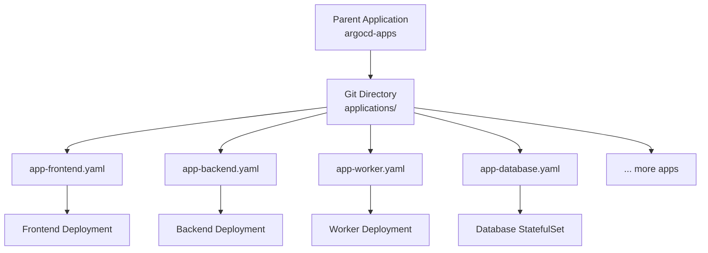

# How to Use the App-of-Apps Pattern in ArgoCD

Author: [nawazdhandala](https://github.com/nawazdhandala)

Tags: ArgoCD, GitOps, Kubernetes, App-of-Apps, Automation

Description: A practical guide to implementing the ArgoCD App-of-Apps pattern for managing multiple applications through a single parent application with automatic discovery.

---

The App-of-Apps pattern is one of the most powerful organizational strategies in ArgoCD. Instead of manually creating each Application resource, you create a single "parent" application that points to a directory containing child Application manifests. When ArgoCD syncs the parent, it discovers and creates all the child applications automatically. This guide walks through the pattern step by step with practical examples.

## The Problem App-of-Apps Solves

Imagine you have 30 microservices to deploy. Without App-of-Apps, you need to:

1. Write 30 Application YAML files
2. Apply each one with kubectl or the ArgoCD CLI
3. Remember to add new Application manifests whenever you create a new service
4. Manually clean up Application resources when services are decommissioned

With App-of-Apps, you write the 30 Application YAMLs, put them in a Git directory, and create one parent Application that points to that directory. ArgoCD handles the rest.



## Setting Up the Repository Structure

Start with a Git repository that holds your Application manifests:

```
argocd-config/
  apps/
    production/
      frontend.yaml
      backend-api.yaml
      backend-worker.yaml
      redis.yaml
      postgres.yaml
    staging/
      frontend.yaml
      backend-api.yaml
  root-app.yaml
```

## Creating Child Application Manifests

Each child application is a standard ArgoCD Application resource:

```yaml
# apps/production/frontend.yaml
apiVersion: argoproj.io/v1alpha1
kind: Application
metadata:
  name: frontend-production
  namespace: argocd
  finalizers:
    - resources-finalizer.argocd.argoproj.io
spec:
  project: team-frontend
  source:
    repoURL: https://github.com/myorg/frontend.git
    targetRevision: main
    path: k8s/overlays/production
  destination:
    server: https://kubernetes.default.svc
    namespace: frontend
  syncPolicy:
    automated:
      prune: true
      selfHeal: true
    syncOptions:
      - CreateNamespace=true
```

```yaml
# apps/production/backend-api.yaml
apiVersion: argoproj.io/v1alpha1
kind: Application
metadata:
  name: backend-api-production
  namespace: argocd
  finalizers:
    - resources-finalizer.argocd.argoproj.io
spec:
  project: team-backend
  source:
    repoURL: https://github.com/myorg/backend-api.git
    targetRevision: main
    path: deploy/overlays/production
  destination:
    server: https://kubernetes.default.svc
    namespace: backend
  syncPolicy:
    automated:
      prune: true
      selfHeal: true
    syncOptions:
      - CreateNamespace=true
```

## Creating the Parent Application

The parent application points to the directory containing the child manifests:

```yaml
# root-app.yaml
apiVersion: argoproj.io/v1alpha1
kind: Application
metadata:
  name: production-apps
  namespace: argocd
  finalizers:
    - resources-finalizer.argocd.argoproj.io
spec:
  project: default
  source:
    repoURL: https://github.com/myorg/argocd-config.git
    targetRevision: main
    path: apps/production
  destination:
    server: https://kubernetes.default.svc
    namespace: argocd  # Child apps are created in the argocd namespace
  syncPolicy:
    automated:
      prune: true    # Remove child apps when their YAML is deleted
      selfHeal: true # Recreate child apps if manually deleted
```

Apply the parent application:

```bash
kubectl apply -f root-app.yaml
```

ArgoCD reads the `apps/production/` directory, finds the Application YAML files, and creates each child application. The child applications then sync their respective workloads.

## Nested App-of-Apps

You can create hierarchies where the parent creates intermediate apps that create more apps:

```
root-app
  |
  +-- production-apps (parent)
  |     +-- frontend-production
  |     +-- backend-production
  |     +-- monitoring-production
  |
  +-- staging-apps (parent)
  |     +-- frontend-staging
  |     +-- backend-staging
  |
  +-- infrastructure-apps (parent)
        +-- cert-manager
        +-- ingress-nginx
        +-- external-secrets
```

The root application:

```yaml
# root-of-roots.yaml
apiVersion: argoproj.io/v1alpha1
kind: Application
metadata:
  name: root-apps
  namespace: argocd
spec:
  project: default
  source:
    repoURL: https://github.com/myorg/argocd-config.git
    targetRevision: main
    path: environments
  destination:
    server: https://kubernetes.default.svc
    namespace: argocd
  syncPolicy:
    automated:
      prune: true
      selfHeal: true
```

And the environments directory contains parent applications:

```yaml
# environments/production.yaml
apiVersion: argoproj.io/v1alpha1
kind: Application
metadata:
  name: production-apps
  namespace: argocd
spec:
  project: default
  source:
    repoURL: https://github.com/myorg/argocd-config.git
    targetRevision: main
    path: apps/production
  destination:
    server: https://kubernetes.default.svc
    namespace: argocd
  syncPolicy:
    automated:
      prune: true
      selfHeal: true
```

## Using Helm with App-of-Apps

Instead of plain YAML files, you can use a Helm chart to generate child Application manifests. This is useful when applications share common configuration:

```yaml
# Chart.yaml
apiVersion: v2
name: production-apps
version: 1.0.0
```

```yaml
# values.yaml
applications:
  frontend:
    repoURL: https://github.com/myorg/frontend.git
    path: k8s/overlays/production
    namespace: frontend
    project: team-frontend

  backend-api:
    repoURL: https://github.com/myorg/backend-api.git
    path: deploy/overlays/production
    namespace: backend
    project: team-backend

  backend-worker:
    repoURL: https://github.com/myorg/backend-worker.git
    path: deploy/overlays/production
    namespace: backend
    project: team-backend

defaults:
  targetRevision: main
  server: https://kubernetes.default.svc
  autoSync: true
  prune: true
  selfHeal: true
```

```yaml
# templates/application.yaml
{{`{{- range $name, $app := .Values.applications }}`}}
apiVersion: argoproj.io/v1alpha1
kind: Application
metadata:
  name: {{`{{ $name }}`}}-production
  namespace: argocd
  finalizers:
    - resources-finalizer.argocd.argoproj.io
spec:
  project: {{`{{ $app.project | default "default" }}`}}
  source:
    repoURL: {{`{{ $app.repoURL }}`}}
    targetRevision: {{`{{ $app.targetRevision | default $.Values.defaults.targetRevision }}`}}
    path: {{`{{ $app.path }}`}}
  destination:
    server: {{`{{ $app.server | default $.Values.defaults.server }}`}}
    namespace: {{`{{ $app.namespace }}`}}
  syncPolicy:
    automated:
      prune: {{`{{ $app.prune | default $.Values.defaults.prune }}`}}
      selfHeal: {{`{{ $app.selfHeal | default $.Values.defaults.selfHeal }}`}}
    syncOptions:
      - CreateNamespace=true
---
{{`{{- end }}`}}
```

The parent application then points to this Helm chart:

```yaml
apiVersion: argoproj.io/v1alpha1
kind: Application
metadata:
  name: production-apps
  namespace: argocd
spec:
  project: default
  source:
    repoURL: https://github.com/myorg/argocd-config.git
    targetRevision: main
    path: charts/production-apps
  destination:
    server: https://kubernetes.default.svc
    namespace: argocd
```

## Handling Sync Order

Sometimes child applications need to be created in a specific order. Use sync waves to control this:

```yaml
# apps/production/namespace-setup.yaml
apiVersion: argoproj.io/v1alpha1
kind: Application
metadata:
  name: namespace-setup
  namespace: argocd
  annotations:
    argocd.argoproj.io/sync-wave: "-1"  # Sync first
spec:
  # ...creates namespaces and resource quotas
```

```yaml
# apps/production/backend-api.yaml
apiVersion: argoproj.io/v1alpha1
kind: Application
metadata:
  name: backend-api-production
  namespace: argocd
  annotations:
    argocd.argoproj.io/sync-wave: "1"  # Sync after namespace setup
spec:
  # ...
```

## Cascading Deletion

When you delete a child Application YAML from Git and the parent has prune enabled, ArgoCD deletes the child Application resource. If the child has the `resources-finalizer.argocd.argoproj.io` finalizer, ArgoCD also deletes the child's managed Kubernetes resources.

Be careful: removing a YAML file from the apps directory will delete the child application and potentially all its resources. This is the desired behavior in most cases, but make sure your team understands this before enabling prune on the parent.

## Best Practices

1. **Always include finalizers** on child applications for proper cleanup
2. **Use separate parent apps per environment** so production and staging are independent
3. **Start with plain YAML** before moving to Helm-templated child apps
4. **Enable prune on the parent** so removed YAML files result in removed applications
5. **Use sync waves** when child applications have ordering dependencies
6. **Keep the parent app in the default project** for simplicity
7. **Review all changes in PRs** since adding or removing a file changes what is deployed

The App-of-Apps pattern scales well from a handful of applications to hundreds. For even more dynamic patterns, consider [ArgoCD ApplicationSets](https://oneuptime.com/blog/post/2026-02-26-argocd-bootstrap-cluster-app-of-apps/view), which generate Applications from templates based on cluster, Git, or list generators.
