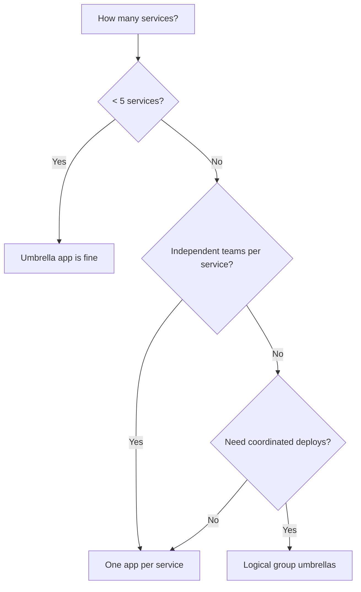

# Best Practice: One ArgoCD App per Service vs Umbrella Apps

Author: [nawazdhandala](https://github.com/nawazdhandala)

Tags: ArgoCD, GitOps, Kubernetes, Architecture, Best Practices

Description: Compare the one-app-per-service and umbrella app patterns in ArgoCD, with guidance on when each approach works best for your team and architecture.

---

Should each microservice get its own ArgoCD Application, or should you bundle related services into umbrella Applications? This architectural decision affects deployment independence, failure isolation, and operational complexity. Both patterns are used in production, and the right choice depends on your team structure and service dependencies.

## Understanding the Two Approaches

### One App per Service

Each microservice or component has its own ArgoCD Application.

```
ArgoCD Applications:
  - user-service
  - order-service
  - payment-service
  - notification-service
  - frontend
  - api-gateway
```

### Umbrella App

Related services are grouped into a single ArgoCD Application that deploys them together.

```
ArgoCD Applications:
  - platform (contains: user-service, order-service, payment-service,
              notification-service, frontend, api-gateway)
```

Or a middle ground with logical groupings:

```
ArgoCD Applications:
  - backend (user-service, order-service, payment-service)
  - frontend (frontend, api-gateway)
  - infrastructure (notification-service, monitoring, logging)
```

## One App per Service: Deep Dive

With this pattern, each service has its own Application resource and its own sync lifecycle.

```yaml
apiVersion: argoproj.io/v1alpha1
kind: Application
metadata:
  name: user-service
  namespace: argocd
spec:
  source:
    repoURL: https://github.com/my-org/config.git
    targetRevision: main
    path: services/user-service/production
  destination:
    server: https://kubernetes.default.svc
    namespace: user-service
  syncPolicy:
    automated:
      prune: true
      selfHeal: true
---
apiVersion: argoproj.io/v1alpha1
kind: Application
metadata:
  name: order-service
  namespace: argocd
spec:
  source:
    repoURL: https://github.com/my-org/config.git
    targetRevision: main
    path: services/order-service/production
  destination:
    server: https://kubernetes.default.svc
    namespace: order-service
  syncPolicy:
    automated:
      prune: true
      selfHeal: true
```

**Advantages**:

**Independent deployments**: Updating the user-service does not trigger a sync of the order-service. Each service deploys on its own schedule. This is the fundamental promise of microservices.

**Failure isolation**: If the user-service sync fails (bad manifest, failed health check), the order-service is unaffected. You can see exactly which service has the problem in the ArgoCD UI.

**Clear ownership**: If your organization has a team per service, each team owns their Application. RBAC can be configured so the user-service team can only sync and view their Application.

**Faster syncs**: A single-service sync is faster than syncing an umbrella containing 10 services.

**Granular rollback**: Rolling back one service does not affect others.

**Disadvantages**:

**Application sprawl**: With 50 microservices across 3 environments, you have 150 Application resources to manage. ApplicationSets help, but it is still a lot.

**No coordinated deployments**: If two services need to deploy together (breaking API change), you need to coordinate the syncs manually or use a separate mechanism.

**More RBAC configuration**: Each Application may need its own RBAC rules.

## Umbrella App: Deep Dive

An umbrella Application deploys multiple services from a single source path.

### Using Kustomize

```yaml
# services/platform/kustomization.yaml
apiVersion: kustomize.config.k8s.io/v1beta1
kind: Kustomization
resources:
  - ../../base/user-service
  - ../../base/order-service
  - ../../base/payment-service
  - ../../base/notification-service
```

```yaml
apiVersion: argoproj.io/v1alpha1
kind: Application
metadata:
  name: platform
  namespace: argocd
spec:
  source:
    repoURL: https://github.com/my-org/config.git
    targetRevision: main
    path: services/platform
  destination:
    server: https://kubernetes.default.svc
  syncPolicy:
    automated:
      prune: true
      selfHeal: true
```

### Using Helm Umbrella Chart

```yaml
# charts/platform/Chart.yaml
apiVersion: v2
name: platform
version: 1.0.0
dependencies:
  - name: user-service
    version: "1.x.x"
    repository: "file://../user-service"
  - name: order-service
    version: "1.x.x"
    repository: "file://../order-service"
  - name: payment-service
    version: "1.x.x"
    repository: "file://../payment-service"
```

**Advantages**:

**Coordinated deployments**: All services in the umbrella are synced together. If you need to deploy a breaking API change that affects both user-service and order-service, the umbrella ensures they deploy atomically.

**Simpler management**: One Application to manage instead of many. The ArgoCD UI shows one "platform" app instead of dozens of individual services.

**Shared resources**: Services that need shared ConfigMaps, Secrets, or other resources can include them in the umbrella without ownership conflicts.

**Sync waves work within the umbrella**: You can use sync waves to order the deployment of services within the umbrella.

```yaml
# Deploy the database migration first
apiVersion: batch/v1
kind: Job
metadata:
  name: migration
  annotations:
    argocd.argoproj.io/sync-wave: "-1"
---
# Then deploy the services
apiVersion: apps/v1
kind: Deployment
metadata:
  name: user-service
  annotations:
    argocd.argoproj.io/sync-wave: "0"
```

**Disadvantages**:

**Blast radius**: A bad manifest in one service can block the sync of all services in the umbrella. If user-service has a syntax error, order-service also does not deploy.

**Slower syncs**: The umbrella syncs everything, even if only one service changed. For large umbrellas, this can be slow.

**No independent deployment**: You cannot deploy just the order-service without syncing the entire umbrella.

**Harder to reason about**: When the umbrella shows OutOfSync, you need to dig into the diff to find which specific service has the change.

## The App of Apps Pattern

A middle ground is the "app of apps" pattern, where a parent Application contains other Application resources.

```yaml
# app-of-apps/applications.yaml
apiVersion: argoproj.io/v1alpha1
kind: Application
metadata:
  name: user-service
  namespace: argocd
spec:
  source:
    repoURL: https://github.com/my-org/config.git
    path: services/user-service/production
  destination:
    server: https://kubernetes.default.svc
    namespace: user-service
---
apiVersion: argoproj.io/v1alpha1
kind: Application
metadata:
  name: order-service
  namespace: argocd
spec:
  source:
    repoURL: https://github.com/my-org/config.git
    path: services/order-service/production
  destination:
    server: https://kubernetes.default.svc
    namespace: order-service
```

```yaml
# Parent application that manages the child Applications
apiVersion: argoproj.io/v1alpha1
kind: Application
metadata:
  name: all-services
  namespace: argocd
spec:
  source:
    repoURL: https://github.com/my-org/config.git
    targetRevision: main
    path: app-of-apps
  destination:
    server: https://kubernetes.default.svc
    namespace: argocd
```

This gives you the organization of an umbrella with the independence of per-service apps. The parent manages which Applications exist, but each child Application syncs independently.

## My Recommendation

For most teams, this is the decision framework:



**Small teams (fewer than 5 services)**: Use an umbrella. The coordination benefits outweigh the coupling downsides.

**Medium teams (5 to 20 services)**: Use one app per service with ApplicationSets to manage the Application resources. Use the app-of-apps pattern for organizational clarity.

**Large teams (20+ services)**: Definitely one app per service. Use ArgoCD Projects for team isolation and ApplicationSets for automation.

**Mixed approach**: Group tightly coupled services (like a backend API and its database migration Job) into small umbrellas, but keep loosely coupled services as separate Applications.

## Using ApplicationSets to Scale

If you choose one app per service, ApplicationSets prevent Application sprawl.

```yaml
apiVersion: argoproj.io/v1alpha1
kind: ApplicationSet
metadata:
  name: all-services
  namespace: argocd
spec:
  generators:
    - git:
        repoURL: https://github.com/my-org/config.git
        revision: main
        directories:
          - path: services/*/production
  template:
    metadata:
      name: '{{path[1]}}'
    spec:
      source:
        repoURL: https://github.com/my-org/config.git
        targetRevision: main
        path: '{{path}}'
      destination:
        server: https://kubernetes.default.svc
        namespace: '{{path[1]}}'
      syncPolicy:
        automated:
          prune: true
          selfHeal: true
```

Adding a new service is as simple as creating a new directory. The ApplicationSet automatically generates the Application.

Monitor your ArgoCD applications regardless of which pattern you choose. [OneUptime](https://oneuptime.com) can track deployment health across all your services, whether they are deployed as individual apps or grouped into umbrellas.

Start with the simpler approach for your team size and evolve as needed. It is easier to split an umbrella into individual apps later than to merge individual apps into an umbrella.
