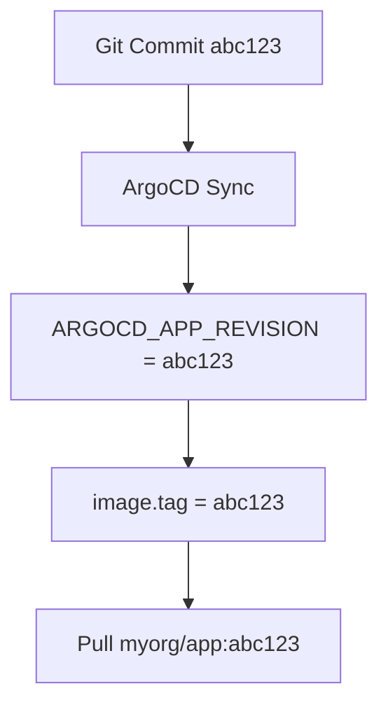

# How to Pass ARGOCD_APP_REVISION to Manifest Generation

Author: [nawazdhandala](https://github.com/nawazdhandala)

Tags: ArgoCD, GitOps, Kubernetes, Manifest Generation, Version Tracking

Description: Learn how to use the ARGOCD_APP_REVISION build environment variable in ArgoCD to track Git commits in deployments, tag images dynamically, and implement revision-based workflows.

---

The `ARGOCD_APP_REVISION` environment variable provides the resolved Git revision (commit SHA) that ArgoCD is currently syncing. This is one of the most practical build environment variables because it connects your deployed Kubernetes resources directly to the exact Git commit they came from.

This guide shows you how to use `ARGOCD_APP_REVISION` for deployment traceability, dynamic image tagging, and revision-based automation.

## What ARGOCD_APP_REVISION Contains

The value depends on the tracking strategy configured for your Application:

| Tracking Strategy | ARGOCD_APP_REVISION Value |
|---|---|
| Branch tracking (e.g., `main`) | Full commit SHA (e.g., `a1b2c3d4e5f6...`) |
| Tag tracking (e.g., `v1.5.0`) | The tag name (e.g., `v1.5.0`) |
| Specific commit | The commit SHA |
| HEAD | Full commit SHA |

For branch tracking, which is the most common setup, the revision is always the full 40-character Git commit SHA.

```yaml
apiVersion: argoproj.io/v1alpha1
kind: Application
metadata:
  name: backend-api
  namespace: argocd
spec:
  source:
    repoURL: https://github.com/myorg/config-repo.git
    targetRevision: main    # Branch tracking
    path: apps/backend-api
```

When ArgoCD syncs this application from commit `a1b2c3d4e5f6789...`, `ARGOCD_APP_REVISION` will contain that full SHA.

## Using ARGOCD_APP_REVISION in Helm

### As a Parameter for Deployment Annotations

The most common use case is adding the Git revision to deployment annotations:

```yaml
apiVersion: argoproj.io/v1alpha1
kind: Application
metadata:
  name: backend-api
  namespace: argocd
spec:
  source:
    repoURL: https://github.com/myorg/helm-charts.git
    targetRevision: main
    path: charts/backend-api
    helm:
      parameters:
        - name: gitRevision
          value: $ARGOCD_APP_REVISION
  destination:
    server: https://kubernetes.default.svc
    namespace: backend-api
```

In your Helm templates:

```yaml
# templates/deployment.yaml
apiVersion: apps/v1
kind: Deployment
metadata:
  name: {{ include "backend-api.fullname" . }}
  annotations:
    # Track which Git commit this deployment came from
    app.kubernetes.io/git-revision: {{ .Values.gitRevision | default "unknown" | quote }}
    deployment.kubernetes.io/revision-hash: {{ .Values.gitRevision | default "unknown" | trunc 8 | quote }}
spec:
  template:
    metadata:
      annotations:
        # Also add to pod template so pods restart on revision change
        app.kubernetes.io/git-revision: {{ .Values.gitRevision | default "unknown" | quote }}
    spec:
      containers:
        - name: {{ .Chart.Name }}
          image: "{{ .Values.image.repository }}:{{ .Values.image.tag }}"
```

### Dynamic Image Tagging

If your CI pipeline tags container images with the Git commit SHA, use `ARGOCD_APP_REVISION` to set the image tag automatically:

```yaml
spec:
  source:
    helm:
      parameters:
        - name: image.tag
          value: $ARGOCD_APP_REVISION
```

This means:
- Developer commits to the config repo
- ArgoCD detects the new commit
- Manifest generation uses the commit SHA as the image tag
- The deployment pulls the image built from that exact commit

The flow:



### Short Revision for Labels

Kubernetes labels have a 63-character limit. Use the truncated revision:

```yaml
# templates/deployment.yaml
metadata:
  labels:
    git-sha: {{ .Values.gitRevision | default "unknown" | trunc 8 | quote }}
```

## Using ARGOCD_APP_REVISION in Custom Plugins

Custom plugins access the revision directly:

```python
#!/usr/bin/env python3
# generate.py
import os
import json

revision = os.environ.get('ARGOCD_APP_REVISION', 'unknown')
app_name = os.environ.get('ARGOCD_APP_NAME', 'unknown')

# Generate a ConfigMap with build info
config = {
    'apiVersion': 'v1',
    'kind': 'ConfigMap',
    'metadata': {
        'name': f'{app_name}-build-info'
    },
    'data': {
        'git-revision': revision,
        'git-revision-short': revision[:8],
        'build-timestamp': '2024-03-15T10:30:00Z',
        'argocd-app': app_name
    }
}

print('---')
print(json.dumps(config))
```

## Practical Use Cases

### Deployment Traceability

When investigating a production issue, you need to quickly find which code is running. With the revision annotation:

```bash
# Find which Git commit is deployed
kubectl get deployment backend-api \
  -o jsonpath='{.metadata.annotations.app\.kubernetes\.io/git-revision}'
# Output: a1b2c3d4e5f6789...

# View that exact commit
git show a1b2c3d4e5f6789
```

### Build Info Endpoint

Many applications expose a `/health` or `/info` endpoint. Include the Git revision:

```yaml
containers:
  - name: backend
    env:
      - name: GIT_REVISION
        value: {{ .Values.gitRevision | quote }}
```

In your application code:

```python
# health.py
import os

@app.route('/info')
def info():
    return {
        'version': os.environ.get('APP_VERSION', 'unknown'),
        'git_revision': os.environ.get('GIT_REVISION', 'unknown'),
        'status': 'healthy'
    }
```

### Revision-Based Cache Busting

Use the revision to bust caches on frontend deployments:

```yaml
# templates/configmap.yaml
apiVersion: v1
kind: ConfigMap
metadata:
  name: {{ include "frontend.fullname" . }}-config
data:
  config.json: |
    {
      "apiBaseUrl": "{{ .Values.apiBaseUrl }}",
      "version": "{{ .Values.gitRevision | trunc 8 }}",
      "assetPrefix": "/static/{{ .Values.gitRevision | trunc 8 }}"
    }
```

### Rollback Identification

When you need to rollback, knowing the revision helps:

```bash
# Check sync history with revisions
argocd app history backend-api

# Output:
# ID  DATE                           REVISION
# 1   2024-03-15T10:30:00Z          a1b2c3d4
# 2   2024-03-16T14:22:00Z          e5f6g7h8
# 3   2024-03-18T09:15:00Z          i9j0k1l2

# Rollback to a specific revision
argocd app rollback backend-api 2
```

### Canary Analysis

Use the revision to tag canary deployments for monitoring:

```yaml
metadata:
  labels:
    revision: {{ .Values.gitRevision | trunc 8 | quote }}
```

Then in Prometheus queries, compare metrics between revisions:

```promql
# Compare error rates between current and previous revision
rate(http_errors_total{revision="i9j0k1l2"}[5m])
/
rate(http_errors_total{revision="e5f6g7h8"}[5m])
```

## Handling Tag-Based Revisions

When using tag-based tracking, `ARGOCD_APP_REVISION` contains the tag name instead of a SHA:

```yaml
spec:
  source:
    targetRevision: v1.5.0    # ARGOCD_APP_REVISION = "v1.5.0"
```

Adjust your templates to handle both formats:

```yaml
metadata:
  annotations:
    # Works for both SHA and tag
    app.kubernetes.io/version: {{ .Values.gitRevision | quote }}
  labels:
    # Truncate for labels (safe for both SHA and short tags)
    version: {{ .Values.gitRevision | trunc 63 | quote }}
```

## Revision in Multi-Source Applications

When using multiple sources, each source has its own revision. ArgoCD provides the revision of the primary source in `ARGOCD_APP_REVISION`. For multi-source setups:

```yaml
spec:
  sources:
    - repoURL: https://github.com/myorg/helm-charts.git
      targetRevision: main    # This revision is in ARGOCD_APP_REVISION
      path: charts/backend-api
      helm:
        parameters:
          - name: chartRevision
            value: $ARGOCD_APP_REVISION

    - repoURL: https://github.com/myorg/config-repo.git
      targetRevision: main
      ref: configValues
```

## Debugging ARGOCD_APP_REVISION

If the revision is not what you expect:

```bash
# Check the current sync status and revision
argocd app get backend-api -o json | jq '.status.sync.revision'

# Check the target revision configured
argocd app get backend-api -o json | jq '.spec.source.targetRevision'

# See what the repo server resolves
kubectl logs -n argocd deployment/argocd-repo-server | grep "revision"
```

## Summary

`ARGOCD_APP_REVISION` connects your deployed Kubernetes resources to the exact Git commit they came from. Use it for deployment annotations, dynamic image tagging, build info endpoints, cache busting, and rollback identification. This variable is essential for maintaining traceability in GitOps workflows - when something goes wrong in production, knowing the exact Git revision lets you quickly find the relevant code changes and either fix forward or rollback.
