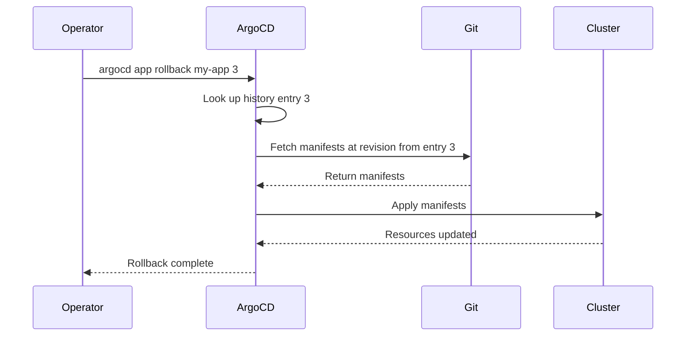

# How to Use argocd app rollback for Emergency Recovery

Author: [nawazdhandala](https://github.com/nawazdhandala)

Tags: ArgoCD, GitOps, Kubernetes, CLI, Disaster Recovery

Description: Learn how to use argocd app rollback to revert to previous deployments during emergencies, with strategies for handling auto-sync and post-rollback procedures.

---

When a deployment goes wrong in production, speed matters. The `argocd app rollback` command lets you revert an application to a previously known-good state by redeploying manifests from a previous history entry. This guide covers how to use it effectively, including the important gotchas around auto-sync that can undo your rollback.

## How Rollback Works in ArgoCD

ArgoCD stores a history of successful sync operations. Each entry contains the Git revision and the source configuration used at that point. When you rollback, ArgoCD re-renders the manifests from that historical revision and applies them to the cluster.



Important: A rollback does NOT revert your Git repository. It deploys a previous revision's manifests to the cluster. This means the application will show as OutOfSync after rollback because the live state no longer matches the current Git HEAD.

## Basic Rollback

First, check the history to find the target:

```bash
# View deployment history
argocd app history my-app
```

Output:

```
ID  DATE                           REVISION
4   2026-02-26 09:30:00 +0000 UTC  abc123d (HEAD)   <-- broken deployment
3   2026-02-25 14:15:00 +0000 UTC  def456a          <-- last known good
2   2026-02-24 09:00:00 +0000 UTC  ghi789b
1   2026-02-23 16:45:00 +0000 UTC  jkl012c
```

Then rollback to the desired history entry:

```bash
# Rollback to history entry 3 (last known good)
argocd app rollback my-app 3
```

## The Auto-Sync Problem

This is the single most important thing to understand about ArgoCD rollbacks: if auto-sync is enabled, ArgoCD will immediately detect that the live state does not match the current Git HEAD and will re-sync, undoing your rollback.

You must disable auto-sync before rolling back:

```bash
# Step 1: Disable auto-sync
argocd app set my-app --sync-policy none

# Step 2: Rollback
argocd app rollback my-app 3

# Step 3: Verify the rollback
argocd app get my-app
```

After the immediate crisis is resolved, either fix the issue in Git and re-enable auto-sync, or leave auto-sync disabled until the fix is committed.

## Complete Emergency Rollback Procedure

Here is a battle-tested rollback procedure:

```bash
#!/bin/bash
# emergency-rollback.sh - Complete emergency rollback procedure

APP_NAME="${1:?Usage: emergency-rollback.sh <app-name> [history-id]}"
HISTORY_ID="${2:-}"

echo "=== EMERGENCY ROLLBACK: $APP_NAME ==="
echo "Time: $(date)"
echo ""

# Step 1: Show current state
echo "--- Current State ---"
argocd app get "$APP_NAME" --refresh
echo ""

# Step 2: Show history
echo "--- Deployment History ---"
argocd app history "$APP_NAME"
echo ""

# Step 3: Get target history ID
if [ -z "$HISTORY_ID" ]; then
  # Default to the previous deployment
  HISTORY_ID=$(argocd app history "$APP_NAME" -o json | jq '.[1].id')
  echo "No history ID specified. Defaulting to previous deployment: $HISTORY_ID"
fi

TARGET_REV=$(argocd app history "$APP_NAME" -o json | jq -r ".[] | select(.id == $HISTORY_ID) | .revision")
echo "Rolling back to history entry $HISTORY_ID (revision: $TARGET_REV)"
echo ""

# Step 4: Disable auto-sync
echo "--- Disabling auto-sync ---"
argocd app set "$APP_NAME" --sync-policy none
echo "Auto-sync disabled."
echo ""

# Step 5: Perform rollback
echo "--- Performing rollback ---"
argocd app rollback "$APP_NAME" "$HISTORY_ID"
echo ""

# Step 6: Wait for resources to stabilize
echo "--- Waiting for application to become healthy ---"
argocd app wait "$APP_NAME" --health --timeout 300

# Step 7: Verify
echo ""
echo "--- Post-Rollback State ---"
argocd app get "$APP_NAME"
echo ""

HEALTH=$(argocd app get "$APP_NAME" -o json | jq -r '.status.health.status')
if [ "$HEALTH" = "Healthy" ]; then
  echo "ROLLBACK SUCCESSFUL - Application is healthy"
else
  echo "WARNING: Application health is $HEALTH after rollback"
  echo "Manual investigation may be required"
fi

echo ""
echo "REMINDER: Auto-sync is DISABLED. Re-enable after fixing the issue in Git:"
echo "  argocd app set $APP_NAME --sync-policy automated --self-heal --auto-prune"
```

## Rollback vs Revert

There is an important distinction between rollback and revert in GitOps:

### Rollback (argocd app rollback)

- Deploys a previous revision to the cluster
- Does NOT change Git
- Application shows as OutOfSync
- Temporary fix - will be overwritten when auto-sync is re-enabled
- Fast - no Git operations needed

### Revert (Git revert)

- Reverts changes in Git
- ArgoCD syncs the reverted state naturally
- Application stays in Synced state
- Permanent fix - the revert is part of Git history
- Slower - requires Git operations

For production incidents, the recommended approach is:

1. **Immediate**: Use `argocd app rollback` to restore service
2. **Follow-up**: Use `git revert` in the source repository to make the fix permanent
3. **Final**: Re-enable auto-sync so ArgoCD picks up the Git revert

## Rollback for Helm Applications

For Helm-based applications, the rollback restores the Helm values and chart version from the history entry:

```bash
# Check history to see Helm parameters at each point
argocd app history my-app -o json | jq '.[] | {id: .id, revision: .revision, helmValues: .source.helm}'

# Rollback will restore those exact Helm parameters
argocd app rollback my-app 3
```

## Partial Rollback

ArgoCD does not support rolling back individual resources. The rollback is always for the entire application. However, you can achieve a partial rollback by:

```bash
# Sync specific resources from a previous revision
argocd app sync my-app \
  --revision <previous-revision-sha> \
  --resource 'apps:Deployment:my-app'
```

This syncs only the Deployment from the previous revision while leaving other resources untouched.

## Monitoring After Rollback

After a rollback, monitor the application closely:

```bash
#!/bin/bash
# post-rollback-monitor.sh - Monitor application after rollback

APP_NAME="${1:?Usage: post-rollback-monitor.sh <app-name>}"
DURATION="${2:-300}"  # Monitor for 5 minutes by default

echo "Monitoring $APP_NAME for $DURATION seconds..."

END_TIME=$(($(date +%s) + DURATION))

while [ $(date +%s) -lt $END_TIME ]; do
  HEALTH=$(argocd app get "$APP_NAME" -o json | jq -r '.status.health.status')
  SYNC=$(argocd app get "$APP_NAME" -o json | jq -r '.status.sync.status')

  echo "$(date '+%H:%M:%S') - Health: $HEALTH, Sync: $SYNC"

  if [ "$HEALTH" = "Degraded" ]; then
    echo "WARNING: Application has become Degraded!"
    argocd app get "$APP_NAME" -o json | jq '.status.resources[] | select(.health.status == "Degraded")'
  fi

  sleep 10
done

echo "Monitoring complete."
```

## Limitations of argocd app rollback

1. **History retention**: Only works within the revision history limit (default 10). If your target revision has been pruned from history, you cannot rollback to it.

2. **No partial rollback**: You cannot rollback individual resources within an application.

3. **Auto-sync conflict**: Rollback is immediately undone if auto-sync is enabled.

4. **No database rollback**: Application rollback does not roll back database schemas, migrations, or data changes.

5. **Stateful resources**: PVCs, PVs, and other stateful resources may not be affected by the rollback.

## Best Practices

1. **Increase history retention for critical apps**: Set `revisionHistoryLimit: 50` on production applications.

2. **Document rollback procedures**: Make sure your team knows the rollback process before they need it.

3. **Test rollbacks regularly**: Practice rollbacks in staging to build muscle memory.

4. **Always disable auto-sync first**: This is the number one mistake during emergency rollbacks.

5. **Follow up with a Git revert**: A rollback is a temporary fix. Make the fix permanent in Git.

## Summary

The `argocd app rollback` command is your emergency brake when a deployment goes wrong. It quickly restores a previous known-good state by re-deploying manifests from a historical revision. The critical gotcha is auto-sync - always disable it before rolling back, or your rollback will be immediately overwritten. For permanent fixes, follow up with a Git revert and then re-enable auto-sync.
