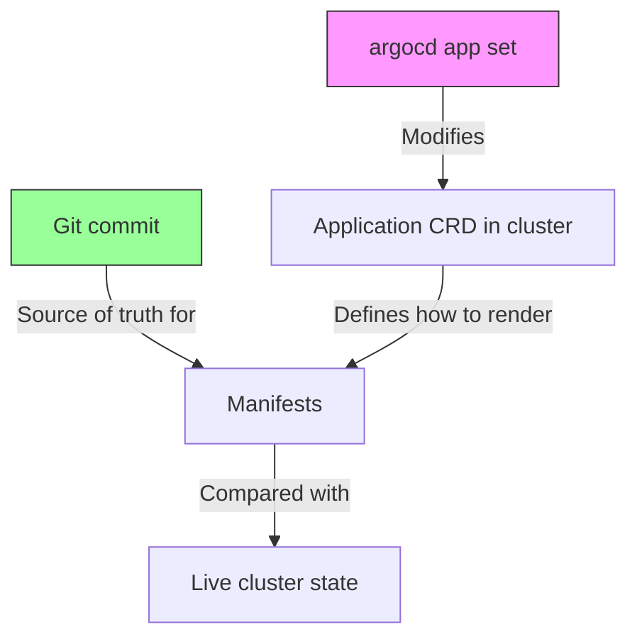

# How to Use argocd app set to Update Applications

Author: [nawazdhandala](https://github.com/nawazdhandala)

Tags: ArgoCD, GitOps, Kubernetes, CLI, Configuration

Description: Learn how to use argocd app set to modify ArgoCD application settings including source configuration, sync policies, parameters, and destination changes.

---

The `argocd app set` command lets you modify an existing ArgoCD application's configuration without recreating it. Whether you need to change the target branch, update Helm values, modify sync policies, or switch the destination cluster, `argocd app set` is the tool. This guide covers all the important options and when to use them.

## Basic Usage

```bash
# Change the target revision
argocd app set my-app --revision main

# Change the source path
argocd app set my-app --path apps/my-app-v2

# Change the repository URL
argocd app set my-app --repo https://github.com/my-org/new-manifests.git
```

Each `argocd app set` call modifies the Application spec in place. The changes take effect immediately and, if auto-sync is enabled, will trigger a new sync.

## Source Configuration Changes

### Changing the Git Source

```bash
# Switch to a different branch
argocd app set my-app --revision production

# Pin to a specific tag
argocd app set my-app --revision v3.0.0

# Pin to a specific commit
argocd app set my-app --revision abc123def456

# Change the path within the repository
argocd app set my-app --path k8s/overlays/staging

# Change the entire repository
argocd app set my-app --repo https://github.com/my-org/different-repo.git
```

### Updating Helm Values

```bash
# Set individual Helm parameters
argocd app set my-app --helm-set image.tag=v2.1.0
argocd app set my-app --helm-set replicaCount=5

# Set string values (important for values that might be interpreted as numbers)
argocd app set my-app --helm-set-string buildId=001234

# Set values from a file
argocd app set my-app --helm-set-file config=./config.yaml

# Change the values file
argocd app set my-app --values values-production.yaml

# Set multiple values at once
argocd app set my-app \
  --helm-set image.tag=v2.1.0 \
  --helm-set replicaCount=5 \
  --helm-set resources.limits.memory=512Mi
```

### Updating Kustomize Options

```bash
# Override images
argocd app set my-app --kustomize-image my-app=registry.example.com/my-app:v2.0.0

# Set name prefix
argocd app set my-app --nameprefix staging-

# Set name suffix
argocd app set my-app --namesuffix -v2

# Set Kustomize version
argocd app set my-app --kustomize-version v5.0.0
```

## Destination Changes

```bash
# Change the destination namespace
argocd app set my-app --dest-namespace new-namespace

# Change the destination cluster by URL
argocd app set my-app --dest-server https://new-cluster.example.com

# Change the destination cluster by name
argocd app set my-app --dest-name staging-cluster
```

**Warning**: Changing the destination of a running application can have significant consequences. If auto-sync is enabled, ArgoCD will deploy resources to the new destination and may prune them from the old one.

## Project Changes

```bash
# Move an application to a different project
argocd app set my-app --project production
```

The target project must allow the application's source and destination. If the project restrictions do not permit the move, the command will fail.

## Sync Policy Changes

```bash
# Enable auto-sync
argocd app set my-app --sync-policy automated

# Disable auto-sync (switch to manual)
argocd app set my-app --sync-policy none

# Enable auto-prune
argocd app set my-app --auto-prune

# Disable auto-prune
argocd app set my-app --auto-prune=false

# Enable self-healing
argocd app set my-app --self-heal

# Disable self-healing
argocd app set my-app --self-heal=false
```

## Sync Options

```bash
# Add sync options
argocd app set my-app --sync-option CreateNamespace=true
argocd app set my-app --sync-option PruneLast=true
argocd app set my-app --sync-option ServerSideApply=true

# Remove a sync option (prefix with !)
argocd app set my-app --sync-option '!PruneLast=true'
```

## Sync Retry Configuration

```bash
argocd app set my-app \
  --sync-retry-limit 5 \
  --sync-retry-backoff-duration 10s \
  --sync-retry-backoff-factor 2 \
  --sync-retry-backoff-max-duration 5m
```

## Common Workflow Patterns

### Image Tag Update from CI/CD

The most common use of `argocd app set` in CI/CD pipelines:

```bash
#!/bin/bash
# deploy.sh - Update image tag and sync

APP_NAME="${1:?Usage: deploy.sh <app-name> <image-tag>}"
IMAGE_TAG="${2:?Usage: deploy.sh <app-name> <image-tag>}"

echo "Updating $APP_NAME to image tag: $IMAGE_TAG"

# Update the image tag
argocd app set "$APP_NAME" --helm-set image.tag="$IMAGE_TAG"

# Trigger sync
argocd app sync "$APP_NAME"

# Wait for healthy state
argocd app wait "$APP_NAME" --health --timeout 300
```

### Environment Promotion

Promote from staging to production by changing the revision:

```bash
#!/bin/bash
# promote.sh - Promote a staging revision to production

STAGING_APP="my-app-staging"
PROD_APP="my-app-production"

# Get the current staging revision
STAGING_REV=$(argocd app get "$STAGING_APP" -o json | jq -r '.status.sync.revision')

echo "Staging is at revision: $STAGING_REV"
echo "Promoting to production..."

# Set production to the same revision
argocd app set "$PROD_APP" --revision "$STAGING_REV"

# Sync production
argocd app sync "$PROD_APP"
argocd app wait "$PROD_APP" --health --timeout 600
```

### Bulk Configuration Changes

Apply the same change across multiple applications:

```bash
#!/bin/bash
# bulk-update.sh - Update a setting across all team applications

LABEL_SELECTOR="${1:?Usage: bulk-update.sh <label-selector> <args...>}"
shift
ARGS="$@"

APPS=$(argocd app list -l "$LABEL_SELECTOR" -o name)

for app in $APPS; do
  echo "Updating $app with: $ARGS"
  argocd app set "$app" $ARGS
done

echo "Updated all matching applications"
```

Usage:

```bash
# Enable self-heal for all production apps
./bulk-update.sh "environment=production" --self-heal

# Update image tag for all backend team apps
./bulk-update.sh "team=backend,environment=staging" --helm-set image.tag=v3.0.0
```

### Temporary Changes for Debugging

```bash
# Increase replicas for load testing
argocd app set my-app --helm-set replicaCount=10

# Enable debug logging
argocd app set my-app --helm-set logLevel=debug

# After debugging, restore from Git
argocd app sync my-app
```

Note: If auto-sync is enabled, temporary changes through `argocd app set` will be overwritten by the next reconciliation unless they match what is in Git. To make temporary changes stick, either disable auto-sync first or commit the changes to Git.

## Understanding app set vs Git Changes

There is an important distinction between changes made via `argocd app set` and changes committed to Git:



- `argocd app set` modifies the Application resource (how ArgoCD renders manifests)
- Git commits modify the manifests themselves (what gets deployed)

Both can cause OutOfSync status and trigger syncs. The key point: `argocd app set` changes the Application spec, which is stored in the cluster, not in Git. If you manage applications declaratively (Application YAML in Git), `argocd app set` changes will be overwritten when the parent app-of-apps syncs.

## Viewing Current Settings

Before changing settings, check what is currently configured:

```bash
# See the full application spec
argocd app get my-app -o json | jq '.spec'

# Check specific settings
argocd app get my-app -o json | jq '.spec.source'
argocd app get my-app -o json | jq '.spec.syncPolicy'
argocd app get my-app -o json | jq '.spec.source.helm.parameters'
```

## Unset Values

To remove a previously set value, you often need to use `argocd app unset`:

```bash
# Remove a Helm parameter
argocd app unset my-app --helm-set image.tag

# Remove a values file
argocd app unset my-app --values values-override.yaml

# Remove name prefix
argocd app unset my-app --nameprefix

# Remove name suffix
argocd app unset my-app --namesuffix
```

## Summary

The `argocd app set` command is your tool for modifying application configuration on the fly. It is most commonly used in CI/CD pipelines for image tag updates, environment promotion scripts, and quick configuration changes during debugging. Remember that for production environments managed declaratively, changes made via `argocd app set` should eventually be reflected in Git to maintain your GitOps source of truth.
