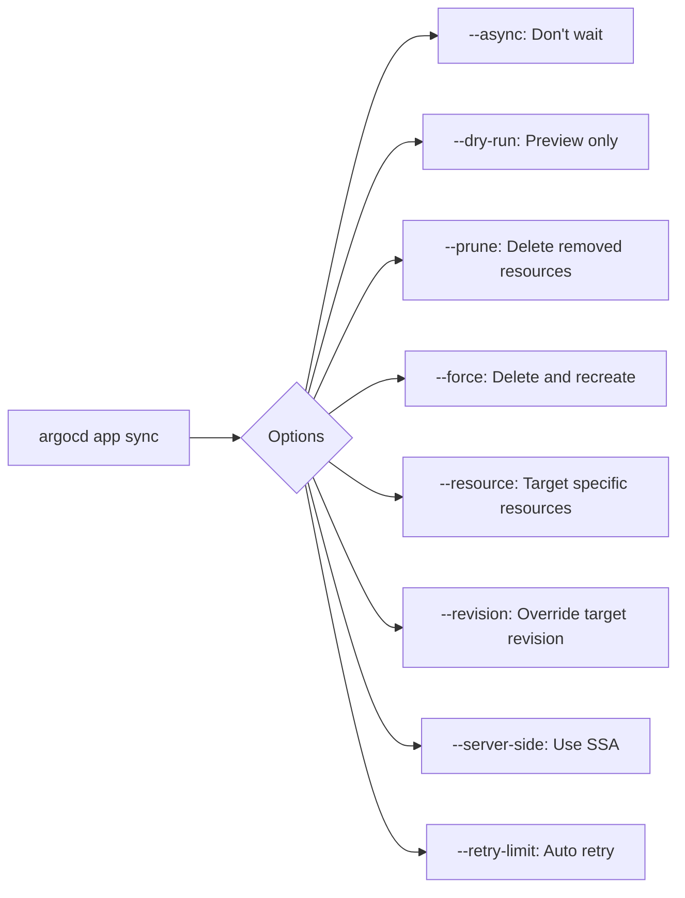

# How to Use argocd app sync with Options

Author: [nawazdhandala](https://github.com/nawazdhandala)

Tags: ArgoCD, GitOps, Kubernetes, CLI, Deployment

Description: A detailed guide to the argocd app sync command covering sync strategies, selective sync, dry run, resource targeting, and CI/CD integration patterns.

---

The `argocd app sync` command is the verb that makes things happen in ArgoCD. It takes your desired state from Git and applies it to the cluster. While auto-sync handles this automatically, manual sync through the CLI gives you precise control over what gets deployed, when, and how. This guide covers every important option.

## Basic Sync

The simplest sync:

```bash
argocd app sync my-app
```

This triggers a full sync of the application, applying all resources from the Git source to the destination cluster. ArgoCD will:

1. Fetch the latest manifests from Git
2. Compare them with the live state
3. Apply any differences
4. Report the result

## Synchronous vs Asynchronous Sync

By default, `argocd app sync` waits for the sync operation to complete:

```bash
# Default: wait for sync to complete (synchronous)
argocd app sync my-app

# Async: trigger sync and return immediately
argocd app sync my-app --async
```

The async option is useful in CI/CD pipelines where you trigger the sync in one step and check the result in another.

## Targeting a Specific Revision

Override the application's target revision for this sync only:

```bash
# Sync to a specific Git commit
argocd app sync my-app --revision a1b2c3d4e5f6

# Sync to a specific branch
argocd app sync my-app --revision feature/new-api

# Sync to a specific tag
argocd app sync my-app --revision v2.1.0
```

This does not change the application's configured target revision - it is a one-time override for this sync operation.

## Dry Run

Preview what would change without actually applying anything:

```bash
argocd app sync my-app --dry-run
```

This shows you exactly which resources would be created, updated, or deleted. Invaluable before syncing production applications.

## Selective Sync (Resource Targeting)

Instead of syncing everything, you can target specific resources:

```bash
# Sync a specific resource by kind and name
argocd app sync my-app --resource ':Deployment:my-app'

# Sync a specific resource with group
argocd app sync my-app --resource 'apps:Deployment:my-app'

# Sync multiple resources
argocd app sync my-app \
  --resource ':Service:my-app-svc' \
  --resource 'apps:Deployment:my-app'

# Sync all resources of a specific kind
argocd app sync my-app --resource ':ConfigMap:*'

# Sync resources in a specific namespace
argocd app sync my-app --resource ':Deployment:my-app:my-namespace'
```

The resource format is `GROUP:KIND:NAME` or `GROUP:KIND:NAME:NAMESPACE`.

## Sync Only OutOfSync Resources

Skip resources that are already in sync:

```bash
argocd app sync my-app --apply-out-of-sync-only
```

This can significantly speed up syncs for large applications where only a few resources have changed.

## Prune Control

Control whether removed resources get deleted:

```bash
# Sync with pruning enabled (delete resources not in Git)
argocd app sync my-app --prune

# Sync without pruning (even if auto-prune is configured)
argocd app sync my-app --prune=false
```

## Force Sync

Force apply resources, replacing them entirely:

```bash
# Force replace resources instead of applying
argocd app sync my-app --force
```

The `--force` flag causes ArgoCD to delete and recreate resources instead of using `kubectl apply`. This is useful when you encounter immutable field errors (like changing a Deployment's selector).

**Warning**: Force sync causes brief downtime for affected resources since they are deleted before recreation.

## Server-Side Apply

Use Kubernetes server-side apply instead of client-side:

```bash
argocd app sync my-app --server-side
```

Server-side apply handles field ownership better and avoids certain conflict issues, especially with large resources or resources managed by multiple controllers.

## Sync Strategy Options

```bash
# Apply sync strategy (default - uses kubectl apply)
argocd app sync my-app --strategy apply

# Hook sync strategy (run hooks but do not apply manifests)
argocd app sync my-app --strategy hook
```

## Retry Configuration

Configure retry behavior for this sync:

```bash
argocd app sync my-app \
  --retry-limit 5 \
  --retry-backoff-duration 10s \
  --retry-backoff-factor 2 \
  --retry-backoff-max-duration 5m
```

This retries the sync up to 5 times with exponential backoff, starting at 10 seconds and maxing out at 5 minutes.

## Sync with Helm Parameters

Override Helm parameters for this sync only:

```bash
argocd app sync my-app \
  --helm-set image.tag=v2.1.0 \
  --helm-set replicaCount=5
```

Note that these overrides are temporary and will not persist in the application spec.

## Sync Workflow for CI/CD Pipelines

Here is a complete CI/CD sync workflow:

```bash
#!/bin/bash
# ci-deploy.sh - Deploy via ArgoCD in a CI pipeline

APP_NAME="${1:?Usage: ci-deploy.sh <app-name>}"
IMAGE_TAG="${2:?Usage: ci-deploy.sh <app-name> <image-tag>}"

echo "Step 1: Update image tag"
argocd app set "$APP_NAME" --helm-set image.tag="$IMAGE_TAG"

echo "Step 2: Trigger sync"
argocd app sync "$APP_NAME" --async

echo "Step 3: Wait for sync to complete"
argocd app wait "$APP_NAME" --timeout 300

echo "Step 4: Verify health"
HEALTH=$(argocd app get "$APP_NAME" -o json | jq -r '.status.health.status')

if [ "$HEALTH" != "Healthy" ]; then
  echo "ERROR: Application is not healthy after sync: $HEALTH"
  echo "Initiating rollback..."
  argocd app rollback "$APP_NAME"
  exit 1
fi

echo "Deployment successful! Application is $HEALTH"
```

## Monitoring Sync Progress

After triggering a sync, monitor its progress:

```bash
# Watch sync operation in real time (block until complete)
argocd app sync my-app

# Or trigger async and then wait separately
argocd app sync my-app --async
argocd app wait my-app --sync --timeout 300

# Check sync status after async trigger
argocd app get my-app -o json | jq '{
  sync: .status.sync.status,
  operation: .status.operationState.phase,
  message: .status.operationState.message
}'
```

## Sync with Label Selector

Sync multiple applications at once using label selectors:

```bash
# Sync all applications with a specific label
argocd app sync -l team=backend

# Sync all staging applications
argocd app sync -l environment=staging

# Sync all apps in a project
argocd app sync -l argocd.argoproj.io/instance=my-app-set --async
```

## Handling Common Sync Issues

### Immutable Field Error

```
error: Deployment.apps "my-app" is invalid: spec.selector: Invalid value: ...: field is immutable
```

Solution: Use force sync to replace the resource:

```bash
argocd app sync my-app --force --resource 'apps:Deployment:my-app'
```

### Resource Already Exists

```
error: the object already exists
```

Solution: The resource exists but is not tracked by ArgoCD. Use the replace sync option:

```bash
argocd app sync my-app --replace
```

### Namespace Does Not Exist

```
error: namespace "my-app-ns" not found
```

Solution: Add the CreateNamespace sync option:

```bash
argocd app set my-app --sync-option CreateNamespace=true
argocd app sync my-app
```

## Sync Waves and Hooks Interaction

When your application uses sync waves and hooks, the sync command respects them:

```bash
# Normal sync respects waves and hooks
argocd app sync my-app

# Skip hooks during sync
argocd app sync my-app --skip-hooks
```

The sync will execute in order:
1. PreSync hooks (wave order)
2. Sync phase resources (wave order)
3. PostSync hooks (wave order)

## Comparing Sync Options

Here is a quick reference for the most common sync flags:



## Summary

The `argocd app sync` command is the most frequently used ArgoCD CLI command. Start with simple syncs and gradually adopt targeted options like `--resource` for selective sync, `--dry-run` for safety, and `--async` with `argocd app wait` for CI/CD pipelines. Understanding sync options deeply is what separates effective ArgoCD usage from struggling with deployment issues.
