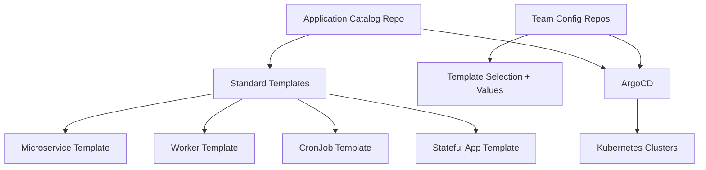

# How to Implement the Application Catalog Pattern

Author: [nawazdhandala](https://github.com/nawazdhandala)

Tags: ArgoCD, GitOps, Kubernetes, Platform Engineering, Self-Service

Description: Learn how to build an application catalog pattern with ArgoCD that lets developers self-service deploy standardized applications from a curated set of templates.

---

The application catalog pattern creates a self-service experience for developers. Instead of each team writing their own Kubernetes manifests from scratch, you build a catalog of pre-approved, battle-tested application templates. Teams pick from the catalog, fill in their values, and ArgoCD handles the rest. Think of it as an internal app store for your Kubernetes platform.

## The Problem It Solves

Without a catalog, every team reinvents the wheel:

- Team A writes their own Deployment with 3 containers and no resource limits
- Team B copies and pastes YAML from Stack Overflow
- Team C builds a Helm chart that works but does not follow security best practices
- The platform team spends weeks reviewing and fixing each team's manifests

An application catalog standardizes the deployment patterns while giving teams freedom to configure the parameters that matter to them.

## Architecture



## Building the Catalog

### Catalog Repository Structure

```text
app-catalog/
├── templates/
│   ├── microservice/
│   │   ├── Chart.yaml
│   │   ├── values.yaml
│   │   ├── values.schema.json
│   │   └── templates/
│   │       ├── deployment.yaml
│   │       ├── service.yaml
│   │       ├── hpa.yaml
│   │       ├── pdb.yaml
│   │       ├── networkpolicy.yaml
│   │       └── servicemonitor.yaml
│   ├── worker/
│   │   ├── Chart.yaml
│   │   ├── values.yaml
│   │   ├── values.schema.json
│   │   └── templates/
│   │       ├── deployment.yaml
│   │       ├── hpa.yaml
│   │       └── networkpolicy.yaml
│   ├── cronjob/
│   │   ├── Chart.yaml
│   │   ├── values.yaml
│   │   ├── values.schema.json
│   │   └── templates/
│   │       ├── cronjob.yaml
│   │       └── networkpolicy.yaml
│   └── stateful/
│       ├── Chart.yaml
│       ├── values.yaml
│       ├── values.schema.json
│       └── templates/
│           ├── statefulset.yaml
│           ├── service.yaml
│           ├── pvc.yaml
│           └── networkpolicy.yaml
├── docs/
│   └── catalog.yaml
└── tests/
    └── templates/
```

### Microservice Template

The microservice template is the most commonly used. It includes everything a team needs:

```yaml
# templates/microservice/Chart.yaml
apiVersion: v2
name: microservice
description: Standard microservice template with best practices
version: 2.1.0
appVersion: "1.0.0"
```

```yaml
# templates/microservice/values.yaml
# Application identity
name: ""
team: ""
tier: "standard"  # standard, critical, internal

# Container configuration
image:
  repository: ""
  tag: "latest"
  pullPolicy: IfNotPresent

# Scaling
replicas:
  min: 2
  max: 10
  targetCPU: 70
  targetMemory: 80

# Resources
resources:
  requests:
    cpu: 100m
    memory: 128Mi
  limits:
    cpu: 500m
    memory: 512Mi

# Service configuration
service:
  port: 8080
  protocol: TCP

# Health checks
healthCheck:
  path: /healthz
  initialDelaySeconds: 10
  periodSeconds: 10

# Ingress
ingress:
  enabled: false
  host: ""
  tls: true

# Feature flags
features:
  pdb: true
  networkPolicy: true
  serviceMonitor: true
```

```yaml
# templates/microservice/templates/deployment.yaml
apiVersion: apps/v1
kind: Deployment
metadata:
  name: {{ .Values.name }}
  labels:
    app: {{ .Values.name }}
    team: {{ .Values.team }}
    tier: {{ .Values.tier }}
spec:
  replicas: {{ .Values.replicas.min }}
  selector:
    matchLabels:
      app: {{ .Values.name }}
  template:
    metadata:
      labels:
        app: {{ .Values.name }}
        team: {{ .Values.team }}
        tier: {{ .Values.tier }}
    spec:
      containers:
        - name: {{ .Values.name }}
          image: "{{ .Values.image.repository }}:{{ .Values.image.tag }}"
          imagePullPolicy: {{ .Values.image.pullPolicy }}
          ports:
            - containerPort: {{ .Values.service.port }}
              protocol: {{ .Values.service.protocol }}
          resources:
            requests:
              cpu: {{ .Values.resources.requests.cpu }}
              memory: {{ .Values.resources.requests.memory }}
            limits:
              cpu: {{ .Values.resources.limits.cpu }}
              memory: {{ .Values.resources.limits.memory }}
          readinessProbe:
            httpGet:
              path: {{ .Values.healthCheck.path }}
              port: {{ .Values.service.port }}
            initialDelaySeconds: {{ .Values.healthCheck.initialDelaySeconds }}
            periodSeconds: {{ .Values.healthCheck.periodSeconds }}
          livenessProbe:
            httpGet:
              path: {{ .Values.healthCheck.path }}
              port: {{ .Values.service.port }}
            initialDelaySeconds: {{ add .Values.healthCheck.initialDelaySeconds 10 }}
            periodSeconds: {{ .Values.healthCheck.periodSeconds }}
      {{- if eq .Values.tier "critical" }}
      topologySpreadConstraints:
        - maxSkew: 1
          topologyKey: topology.kubernetes.io/zone
          whenUnsatisfiable: DoNotSchedule
          labelSelector:
            matchLabels:
              app: {{ .Values.name }}
      {{- end }}
```

### Values Schema for Validation

Add a JSON schema to validate inputs:

```json
{
  "$schema": "http://json-schema.org/draft-07/schema#",
  "type": "object",
  "required": ["name", "team", "image"],
  "properties": {
    "name": {
      "type": "string",
      "pattern": "^[a-z][a-z0-9-]{2,62}$",
      "description": "Application name (lowercase, alphanumeric, hyphens)"
    },
    "team": {
      "type": "string",
      "enum": ["team-a", "team-b", "team-c", "platform"],
      "description": "Owning team"
    },
    "tier": {
      "type": "string",
      "enum": ["standard", "critical", "internal"],
      "description": "Service tier for resource allocation"
    },
    "image": {
      "type": "object",
      "required": ["repository"],
      "properties": {
        "repository": {
          "type": "string",
          "pattern": "^[a-z0-9./-]+$"
        },
        "tag": {
          "type": "string"
        }
      }
    }
  }
}
```

## How Teams Consume the Catalog

Teams create a simple values file that references the catalog template:

```text
team-a-config/
├── services/
│   ├── user-service/
│   │   └── values.yaml
│   ├── auth-service/
│   │   └── values.yaml
│   └── notification-service/
│       └── values.yaml
└── argocd-apps.yaml
```

```yaml
# services/user-service/values.yaml
name: user-service
team: team-a
tier: standard

image:
  repository: org/user-service
  tag: v2.1.0

replicas:
  min: 2
  max: 5
  targetCPU: 70

resources:
  requests:
    cpu: 200m
    memory: 256Mi
  limits:
    cpu: "1"
    memory: 1Gi

service:
  port: 8080

healthCheck:
  path: /health
  initialDelaySeconds: 15

ingress:
  enabled: true
  host: user-service.example.com
```

## ArgoCD Application Pointing to Catalog Template

Each service application references the catalog chart but uses team-specific values:

```yaml
apiVersion: argoproj.io/v1alpha1
kind: Application
metadata:
  name: user-service-production
  namespace: argocd
spec:
  project: team-a
  sources:
    # Multi-source: chart from catalog repo, values from team repo
    - repoURL: https://github.com/org/app-catalog.git
      targetRevision: v2.1.0
      path: templates/microservice
      helm:
        valueFiles:
          - $values/services/user-service/values.yaml
    - repoURL: https://github.com/org/team-a-config.git
      targetRevision: main
      ref: values
  destination:
    server: https://production-cluster.example.com
    namespace: team-a
```

## Auto-Discovery with ApplicationSets

Automatically create applications for every service directory in the team config repo:

```yaml
apiVersion: argoproj.io/v1alpha1
kind: ApplicationSet
metadata:
  name: team-a-catalog-apps
  namespace: argocd
spec:
  generators:
    - git:
        repoURL: https://github.com/org/team-a-config.git
        revision: main
        files:
          - path: "services/*/values.yaml"
  template:
    metadata:
      name: '{{path[1]}}-production'
    spec:
      project: team-a
      sources:
        - repoURL: https://github.com/org/app-catalog.git
          targetRevision: v2.1.0
          path: templates/microservice
          helm:
            valueFiles:
              - $values/{{path}}/values.yaml
        - repoURL: https://github.com/org/team-a-config.git
          targetRevision: main
          ref: values
      destination:
        server: https://production-cluster.example.com
        namespace: team-a
```

## Versioning the Catalog

Pin catalog template versions to prevent unexpected changes:

```yaml
# Point to a specific catalog version tag
source:
  repoURL: https://github.com/org/app-catalog.git
  targetRevision: v2.1.0  # Pinned version
  path: templates/microservice
```

When the platform team releases a new catalog version, teams bump the `targetRevision` at their own pace. This gives teams control over when they adopt new template changes.

## Catalog Governance

Enforce that all deployments use catalog templates through AppProject restrictions:

```yaml
apiVersion: argoproj.io/v1alpha1
kind: AppProject
metadata:
  name: team-a
spec:
  sourceRepos:
    # Only allow the catalog repo and team config repo
    - https://github.com/org/app-catalog.git
    - https://github.com/org/team-a-config.git
  destinations:
    - namespace: team-a
      server: https://production-cluster.example.com
```

This ensures teams cannot bypass the catalog and deploy arbitrary manifests.

## Testing Catalog Templates

Validate templates in CI before releasing:

```bash
# Test rendering with sample values
helm template test templates/microservice \
  --values templates/microservice/tests/sample-values.yaml \
  | kubeval --strict

# Test schema validation
helm lint templates/microservice \
  --values templates/microservice/tests/sample-values.yaml \
  --strict
```

The application catalog pattern is a key building block for internal developer platforms. It gives teams self-service deployment while maintaining organizational standards. For more on multi-source applications, see our guide on [ArgoCD multi-source Helm and Kustomize](https://oneuptime.com/blog/post/2026-02-09-argocd-multi-source-helm-kustomize/view).
