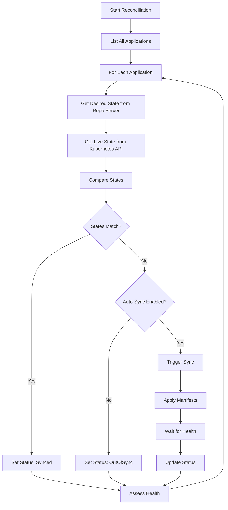

# Understanding the ArgoCD Application Controller Explained Simply

Author: [nawazdhandala](https://github.com/nawazdhandala)

Tags: ArgoCD, GitOps, Kubernetes, Controller

Description: A clear explanation of how the ArgoCD Application Controller works, including its reconciliation loop, sync operations, health checks, and performance tuning.

---

The Application Controller is the most important component in ArgoCD. It is the piece that watches your Git repos, compares the desired state with what is actually running, and makes sure your cluster matches what you have declared. If ArgoCD were a car, the Application Controller would be the engine.

This post explains what it does, how it works internally, and how to tune it for production workloads.

## What the Application Controller Does

The controller has four primary responsibilities:

1. **Monitoring Application resources** - it watches all ArgoCD Application custom resources in the cluster
2. **Comparing states** - it continuously compares the desired state (from Git) with the live state (from the cluster)
3. **Executing syncs** - when states differ and sync is triggered (automatically or manually), it applies the changes
4. **Assessing health** - it evaluates the health of every resource managed by each Application

These four jobs run in a continuous loop, which is why ArgoCD can detect drift, self-heal, and keep your cluster in the desired state without manual intervention.

## The Reconciliation Loop

The core of the controller is its reconciliation loop. Here is what happens during each cycle:



The loop runs continuously with configurable intervals. By default, the controller refreshes application state every 3 minutes for Git polling, but it also responds to webhook events for faster detection.

## How State Comparison Works

The comparison step is more nuanced than it appears. ArgoCD does not simply do a string comparison between YAML files. It performs what is called a "normalized diff."

When you write a Kubernetes Deployment, you might specify 10 fields. But the actual resource in the cluster has hundreds of fields, including defaults, status fields, managed fields, and fields injected by admission controllers. A naive diff would show hundreds of differences that do not matter.

The controller normalizes both sides:

1. **Removes server-side fields** - status, managedFields, creationTimestamp, uid, and similar fields that Kubernetes adds automatically
2. **Applies defaults** - if your manifest omits a field that has a default value (like `imagePullPolicy: IfNotPresent`), the controller accounts for that
3. **Handles strategic merge** - arrays and maps are compared using Kubernetes strategic merge logic, not raw string comparison

This normalization is why ArgoCD can accurately show you "Synced" when your manifests match the cluster, even though the raw YAML looks different.

## The Sync Process in Detail

When the controller decides to sync an application (either from auto-sync or manual trigger), it follows this sequence:

```bash
# You can observe the sync process in the controller logs
kubectl logs -l app.kubernetes.io/name=argocd-application-controller -n argocd -f
```

**Phase 1: Pre-Sync hooks**

The controller looks for resources annotated with `argocd.argoproj.io/hook: PreSync`. These are typically Jobs that run database migrations, validation scripts, or setup tasks. The controller waits for all PreSync hooks to complete before moving on.

**Phase 2: Sync waves**

Resources are grouped by their sync wave annotation (`argocd.argoproj.io/sync-wave`). Wave 0 goes first, then wave 1, and so on. Within each wave, resources are applied in a predefined order: Namespaces first, then ConfigMaps and Secrets, then Services, then Deployments, and so on. This order ensures dependencies exist before the resources that need them.

For more details on sync waves, see [how to implement sync waves in ArgoCD](https://oneuptime.com/blog/post/2026-01-25-sync-waves-argocd/view).

**Phase 3: Post-Sync hooks**

After all resources are applied and healthy, PostSync hooks run. These typically handle smoke tests, notifications, or cleanup tasks.

**Phase 4: Health assessment**

The controller evaluates the health of every resource. Each resource type has a health check function. Deployments are healthy when all replicas are available. Services are healthy when they have endpoints. StatefulSets are healthy when all pods are ready.

## Status and Operation Processors

The controller has two types of work processors:

- **Status processors** - handle the comparison of desired vs live state. These determine whether an application is Synced or OutOfSync.
- **Operation processors** - handle the actual sync operations. These apply manifests to the cluster.

By default, ArgoCD runs 20 status processors and 10 operation processors. You can tune these numbers based on your workload.

```yaml
# Adjust processor counts in the argocd-cmd-params-cm ConfigMap
apiVersion: v1
kind: ConfigMap
metadata:
  name: argocd-cmd-params-cm
  namespace: argocd
data:
  # Increase status processors for faster state detection
  controller.status.processors: "50"
  # Increase operation processors for more concurrent syncs
  controller.operation.processors: "25"
```

More status processors means ArgoCD detects drift faster. More operation processors means more syncs can happen in parallel. But both consume CPU and memory, so increase them gradually and monitor resource usage.

## Application Refresh

The controller refreshes applications in two ways:

**Normal refresh** - The controller checks the Git repository for new commits and compares the latest desired state with the live state. This happens on the configured interval (default 3 minutes) or when triggered by a webhook.

**Hard refresh** - This invalidates the manifest cache and forces the repo server to regenerate all manifests from scratch. This is useful when external inputs change (like a Helm chart dependency update) that would not be detected by a normal refresh.

```bash
# Trigger a normal refresh
argocd app get my-app --refresh

# Trigger a hard refresh - invalidates caches
argocd app get my-app --hard-refresh
```

## StatefulSet vs Deployment

The application controller runs as a StatefulSet, not a Deployment. This is important for two reasons:

1. **Leader election** - only one controller replica is active at a time (without sharding). The StatefulSet ensures stable network identities for leader election.
2. **Sharding** - when sharding is enabled, each replica gets a deterministic identity (controller-0, controller-1, etc.) so Applications can be consistently assigned to specific shards.

```bash
# Check the controller StatefulSet
kubectl get statefulset argocd-application-controller -n argocd

# See which pod is the current leader
kubectl logs argocd-application-controller-0 -n argocd | grep "leader"
```

## Sharding for Scale

When you manage hundreds or thousands of Applications, a single controller can become a bottleneck. Sharding distributes the load across multiple controller replicas.

Each Application is assigned to a shard based on a hash of its name or the cluster it targets. Each controller replica only processes Applications assigned to its shard.

```yaml
# Enable sharding with 3 replicas
apiVersion: apps/v1
kind: StatefulSet
metadata:
  name: argocd-application-controller
  namespace: argocd
spec:
  replicas: 3  # Number of shards
  template:
    spec:
      containers:
      - name: argocd-application-controller
        env:
        - name: ARGOCD_CONTROLLER_REPLICAS
          value: "3"
```

With sharding, if controller-0 goes down, the Applications it managed will not be reconciled until it comes back. The other controllers do not take over its shard automatically. This is a trade-off between even distribution and resilience.

## Resource Limits and Performance

The controller is CPU and memory intensive. It needs to:

- Hold the desired state of all Applications in memory
- Maintain a cache of live cluster state
- Run diff calculations continuously
- Execute sync operations

For production, set appropriate resource limits:

```yaml
# Production-ready resource configuration
containers:
- name: argocd-application-controller
  resources:
    requests:
      cpu: "1"
      memory: 1Gi
    limits:
      cpu: "2"
      memory: 2Gi
```

Monitor the controller's metrics to understand its performance:

```bash
# Port-forward to the metrics endpoint
kubectl port-forward svc/argocd-metrics -n argocd 8082:8082

# Key metrics to watch
# argocd_app_reconcile_count - total reconciliation count
# argocd_app_reconcile_bucket - reconciliation duration histogram
# argocd_app_info - application status gauge
```

## Common Issues and Debugging

**Out of memory** - The controller caches all managed resource states. If you manage thousands of resources, memory usage grows. Increase memory limits or enable sharding.

**Slow reconciliation** - Check the `argocd_app_reconcile_bucket` metric. If reconciliation takes too long, the controller cannot keep up with all Applications. Common causes are slow Git operations (check repo server) or slow Kubernetes API responses (check cluster health).

**Sync stuck in progress** - Usually means a resource is not reaching a healthy state. Check the Application status for resource health details.

```bash
# Check Application sync status
argocd app get my-app

# Get detailed resource health
argocd app resources my-app

# View controller metrics
kubectl port-forward svc/argocd-metrics -n argocd 8082:8082 &
curl localhost:8082/metrics | grep argocd_app_reconcile
```

## The Bottom Line

The Application Controller is the heart of ArgoCD. It runs the reconciliation loop that makes GitOps work - continuously comparing what you declared in Git with what is actually running in the cluster, and taking action to close the gap.

Understanding its internals helps you tune performance (processor counts, resource limits), debug issues (which phase of reconciliation is slow), and scale effectively (sharding for large deployments). Most importantly, it helps you trust what ArgoCD is doing, because you know exactly how it makes decisions.
