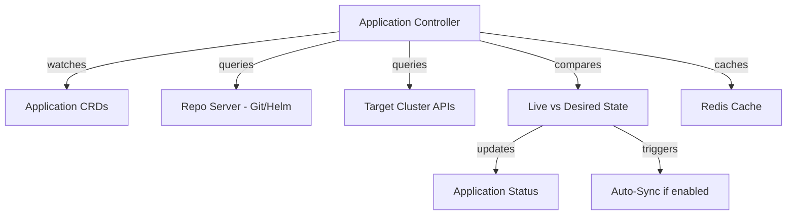

# How to Configure argocd-application-controller Options

Author: [nawazdhandala](https://github.com/nawazdhandala)

Tags: ArgoCD, GitOps, Kubernetes, Application Controller, Performance Tuning

Description: Learn how to configure argocd-application-controller command-line options for performance tuning, sharding, reconciliation, and resource management.

---

The `argocd-application-controller` is the heart of ArgoCD. It continuously monitors running applications and compares the live state against the desired state defined in Git. When it detects drift, it updates the status and optionally syncs the changes. For small deployments, the default configuration works fine. But as you scale to hundreds or thousands of applications, tuning the controller becomes essential.

This guide covers the most important argocd-application-controller options, how to tune them for performance, and how to configure sharding for large-scale deployments.

## How the Application Controller Works

The application controller runs as a StatefulSet (or Deployment in newer versions). It:

1. Watches ArgoCD Application resources
2. Connects to target clusters via the Kubernetes API
3. Compares live state with desired state from Git
4. Updates application sync status and health
5. Optionally performs automatic sync operations

Each of these steps can be tuned through command-line options.



## Setting Controller Options

Like the server, you modify controller options in the deployment spec.

### Using Kustomize

```yaml
# kustomization.yaml
patches:
  - target:
      kind: StatefulSet
      name: argocd-application-controller
    patch: |
      - op: replace
        path: /spec/template/spec/containers/0/command
        value:
          - argocd-application-controller
          - --status-processors=50
          - --operation-processors=25
          - --app-resync=180
```

### Using Helm

```yaml
# values.yaml
controller:
  extraArgs:
    - --status-processors=50
    - --operation-processors=25
    - --app-resync=180
```

## Core Reconciliation Options

### --app-resync

Controls how often (in seconds) the controller re-evaluates each application, even if nothing has changed. Default is 180 seconds (3 minutes).

```yaml
command:
  - argocd-application-controller
  - --app-resync=300  # 5 minutes
```

**When to change**: Increase this for large deployments to reduce API server load. Decrease it if you need faster drift detection.

Trade-offs:
- **Lower values** (60-120s): Faster drift detection, higher API server load
- **Higher values** (300-600s): Less API load, slower drift detection
- **Default** (180s): Good balance for most deployments

### --app-hard-resync

Forces a full comparison instead of using cached state. Default is 0 (disabled, uses app-resync for full resyncs).

```yaml
command:
  - argocd-application-controller
  - --app-hard-resync=3600  # Full resync every hour
```

### --self-heal-timeout-seconds

Maximum time allowed for self-healing sync operations. Default is 5 seconds.

```yaml
command:
  - argocd-application-controller
  - --self-heal-timeout-seconds=10
```

## Processing Concurrency

### --status-processors

Controls the number of concurrent status refresh operations. Default is 20.

```yaml
command:
  - argocd-application-controller
  - --status-processors=50
```

This is one of the most important tuning parameters. Each status processor handles one application's state comparison at a time. If you have 500 applications and only 20 processors, it takes at least 25 cycles to check all applications.

**Recommended values**:
- Under 100 apps: 20 (default)
- 100 to 500 apps: 50
- 500 to 1000 apps: 100
- Over 1000 apps: Consider sharding

### --operation-processors

Controls the number of concurrent sync operations. Default is 10.

```yaml
command:
  - argocd-application-controller
  - --operation-processors=25
```

This limits how many applications can be synced simultaneously. Increase this if you often see sync operations queued.

**Recommended values**:
- Under 100 apps: 10 (default)
- 100 to 500 apps: 25
- Over 500 apps: 50

### --kubectl-parallelism-limit

Limits the number of concurrent kubectl operations. Default is 20.

```yaml
command:
  - argocd-application-controller
  - --kubectl-parallelism-limit=40
```

## Sharding Options

For very large deployments, you can run multiple controller instances, each responsible for a subset of applications.

### --controller-sharding-algorithm

Specifies the sharding algorithm. Options are `legacy` and `round-robin`.

```yaml
command:
  - argocd-application-controller
  - --controller-sharding-algorithm=round-robin
```

### --sharding-method

Method used for distributing applications. Can be `legacy` or `consistent-hashing`.

### Configuring Sharding

To use sharding, scale the controller StatefulSet and set the shard count.

```yaml
apiVersion: apps/v1
kind: StatefulSet
metadata:
  name: argocd-application-controller
  namespace: argocd
spec:
  replicas: 3  # Number of shards
  template:
    spec:
      containers:
        - name: argocd-application-controller
          command:
            - argocd-application-controller
            - --status-processors=50
            - --operation-processors=25
          env:
            - name: ARGOCD_CONTROLLER_REPLICAS
              value: "3"
```

Each controller instance automatically picks up its shard based on its ordinal index in the StatefulSet.

## Resource Tracking Options

### --resource-parallelism-limit

Limits concurrent resource operations per application. This prevents a single large application from monopolizing the controller.

```yaml
command:
  - argocd-application-controller
  - --resource-parallelism-limit=50
```

### --default-cache-expiration

Sets the default cache TTL for cluster state. Default is 24h.

```yaml
command:
  - argocd-application-controller
  - --default-cache-expiration=12h
```

### --repo-server-timeout-seconds

Timeout for repo server calls. Default is 60 seconds.

```yaml
command:
  - argocd-application-controller
  - --repo-server-timeout-seconds=120
```

Increase this if you have large repositories that take a long time to render.

## Logging and Debugging

### --loglevel

```yaml
command:
  - argocd-application-controller
  - --loglevel=info  # debug, info, warn, error
```

### --logformat

```yaml
command:
  - argocd-application-controller
  - --logformat=json
```

## Redis Configuration

### --redis

Specifies the Redis server address.

```yaml
command:
  - argocd-application-controller
  - --redis=argocd-redis-ha-haproxy:6379
```

### --redis-compress

Enables compression for Redis data. Useful for large deployments to reduce Redis memory usage.

```yaml
command:
  - argocd-application-controller
  - --redis-compress=gzip
```

## Full Production Configuration

```yaml
apiVersion: apps/v1
kind: StatefulSet
metadata:
  name: argocd-application-controller
  namespace: argocd
spec:
  replicas: 1
  template:
    spec:
      containers:
        - name: argocd-application-controller
          image: quay.io/argoproj/argocd:v2.10.0
          command:
            - argocd-application-controller
            # Reconciliation
            - --app-resync=180
            # Concurrency
            - --status-processors=50
            - --operation-processors=25
            - --kubectl-parallelism-limit=40
            # Timeouts
            - --repo-server-timeout-seconds=120
            - --self-heal-timeout-seconds=10
            # Logging
            - --logformat=json
            - --loglevel=info
            # Redis compression
            - --redis-compress=gzip
          resources:
            requests:
              cpu: 500m
              memory: 1Gi
            limits:
              cpu: "2"
              memory: 4Gi
          env:
            - name: ARGOCD_CONTROLLER_REPLICAS
              value: "1"
```

## Monitoring Controller Performance

### Key Metrics

The controller exposes Prometheus metrics on port 8082.

```bash
# Check controller metrics
kubectl port-forward -n argocd statefulset/argocd-application-controller 8082:8082
curl localhost:8082/metrics | grep argocd_app_reconcile
```

Important metrics to watch:
- `argocd_app_reconcile_count` - Number of reconciliation cycles
- `argocd_app_reconcile_bucket` - Reconciliation duration histogram
- `argocd_kubectl_exec_total` - kubectl execution count
- `argocd_app_sync_total` - Total sync operations

### Troubleshooting Slow Reconciliation

If applications take too long to update status:

```bash
# Check controller logs for slow operations
kubectl logs -n argocd statefulset/argocd-application-controller | grep -i "slow\|timeout"

# Check the reconciliation queue
kubectl logs -n argocd statefulset/argocd-application-controller | grep "queue"
```

## Environment Variables

Some options can be set via environment variables.

```yaml
env:
  - name: ARGOCD_RECONCILIATION_TIMEOUT
    value: "180s"
  - name: ARGOCD_CONTROLLER_REPLICAS
    value: "1"
  - name: ARGOCD_APPLICATION_CONTROLLER_REPO_SERVER
    value: "argocd-repo-server:8081"
  - name: HOME
    value: "/home/argocd"
```

## Common Tuning Mistakes

### Setting Processors Too High

More processors is not always better. Each processor uses CPU and memory, and too many concurrent operations can overwhelm the Kubernetes API server.

### Ignoring Memory Limits

The controller's memory usage grows with the number of applications and the size of their resource trees. Set memory limits based on your actual usage, not arbitrary values.

### Not Monitoring Before Tuning

Always measure before changing settings. Use the Prometheus metrics to understand your current bottlenecks before adjusting parameters.

## Conclusion

The argocd-application-controller is the component that most impacts ArgoCD's performance at scale. The key options to tune are `--status-processors` and `--operation-processors` for concurrency, `--app-resync` for reconciliation frequency, and `--repo-server-timeout-seconds` for large repositories. For deployments beyond a few hundred applications, consider sharding the controller across multiple replicas. Always monitor the controller's metrics before and after making changes to ensure your tuning is actually helping.
