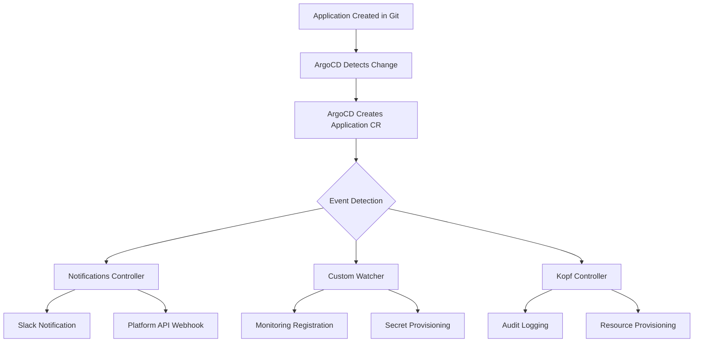

# How to Handle Application Created Events in ArgoCD

Author: [nawazdhandala](https://github.com/nawazdhandala)

Tags: ArgoCD, GitOps, Kubernetes, Event Handling, Automation

Description: Learn how to detect and respond to Application Created events in ArgoCD using notifications, webhooks, and custom controllers for automated onboarding workflows.

---

When a new application is created in ArgoCD, it often needs to trigger downstream processes - registering with monitoring systems, creating DNS entries, provisioning secrets, or notifying teams. ArgoCD does not have a built-in plugin system for lifecycle hooks on application creation, but there are several effective patterns for detecting and responding to these events.

This guide covers four approaches to handling Application Created events: ArgoCD Notifications, Kubernetes event watchers, custom controllers, and resource hooks.

## Why Handle Application Created Events?

In a platform engineering context, application creation is a trigger for many workflows:

- **Monitoring setup**: Auto-register the application with your observability platform
- **Secret provisioning**: Generate and inject application-specific credentials
- **DNS and ingress**: Create DNS records and TLS certificates
- **Team notification**: Alert the owning team that their application is deployed
- **Compliance logging**: Record application creation for audit trails
- **Cost tracking**: Tag resources for cost allocation

## Approach 1: ArgoCD Notifications

ArgoCD Notifications is the most native way to react to application lifecycle events. It watches for state changes and can trigger webhooks, send messages, or execute templates.

First, install ArgoCD Notifications (included by default in ArgoCD 2.6+):

```yaml
# argocd/notifications-config.yaml
apiVersion: v1
kind: ConfigMap
metadata:
  name: argocd-notifications-cm
  namespace: argocd
data:
  # Trigger on application creation (first sync)
  trigger.on-created: |
    - description: Application is created
      when: app.metadata.creationTimestamp != nil and
            time.Now().Sub(time.Parse(app.metadata.creationTimestamp)).Minutes() < 5
      send:
        - app-created-webhook
        - app-created-slack

  # Webhook notification
  service.webhook.platform-api: |
    url: https://platform-api.internal.company.com/api/v1/applications
    headers:
      - name: Content-Type
        value: application/json
      - name: Authorization
        value: $platform-api-token

  # Slack notification
  service.slack: |
    token: $slack-token

  # Webhook template
  template.app-created-webhook: |
    webhook:
      platform-api:
        method: POST
        body: |
          {
            "event": "application.created",
            "application": "{{.app.metadata.name}}",
            "namespace": "{{.app.spec.destination.namespace}}",
            "project": "{{.app.spec.project}}",
            "repoURL": "{{.app.spec.source.repoURL}}",
            "cluster": "{{.app.spec.destination.server}}",
            "createdAt": "{{.app.metadata.creationTimestamp}}",
            "labels": {{toJson .app.metadata.labels}}
          }

  # Slack template
  template.app-created-slack: |
    slack:
      channel: platform-notifications
      title: "New Application Created: {{.app.metadata.name}}"
      text: |
        *Application*: {{.app.metadata.name}}
        *Project*: {{.app.spec.project}}
        *Namespace*: {{.app.spec.destination.namespace}}
        *Repository*: {{.app.spec.source.repoURL}}
        *Created by*: {{index .app.metadata.annotations "argocd.argoproj.io/created-by" | default "unknown"}}
      color: "#36a64f"
```

Apply the notification subscription to applications using annotations:

```yaml
# In your Application manifest
metadata:
  annotations:
    notifications.argoproj.io/subscribe.on-created.slack: platform-notifications
    notifications.argoproj.io/subscribe.on-created.platform-api: ""
```

## Approach 2: Kubernetes Event Watcher

ArgoCD Applications are Kubernetes custom resources. You can watch for creation events using a simple controller.

```yaml
# platform/event-watcher/deployment.yaml
apiVersion: apps/v1
kind: Deployment
metadata:
  name: argocd-event-watcher
  namespace: argocd
spec:
  replicas: 1
  selector:
    matchLabels:
      app: argocd-event-watcher
  template:
    metadata:
      labels:
        app: argocd-event-watcher
    spec:
      serviceAccountName: argocd-event-watcher
      containers:
        - name: watcher
          image: bitnami/kubectl:1.30
          command:
            - /bin/bash
            - -c
            - |
              echo "Starting ArgoCD Application watcher..."
              kubectl get applications.argoproj.io \
                -n argocd \
                --watch \
                -o json | while read -r event; do

                TYPE=$(echo "$event" | jq -r '.type // "MODIFIED"')
                NAME=$(echo "$event" | jq -r '.metadata.name')
                NAMESPACE=$(echo "$event" | jq -r '.spec.destination.namespace')
                PROJECT=$(echo "$event" | jq -r '.spec.project')

                if [ "$TYPE" = "ADDED" ]; then
                  echo "Application created: $NAME in namespace $NAMESPACE"

                  # Call platform API
                  curl -s -X POST \
                    https://platform-api.internal/api/v1/apps/register \
                    -H "Content-Type: application/json" \
                    -d "{
                      \"name\": \"$NAME\",
                      \"namespace\": \"$NAMESPACE\",
                      \"project\": \"$PROJECT\"
                    }"
                fi
              done
```

The RBAC for this watcher:

```yaml
# platform/event-watcher/rbac.yaml
apiVersion: v1
kind: ServiceAccount
metadata:
  name: argocd-event-watcher
  namespace: argocd
---
apiVersion: rbac.authorization.k8s.io/v1
kind: ClusterRole
metadata:
  name: argocd-app-watcher
rules:
  - apiGroups: ["argoproj.io"]
    resources: ["applications"]
    verbs: ["get", "list", "watch"]
---
apiVersion: rbac.authorization.k8s.io/v1
kind: ClusterRoleBinding
metadata:
  name: argocd-event-watcher
subjects:
  - kind: ServiceAccount
    name: argocd-event-watcher
    namespace: argocd
roleRef:
  kind: ClusterRole
  name: argocd-app-watcher
  apiGroup: rbac.authorization.k8s.io
```

## Approach 3: Custom Controller with Python

For more complex logic, write a custom controller using the Kubernetes Python client.

```python
# platform/event-watcher/controller.py
import kopf
import requests
import json
from datetime import datetime

@kopf.on.create('argoproj.io', 'v1alpha1', 'applications')
def on_application_created(spec, meta, namespace, logger, **kwargs):
    """Handle ArgoCD Application creation events."""

    app_name = meta.get('name')
    app_namespace = spec.get('destination', {}).get('namespace', 'default')
    project = spec.get('project', 'default')
    repo_url = spec.get('source', {}).get('repoURL', '')
    labels = meta.get('labels', {})

    logger.info(f"New application created: {app_name}")

    # Register with monitoring platform
    register_monitoring(app_name, app_namespace, labels)

    # Create namespace-level resources
    provision_app_resources(app_name, app_namespace)

    # Notify team
    notify_team(app_name, project, repo_url)

    # Log for audit
    log_audit_event('application.created', {
        'name': app_name,
        'namespace': app_namespace,
        'project': project,
        'created_at': datetime.utcnow().isoformat()
    })


def register_monitoring(app_name, namespace, labels):
    """Register the application with the monitoring platform."""
    team = labels.get('team', 'unknown')
    requests.post(
        'https://oneuptime.com/api/monitor',
        json={
            'name': f'{app_name}-health',
            'type': 'kubernetes',
            'namespace': namespace,
            'team': team
        },
        headers={'Authorization': f'Bearer {ONEUPTIME_API_KEY}'}
    )


def provision_app_resources(app_name, namespace):
    """Create namespace-level resources for the application."""
    # Create network policies, resource quotas, etc.
    pass


def notify_team(app_name, project, repo_url):
    """Send notification to the owning team."""
    requests.post(
        SLACK_WEBHOOK_URL,
        json={
            'text': f'New application `{app_name}` created in project `{project}`',
            'channel': f'#{project}-notifications'
        }
    )
```

## Approach 4: ApplicationSet with Progressive Sync

If applications are created through ApplicationSets, you can use progressive sync to control rollout and trigger events at each stage.

```yaml
# argocd/appset-with-events.yaml
apiVersion: argoproj.io/v1alpha1
kind: ApplicationSet
metadata:
  name: microservices
  namespace: argocd
spec:
  generators:
    - git:
        repoURL: https://github.com/your-org/k8s-manifests.git
        revision: main
        directories:
          - path: apps/*
  strategy:
    type: RollingSync
    rollingSync:
      steps:
        - matchExpressions:
            - key: envType
              operator: In
              values:
                - staging
        - matchExpressions:
            - key: envType
              operator: In
              values:
                - production
  template:
    metadata:
      name: "{{path.basename}}"
      labels:
        envType: "{{path.basename}}"
      annotations:
        notifications.argoproj.io/subscribe.on-created.slack: ""
    spec:
      project: default
      source:
        repoURL: https://github.com/your-org/k8s-manifests.git
        targetRevision: main
        path: "{{path}}"
      destination:
        server: https://kubernetes.default.svc
        namespace: "{{path.basename}}"
```

## Event Flow Architecture



## Best Practices

1. **Idempotency**: Always make your event handlers idempotent. Applications may be deleted and recreated, triggering the creation event again.

2. **Annotation-based metadata**: Use annotations to pass context about who created the application and why:

```yaml
metadata:
  annotations:
    argocd.argoproj.io/created-by: "platform-team"
    app.company.com/team: "payments"
    app.company.com/tier: "critical"
```

3. **Filtering**: Not every application creation needs every handler. Use labels and annotations to determine which workflows to trigger.

4. **Error handling**: If a downstream system is unavailable when the event fires, queue the event for retry rather than blocking.

5. **Avoid circular dependencies**: Do not create ArgoCD Applications as a response to application creation events, or you may end up in an infinite loop.

## Conclusion

Handling Application Created events in ArgoCD enables powerful automation workflows. ArgoCD Notifications is the simplest approach for webhooks and chat notifications. For more complex scenarios like resource provisioning and monitoring registration, a custom Kubernetes controller gives you full flexibility. Whichever approach you choose, make your handlers idempotent, filter events appropriately, and log everything for audit compliance. This turns ArgoCD from a deployment tool into a complete platform automation engine.
