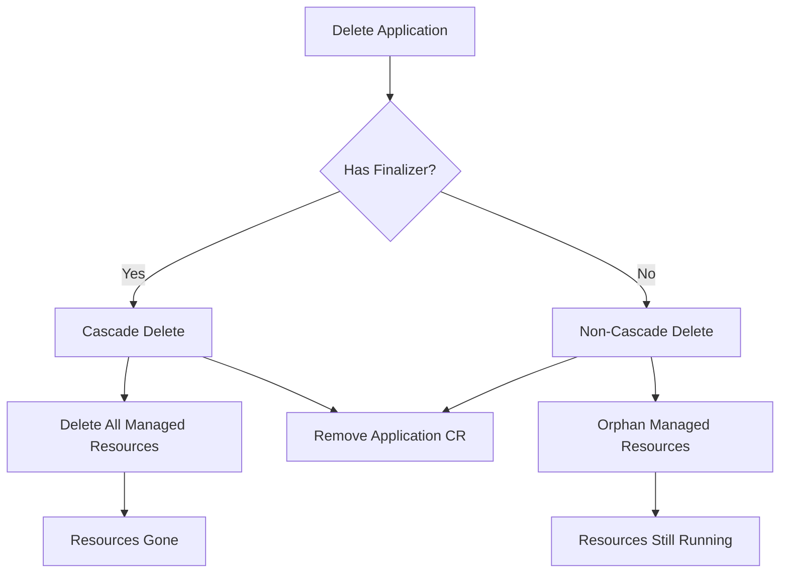
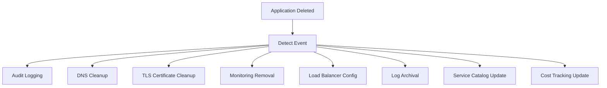

# How to Handle Application Deleted Events in ArgoCD

Author: [nawazdhandala](https://github.com/nawazdhandala)

Tags: ArgoCD, GitOps, Kubernetes, Event Handling, Security

Description: Learn how to detect and respond to ArgoCD application deletion events for audit logging, resource cleanup, and preventing accidental deletions.

---

Application deletion in ArgoCD is a high-impact operation. When someone deletes an ArgoCD Application, it can cascade to deleting all managed Kubernetes resources depending on the finalizer configuration. Tracking these events is critical for audit compliance, triggering cleanup workflows, and preventing accidental data loss.

This guide covers detecting application deletions, implementing safeguards, automating cleanup, and maintaining audit trails.

## Understanding ArgoCD Deletion Behavior

ArgoCD Applications can be deleted in two modes:

1. **Cascade delete (default)**: Removes the Application resource and all managed Kubernetes resources
2. **Non-cascade delete**: Removes only the Application resource, leaving Kubernetes resources in place (orphaned)

The behavior is controlled by the `resources-finalizer.argocd.argoproj.io` finalizer:

```yaml
metadata:
  finalizers:
    - resources-finalizer.argocd.argoproj.io  # Enables cascade delete
```

If this finalizer is present, deleting the Application removes all resources it manages. If absent, only the Application CR is removed.



## Approach 1: Pre-Delete Notifications

ArgoCD Notifications can detect when an application is about to be deleted by watching for the deletion timestamp.

```yaml
# argocd-notifications-cm ConfigMap
apiVersion: v1
kind: ConfigMap
metadata:
  name: argocd-notifications-cm
  namespace: argocd
data:
  trigger.on-app-deleted: |
    - description: Application is being deleted
      when: app.metadata.deletionTimestamp != nil
      send:
        - app-deleted-alert
        - app-deleted-audit

  template.app-deleted-alert: |
    slack:
      channel: "platform-alerts"
      title: "APPLICATION DELETED: {{.app.metadata.name}}"
      text: |
        *Application*: {{.app.metadata.name}}
        *Project*: {{.app.spec.project}}
        *Namespace*: {{.app.spec.destination.namespace}}
        *Cluster*: {{.app.spec.destination.server}}
        *Had Cascade Finalizer*: {{if .app.metadata.finalizers}}Yes - managed resources will be deleted{{else}}No - resources will be orphaned{{end}}
        *Deletion Timestamp*: {{.app.metadata.deletionTimestamp}}

        This is an automated alert. If this deletion was unexpected, contact the platform team immediately.
      color: "#FF0000"

  template.app-deleted-audit: |
    webhook:
      audit-api:
        method: POST
        body: |
          {
            "event": "application.deleted",
            "application": "{{.app.metadata.name}}",
            "project": "{{.app.spec.project}}",
            "namespace": "{{.app.spec.destination.namespace}}",
            "cluster": "{{.app.spec.destination.server}}",
            "cascade": {{if .app.metadata.finalizers}}true{{else}}false{{end}},
            "timestamp": "{{.app.metadata.deletionTimestamp}}",
            "source": {
              "repoURL": "{{.app.spec.source.repoURL}}",
              "path": "{{.app.spec.source.path}}",
              "revision": "{{.app.status.sync.revision}}"
            },
            "lastHealthStatus": "{{.app.status.health.status}}",
            "managedResources": {{len .app.status.resources}}
          }

  service.webhook.audit-api: |
    url: https://audit.internal.company.com/api/v1/events
    headers:
      - name: Content-Type
        value: application/json
      - name: Authorization
        value: $audit-api-token
```

## Approach 2: Kubernetes Controller for Deletion Events

A more reliable approach is a Kubernetes controller that watches for Application deletion events.

```python
# controllers/deletion_watcher.py
import kopf
import logging
import requests
from datetime import datetime

logger = logging.getLogger(__name__)

@kopf.on.delete('argoproj.io', 'v1alpha1', 'applications')
def on_application_deleted(spec, meta, namespace, logger, **kwargs):
    """Handle ArgoCD Application deletion events."""

    app_name = meta.get('name')
    app_namespace = spec.get('destination', {}).get('namespace', 'default')
    project = spec.get('project', 'default')
    finalizers = meta.get('finalizers', [])
    has_cascade = 'resources-finalizer.argocd.argoproj.io' in finalizers

    logger.warning(
        f"Application deleted: {app_name}, "
        f"cascade={has_cascade}, "
        f"namespace={app_namespace}"
    )

    # Record in audit log
    record_audit_event(app_name, app_namespace, project, has_cascade)

    # Clean up external resources
    cleanup_external_resources(app_name, app_namespace)

    # Update service catalog
    deregister_from_catalog(app_name)


def record_audit_event(app_name, namespace, project, cascade):
    """Record the deletion in the audit system."""
    requests.post(
        'https://audit.internal.company.com/api/v1/events',
        json={
            'event': 'application.deleted',
            'application': app_name,
            'namespace': namespace,
            'project': project,
            'cascade': cascade,
            'timestamp': datetime.utcnow().isoformat()
        }
    )


def cleanup_external_resources(app_name, namespace):
    """Clean up resources outside of Kubernetes."""
    # Remove DNS records
    remove_dns_records(app_name, namespace)

    # Remove monitoring configurations
    remove_monitors(app_name)

    # Remove from load balancer
    remove_from_lb(app_name, namespace)

    # Archive logs
    archive_application_logs(app_name, namespace)


def deregister_from_catalog(app_name):
    """Remove from service catalog."""
    requests.delete(
        f'https://catalog.internal.company.com/api/v1/services/{app_name}'
    )
```

## Approach 3: Preventing Accidental Deletions

The best way to handle deletion events is to prevent accidental ones in the first place.

### Use AppProject Restrictions

```yaml
apiVersion: argoproj.io/v1alpha1
kind: AppProject
metadata:
  name: production
  namespace: argocd
spec:
  # Restrict who can delete applications
  roles:
    - name: developer
      description: Developer role
      policies:
        - p, proj:production:developer, applications, get, production/*, allow
        - p, proj:production:developer, applications, sync, production/*, allow
        # No delete permission
      groups:
        - developers

    - name: admin
      description: Admin role with delete permissions
      policies:
        - p, proj:production:admin, applications, *, production/*, allow
      groups:
        - platform-admins
```

### Use Kubernetes Admission Webhooks

Create a validating admission webhook that requires approval for deletions:

```yaml
# platform/deletion-guard/webhook.yaml
apiVersion: admissionregistration.k8s.io/v1
kind: ValidatingWebhookConfiguration
metadata:
  name: argocd-deletion-guard
webhooks:
  - name: deletion-guard.argocd.platform.company.com
    rules:
      - apiGroups: ["argoproj.io"]
        apiVersions: ["v1alpha1"]
        operations: ["DELETE"]
        resources: ["applications"]
    clientConfig:
      service:
        name: deletion-guard
        namespace: argocd
        path: /validate
    admissionReviewVersions: ["v1"]
    sideEffects: None
    failurePolicy: Fail
```

The webhook handler checks for a required annotation before allowing deletion:

```python
# platform/deletion-guard/handler.py
from flask import Flask, request, jsonify

app = Flask(__name__)

@app.route('/validate', methods=['POST'])
def validate_deletion():
    review = request.json
    app_obj = review['request']['oldObject']
    app_name = app_obj['metadata']['name']
    annotations = app_obj['metadata'].get('annotations', {})

    # Check if deletion is approved
    deletion_approved = annotations.get(
        'platform.company.com/deletion-approved', 'false'
    )

    if deletion_approved != 'true':
        return jsonify({
            'apiVersion': 'admission.k8s.io/v1',
            'kind': 'AdmissionReview',
            'response': {
                'uid': review['request']['uid'],
                'allowed': False,
                'status': {
                    'message': (
                        f'Deletion of application {app_name} requires '
                        f'annotation platform.company.com/deletion-approved=true. '
                        f'Add this annotation before deleting.'
                    )
                }
            }
        })

    return jsonify({
        'apiVersion': 'admission.k8s.io/v1',
        'kind': 'AdmissionReview',
        'response': {
            'uid': review['request']['uid'],
            'allowed': True
        }
    })
```

## Approach 4: Backup Before Delete

Automatically backup application configuration before deletion using a pre-delete hook:

```yaml
# This runs as a PreSync hook when the Application is being deleted
apiVersion: batch/v1
kind: Job
metadata:
  name: app-backup-on-delete
  annotations:
    argocd.argoproj.io/hook: PreSync
spec:
  template:
    spec:
      containers:
        - name: backup
          image: bitnami/kubectl:1.30
          command:
            - /bin/bash
            - -c
            - |
              # Export all resources managed by this application
              NAMESPACE="target-namespace"
              TIMESTAMP=$(date +%Y%m%d-%H%M%S)

              # Get all resources and save to S3
              kubectl get all -n $NAMESPACE -o yaml > /tmp/backup.yaml
              kubectl get configmaps,secrets,pvc -n $NAMESPACE \
                -o yaml >> /tmp/backup.yaml

              # Upload to S3
              aws s3 cp /tmp/backup.yaml \
                s3://app-backups/deletions/$NAMESPACE-$TIMESTAMP.yaml
      restartPolicy: Never
```

## Cleanup Workflow

When an application is deleted, these external resources often need cleanup:



## Subscribe Applications to Deletion Events

```yaml
metadata:
  annotations:
    notifications.argoproj.io/subscribe.on-app-deleted.slack: ""
    notifications.argoproj.io/subscribe.on-app-deleted.audit-api: ""
```

## Best Practices

1. **Always use the cascade finalizer** on production applications so resources are properly cleaned up.

2. **Require deletion approval** through annotations or admission webhooks for critical applications.

3. **Archive before deleting** - back up the application state to object storage.

4. **Audit everything** - record who deleted what, when, and whether it was cascading.

5. **Clean up external resources** - DNS records, monitoring configs, and certificates do not get cleaned up by Kubernetes cascade deletion.

6. **Use RBAC** to restrict who can delete applications in production projects.

## Conclusion

Application deletion events require careful handling because they are irreversible and high-impact. By combining ArgoCD Notifications for alerting, admission webhooks for prevention, custom controllers for cleanup, and audit logging for compliance, you build a safety net around your ArgoCD deployment. The goal is to make accidental deletions difficult and intentional deletions well-documented. Use [OneUptime](https://oneuptime.com) for monitoring the health of these safeguards and ensuring your deletion protection is always active.
