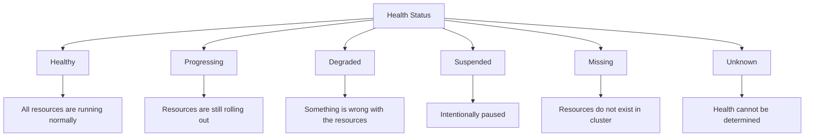

# How to Get Application Health via ArgoCD API

Author: [nawazdhandala](https://github.com/nawazdhandala)

Tags: ArgoCD, GitOps, Kubernetes, REST API, Health Checks

Description: Learn how to query application health status through the ArgoCD REST API for monitoring, alerting, and automated health-based decision making.

---

Application health is one of the most critical signals in a GitOps workflow. ArgoCD continuously monitors the health of every managed resource and aggregates that into an overall application health status. By querying this through the API, you can build monitoring dashboards, trigger alerts, and make automated decisions based on application health.

## Understanding Health Status Values

ArgoCD uses these health status values:



- **Healthy** - All resources are running as expected
- **Progressing** - Resources are still being rolled out or updated
- **Degraded** - One or more resources have issues
- **Suspended** - Resource is intentionally suspended (e.g., Argo Rollout paused)
- **Missing** - Expected resources do not exist in the cluster
- **Unknown** - Health status cannot be determined

## Querying Application Health

### Get Overall Health Status

```bash
# Get the top-level health status
curl -s -k -H "Authorization: Bearer $ARGOCD_TOKEN" \
  "https://argocd.example.com/api/v1/applications/my-app" | \
  jq '{
    name: .metadata.name,
    health: .status.health.status,
    healthMessage: .status.health.message,
    sync: .status.sync.status
  }'
```

Response:

```json
{
  "name": "my-app",
  "health": "Healthy",
  "healthMessage": null,
  "sync": "Synced"
}
```

### Get Per-Resource Health

The resource tree gives you health details for every individual resource:

```bash
# Get the resource tree with health details
curl -s -k -H "Authorization: Bearer $ARGOCD_TOKEN" \
  "https://argocd.example.com/api/v1/applications/my-app/resource-tree" | \
  jq '.nodes[] | {
    kind: .kind,
    name: .name,
    namespace: .namespace,
    health: .health
  }'
```

Example output:

```json
{
  "kind": "Deployment",
  "name": "api-server",
  "namespace": "production",
  "health": { "status": "Healthy" }
}
{
  "kind": "ReplicaSet",
  "name": "api-server-5d4f6b8c9",
  "namespace": "production",
  "health": { "status": "Healthy" }
}
{
  "kind": "Pod",
  "name": "api-server-5d4f6b8c9-x7k2p",
  "namespace": "production",
  "health": { "status": "Healthy" }
}
{
  "kind": "Service",
  "name": "api-server",
  "namespace": "production",
  "health": { "status": "Healthy" }
}
```

### Find Unhealthy Resources

Filter for resources that are not healthy:

```bash
# List all unhealthy resources in an application
curl -s -k -H "Authorization: Bearer $ARGOCD_TOKEN" \
  "https://argocd.example.com/api/v1/applications/my-app/resource-tree" | \
  jq '[.nodes[] | select(.health.status != "Healthy" and .health.status != null)] |
    map({kind, name, namespace, health: .health.status, message: .health.message})'
```

## Health Monitoring Script

Here is a comprehensive monitoring script that checks health across all applications:

```bash
#!/bin/bash
# health-monitor.sh - Monitor health of all ArgoCD applications

ARGOCD_SERVER="https://argocd.example.com"

# Get all applications
APPS=$(curl -s -k -H "Authorization: Bearer $ARGOCD_TOKEN" \
  "$ARGOCD_SERVER/api/v1/applications")

# Count by health status
echo "=== Application Health Summary ==="
echo "$APPS" | jq -r '.items[].status.health.status' | sort | uniq -c | sort -rn

echo ""
echo "=== Degraded Applications ==="
echo "$APPS" | jq -r '.items[] | select(.status.health.status == "Degraded") |
  "  \(.metadata.name): \(.status.health.message // "no message")"'

echo ""
echo "=== Progressing Applications ==="
echo "$APPS" | jq -r '.items[] | select(.status.health.status == "Progressing") |
  "  \(.metadata.name)"'

echo ""
echo "=== Missing Applications ==="
echo "$APPS" | jq -r '.items[] | select(.status.health.status == "Missing") |
  "  \(.metadata.name)"'

# Return non-zero if any applications are degraded
DEGRADED_COUNT=$(echo "$APPS" | jq '[.items[] | select(.status.health.status == "Degraded")] | length')
if [ "$DEGRADED_COUNT" -gt 0 ]; then
  echo ""
  echo "WARNING: $DEGRADED_COUNT application(s) are degraded!"
  exit 1
fi
```

## Python Health Dashboard

Build a more sophisticated health monitor in Python:

```python
import requests
import json
from datetime import datetime

class HealthMonitor:
    def __init__(self, server, token):
        self.server = server.rstrip('/')
        self.headers = {"Authorization": f"Bearer {token}"}
        self.verify = False

    def get_all_health(self):
        """Get health status for all applications."""
        resp = requests.get(
            f"{self.server}/api/v1/applications",
            headers=self.headers,
            verify=self.verify
        )
        resp.raise_for_status()
        apps = resp.json().get("items", [])

        results = []
        for app in apps:
            results.append({
                "name": app["metadata"]["name"],
                "project": app["spec"]["project"],
                "health": app["status"]["health"]["status"],
                "health_message": app["status"]["health"].get("message"),
                "sync": app["status"]["sync"]["status"],
                "last_synced": app["status"].get("operationState", {}).get("finishedAt")
            })
        return results

    def get_degraded_details(self, app_name):
        """Get detailed health info for a degraded application."""
        resp = requests.get(
            f"{self.server}/api/v1/applications/{app_name}/resource-tree",
            headers=self.headers,
            verify=self.verify
        )
        resp.raise_for_status()
        tree = resp.json()

        # Find unhealthy resources
        unhealthy = []
        for node in tree.get("nodes", []):
            health = node.get("health", {})
            if health.get("status") not in ("Healthy", None):
                unhealthy.append({
                    "kind": node["kind"],
                    "name": node["name"],
                    "namespace": node.get("namespace", ""),
                    "status": health["status"],
                    "message": health.get("message", "")
                })
        return unhealthy

    def generate_report(self):
        """Generate a health report."""
        apps = self.get_all_health()
        timestamp = datetime.utcnow().isoformat()

        print(f"ArgoCD Health Report - {timestamp}")
        print("=" * 60)

        # Summary
        from collections import Counter
        health_counts = Counter(a["health"] for a in apps)
        print(f"\nTotal Applications: {len(apps)}")
        for status, count in health_counts.most_common():
            indicator = {
                "Healthy": "[OK]",
                "Progressing": "[..]",
                "Degraded": "[!!]",
                "Missing": "[??]",
                "Unknown": "[--]"
            }.get(status, "[  ]")
            print(f"  {indicator} {status}: {count}")

        # Details for non-healthy apps
        degraded = [a for a in apps if a["health"] == "Degraded"]
        if degraded:
            print(f"\nDegraded Applications ({len(degraded)}):")
            for app in degraded:
                print(f"\n  {app['name']} (project: {app['project']})")
                if app["health_message"]:
                    print(f"    Message: {app['health_message']}")

                details = self.get_degraded_details(app["name"])
                for d in details:
                    print(f"    - {d['kind']}/{d['name']}: "
                          f"{d['status']} - {d['message']}")

# Usage
monitor = HealthMonitor("https://argocd.example.com", token)
monitor.generate_report()
```

## Health-Based Automation

### Automated Rollback on Degraded Health

```bash
#!/bin/bash
# auto-rollback.sh - Roll back if health degrades after sync

APP_NAME="$1"
ARGOCD_SERVER="https://argocd.example.com"
HEALTH_CHECK_DELAY=60   # Wait for initial rollout
HEALTH_CHECK_TIMEOUT=300  # Total timeout

echo "Monitoring $APP_NAME for health degradation..."

# Wait for initial rollout
sleep $HEALTH_CHECK_DELAY

START=$(date +%s)
while true; do
  ELAPSED=$(( $(date +%s) - START ))
  if [ $ELAPSED -gt $HEALTH_CHECK_TIMEOUT ]; then
    echo "Health check timeout reached"
    break
  fi

  HEALTH=$(curl -s -k -H "Authorization: Bearer $ARGOCD_TOKEN" \
    "$ARGOCD_SERVER/api/v1/applications/$APP_NAME" | \
    jq -r '.status.health.status')

  case "$HEALTH" in
    "Healthy")
      echo "Application is healthy!"
      exit 0
      ;;
    "Degraded")
      echo "Application is degraded! Initiating rollback..."

      # Get the previous sync revision
      HISTORY=$(curl -s -k -H "Authorization: Bearer $ARGOCD_TOKEN" \
        "$ARGOCD_SERVER/api/v1/applications/$APP_NAME" | \
        jq -r '.status.history[-2].revision // empty')

      if [ -n "$HISTORY" ]; then
        # Sync to previous revision
        curl -s -k -H "Authorization: Bearer $ARGOCD_TOKEN" \
          -X POST "$ARGOCD_SERVER/api/v1/applications/$APP_NAME/sync" \
          -H "Content-Type: application/json" \
          -d "{\"revision\": \"$HISTORY\", \"prune\": true}"
        echo "Rollback triggered to revision: $HISTORY"
      else
        echo "No previous revision found for rollback"
      fi
      exit 1
      ;;
    "Progressing")
      echo "[${ELAPSED}s] Still progressing..."
      ;;
  esac

  sleep 10
done
```

### Health-Based Deployment Gate

Use health status as a gate for promotion workflows:

```bash
#!/bin/bash
# check-health-gate.sh - Block promotion if staging is unhealthy

ARGOCD_SERVER="https://argocd.example.com"

# Check staging health before promoting to production
STAGING_HEALTH=$(curl -s -k -H "Authorization: Bearer $ARGOCD_TOKEN" \
  "$ARGOCD_SERVER/api/v1/applications/my-app-staging" | \
  jq -r '.status.health.status')

STAGING_SYNC=$(curl -s -k -H "Authorization: Bearer $ARGOCD_TOKEN" \
  "$ARGOCD_SERVER/api/v1/applications/my-app-staging" | \
  jq -r '.status.sync.status')

if [ "$STAGING_HEALTH" = "Healthy" ] && [ "$STAGING_SYNC" = "Synced" ]; then
  echo "Staging is healthy and synced. Proceeding with production deployment."

  # Get the staging revision
  REVISION=$(curl -s -k -H "Authorization: Bearer $ARGOCD_TOKEN" \
    "$ARGOCD_SERVER/api/v1/applications/my-app-staging" | \
    jq -r '.status.sync.revision')

  # Deploy same revision to production
  curl -s -k -H "Authorization: Bearer $ARGOCD_TOKEN" \
    -X POST "$ARGOCD_SERVER/api/v1/applications/my-app-production/sync" \
    -H "Content-Type: application/json" \
    -d "{\"revision\": \"$REVISION\", \"prune\": true}"

  echo "Production sync triggered with revision: $REVISION"
else
  echo "BLOCKED: Staging health=$STAGING_HEALTH, sync=$STAGING_SYNC"
  echo "Fix staging before promoting to production."
  exit 1
fi
```

## Integrating with Monitoring Systems

Send health data to your monitoring platform. For comprehensive monitoring, consider using [OneUptime](https://oneuptime.com) to track ArgoCD application health alongside your infrastructure metrics:

```bash
# Export health data as Prometheus-compatible metrics
curl -s -k -H "Authorization: Bearer $ARGOCD_TOKEN" \
  "https://argocd.example.com/api/v1/applications" | \
  jq -r '.items[] | "argocd_app_health{name=\"\(.metadata.name)\",project=\"\(.spec.project)\",status=\"\(.status.health.status)\"} 1"'
```

Application health is the ultimate signal for deployment success. By using the ArgoCD API to query health programmatically, you can build automated rollbacks, deployment gates, monitoring dashboards, and alerting systems that keep your services reliable.
