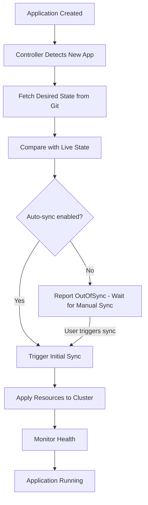
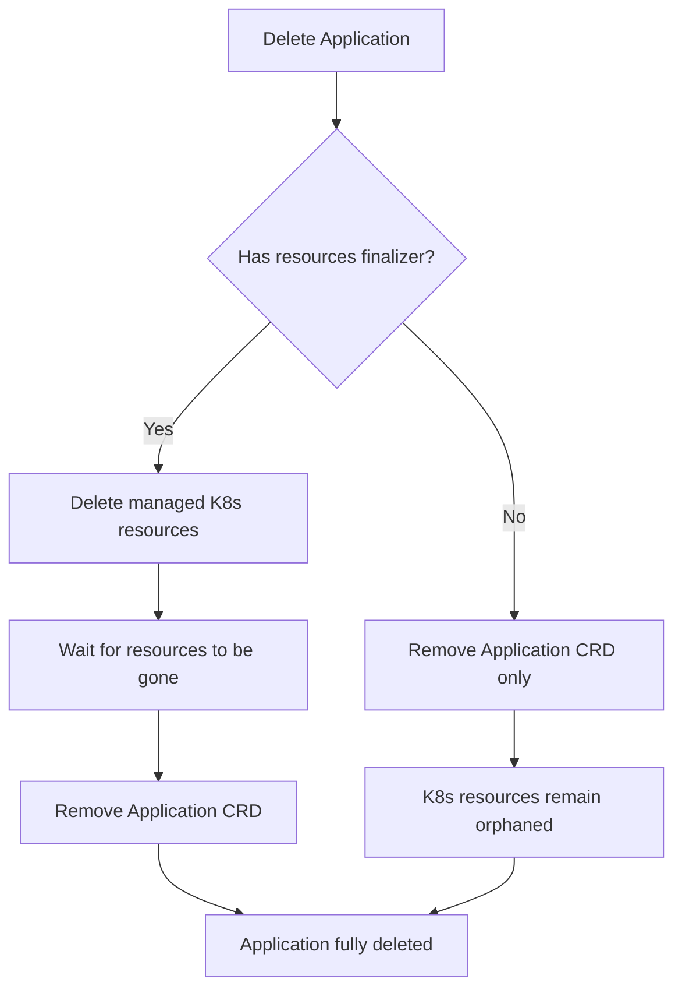

# Understanding ArgoCD Application Lifecycle from Creation to Deletion

Author: [nawazdhandala](https://github.com/nawazdhandala)

Tags: ArgoCD, GitOps, Kubernetes, Application Management

Description: A complete walkthrough of the ArgoCD Application lifecycle covering creation, initial sync, ongoing reconciliation, updates, rollbacks, and deletion.

---

An ArgoCD Application goes through a well-defined lifecycle from the moment you create it to the moment you delete it. Understanding each phase helps you predict behavior, debug issues, and make informed decisions about sync policies and deletion strategies. This post walks through the entire lifecycle with practical examples.

## Phase 1: Creation

An ArgoCD Application starts when you create the Application custom resource. You can do this through the CLI, UI, or by applying a YAML manifest.

```yaml
# Creating an Application via YAML
apiVersion: argoproj.io/v1alpha1
kind: Application
metadata:
  name: my-app
  namespace: argocd
  finalizers:
  - resources-finalizer.argocd.argoproj.io
spec:
  project: default
  source:
    repoURL: https://github.com/myorg/gitops-repo.git
    targetRevision: main
    path: apps/my-app
  destination:
    server: https://kubernetes.default.svc
    namespace: production
  syncPolicy:
    automated:
      prune: true
      selfHeal: true
```

```bash
# Or creating via CLI
argocd app create my-app \
  --repo https://github.com/myorg/gitops-repo.git \
  --path apps/my-app \
  --dest-server https://kubernetes.default.svc \
  --dest-namespace production
```

When the Application resource is created, the Application Controller picks it up within seconds. At this point, the Application exists in ArgoCD's tracking, but no Kubernetes resources have been deployed yet.

**Initial state after creation:**
- Sync status: OutOfSync (nothing deployed yet)
- Health status: Missing (no resources in the cluster)
- Operation state: No operation has run



## Phase 2: Initial Sync

The first sync is special. There are no existing resources in the cluster (unless you are taking over existing resources), so everything is a creation operation.

If auto-sync is enabled, the controller triggers the initial sync automatically. If not, you need to trigger it manually:

```bash
# Manual initial sync
argocd app sync my-app
```

During the initial sync:

1. **PreSync hooks run** - if defined, Jobs like database migrations execute first
2. **Resources are created in wave order** - sync wave 0 first, then 1, and so on
3. **Within each wave, resources are created in kind order** - Namespaces before ConfigMaps, ConfigMaps before Deployments
4. **PostSync hooks run** - smoke tests, notifications, etc.

After a successful initial sync:
- Sync status: Synced (at the Git commit that was synced)
- Health status: depends on the resources (usually Progressing, then Healthy)

## Phase 3: Ongoing Reconciliation

Once an Application is synced, it enters the reconciliation phase. This is where ArgoCD spends most of its time. The controller continuously:

1. Checks Git for new commits (every 3 minutes by default, or via webhooks)
2. Reads the live cluster state from the cache
3. Compares the two
4. Reports the sync and health status

During this phase, nothing changes unless:
- A new commit arrives in Git
- Someone manually changes the cluster
- A pod crashes and Kubernetes restarts it (not a sync issue, but affects health)
- You manually trigger a sync or refresh

### Git Changes Trigger Updates

When you push a new commit that changes your application manifests:

```bash
# Developer updates the image tag
git clone https://github.com/myorg/gitops-repo.git
cd gitops-repo
# Edit apps/my-app/deployment.yaml - change image tag
git commit -am "Bump my-app to v1.2.0"
git push origin main
```

ArgoCD detects the change (via polling or webhook) and:

1. Reports the Application as OutOfSync
2. If auto-sync is enabled, starts a new sync operation
3. Applies the changed resources
4. Monitors health until everything is stable
5. Reports the Application as Synced again

### Drift Detection and Self-Healing

If someone modifies a managed resource directly:

```bash
# Someone manually scales the deployment
kubectl scale deployment my-app -n production --replicas=10
```

ArgoCD detects this drift (the live state has 10 replicas, but Git says 3). If self-healing is enabled, ArgoCD automatically reverts the change. The timeline looks like this:

1. Manual change is made (T+0)
2. ArgoCD detects drift during next reconciliation (T+5 to T+180 seconds, depending on sync interval)
3. ArgoCD reverts the change (T+5 to T+180 seconds)
4. Application returns to Synced state

For more on self-healing, see [how to implement self-healing in ArgoCD](https://oneuptime.com/blog/post/2026-01-25-self-healing-applications-argocd/view).

## Phase 4: Updates and Rollouts

Over time, your application goes through many update cycles. Each update follows the same pattern: Git change, detection, sync, health check.

For critical applications, you might use sync waves to control the order of updates. For details, see [how to implement sync waves](https://oneuptime.com/blog/post/2026-01-25-sync-waves-argocd/view).

ArgoCD maintains a history of sync operations:

```bash
# View sync history
argocd app history my-app

# Output shows each sync operation with:
# - Revision (Git commit SHA)
# - Date of sync
# - Status (Succeeded/Failed)
ID  DATE                           REVISION
5   2026-02-26 10:30:00 +0000 UTC  abc1234 (main)
4   2026-02-25 14:00:00 +0000 UTC  def5678 (main)
3   2026-02-24 09:15:00 +0000 UTC  ghi9012 (main)
```

## Phase 5: Rollback

When an update causes problems, you can roll back. ArgoCD supports two approaches:

### Git-Based Rollback (Recommended)

Revert the commit in Git. This is the GitOps way - the desired state changes in Git, and ArgoCD syncs the cluster to match.

```bash
# Revert the last commit
git revert HEAD
git push origin main

# ArgoCD detects the change and syncs
```

### ArgoCD History-Based Rollback

Roll back to a previous sync revision directly through ArgoCD:

```bash
# Roll back to sync operation #4
argocd app rollback my-app 4
```

Note: this creates a sync operation at the old revision, which means the Application will be OutOfSync with the current Git HEAD. On the next auto-sync, ArgoCD would sync forward again to the latest Git revision. So this is a temporary measure - you should also fix Git.

For more on rollbacks, see [rollback strategies in ArgoCD](https://oneuptime.com/blog/post/2026-01-25-rollback-strategies-argocd/view).

## Phase 6: Suspension and Maintenance

You can temporarily pause automatic sync operations:

```bash
# Disable auto-sync
argocd app set my-app --sync-policy none

# The application continues to report sync status
# but does not automatically sync changes
```

This is useful during maintenance windows, incident response, or when you need to make temporary manual changes without ArgoCD reverting them.

ArgoCD also supports sync windows at the Project level, which let you define schedules for when syncs are allowed:

```yaml
# In the AppProject spec
spec:
  syncWindows:
  - kind: deny
    schedule: "0 22 * * *"  # Deny syncs from 10 PM
    duration: 8h            # Until 6 AM
    applications:
    - "*"
```

## Phase 7: Deletion

When you are ready to remove an application, the deletion behavior depends on the finalizer configuration.

### With the Resources Finalizer

If the Application has the `resources-finalizer.argocd.argoproj.io` finalizer (recommended), deleting the Application also deletes all managed Kubernetes resources:

```bash
# Delete the Application AND its Kubernetes resources
argocd app delete my-app

# Or with kubectl
kubectl delete application my-app -n argocd
```

The deletion process:
1. ArgoCD marks the Application for deletion
2. The finalizer kicks in
3. ArgoCD deletes all managed resources from the cluster (Deployments, Services, ConfigMaps, etc.)
4. Once all resources are deleted, the Application resource is removed



### Without the Finalizer

If there is no finalizer, the Application resource is deleted but the Kubernetes resources remain running in the cluster. They become orphaned - no longer managed by ArgoCD but still running.

```bash
# Delete only the ArgoCD Application, keep the K8s resources
argocd app delete my-app --cascade=false
```

This is useful when you want to stop managing an application with ArgoCD without disrupting the running workload.

### Cascade Options

ArgoCD provides fine-grained control over cascade deletion:

```bash
# Delete with foreground cascade - wait for resources to be deleted
argocd app delete my-app --cascade --propagation-policy foreground

# Delete with background cascade - return immediately, resources deleted async
argocd app delete my-app --cascade --propagation-policy background
```

## Application Status Throughout the Lifecycle

Here is a summary of the typical status at each lifecycle phase:

| Phase | Sync Status | Health Status | Notes |
|-------|-------------|---------------|-------|
| Just created | OutOfSync | Missing | No resources deployed yet |
| Initial sync in progress | Synced (at target rev) | Progressing | Resources being created |
| Stable running | Synced | Healthy | Normal operating state |
| Git change detected | OutOfSync | Healthy | New commit, not yet synced |
| Sync in progress | Synced (at new rev) | Progressing | Resources being updated |
| Deployment issue | Synced | Degraded | Cluster matches Git but pods failing |
| Drift detected | OutOfSync | Varies | Manual change detected |
| Rollback in progress | OutOfSync | Progressing | Reverting to old revision |
| Being deleted | N/A | N/A | Resources being cleaned up |

## Best Practices for Application Lifecycle

**Always use the resources finalizer.** Without it, deleting an Application leaves orphaned resources that you have to clean up manually.

**Use automated sync with self-healing for production.** This ensures drift is corrected automatically and Git remains the source of truth.

**Monitor the health status, not just sync status.** An application can be Synced but Degraded. Set up alerts for Degraded applications using [ArgoCD notifications](https://oneuptime.com/blog/post/2026-01-25-notifications-argocd/view).

**Keep sync history.** ArgoCD's history is valuable for debugging. Configure adequate history retention (default is 10 entries).

**Test deletion in non-production first.** Understand the cascade behavior before deleting applications in production.

## The Bottom Line

An ArgoCD Application lifecycle flows from creation through initial sync, ongoing reconciliation, updates, potential rollbacks, and eventual deletion. Each phase has predictable behaviors and status indicators. Understanding this lifecycle helps you operate ArgoCD confidently - you know what to expect when you create an application, what happens when Git changes, how to handle problems, and what to be careful about during deletion.
