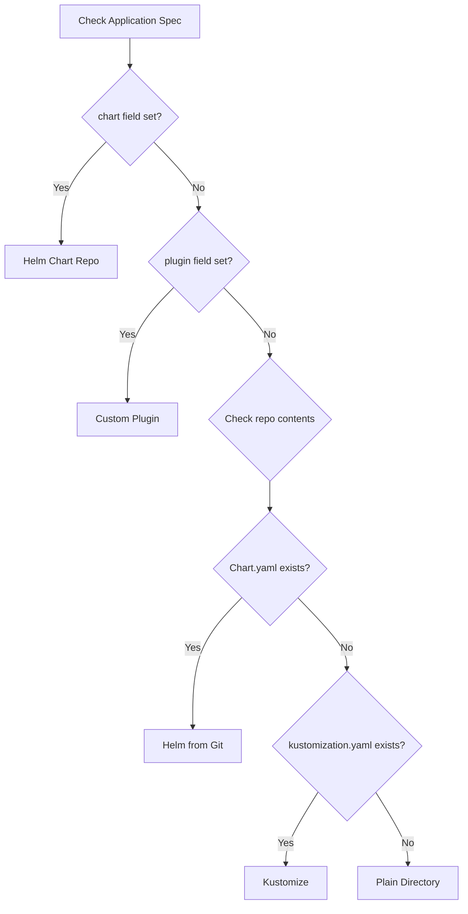

# Understanding ArgoCD Application Source Types

Author: [nawazdhandala](https://github.com/nawazdhandala)

Tags: ArgoCD, GitOps, Kubernetes, Application Management

Description: A practical guide to understanding and using all ArgoCD application source types including Git directories, Helm charts, Kustomize overlays, Jsonnet, and plugin-based sources.

---

When you create an ArgoCD Application, one of the most important decisions you make is choosing the right source type. The source type tells ArgoCD how to render your Kubernetes manifests before applying them to the cluster. Each source type has its own strengths, and understanding them will save you from configuration headaches down the road.

In this post, we will walk through every source type ArgoCD supports, with real examples showing when and how to use each one.

## What Is an Application Source Type?

In ArgoCD, the Application source defines where your manifests live and how they should be processed. ArgoCD inspects the repository contents to auto-detect the source type, but you can also explicitly configure it in your Application spec.

The source type determines the rendering pipeline - whether ArgoCD reads plain YAML files directly, runs Helm template, processes Kustomize overlays, evaluates Jsonnet, or invokes a custom plugin.

## Source Type 1: Plain Directory (Raw YAML/JSON)

The simplest source type is a directory containing raw Kubernetes YAML or JSON manifests. ArgoCD reads every `.yaml`, `.yml`, and `.json` file in the specified path and applies them.

```yaml
# Application using a plain directory source
apiVersion: argoproj.io/v1alpha1
kind: Application
metadata:
  name: my-app
  namespace: argocd
spec:
  project: default
  source:
    repoURL: https://github.com/myorg/manifests.git
    targetRevision: main
    path: apps/my-app
    # Optional: configure directory-specific options
    directory:
      recurse: true  # Include subdirectories
      exclude: '{config.json,*.bak}'  # Exclude patterns
      include: '*.yaml'  # Only include matching files
  destination:
    server: https://kubernetes.default.svc
    namespace: my-app
```

Key options for directory sources:

- `recurse` - Whether to include files from subdirectories
- `exclude` - Glob pattern to exclude files
- `include` - Glob pattern to include only specific files
- `jsonnet` - Treat files as Jsonnet (discussed below)

Use plain directories when your manifests are straightforward and do not need templating.

## Source Type 2: Helm

Helm is one of the most popular source types. ArgoCD can render Helm charts from Git repositories or Helm chart repositories (including OCI registries).

### Helm from a Git Repository

```yaml
apiVersion: argoproj.io/v1alpha1
kind: Application
metadata:
  name: my-helm-app
  namespace: argocd
spec:
  project: default
  source:
    repoURL: https://github.com/myorg/charts.git
    targetRevision: main
    path: charts/my-app
    helm:
      # Override values inline
      parameters:
        - name: image.tag
          value: "v1.2.3"
        - name: replicaCount
          value: "3"
      # Or use a values file from the repo
      valueFiles:
        - values-production.yaml
      # Or provide values as a block
      values: |
        ingress:
          enabled: true
          host: app.example.com
  destination:
    server: https://kubernetes.default.svc
    namespace: my-app
```

### Helm from a Chart Repository

```yaml
apiVersion: argoproj.io/v1alpha1
kind: Application
metadata:
  name: prometheus
  namespace: argocd
spec:
  project: default
  source:
    # Point to the Helm repository URL, not a Git repo
    repoURL: https://prometheus-community.github.io/helm-charts
    chart: kube-prometheus-stack  # Chart name
    targetRevision: 55.5.0  # Chart version
    helm:
      values: |
        grafana:
          enabled: true
        alertmanager:
          enabled: false
  destination:
    server: https://kubernetes.default.svc
    namespace: monitoring
```

ArgoCD auto-detects Helm when it finds a `Chart.yaml` in the specified path. For chart repositories, you set the `chart` field instead of `path`.

## Source Type 3: Kustomize

Kustomize is natively supported by ArgoCD. When ArgoCD finds a `kustomization.yaml` (or `kustomization.yml` or `Kustomize`) file in the target path, it automatically runs `kustomize build`.

```yaml
apiVersion: argoproj.io/v1alpha1
kind: Application
metadata:
  name: my-kustomize-app
  namespace: argocd
spec:
  project: default
  source:
    repoURL: https://github.com/myorg/manifests.git
    targetRevision: main
    path: overlays/production
    kustomize:
      # Override the image tag
      images:
        - myregistry.io/my-app:v2.0.0
      # Add a name prefix to all resources
      namePrefix: prod-
      # Add a name suffix to all resources
      nameSuffix: -v2
      # Add common labels
      commonLabels:
        env: production
      # Add common annotations
      commonAnnotations:
        team: platform
  destination:
    server: https://kubernetes.default.svc
    namespace: production
```

Kustomize source types are ideal when you have a base set of manifests and need to create environment-specific overlays without templating.

## Source Type 4: Jsonnet

Jsonnet is a data templating language that produces JSON output. ArgoCD evaluates Jsonnet files and converts the output to Kubernetes manifests.

```yaml
apiVersion: argoproj.io/v1alpha1
kind: Application
metadata:
  name: my-jsonnet-app
  namespace: argocd
spec:
  project: default
  source:
    repoURL: https://github.com/myorg/manifests.git
    targetRevision: main
    path: apps/my-app
    directory:
      jsonnet:
        # External variables passed to Jsonnet
        extVars:
          - name: replicas
            value: "3"
          - name: image
            value: "myapp:latest"
        # Top-level arguments
        tlas:
          - name: config
            value: '{"env": "production"}'
        # Additional library paths
        libs:
          - vendor
          - lib
  destination:
    server: https://kubernetes.default.svc
    namespace: my-app
```

Jsonnet is less common than Helm or Kustomize, but it is powerful for teams that want a programming-language approach to generating manifests.

## Source Type 5: Custom Plugins (CMP)

When none of the built-in source types fit your needs, you can use Config Management Plugins (CMP). Plugins run as sidecar containers to the repo-server and can execute arbitrary commands to generate manifests.

```yaml
# First, define the plugin in a ConfigMap or sidecar
# Then reference it in the Application
apiVersion: argoproj.io/v1alpha1
kind: Application
metadata:
  name: my-plugin-app
  namespace: argocd
spec:
  project: default
  source:
    repoURL: https://github.com/myorg/manifests.git
    targetRevision: main
    path: apps/my-app
    plugin:
      name: my-custom-plugin
      env:
        - name: ENV_NAME
          value: production
  destination:
    server: https://kubernetes.default.svc
    namespace: my-app
```

Common use cases for plugins include using tools like cue, dhall, or custom scripts to generate manifests.

## Source Type 6: Multi-Source Applications

Starting with ArgoCD v2.6, you can define multiple sources for a single Application. This is incredibly useful when you want to combine a Helm chart from one repository with values files from another.

```yaml
apiVersion: argoproj.io/v1alpha1
kind: Application
metadata:
  name: my-multi-source-app
  namespace: argocd
spec:
  project: default
  sources:  # Note: "sources" (plural) instead of "source"
    - repoURL: https://charts.bitnami.com/bitnami
      chart: nginx
      targetRevision: 15.0.0
      helm:
        valueFiles:
          # Reference a file from the second source using $values
          - $values/envs/production/values.yaml
    - repoURL: https://github.com/myorg/config.git
      targetRevision: main
      ref: values  # This ref is used by $values above
  destination:
    server: https://kubernetes.default.svc
    namespace: web
```

Multi-source applications solve the classic problem of wanting to version your Helm chart separately from your configuration values.

## How ArgoCD Detects Source Types

ArgoCD uses the following detection logic:



You can override auto-detection by explicitly setting the source type fields in your Application spec.

## Choosing the Right Source Type

Here is a quick guide for picking the right source type:

- **Plain Directory** - Simple applications with static manifests, no templating needed
- **Helm** - When you need templating, or you are consuming third-party charts
- **Kustomize** - When you have a base configuration with environment-specific patches
- **Jsonnet** - When you want programmatic manifest generation with a functional language
- **Plugin** - When you use a tool not natively supported by ArgoCD
- **Multi-Source** - When your chart and values live in different repositories

## Practical Tips

1. **Do not fight the tool** - If your team already uses Helm, use Helm as your source type. Do not convert to Kustomize just because someone wrote a blog post about it.

2. **Keep it consistent** - Try to use the same source type across your applications. Mixing Helm, Kustomize, and plain YAML in the same project creates cognitive overhead.

3. **Use multi-source for separation of concerns** - Keep your chart definitions and environment-specific values in separate repos. This lets different teams manage their own configuration without touching the chart.

4. **Test locally first** - Before pushing to Git, test your manifests locally with `helm template`, `kustomize build`, or the relevant tool for your source type.

For more on deploying Helm charts with ArgoCD, check out our guide on [Helm + ArgoCD GitOps Deployment](https://oneuptime.com/blog/post/helm-argocd-gitops-deployment/view). For Kustomize-based deployments, see [How to Deploy with Kustomize in ArgoCD](https://oneuptime.com/blog/post/deploy-kustomize-argocd/view).

Understanding source types is foundational to working effectively with ArgoCD. Once you have picked the right source type for your team, everything else - sync policies, health checks, and application management - becomes much more straightforward.
