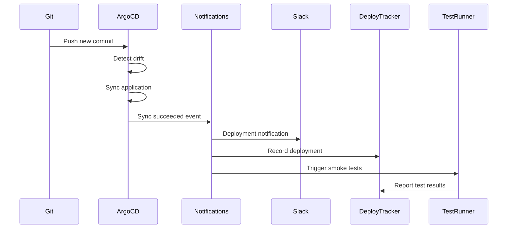

# How to Handle Application Synced Events in ArgoCD

Author: [nawazdhandala](https://github.com/nawazdhandala)

Tags: ArgoCD, GitOps, Kubernetes, Event Handling, CI/CD

Description: Learn how to detect and respond to Application Synced events in ArgoCD for deployment tracking, rollback automation, and integration with external systems.

---

Every time ArgoCD successfully syncs an application, it represents a completed deployment. Capturing these synced events is valuable for deployment tracking, triggering post-deployment tests, updating change management systems, and maintaining audit trails. ArgoCD provides several mechanisms to detect when an application transitions from OutOfSync to Synced, and this guide covers the most effective patterns.

## Why Track Synced Events?

Sync completion is one of the most important events in a GitOps workflow:

- **Deployment tracking**: Record which version is deployed where and when
- **Post-deployment testing**: Trigger smoke tests or integration tests
- **Change management**: Update ITSM tickets or change records
- **Metrics collection**: Measure deployment frequency and lead time
- **Notification**: Tell teams their changes are live
- **Rollback triggers**: Start monitoring for errors that might require rollback

## Approach 1: ArgoCD Notifications

The most straightforward way to handle synced events is through ArgoCD Notifications.

```yaml
# argocd-notifications-cm ConfigMap
apiVersion: v1
kind: ConfigMap
metadata:
  name: argocd-notifications-cm
  namespace: argocd
data:
  # Trigger when sync operation succeeds
  trigger.on-sync-succeeded: |
    - description: Application synced successfully
      when: app.status.operationState.phase in ['Succeeded']
      oncePer: app.status.operationState.syncResult.revision
      send:
        - sync-succeeded-webhook
        - sync-succeeded-slack
        - sync-succeeded-metrics

  # Webhook to deployment tracking system
  service.webhook.deploy-tracker: |
    url: https://deploy-tracker.internal.company.com/api/v1/deployments
    headers:
      - name: Content-Type
        value: application/json
      - name: Authorization
        value: $deploy-tracker-token

  # Template for deployment tracking
  template.sync-succeeded-webhook: |
    webhook:
      deploy-tracker:
        method: POST
        body: |
          {
            "event": "deployment.completed",
            "application": "{{.app.metadata.name}}",
            "project": "{{.app.spec.project}}",
            "namespace": "{{.app.spec.destination.namespace}}",
            "cluster": "{{.app.spec.destination.server}}",
            "revision": "{{.app.status.operationState.syncResult.revision}}",
            "source": "{{.app.spec.source.repoURL}}",
            "path": "{{.app.spec.source.path}}",
            "syncedAt": "{{.app.status.operationState.finishedAt}}",
            "initiatedBy": "{{.app.status.operationState.operation.initiatedBy.username}}",
            "images": {{toJson .app.status.summary.images}}
          }

  # Slack notification
  template.sync-succeeded-slack: |
    slack:
      channel: deployments
      title: "Deployment Complete: {{.app.metadata.name}}"
      text: |
        *Application*: {{.app.metadata.name}}
        *Revision*: `{{.app.status.operationState.syncResult.revision | truncate 8}}`
        *Namespace*: {{.app.spec.destination.namespace}}
        *Synced at*: {{.app.status.operationState.finishedAt}}
        *Initiated by*: {{.app.status.operationState.operation.initiatedBy.username | default "auto-sync"}}
        {{range .app.status.summary.images}}
        *Image*: {{.}}
        {{end}}
      color: "#36a64f"

  # Metrics for deployment frequency
  template.sync-succeeded-metrics: |
    webhook:
      deploy-tracker:
        method: POST
        path: /api/v1/metrics
        body: |
          {
            "metric": "deployment_completed",
            "labels": {
              "application": "{{.app.metadata.name}}",
              "project": "{{.app.spec.project}}",
              "cluster": "{{.app.spec.destination.server}}"
            },
            "value": 1,
            "timestamp": "{{.app.status.operationState.finishedAt}}"
          }
```

The `oncePer` field is crucial. It ensures the notification fires only once per Git revision, preventing duplicate notifications when ArgoCD reconciles.

## Approach 2: Post-Deployment Test Trigger

After a successful sync, trigger automated tests to verify the deployment.

```yaml
# In argocd-notifications-cm
data:
  service.webhook.test-runner: |
    url: https://ci.internal.company.com/api/v2/pipelines
    headers:
      - name: Content-Type
        value: application/json
      - name: Authorization
        value: $ci-api-token

  template.trigger-post-deploy-tests: |
    webhook:
      test-runner:
        method: POST
        body: |
          {
            "pipeline": "post-deploy-tests",
            "parameters": {
              "APPLICATION": "{{.app.metadata.name}}",
              "NAMESPACE": "{{.app.spec.destination.namespace}}",
              "REVISION": "{{.app.status.operationState.syncResult.revision}}",
              "TEST_SUITE": "smoke"
            }
          }

  trigger.on-sync-with-tests: |
    - description: Sync succeeded, trigger tests
      when: app.status.operationState.phase in ['Succeeded'] and
            app.metadata.labels.run-post-deploy-tests == 'true'
      oncePer: app.status.operationState.syncResult.revision
      send:
        - trigger-post-deploy-tests
```

Label applications that need post-deployment tests:

```yaml
metadata:
  labels:
    run-post-deploy-tests: "true"
  annotations:
    notifications.argoproj.io/subscribe.on-sync-with-tests.test-runner: ""
```

## Approach 3: Resource Hooks for Post-Sync Actions

ArgoCD resource hooks run Kubernetes Jobs at specific points in the sync lifecycle.

```yaml
# post-sync-job.yaml
apiVersion: batch/v1
kind: Job
metadata:
  name: post-sync-smoke-test
  annotations:
    argocd.argoproj.io/hook: PostSync
    argocd.argoproj.io/hook-delete-policy: BeforeHookCreation
spec:
  template:
    spec:
      containers:
        - name: smoke-test
          image: your-org/smoke-tests:latest
          env:
            - name: TARGET_URL
              value: "http://my-service.default.svc:8080"
            - name: TEST_SUITE
              value: "smoke"
          command:
            - /bin/sh
            - -c
            - |
              echo "Running smoke tests..."
              # Run health check
              for i in $(seq 1 30); do
                if curl -sf $TARGET_URL/health; then
                  echo "Service is healthy"
                  break
                fi
                echo "Attempt $i: Service not ready, waiting..."
                sleep 10
              done

              # Run smoke test suite
              ./run-tests.sh --suite $TEST_SUITE --target $TARGET_URL

              # Report results
              curl -X POST https://deploy-tracker.internal/api/v1/tests \
                -H "Content-Type: application/json" \
                -d "{
                  \"application\": \"my-service\",
                  \"suite\": \"smoke\",
                  \"status\": \"passed\",
                  \"timestamp\": \"$(date -u +%FT%TZ)\"
                }"
      restartPolicy: Never
  backoffLimit: 2
```

## Approach 4: DORA Metrics Collection

Use synced events to calculate DORA (DevOps Research and Assessment) metrics.

```yaml
# Deployment frequency and lead time tracking
template.dora-metrics: |
  webhook:
    deploy-tracker:
      method: POST
      path: /api/v1/dora
      body: |
        {
          "type": "deployment",
          "application": "{{.app.metadata.name}}",
          "team": "{{index .app.metadata.labels "team"}}",
          "revision": "{{.app.status.operationState.syncResult.revision}}",
          "startedAt": "{{.app.status.operationState.startedAt}}",
          "finishedAt": "{{.app.status.operationState.finishedAt}}",
          "source": {
            "repoURL": "{{.app.spec.source.repoURL}}",
            "path": "{{.app.spec.source.path}}",
            "targetRevision": "{{.app.spec.source.targetRevision}}"
          }
        }
```

## Event Flow



## Filtering Synced Events

Not all sync events are equally important. Use conditions to filter:

```yaml
trigger.on-production-sync: |
  - description: Production sync completed
    when: >-
      app.status.operationState.phase in ['Succeeded'] and
      app.spec.destination.namespace matches 'production.*'
    oncePer: app.status.operationState.syncResult.revision
    send:
      - production-deploy-notification

trigger.on-manual-sync: |
  - description: Manual sync completed
    when: >-
      app.status.operationState.phase in ['Succeeded'] and
      app.status.operationState.operation.initiatedBy.username != ''
    oncePer: app.status.operationState.syncResult.revision
    send:
      - manual-deploy-audit
```

## Integration with Change Management

For organizations with ITSM processes, synced events can automatically update change records:

```yaml
template.update-change-record: |
  webhook:
    servicenow:
      method: PATCH
      path: "/api/now/table/change_request/{{index .app.metadata.annotations "change-request-id"}}"
      body: |
        {
          "state": "implement",
          "work_notes": "Deployment completed via ArgoCD. Revision: {{.app.status.operationState.syncResult.revision}}",
          "close_code": "successful",
          "close_notes": "Automated deployment completed successfully at {{.app.status.operationState.finishedAt}}"
        }
```

## Best Practices

1. **Use oncePer**: Always set `oncePer` to prevent duplicate notifications during reconciliation loops.

2. **Track revision**: Include the Git revision in every notification so you can trace back to the exact commit.

3. **Capture images**: The `app.status.summary.images` field shows which container images are deployed, useful for vulnerability tracking.

4. **Separate concerns**: Use different notification targets for different purposes - Slack for humans, webhooks for automation, metrics endpoints for dashboards.

5. **Handle partial syncs**: A sync might succeed for the Application resource but individual resources might still be progressing. Check health status alongside sync status for complete accuracy.

## Conclusion

Synced events in ArgoCD are the foundation for deployment observability. By capturing them through notifications, webhooks, and resource hooks, you build a comprehensive deployment tracking system. Use these events to measure DORA metrics, trigger post-deployment tests, update change management records, and keep teams informed. The `oncePer` configuration prevents noise, and filtering by namespace or labels ensures the right events reach the right systems.
