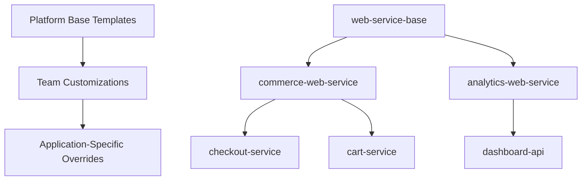

# How to Create Application Templates for Platform Consumers

Author: [nawazdhandala](https://github.com/nawazdhandala)

Tags: ArgoCD, GitOps, Kubernetes, Platform Engineering, Template

Description: Learn how to create reusable ArgoCD application templates that platform consumers can adopt for consistent, production-ready deployments across teams.

---

Application templates are the building blocks of a platform engineering strategy. They encode organizational best practices into reusable patterns that developers adopt without needing to understand every Kubernetes primitive. When built on top of ArgoCD, these templates become the interface between platform teams and their consumers, providing consistency while allowing customization.

This guide covers designing, implementing, and distributing application templates that work with ArgoCD's ecosystem.

## The Template Hierarchy

A well-designed template system has layers:



- **Platform base**: Security contexts, resource limits, monitoring, networking
- **Team layer**: Team-specific defaults, naming conventions, alert channels
- **Application layer**: Image tags, replicas, custom environment variables

## Step 1: Design the Template Interface

Define what developers need to provide versus what the platform provides:

```yaml
# Developer provides (minimal):
app:
  name: checkout-service
  team: commerce
  image: registry.company.com/commerce/checkout:v1.2.3
  port: 8080

# Platform provides (everything else):
# - Deployment with health probes
# - Service and Ingress
# - HPA and PDB
# - ServiceMonitor
# - NetworkPolicy
# - SecurityContext
# - TopologySpreadConstraints
# - Resource defaults
# - Alerting rules
```

## Step 2: Build the Base Template Chart

Create a Helm chart that serves as the universal base template:

```yaml
# charts/platform-app/Chart.yaml
apiVersion: v2
name: platform-app
description: Platform base application template
version: 2.0.0
type: application
```

```yaml
# charts/platform-app/values.schema.json
{
  "$schema": "http://json-schema.org/draft-07/schema#",
  "required": ["app"],
  "properties": {
    "app": {
      "type": "object",
      "required": ["name", "team", "image"],
      "properties": {
        "name": {
          "type": "string",
          "pattern": "^[a-z][a-z0-9-]{2,62}$",
          "description": "Application name (lowercase, alphanumeric, hyphens)"
        },
        "team": {
          "type": "string",
          "description": "Owning team name"
        },
        "image": {
          "type": "string",
          "description": "Full container image with tag"
        },
        "port": {
          "type": "integer",
          "default": 8080,
          "description": "Container port"
        }
      }
    }
  }
}
```

```yaml
# charts/platform-app/values.yaml
app:
  name: ""
  team: ""
  image: ""
  port: 8080
  healthCheck:
    path: /health
    initialDelay: 10
  env: []
  envFrom: []

# Deployment configuration
deployment:
  replicas: 2
  strategy:
    type: RollingUpdate
    rollingUpdate:
      maxSurge: 25%
      maxUnavailable: 0
  terminationGracePeriod: 30

# Resource configuration
resources:
  requests:
    cpu: 100m
    memory: 128Mi
  limits:
    cpu: 500m
    memory: 512Mi

# Autoscaling
autoscaling:
  enabled: true
  minReplicas: 2
  maxReplicas: 10
  metrics:
    - type: Resource
      resource:
        name: cpu
        target:
          type: Utilization
          averageUtilization: 70

# Service configuration
service:
  type: ClusterIP
  port: 80

# Ingress
ingress:
  enabled: false
  className: nginx
  annotations: {}
  hosts: []
  tls: []

# Pod disruption budget
pdb:
  enabled: true
  minAvailable: 1

# Network policy
networkPolicy:
  enabled: true
  allowedNamespaces: []
  allowedPorts: []

# Monitoring
monitoring:
  serviceMonitor:
    enabled: true
    interval: 30s
    path: /metrics
  alerts:
    enabled: true
    errorRateThreshold: 0.01
    latencyP99Threshold: 1000
    availabilityTarget: 99.9

# Security
security:
  serviceAccount:
    create: true
    annotations: {}
  podSecurityContext:
    runAsNonRoot: true
    seccompProfile:
      type: RuntimeDefault
  containerSecurityContext:
    readOnlyRootFilesystem: true
    allowPrivilegeEscalation: false
    capabilities:
      drop:
        - ALL
```

## Step 3: Implement Template Resources

The Deployment template with all platform standards baked in:

```yaml
# charts/platform-app/templates/deployment.yaml
apiVersion: apps/v1
kind: Deployment
metadata:
  name: {{ .Values.app.name }}
  labels:
    {{- include "platform-app.labels" . | nindent 4 }}
spec:
  {{- if not .Values.autoscaling.enabled }}
  replicas: {{ .Values.deployment.replicas }}
  {{- end }}
  strategy:
    {{- toYaml .Values.deployment.strategy | nindent 4 }}
  selector:
    matchLabels:
      {{- include "platform-app.selectorLabels" . | nindent 6 }}
  template:
    metadata:
      labels:
        {{- include "platform-app.labels" . | nindent 8 }}
      annotations:
        checksum/config: {{ include (print $.Template.BasePath "/configmap.yaml") . | sha256sum }}
    spec:
      serviceAccountName: {{ .Values.app.name }}
      securityContext:
        {{- toYaml .Values.security.podSecurityContext | nindent 8 }}
      terminationGracePeriodSeconds: {{ .Values.deployment.terminationGracePeriod }}
      containers:
        - name: {{ .Values.app.name }}
          image: {{ .Values.app.image }}
          ports:
            - name: http
              containerPort: {{ .Values.app.port }}
          securityContext:
            {{- toYaml .Values.security.containerSecurityContext | nindent 12 }}
          resources:
            {{- toYaml .Values.resources | nindent 12 }}
          {{- if .Values.app.env }}
          env:
            {{- toYaml .Values.app.env | nindent 12 }}
          {{- end }}
          {{- if .Values.app.envFrom }}
          envFrom:
            {{- toYaml .Values.app.envFrom | nindent 12 }}
          {{- end }}
          livenessProbe:
            httpGet:
              path: {{ .Values.app.healthCheck.path }}
              port: http
            initialDelaySeconds: {{ .Values.app.healthCheck.initialDelay }}
            periodSeconds: 10
            failureThreshold: 3
          readinessProbe:
            httpGet:
              path: {{ .Values.app.healthCheck.path }}
              port: http
            initialDelaySeconds: 5
            periodSeconds: 5
            failureThreshold: 3
          startupProbe:
            httpGet:
              path: {{ .Values.app.healthCheck.path }}
              port: http
            failureThreshold: 30
            periodSeconds: 5
      topologySpreadConstraints:
        - maxSkew: 1
          topologyKey: kubernetes.io/hostname
          whenUnsatisfiable: DoNotSchedule
          labelSelector:
            matchLabels:
              {{- include "platform-app.selectorLabels" . | nindent 14 }}
```

The alert rules template:

```yaml
# charts/platform-app/templates/alerts.yaml
{{- if .Values.monitoring.alerts.enabled }}
apiVersion: monitoring.coreos.com/v1
kind: PrometheusRule
metadata:
  name: {{ .Values.app.name }}-alerts
  labels:
    {{- include "platform-app.labels" . | nindent 4 }}
spec:
  groups:
    - name: {{ .Values.app.name }}.rules
      rules:
        - alert: HighErrorRate
          expr: |
            sum(rate(http_requests_total{
              job="{{ .Values.app.name }}",
              status=~"5.."
            }[5m]))
            /
            sum(rate(http_requests_total{
              job="{{ .Values.app.name }}"
            }[5m]))
            > {{ .Values.monitoring.alerts.errorRateThreshold }}
          for: 5m
          labels:
            severity: critical
            team: {{ .Values.app.team }}
          annotations:
            summary: "High error rate for {{ .Values.app.name }}"
            description: "Error rate is above {{ mul .Values.monitoring.alerts.errorRateThreshold 100 }}%"

        - alert: HighLatency
          expr: |
            histogram_quantile(0.99,
              sum(rate(http_request_duration_seconds_bucket{
                job="{{ .Values.app.name }}"
              }[5m])) by (le)
            ) > {{ div .Values.monitoring.alerts.latencyP99Threshold 1000 }}
          for: 5m
          labels:
            severity: warning
            team: {{ .Values.app.team }}

        - alert: PodCrashLooping
          expr: |
            increase(kube_pod_container_status_restarts_total{
              namespace="{{ .Release.Namespace }}",
              pod=~"{{ .Values.app.name }}-.*"
            }[1h]) > 5
          for: 10m
          labels:
            severity: critical
            team: {{ .Values.app.team }}
{{- end }}
```

## Step 4: Create Specialized Template Variants

Build on the base template for specific use cases:

```yaml
# charts/platform-cronjob/Chart.yaml
apiVersion: v2
name: platform-cronjob
description: Platform template for scheduled jobs
version: 1.0.0
dependencies:
  - name: platform-app
    version: "2.0.0"
    repository: "file://../platform-app"
    condition: baseApp.enabled
```

```yaml
# charts/platform-cronjob/values.yaml
schedule: "0 * * * *"
concurrencyPolicy: Forbid
successfulJobsHistoryLimit: 3
failedJobsHistoryLimit: 5
activeDeadlineSeconds: 3600
backoffLimit: 3

# Disable features not needed for cron jobs
autoscaling:
  enabled: false
ingress:
  enabled: false
service:
  enabled: false
pdb:
  enabled: false
```

## Step 5: Distribute Templates via ArgoCD

Host templates in a Helm chart repository and reference them from ArgoCD Applications:

```yaml
# A developer's application using the platform template
apiVersion: argoproj.io/v1alpha1
kind: Application
metadata:
  name: commerce-checkout-production
  namespace: argocd
spec:
  project: commerce
  source:
    chart: platform-app
    repoURL: https://charts.platform.company.com
    targetRevision: 2.0.0
    helm:
      values: |
        app:
          name: checkout-service
          team: commerce
          image: registry.company.com/commerce/checkout:v1.2.3
          port: 8080
          env:
            - name: DATABASE_URL
              valueFrom:
                secretKeyRef:
                  name: checkout-db-creds
                  key: url
        ingress:
          enabled: true
          hosts:
            - host: checkout.company.com
              paths:
                - path: /
                  pathType: Prefix
  destination:
    server: https://kubernetes.default.svc
    namespace: commerce-production
```

## Step 6: Template Versioning Strategy

Version your templates so teams can upgrade at their own pace:

```
platform-app v1.x - Legacy, security patches only
platform-app v2.x - Current, all new features
platform-app v3.x - Next, breaking changes
```

Teams pin to a major version and get automatic security patches. Major version upgrades are communicated with migration guides and deprecation timelines.

## Template Documentation

Every template should have clear documentation about what it creates and how to customize it. Use [OneUptime](https://oneuptime.com) dashboards to show teams what monitoring and alerting comes built into each template.

## Conclusion

Application templates are the primary interface between platform teams and developers. By building Helm charts that encode security, monitoring, networking, and operational best practices, you create a system where developers get production-grade deployments by providing minimal configuration. The key design principles are: require as little input as possible from developers, provide sensible defaults for everything, validate inputs with JSON Schema, version templates independently, and always include monitoring and alerting as built-in features rather than optional add-ons.
