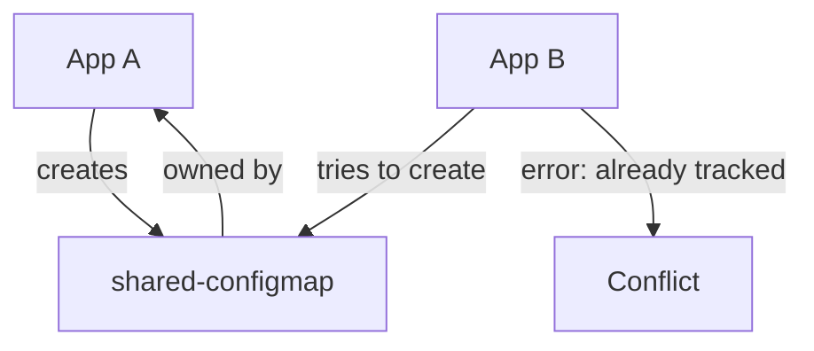

# How to Handle ArgoCD Applications with Shared Resources

Author: [nawazdhandala](https://github.com/nawazdhandala)

Tags: ArgoCD, GitOps, Kubernetes, Architecture, Best Practices

Description: Learn how to manage Kubernetes resources shared between multiple ArgoCD applications without conflicts, tracking issues, or sync errors.

---

When two or more ArgoCD applications try to manage the same Kubernetes resource, things get messy. ArgoCD tracks which resources belong to which application, and when it detects a resource already managed by another application, it throws an error or behaves unpredictably. This is a common problem when multiple services share a ConfigMap, a namespace, or a ClusterRole.

Understanding how ArgoCD tracks resource ownership and knowing the patterns for sharing resources will save you from a lot of frustration.

## The Problem: Resource Ownership Conflicts

ArgoCD adds tracking labels and annotations to every resource it manages. The key annotation is `argocd.argoproj.io/tracking-id`, which links the resource to a specific ArgoCD Application.

When Application A creates a ConfigMap and Application B also tries to create the same ConfigMap, ArgoCD detects the conflict. Depending on your configuration, you might see:

- "Resource already tracked by another application"
- The resource flipping between two Applications
- One application showing OutOfSync because the other application modified the resource



## Understanding ArgoCD Tracking Methods

ArgoCD supports three tracking methods, and choosing the right one affects how shared resources work.

```yaml
# In argocd-cm ConfigMap
apiVersion: v1
kind: ConfigMap
metadata:
  name: argocd-cm
  namespace: argocd
data:
  # Options: label, annotation, annotation+label
  application.resourceTrackingMethod: annotation
```

- **label** (legacy): Uses the `app.kubernetes.io/instance` label. This is the most restrictive - only one application can own a resource.
- **annotation**: Uses the `argocd.argoproj.io/tracking-id` annotation. Same ownership limitation but does not interfere with standard Kubernetes labels.
- **annotation+label**: Uses both. Most compatible with external tools.

None of these tracking methods natively support shared ownership. A resource can only belong to one Application.

## Pattern 1: Use a Shared Infrastructure Application

The cleanest pattern is to create a dedicated Application for shared resources. Individual service Applications do not manage the shared resources at all.

```yaml
# Application for shared infrastructure
apiVersion: argoproj.io/v1alpha1
kind: Application
metadata:
  name: shared-infra
  namespace: argocd
spec:
  source:
    repoURL: https://github.com/my-org/platform-config.git
    targetRevision: main
    path: shared-resources/
  destination:
    server: https://kubernetes.default.svc
    namespace: default
  syncPolicy:
    automated:
      prune: false  # Be careful with pruning shared resources
      selfHeal: true
```

The shared resources live in their own Git directory and are managed by this single Application. Service applications reference these resources but do not create or manage them.

```text
platform-config/
  shared-resources/
    namespaces.yaml       # Shared namespaces
    cluster-roles.yaml    # Shared RBAC
    configmaps.yaml       # Shared ConfigMaps
  service-a/
    deployment.yaml       # References shared namespace
    service.yaml
  service-b/
    deployment.yaml       # References shared namespace
    service.yaml
```

## Pattern 2: Exclude Shared Resources from Tracking

You can tell ArgoCD to exclude specific resources from tracking entirely using the `argocd.argoproj.io/compare-options` annotation or by configuring resource exclusions.

```yaml
apiVersion: v1
kind: ConfigMap
metadata:
  name: argocd-cm
  namespace: argocd
data:
  # Exclude specific resource types from tracking
  resource.exclusions: |
    - apiGroups:
        - ""
      kinds:
        - ConfigMap
      clusters:
        - "*"
      namespaces:
        - shared-config
```

This approach tells ArgoCD to completely ignore certain resources. The downside is that ArgoCD will not manage those resources at all - no sync status, no drift detection.

## Pattern 3: Use the Managed-By Annotation

You can explicitly tell ArgoCD which Application manages a resource by setting the tracking annotation on the resource itself.

```yaml
apiVersion: v1
kind: ConfigMap
metadata:
  name: shared-config
  namespace: default
  annotations:
    # Explicitly assign this resource to the shared-infra app
    argocd.argoproj.io/managed-by: argocd/shared-infra
```

When another Application includes this ConfigMap in its manifests, ArgoCD will skip it because it is already managed by `shared-infra`.

## Pattern 4: Create Namespace Resources Separately

One of the most common shared resource conflicts is namespaces. Multiple Applications might deploy to the same namespace, and if they both try to create it, you get a conflict.

The solution is to not manage namespaces within Application specs. Instead, use the `CreateNamespace=true` sync option or manage namespaces through a separate Application.

```yaml
# Let ArgoCD create the namespace without tracking it
apiVersion: argoproj.io/v1alpha1
kind: Application
metadata:
  name: service-a
  namespace: argocd
spec:
  destination:
    server: https://kubernetes.default.svc
    namespace: shared-namespace
  syncPolicy:
    syncOptions:
      - CreateNamespace=true
```

With `CreateNamespace=true`, ArgoCD creates the namespace if it does not exist but does not track it as a managed resource. Multiple applications can share the same namespace without conflict.

## Pattern 5: Use Resource Annotations to Prevent Pruning

When a shared resource is included in multiple Application manifests, you can prevent ArgoCD from pruning it by marking it as "do not prune".

```yaml
apiVersion: v1
kind: ConfigMap
metadata:
  name: shared-config
  annotations:
    argocd.argoproj.io/sync-options: Prune=false
```

This prevents ArgoCD from deleting the resource even if it disappears from an Application's manifest source.

## Pattern 6: Use ApplicationSets with Shared Resources

When using ApplicationSets to generate many Applications that all need the same shared resources, consider using an app-of-apps pattern where shared resources are deployed once and service-specific resources are deployed per application.

```yaml
# ApplicationSet for services (does NOT include shared resources)
apiVersion: argoproj.io/v1alpha1
kind: ApplicationSet
metadata:
  name: services
  namespace: argocd
spec:
  generators:
    - git:
        repoURL: https://github.com/my-org/services.git
        revision: main
        directories:
          - path: services/*
  template:
    metadata:
      name: '{{path.basename}}'
    spec:
      source:
        repoURL: https://github.com/my-org/services.git
        targetRevision: main
        path: '{{path}}'
      destination:
        server: https://kubernetes.default.svc
        namespace: '{{path.basename}}'
```

## Handling Conflicts in Existing Deployments

If you already have a conflict where two Applications are fighting over a resource, here is how to resolve it.

```bash
# Check which application owns a resource
kubectl get configmap shared-config -o jsonpath='{.metadata.annotations.argocd\.argoproj\.io/tracking-id}'

# Remove the tracking annotation to release ownership
kubectl annotate configmap shared-config argocd.argoproj.io/tracking-id-

# Then let the correct Application claim it on next sync
argocd app sync shared-infra
```

## Best Practices Summary

1. **Dedicate an Application for shared resources**: This is the cleanest approach and avoids ownership conflicts entirely
2. **Use `CreateNamespace=true`** instead of including namespace manifests in multiple Applications
3. **Never have two Applications manage the same resource**: If you need to, restructure your Git repository
4. **Be cautious with pruning**: Set `Prune=false` on shared resources to prevent accidental deletion
5. **Document your ownership model**: Make it clear which Application owns which resources

Shared resources in ArgoCD require thoughtful architecture upfront. Retrofitting a solution after conflicts arise is always harder than designing the resource ownership model from the start.
