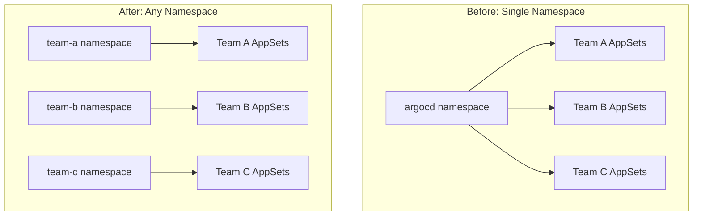

# How to Use ApplicationSets in Any Namespace in ArgoCD

Author: [nawazdhandala](https://github.com/nawazdhandala)

Tags: ArgoCD, GitOps, Kubernetes, ApplicationSet, Namespace Management

Description: Learn how to configure ArgoCD ApplicationSets to be created and managed in namespaces other than the default argocd namespace for multi-tenant environments.

---

By default, ArgoCD ApplicationSets must be created in the `argocd` namespace. This becomes a bottleneck in multi-tenant environments where different teams want to manage their own ApplicationSets independently. The "ApplicationSets in any namespace" feature lets teams create ApplicationSets in their own namespaces while still being managed by the central ArgoCD controller.

This guide covers enabling this feature, configuring namespace permissions, and setting up multi-tenant ApplicationSet management.

## Why ApplicationSets in Any Namespace?

In a standard ArgoCD setup, all ApplicationSets live in the `argocd` namespace. This means:

- Platform teams must manage all ApplicationSets centrally
- Teams cannot self-service their ApplicationSet creation
- Namespace-level RBAC cannot isolate ApplicationSets between teams
- All ApplicationSets share the same namespace, risking naming conflicts

Moving ApplicationSets to team namespaces solves these problems.



## Enabling ApplicationSets in Any Namespace

This feature requires ArgoCD v2.8 or later. Enable it by configuring the ApplicationSet controller.

### Step 1: Update the ArgoCD ConfigMap

```yaml
apiVersion: v1
kind: ConfigMap
metadata:
  name: argocd-cmd-params-cm
  namespace: argocd
data:
  # Enable ApplicationSets in any namespace
  applicationsetcontroller.namespaces: "team-a,team-b,team-c"
  # Or use a glob pattern
  # applicationsetcontroller.namespaces: "team-*"
```

### Step 2: Configure RBAC for the ApplicationSet Controller

The ApplicationSet controller needs permission to watch and manage ApplicationSets in the specified namespaces.

```yaml
apiVersion: rbac.authorization.k8s.io/v1
kind: ClusterRole
metadata:
  name: argocd-applicationset-controller-namespaced
rules:
  - apiGroups:
      - argoproj.io
    resources:
      - applicationsets
      - applicationsets/status
      - applicationsets/finalizers
    verbs:
      - get
      - list
      - watch
      - create
      - update
      - patch
      - delete
  - apiGroups:
      - argoproj.io
    resources:
      - applications
    verbs:
      - get
      - list
      - watch
      - create
      - update
      - patch
      - delete
---
apiVersion: rbac.authorization.k8s.io/v1
kind: ClusterRoleBinding
metadata:
  name: argocd-applicationset-controller-namespaced
roleRef:
  apiGroup: rbac.authorization.k8s.io
  kind: ClusterRole
  name: argocd-applicationset-controller-namespaced
subjects:
  - kind: ServiceAccount
    name: argocd-applicationset-controller
    namespace: argocd
```

### Step 3: Restart the Controller

```bash
kubectl rollout restart deployment argocd-applicationset-controller -n argocd

# Verify the controller picked up the new configuration
kubectl logs -n argocd \
  -l app.kubernetes.io/name=argocd-applicationset-controller \
  --tail=50 | grep -i "namespace"
```

## Creating ApplicationSets in Team Namespaces

Once enabled, teams can create ApplicationSets in their own namespaces.

```yaml
apiVersion: argoproj.io/v1alpha1
kind: ApplicationSet
metadata:
  name: team-a-services
  # ApplicationSet in the team's namespace
  namespace: team-a
spec:
  generators:
    - git:
        repoURL: https://github.com/myorg/team-a-services.git
        revision: HEAD
        directories:
          - path: 'services/*'
  template:
    metadata:
      name: 'team-a-{{path.basename}}'
    spec:
      project: team-a
      source:
        repoURL: https://github.com/myorg/team-a-services.git
        targetRevision: HEAD
        path: '{{path}}'
      destination:
        server: https://kubernetes.default.svc
        namespace: 'team-a-{{path.basename}}'
      syncPolicy:
        automated:
          prune: true
          selfHeal: true
        syncOptions:
          - CreateNamespace=true
```

## Project Restrictions for Namespace Scoping

When using ApplicationSets in any namespace, ArgoCD Projects provide guardrails to prevent teams from deploying to unauthorized destinations.

```yaml
apiVersion: argoproj.io/v1alpha1
kind: AppProject
metadata:
  name: team-a
  namespace: argocd
spec:
  description: Team A project
  # Restrict source repositories
  sourceRepos:
    - 'https://github.com/myorg/team-a-*'
  # Restrict destination clusters and namespaces
  destinations:
    - server: https://kubernetes.default.svc
      namespace: 'team-a-*'
  # Restrict cluster-scoped resources
  clusterResourceWhitelist: []
  # Allow specific namespaced resources only
  namespaceResourceWhitelist:
    - group: ''
      kind: ConfigMap
    - group: ''
      kind: Secret
    - group: ''
      kind: Service
    - group: apps
      kind: Deployment
    - group: networking.k8s.io
      kind: Ingress
  # ApplicationSet source namespaces
  sourceNamespaces:
    - team-a
```

The `sourceNamespaces` field is critical. It tells ArgoCD which namespaces are allowed to host ApplicationSets that create Applications in this project.

## Multi-Tenant Setup Example

Here is a complete multi-tenant configuration.

### Platform Team Configuration

```yaml
# Namespace for each team
apiVersion: v1
kind: Namespace
metadata:
  name: team-a
  labels:
    argocd.argoproj.io/applicationset-enabled: "true"
---
apiVersion: v1
kind: Namespace
metadata:
  name: team-b
  labels:
    argocd.argoproj.io/applicationset-enabled: "true"
---
# ArgoCD configuration
apiVersion: v1
kind: ConfigMap
metadata:
  name: argocd-cmd-params-cm
  namespace: argocd
data:
  applicationsetcontroller.namespaces: "team-a,team-b"
```

### Team A's ApplicationSet

```yaml
apiVersion: argoproj.io/v1alpha1
kind: ApplicationSet
metadata:
  name: services
  namespace: team-a
spec:
  generators:
    - list:
        elements:
          - name: user-service
            port: "8080"
          - name: order-service
            port: "8081"
  template:
    metadata:
      name: 'team-a-{{name}}'
      labels:
        team: team-a
    spec:
      project: team-a
      source:
        repoURL: https://github.com/myorg/team-a-services.git
        targetRevision: HEAD
        path: '{{name}}/deploy'
      destination:
        server: https://kubernetes.default.svc
        namespace: 'team-a-{{name}}'
      syncPolicy:
        automated:
          selfHeal: true
        syncOptions:
          - CreateNamespace=true
```

### Team B's ApplicationSet

```yaml
apiVersion: argoproj.io/v1alpha1
kind: ApplicationSet
metadata:
  name: services
  # Same name as Team A's, but different namespace - no conflict
  namespace: team-b
spec:
  generators:
    - list:
        elements:
          - name: analytics
          - name: reporting
  template:
    metadata:
      name: 'team-b-{{name}}'
      labels:
        team: team-b
    spec:
      project: team-b
      source:
        repoURL: https://github.com/myorg/team-b-services.git
        targetRevision: HEAD
        path: '{{name}}/deploy'
      destination:
        server: https://kubernetes.default.svc
        namespace: 'team-b-{{name}}'
      syncPolicy:
        automated:
          selfHeal: true
        syncOptions:
          - CreateNamespace=true
```

## Security Considerations

When enabling ApplicationSets in any namespace, be aware of these security implications.

### Generator Restrictions

ApplicationSets in non-argocd namespaces might have restricted generator types. The SCM provider generator and pull request generator require API tokens that should not be exposed to team namespaces.

```yaml
# Platform-level ConfigMap to restrict generators per namespace
apiVersion: v1
kind: ConfigMap
metadata:
  name: argocd-cmd-params-cm
  namespace: argocd
data:
  applicationsetcontroller.namespaces: "team-a,team-b"
  # Restrict which generators are allowed in non-argocd namespaces
  applicationsetcontroller.allowed-scm-providers: ""
```

### RBAC for Team Members

Grant team members permission to manage ApplicationSets only in their namespace.

```yaml
apiVersion: rbac.authorization.k8s.io/v1
kind: Role
metadata:
  name: applicationset-manager
  namespace: team-a
rules:
  - apiGroups: [argoproj.io]
    resources: [applicationsets]
    verbs: [get, list, watch, create, update, patch, delete]
---
apiVersion: rbac.authorization.k8s.io/v1
kind: RoleBinding
metadata:
  name: team-a-appset-managers
  namespace: team-a
subjects:
  - kind: Group
    name: team-a-developers
    apiGroup: rbac.authorization.k8s.io
roleRef:
  kind: Role
  name: applicationset-manager
  apiGroup: rbac.authorization.k8s.io
```

## Verifying the Setup

```bash
# Check that the controller is watching the team namespaces
kubectl logs -n argocd \
  -l app.kubernetes.io/name=argocd-applicationset-controller \
  --tail=50

# List ApplicationSets across namespaces
kubectl get applicationsets -A

# Verify applications were created from team namespaces
argocd app list -l team=team-a

# Check that team A cannot see team B's ApplicationSets
kubectl get applicationsets -n team-b --as=team-a-user
```

ApplicationSets in any namespace is a key feature for scaling ArgoCD across multiple teams. It provides the self-service model teams want while maintaining the security boundaries the platform team needs. For monitoring ApplicationSets across all namespaces, [OneUptime](https://oneuptime.com/blog/post/2026-02-26-argocd-applicationset-limit-generated-apps/view) provides centralized observability for your multi-tenant ArgoCD deployment.
