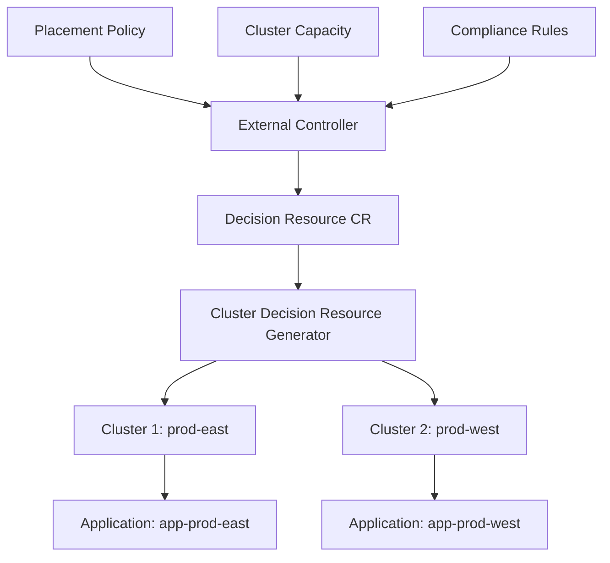

# How to Use Cluster Decision Resource Generator

Author: [nawazdhandala](https://github.com/nawazdhandala)

Tags: ArgoCD, GitOps, Kubernetes, ApplicationSets, Multi-Cluster

Description: Learn how to use the ArgoCD ApplicationSet Cluster Decision Resource generator to integrate with external cluster management tools like Open Cluster Management for dynamic cluster targeting.

---

The Cluster Decision Resource generator in ArgoCD ApplicationSets delegates cluster selection to an external custom resource. Instead of ArgoCD deciding which clusters to target, an external tool like Open Cluster Management (OCM) or a custom controller makes the decision and writes it to a Kubernetes resource. The ApplicationSet reads that resource and creates Applications for the selected clusters.

This approach is useful when cluster placement decisions depend on factors outside ArgoCD's knowledge - things like cluster capacity, compliance requirements, geographic constraints, or organizational policies.

## How the Cluster Decision Resource Works

An external controller creates or updates a custom resource that lists which clusters should receive specific workloads. The ApplicationSet Cluster Decision Resource generator watches that resource and creates Applications for each cluster listed in it.



## Understanding the Decision Resource

A Cluster Decision Resource is any Kubernetes custom resource that contains a list of cluster decisions in its status. The resource must have a status field with a list of objects, each containing at least a `clusterName` field.

Here is an example custom resource.

```yaml
apiVersion: cluster.open-cluster-management.io/v1beta1
kind: PlacementDecision
metadata:
  name: my-placement-decision
  namespace: argocd
  labels:
    cluster.open-cluster-management.io/placement: my-placement
status:
  decisions:
  - clusterName: prod-east
    reason: "Capacity available"
  - clusterName: prod-west
    reason: "Geographic requirement"
```

## Configuring the Generator

The generator needs to know the API group, kind, and which field contains the cluster decisions.

```yaml
apiVersion: argoproj.io/v1alpha1
kind: ApplicationSet
metadata:
  name: dynamic-placement
  namespace: argocd
spec:
  generators:
  - clusterDecisionResource:
      # The ConfigMap that maps decision resources to cluster parameters
      configMapRef: my-cluster-decision-config
      # Label selector to find the decision resources
      labelSelector:
        matchLabels:
          cluster.open-cluster-management.io/placement: my-placement
      # Name of the resource (optional, use labelSelector instead for flexibility)
      # name: my-placement-decision
  template:
    metadata:
      name: 'app-{{name}}'
    spec:
      project: default
      source:
        repoURL: https://github.com/myorg/app
        targetRevision: main
        path: deploy/
      destination:
        server: '{{server}}'
        namespace: my-app
      syncPolicy:
        automated:
          prune: true
          selfHeal: true
```

## Setting Up the ConfigMap

The generator requires a ConfigMap that specifies the API resource details for the decision resource.

```yaml
apiVersion: v1
kind: ConfigMap
metadata:
  name: my-cluster-decision-config
  namespace: argocd
data:
  # API group of the decision resource
  apiVersion: cluster.open-cluster-management.io/v1beta1
  # Kind of the decision resource
  kind: PlacementDecision
  # JSON path to the status field containing decisions
  statusListKey: decisions
  # JSON path within each decision to the cluster name
  matchKey: clusterName
```

## Integration with Open Cluster Management

Open Cluster Management (OCM) is the most common tool used with the Cluster Decision Resource generator. OCM uses Placement and PlacementDecision resources to manage cluster selection.

First, install OCM or create compatible resources.

```yaml
# Placement resource defines the selection criteria
apiVersion: cluster.open-cluster-management.io/v1beta1
kind: Placement
metadata:
  name: production-placement
  namespace: argocd
spec:
  predicates:
  - requiredClusterSelector:
      labelSelector:
        matchLabels:
          environment: production
      claimSelector:
        matchExpressions:
        - key: platform.open-cluster-management.io
          operator: In
          values:
          - AWS
          - GCP
  numberOfClusters: 3  # Select up to 3 clusters
```

OCM's placement controller evaluates this and creates PlacementDecision resources.

```yaml
# PlacementDecision (created by OCM controller)
apiVersion: cluster.open-cluster-management.io/v1beta1
kind: PlacementDecision
metadata:
  name: production-placement-decision-1
  namespace: argocd
  labels:
    cluster.open-cluster-management.io/placement: production-placement
status:
  decisions:
  - clusterName: prod-aws-east
    reason: "Selected"
  - clusterName: prod-gcp-west
    reason: "Selected"
  - clusterName: prod-aws-west
    reason: "Selected"
```

The ApplicationSet picks up these decisions and creates Applications.

```yaml
apiVersion: argoproj.io/v1alpha1
kind: ApplicationSet
metadata:
  name: production-apps
  namespace: argocd
spec:
  generators:
  - clusterDecisionResource:
      configMapRef: ocm-cluster-decision-config
      labelSelector:
        matchLabels:
          cluster.open-cluster-management.io/placement: production-placement
  template:
    metadata:
      name: 'my-app-{{name}}'
    spec:
      project: default
      source:
        repoURL: https://github.com/myorg/my-app
        targetRevision: main
        path: deploy/
      destination:
        server: '{{server}}'
        namespace: my-app
```

## Creating a Custom Decision Controller

You do not need OCM to use the Cluster Decision Resource generator. You can create your own controller that populates decision resources based on your own logic.

Here is a simple example using a CronJob that evaluates cluster health and updates decisions.

```yaml
apiVersion: batch/v1
kind: CronJob
metadata:
  name: cluster-decision-updater
  namespace: argocd
spec:
  schedule: "*/5 * * * *"
  jobTemplate:
    spec:
      template:
        spec:
          serviceAccountName: decision-updater
          containers:
          - name: updater
            image: bitnami/kubectl:latest
            command:
            - /bin/sh
            - -c
            - |
              # Get healthy clusters from ArgoCD
              HEALTHY_CLUSTERS=$(kubectl get secrets -n argocd \
                -l argocd.argoproj.io/secret-type=cluster \
                -o jsonpath='{range .items[*]}{.metadata.labels.environment}{" "}{.data.name}{"\n"}{end}' \
                | grep production | awk '{print $2}' | base64 -d)

              # Update the decision resource
              cat <<YAML | kubectl apply -f -
              apiVersion: custom.example.com/v1
              kind: ClusterDecision
              metadata:
                name: healthy-production
                namespace: argocd
                labels:
                  decision-type: healthy-production
              status:
                decisions:
              $(echo "$HEALTHY_CLUSTERS" | while read cluster; do
                echo "    - clusterName: $cluster"
              done)
              YAML
          restartPolicy: Never
```

## Dynamic Cluster Failover

One powerful pattern is using the Cluster Decision Resource generator for automatic failover. When a cluster becomes unhealthy, the decision controller removes it from the decision list, and ArgoCD moves the workload.

```yaml
# Decision resource that responds to cluster health
apiVersion: custom.example.com/v1
kind: ClusterDecision
metadata:
  name: active-clusters
  namespace: argocd
  labels:
    decision-type: active-production
status:
  decisions:
  # Only healthy clusters are listed
  - clusterName: prod-east  # healthy
  - clusterName: prod-west  # healthy
  # prod-central removed because it's unhealthy
```

When the controller detects prod-central is unhealthy, it removes it from the decision list. ArgoCD then deletes the Application targeting prod-central (or preserves resources depending on the policy).

## Debugging the Generator

When the Cluster Decision Resource generator does not produce expected results.

```bash
# Check that the decision resource exists and has decisions
kubectl get placementdecision -n argocd -o yaml

# Verify the ConfigMap is correct
kubectl get configmap my-cluster-decision-config -n argocd -o yaml

# Check controller logs
kubectl logs -n argocd deployment/argocd-applicationset-controller \
  | grep -i "cluster.decision\|clusterDecision"

# Verify cluster secrets exist for the decided clusters
kubectl get secrets -n argocd -l argocd.argoproj.io/secret-type=cluster
```

The Cluster Decision Resource generator is the bridge between ArgoCD and external cluster management systems. It decouples the "where to deploy" decision from ArgoCD, letting specialized tools handle cluster placement based on policies, capacity, compliance, and health - while ArgoCD handles the actual deployment.
