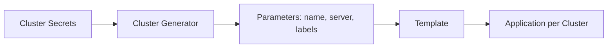

# How to Use Cluster Generator in ApplicationSets

Author: [nawazdhandala](https://github.com/nawazdhandala)

Tags: ArgoCD, GitOps, Kubernetes, ApplicationSets, Multi-Cluster

Description: Learn how to use the ArgoCD ApplicationSet Cluster generator to automatically deploy applications across multiple Kubernetes clusters based on cluster registration and label selectors.

---

When you manage multiple Kubernetes clusters with ArgoCD, deploying the same application or platform service to every cluster becomes tedious. The Cluster generator solves this by automatically creating Applications for every cluster registered in ArgoCD, or a subset of clusters matching specific labels.

This guide covers the Cluster generator from basic usage through advanced patterns like label-based filtering, cluster metadata templating, and combining clusters with other generators.

## How the Cluster Generator Works

ArgoCD stores cluster connection information as Kubernetes secrets in the argocd namespace. Each secret represents a registered cluster. The Cluster generator reads these secrets and produces one parameter set per cluster.

Every parameter set includes:

- `name` - the cluster name as registered in ArgoCD
- `server` - the cluster API server URL
- `metadata.labels.<key>` - any labels on the cluster secret
- `metadata.annotations.<key>` - any annotations on the cluster secret



## Registering Clusters with ArgoCD

Before using the Cluster generator, you need clusters registered in ArgoCD. The built-in cluster (where ArgoCD runs) is always available.

```bash
# Add a cluster to ArgoCD
argocd cluster add my-staging-cluster --name staging

# Add with labels for filtering
argocd cluster add my-prod-east --name prod-east \
  --label environment=production \
  --label region=us-east-1

argocd cluster add my-prod-west --name prod-west \
  --label environment=production \
  --label region=us-west-2

# List registered clusters
argocd cluster list
# SERVER                           NAME        VERSION  STATUS
# https://kubernetes.default.svc   in-cluster  1.28     Successful
# https://staging.example.com      staging     1.28     Successful
# https://prod-east.example.com    prod-east   1.28     Successful
# https://prod-west.example.com    prod-west   1.28     Successful
```

You can also label clusters directly on the secret.

```bash
# Add labels to an existing cluster secret
kubectl label secret -n argocd -l argocd.argoproj.io/secret-type=cluster \
  environment=production --overwrite
```

## Basic Cluster Generator

Deploy an application to every registered cluster.

```yaml
apiVersion: argoproj.io/v1alpha1
kind: ApplicationSet
metadata:
  name: platform-monitoring
  namespace: argocd
spec:
  generators:
  # No selector means all clusters
  - clusters: {}
  template:
    metadata:
      name: 'monitoring-{{name}}'
    spec:
      project: platform
      source:
        repoURL: https://github.com/myorg/platform
        targetRevision: main
        path: monitoring/base
      destination:
        server: '{{server}}'
        namespace: monitoring
      syncPolicy:
        automated:
          prune: true
          selfHeal: true
        syncOptions:
        - CreateNamespace=true
```

This creates one monitoring Application for every cluster ArgoCD knows about. When you add a new cluster, the Application is created automatically.

## Filtering Clusters with Label Selectors

Most of the time, you want to target a subset of clusters. Use `matchLabels` or `matchExpressions` to filter.

```yaml
apiVersion: argoproj.io/v1alpha1
kind: ApplicationSet
metadata:
  name: production-ingress
  namespace: argocd
spec:
  generators:
  - clusters:
      selector:
        matchLabels:
          environment: production
  template:
    metadata:
      name: 'ingress-{{name}}'
    spec:
      project: platform
      source:
        repoURL: https://github.com/myorg/platform
        targetRevision: main
        path: ingress/production
      destination:
        server: '{{server}}'
        namespace: ingress-nginx
```

For more complex filtering, use matchExpressions.

```yaml
generators:
- clusters:
    selector:
      matchExpressions:
      - key: environment
        operator: In
        values:
        - staging
        - production
      - key: region
        operator: NotIn
        values:
        - eu-west-1  # Exclude EU clusters
```

## Using Cluster Labels in Templates

Cluster labels are available as template parameters under the `metadata.labels` prefix. This lets you customize deployments based on cluster properties.

```yaml
apiVersion: argoproj.io/v1alpha1
kind: ApplicationSet
metadata:
  name: app-per-region
  namespace: argocd
spec:
  generators:
  - clusters:
      selector:
        matchLabels:
          environment: production
      # Specify which values to use from cluster labels
      values:
        region: '{{metadata.labels.region}}'
        tier: '{{metadata.labels.tier}}'
  template:
    metadata:
      name: 'app-{{name}}'
      labels:
        region: '{{values.region}}'
    spec:
      project: default
      source:
        repoURL: https://github.com/myorg/app
        targetRevision: main
        path: 'deploy/regions/{{values.region}}'
      destination:
        server: '{{server}}'
        namespace: my-app
```

The `values` field lets you define additional parameters derived from cluster metadata. These parameters are accessible in the template under the `values` prefix.

## Handling the Local Cluster

The in-cluster (where ArgoCD runs) has the special name `in-cluster` and server URL `https://kubernetes.default.svc`. You may want to include or exclude it from your generators.

```yaml
# Exclude the local cluster
generators:
- clusters:
    selector:
      matchExpressions:
      - key: argocd.argoproj.io/secret-type
        operator: Exists
    # The in-cluster doesn't have a secret, so it's excluded

# Or explicitly target only remote clusters
- clusters:
    selector:
      matchLabels:
        cluster-type: remote
```

To include the local cluster, make sure it has the labels you are selecting on, or use an empty selector.

## Combining Cluster Generator with Matrix

The Matrix generator lets you combine the Cluster generator with other generators to create powerful cross-product deployments.

```yaml
apiVersion: argoproj.io/v1alpha1
kind: ApplicationSet
metadata:
  name: platform-stack
  namespace: argocd
spec:
  generators:
  - matrix:
      generators:
      # First axis: platform components
      - list:
          elements:
          - component: cert-manager
            path: platform/cert-manager
            namespace: cert-manager
          - component: external-dns
            path: platform/external-dns
            namespace: external-dns
          - component: prometheus
            path: platform/prometheus
            namespace: monitoring
      # Second axis: target clusters
      - clusters:
          selector:
            matchLabels:
              environment: production
  template:
    metadata:
      name: '{{component}}-{{name}}'
    spec:
      project: platform
      source:
        repoURL: https://github.com/myorg/platform
        targetRevision: main
        path: '{{path}}'
      destination:
        server: '{{server}}'
        namespace: '{{namespace}}'
```

With 3 components and 4 production clusters, this generates 12 Applications. Each cluster gets every platform component.

## Monitoring Cluster Generator Behavior

Track what the Cluster generator discovers and produces.

```bash
# List all cluster secrets
kubectl get secrets -n argocd \
  -l argocd.argoproj.io/secret-type=cluster \
  -o custom-columns=NAME:.metadata.name,CLUSTER:.metadata.labels

# Check ApplicationSet status
kubectl describe applicationset platform-monitoring -n argocd

# View generated Applications with their target clusters
kubectl get applications -n argocd \
  -o custom-columns=NAME:.metadata.name,DEST:.spec.destination.server,STATUS:.status.sync.status
```

The Cluster generator is the backbone of multi-cluster GitOps with ArgoCD. It automatically responds to new clusters being registered, making it the right choice for organizations that frequently add and remove clusters. Combined with proper labeling conventions, it provides fine-grained control over which applications land on which clusters.
