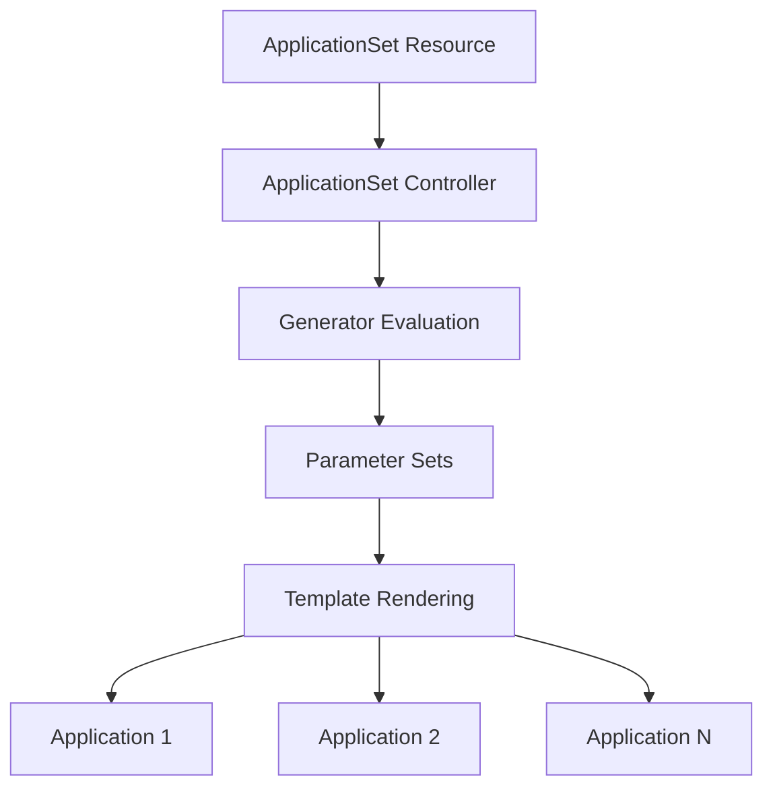

# How to Understand ApplicationSet Controllers and Generators in ArgoCD

Author: [nawazdhandala](https://github.com/nawazdhandala)

Tags: ArgoCD, GitOps, Kubernetes, ApplicationSets, DevOps

Description: Learn how ArgoCD ApplicationSet controllers and generators work together to dynamically create and manage multiple applications from a single template definition.

---

ApplicationSets are the scaling mechanism for ArgoCD. Instead of creating individual Application resources one by one, you define a single ApplicationSet with a template and one or more generators. The generators produce parameter sets, and the controller creates one Application for each parameter set. Understanding how the controller and generators interact is essential for managing applications at scale.

## The ApplicationSet Architecture

The ApplicationSet system has three key components:

1. **ApplicationSet Controller** - a Kubernetes controller that watches ApplicationSet resources and reconciles them
2. **Generators** - plugins that produce lists of parameter key-value pairs
3. **Templates** - Application templates with placeholders that get filled by generator parameters

Here is how they fit together:



## The ApplicationSet Controller

The ApplicationSet controller runs as part of the ArgoCD installation (bundled since ArgoCD v2.3). It watches for ApplicationSet custom resources and performs the following cycle:

1. Reads the ApplicationSet spec
2. Evaluates all generators to produce parameter sets
3. Renders the template once per parameter set
4. Creates, updates, or deletes Application resources to match the desired state

### Verifying the Controller is Running

```bash
# Check if the ApplicationSet controller is running
kubectl get pods -n argocd -l app.kubernetes.io/component=applicationset-controller

# Check controller logs
kubectl logs -n argocd -l app.kubernetes.io/component=applicationset-controller --tail=50
```

### Controller Reconciliation

The controller reconciles ApplicationSets periodically and also when:
- The ApplicationSet resource changes
- A webhook triggers a refresh
- The controller detects changes in generator sources (like Git repos or cluster list)

You can configure the reconciliation interval:

```bash
# Set ApplicationSet controller reconciliation period
kubectl patch deployment argocd-applicationset-controller -n argocd --type json -p '[
  {"op": "add", "path": "/spec/template/spec/containers/0/args/-", "value": "--policy=sync"}
]'
```

## Generator Types Overview

ArgoCD provides several built-in generators, each designed for different use cases:

### List Generator

The simplest generator. You provide a static list of parameter sets:

```yaml
apiVersion: argoproj.io/v1alpha1
kind: ApplicationSet
metadata:
  name: my-apps
  namespace: argocd
spec:
  generators:
    - list:
        elements:
          - cluster: production
            url: https://prod-cluster.example.com
          - cluster: staging
            url: https://staging-cluster.example.com
  template:
    metadata:
      name: 'myapp-{{cluster}}'
    spec:
      project: default
      source:
        repoURL: https://github.com/company/manifests.git
        targetRevision: main
        path: 'envs/{{cluster}}'
      destination:
        server: '{{url}}'
        namespace: myapp
```

This creates two Applications: `myapp-production` and `myapp-staging`.

### Cluster Generator

Automatically discovers clusters registered in ArgoCD:

```yaml
spec:
  generators:
    - clusters:
        selector:
          matchLabels:
            environment: production
```

This creates one Application for every cluster with the `environment: production` label.

### Git Directory Generator

Discovers directories in a Git repository:

```yaml
spec:
  generators:
    - git:
        repoURL: https://github.com/company/manifests.git
        revision: main
        directories:
          - path: 'services/*'
```

This creates one Application for every subdirectory under `services/`.

### Git File Generator

Reads configuration from files in a Git repository:

```yaml
spec:
  generators:
    - git:
        repoURL: https://github.com/company/config.git
        revision: main
        files:
          - path: 'apps/*/config.json'
```

Each matching JSON file provides parameter values for one Application.

### Matrix Generator

Combines two generators by computing the cartesian product of their outputs:

```yaml
spec:
  generators:
    - matrix:
        generators:
          - clusters:
              selector:
                matchLabels:
                  environment: production
          - git:
              repoURL: https://github.com/company/manifests.git
              revision: main
              directories:
                - path: 'services/*'
```

If you have 3 production clusters and 5 services, this creates 15 Applications (3 x 5).

### Merge Generator

Combines generators and merges their parameters based on a key field:

```yaml
spec:
  generators:
    - merge:
        mergeKeys:
          - name
        generators:
          - list:
              elements:
                - name: api
                  replicas: "3"
                - name: web
                  replicas: "2"
          - git:
              repoURL: https://github.com/company/manifests.git
              revision: main
              directories:
                - path: 'services/*'
```

### SCM Provider Generator

Discovers repositories in a source code management platform (GitHub, GitLab, Bitbucket, Azure DevOps):

```yaml
spec:
  generators:
    - scmProvider:
        github:
          organization: my-org
          allBranches: true
```

### Pull Request Generator

Creates Applications for open pull requests:

```yaml
spec:
  generators:
    - pullRequest:
        github:
          owner: my-org
          repo: my-app
```

### Cluster Decision Resource Generator

Uses an external custom resource to determine which clusters to target:

```yaml
spec:
  generators:
    - clusterDecisionResource:
        configMapRef: my-decision-resource
        name: decision-resource
```

### Plugin Generator

Calls an external service to generate parameters:

```yaml
spec:
  generators:
    - plugin:
        configMapRef:
          name: my-plugin-cm
```

## How Generators Produce Parameters

Every generator outputs a list of parameter maps. Think of it as a list of rows where each row is a dictionary of key-value pairs:

```
Generator Output:
[
  {cluster: "prod", region: "us-east-1", url: "https://prod.example.com"},
  {cluster: "staging", region: "eu-west-1", url: "https://staging.example.com"}
]
```

The template then uses `{{cluster}}`, `{{region}}`, and `{{url}}` as placeholders.

## Template Rendering

The template is a standard ArgoCD Application spec with placeholder values:

```yaml
  template:
    metadata:
      name: 'app-{{cluster}}-{{region}}'
      labels:
        environment: '{{cluster}}'
    spec:
      project: default
      source:
        repoURL: https://github.com/company/manifests.git
        targetRevision: main
        path: 'envs/{{cluster}}/{{region}}'
      destination:
        server: '{{url}}'
        namespace: my-app
```

For each parameter set from the generator, the controller substitutes the placeholders and creates an Application.

### Go Template Support

ApplicationSets also support Go templates for more complex rendering:

```yaml
  goTemplate: true
  template:
    metadata:
      name: 'app-{{ .cluster | lower }}'
    spec:
      source:
        path: '{{ if eq .cluster "production" }}prod{{ else }}{{ .cluster }}{{ end }}'
```

Enable Go templates with `goTemplate: true` in the ApplicationSet spec.

## Controller Policies

The ApplicationSet controller supports different policies that control what happens to generated Applications:

### Sync Policy

```yaml
spec:
  syncPolicy:
    # What to do when an ApplicationSet is deleted
    preserveResourcesOnDeletion: false
```

### Application Ownership

The controller adds an `ownerReference` to each generated Application pointing back to the ApplicationSet. This means:

- Deleting the ApplicationSet deletes all generated Applications
- You cannot manually modify a generated Application's spec (the controller will revert it)

### Preventing Accidental Deletion

```yaml
spec:
  syncPolicy:
    preserveResourcesOnDeletion: true
```

With this setting, deleting the ApplicationSet leaves the generated Applications intact.

## The Reconciliation Loop in Detail

The controller's reconciliation cycle follows these steps:

1. **Read** - fetch the ApplicationSet spec from the Kubernetes API
2. **Generate** - evaluate all generators to produce parameter sets
3. **Render** - apply each parameter set to the template
4. **Diff** - compare rendered Applications with existing ones
5. **Apply** - create, update, or delete Applications to match desired state

When a generator fails (for example, a Git repository is unreachable), the controller preserves existing Applications by default. It does not delete Applications just because it temporarily cannot reach the data source. This safety mechanism prevents accidental mass deletion during network outages.

## Debugging Generator Output

To see what parameters a generator produces:

```bash
# Check ApplicationSet status
kubectl get applicationset my-appset -n argocd -o json | jq '.status'

# List all applications generated by an ApplicationSet
kubectl get applications -n argocd -l 'app.kubernetes.io/managed-by=applicationset-controller' \
  -o custom-columns='NAME:.metadata.name,SYNC:.status.sync.status,HEALTH:.status.health.status'

# Check controller logs for generation details
kubectl logs -n argocd -l app.kubernetes.io/component=applicationset-controller | \
  grep "my-appset"
```

## Combining Multiple Generators

An ApplicationSet can have multiple generators at the top level. The generated parameter sets from all generators are concatenated:

```yaml
spec:
  generators:
    # Generator 1: internal services
    - list:
        elements:
          - name: api
            path: services/api
    # Generator 2: external services
    - list:
        elements:
          - name: gateway
            path: services/gateway
```

This produces Applications from both generators combined.

## Best Practices

**Start with the List generator**: It is the simplest and makes the parameter model easy to understand before moving to more dynamic generators.

**Use labels on generated Applications**: Add labels through the template so you can easily query and manage generated Applications.

**Test with dry-run**: Before deploying an ApplicationSet that generates 100 Applications, test the generator output with a small parameter set first.

**Monitor the controller**: The ApplicationSet controller is a single point of failure for all generated Applications. Monitor its health and resource usage.

**Understand ownership**: Generated Applications are owned by the ApplicationSet. Manual changes to these Applications will be reverted by the controller on the next reconciliation.

The ApplicationSet controller and generators are the foundation for managing ArgoCD at scale. For specific generator deep-dives, see the [Git directory generator](https://oneuptime.com/blog/post/2026-02-26-argocd-git-directory-generator/view) and [Git file generator](https://oneuptime.com/blog/post/2026-02-26-argocd-git-file-generator/view) guides.
