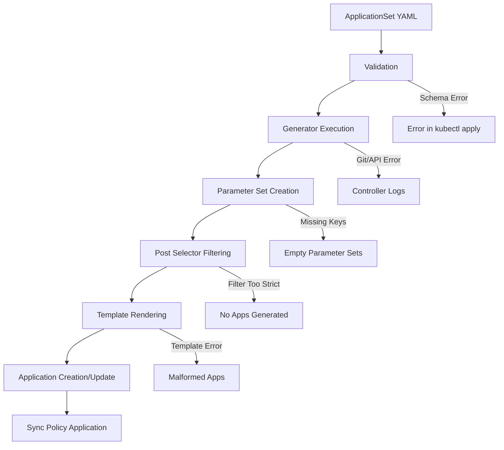

# How to Debug ApplicationSet Generation Issues in ArgoCD

Author: [nawazdhandala](https://github.com/nawazdhandala)

Tags: ArgoCD, GitOps, Kubernetes, ApplicationSet, Troubleshooting

Description: Learn how to diagnose and fix common ApplicationSet generation issues in ArgoCD including template errors, generator failures, and unexpected application output.

---

ApplicationSets can fail silently. A misconfigured generator might produce zero applications without any obvious error. A template typo might create applications with wrong names. A merge key mismatch might cause overrides to be ignored. Debugging these issues requires knowing where to look and what tools to use.

This guide covers systematic debugging approaches for every stage of ApplicationSet generation.

## The ApplicationSet Generation Pipeline

Understanding where things can go wrong requires knowing the pipeline.



## Step 1: Check ApplicationSet Status

The first thing to check is the ApplicationSet resource status.

```bash
# Get the ApplicationSet status
kubectl get applicationset my-appset -n argocd -o yaml

# Check the status conditions
kubectl get applicationset my-appset -n argocd -o json | \
  jq '.status'

# Look at the resources section
kubectl get applicationset my-appset -n argocd -o json | \
  jq '.status.resources'
```

The status section shows:
- How many applications were generated
- Which applications are managed by this ApplicationSet
- Any error conditions

## Step 2: Check Controller Logs

The ApplicationSet controller logs contain detailed information about generation and errors.

```bash
# Get recent controller logs
kubectl logs -n argocd \
  -l app.kubernetes.io/name=argocd-applicationset-controller \
  --tail=200

# Filter for errors
kubectl logs -n argocd \
  -l app.kubernetes.io/name=argocd-applicationset-controller \
  --tail=500 | grep -i "error\|warn\|fail"

# Filter for a specific ApplicationSet
kubectl logs -n argocd \
  -l app.kubernetes.io/name=argocd-applicationset-controller \
  --tail=500 | grep "my-appset"

# Follow logs in real-time
kubectl logs -n argocd \
  -l app.kubernetes.io/name=argocd-applicationset-controller \
  -f
```

## Step 3: Check Events

Kubernetes events often contain useful information about failures.

```bash
# Events for the ApplicationSet
kubectl get events -n argocd \
  --field-selector involvedObject.name=my-appset \
  --sort-by='.lastTimestamp'

# All recent events in argocd namespace
kubectl get events -n argocd \
  --sort-by='.lastTimestamp' \
  --field-selector type=Warning
```

## Common Issue: No Applications Generated

If an ApplicationSet creates zero applications, check these causes.

### Git Generator Cannot Access Repository

```bash
# Check if ArgoCD can reach the repo
argocd repo list

# Test repo connection
argocd repo get https://github.com/myorg/configs.git

# Check for SSH key or credential issues in logs
kubectl logs -n argocd \
  -l app.kubernetes.io/name=argocd-applicationset-controller \
  --tail=200 | grep -i "auth\|credential\|ssh\|permission"
```

### Post Selector Filters Everything Out

```yaml
# This might filter out everything if no element has env=production
generators:
  - list:
      elements:
        - name: app-a
          environment: prod  # Note: "prod" not "production"
      selector:
        matchLabels:
          environment: production  # Looking for "production"
```

Fix: Verify that selector key names and values exactly match the generator parameters.

### Git Directory Generator Finds No Directories

```bash
# Verify the path pattern matches actual directories
# Clone the repo and check locally
git clone https://github.com/myorg/configs.git /tmp/test-configs
ls /tmp/test-configs/apps/*/

# Check if the revision exists
git ls-remote https://github.com/myorg/configs.git HEAD
```

### Cluster Generator Finds No Clusters

```bash
# List registered clusters
argocd cluster list

# Check cluster labels match the selector
argocd cluster list -o wide

# Verify cluster secrets exist
kubectl get secrets -n argocd -l argocd.argoproj.io/secret-type=cluster
```

## Common Issue: Wrong Application Names

Template rendering issues often show up as unexpected application names.

```bash
# List generated applications
argocd app list -l app.kubernetes.io/managed-by=applicationset-controller

# Compare expected vs actual names
kubectl get applicationset my-appset -n argocd -o json | \
  jq '.status.resources[].name'
```

### Go Template Not Enabled

```yaml
# BUG: Using Go template syntax without enabling Go templates
spec:
  # Missing: goTemplate: true
  generators:
    - list:
        elements:
          - name: myapp
  template:
    metadata:
      name: '{{.name}}'  # This renders literally as "{{.name}}"
```

Fix: Add `goTemplate: true` to the spec, or use `{{name}}` without the dot prefix.

### Parameter Name Mismatch

```yaml
# BUG: Generator provides "app_name" but template uses "name"
generators:
  - git:
      files:
        - path: 'apps/*.json'
        # JSON files contain: {"app_name": "myapp", ...}
template:
  metadata:
    name: '{{name}}'  # Should be {{app_name}}
```

Fix: Check that template parameter references exactly match generator output parameter names.

## Common Issue: Template Rendering Errors

### Missing Required Parameters

```yaml
# With Go templates, use missingkey=error to catch these
spec:
  goTemplate: true
  goTemplateOptions: ["missingkey=error"]
```

Without this option, missing keys silently render as empty strings, creating applications with missing fields.

### YAML Formatting Issues from Templates

```yaml
# BUG: Template produces invalid YAML
template:
  metadata:
    name: '{{name}}'
    labels:
      # If name contains special characters, this breaks YAML
      app: {{name}}  # Missing quotes!
```

Fix: Always quote template values in YAML.

## Common Issue: Merge Generator Produces Unexpected Results

```bash
# Debug merge by checking parameter values from each generator
# Step 1: Apply just the primary generator in a test ApplicationSet
# Step 2: Check what parameters it produces
# Step 3: Verify merge key values match between generators
```

Common merge issues:
- Merge key values do not match (case sensitivity, trailing spaces)
- Override generator parameters have different key names
- Merge key references a nested path that is not flat

## Common Issue: Applications Created Then Immediately Deleted

This happens when the generator output changes between reconciliation cycles.

```bash
# Check if the ApplicationSet is rapidly creating and deleting
kubectl get events -n argocd \
  --field-selector involvedObject.name=my-appset \
  --sort-by='.lastTimestamp' | head -20

# Common cause: Git revision flapping
# Check if targetRevision resolves to a stable commit
```

## Debugging Tool: Describe ApplicationSet

The `kubectl describe` command shows the most useful debugging information.

```bash
kubectl describe applicationset my-appset -n argocd
```

Look for:
- **Conditions** section for generation errors
- **Events** section for controller actions
- **Status** section for the list of managed resources

## Debugging Tool: Increase Controller Log Level

For deep debugging, temporarily increase the controller's log verbosity.

```bash
# Edit the controller deployment
kubectl edit deployment argocd-applicationset-controller -n argocd

# Add to the container args:
# --loglevel=debug

# Or patch it
kubectl patch deployment argocd-applicationset-controller -n argocd \
  --type json \
  -p '[{"op":"add","path":"/spec/template/spec/containers/0/args/-","value":"--loglevel=debug"}]'

# Remember to revert after debugging
```

## Debugging Checklist

When an ApplicationSet is not working as expected, run through this checklist:

```bash
# 1. Is the ApplicationSet resource valid?
kubectl get applicationset my-appset -n argocd

# 2. What does the status say?
kubectl get applicationset my-appset -n argocd -o yaml | yq '.status'

# 3. Are there any error events?
kubectl get events -n argocd --field-selector involvedObject.name=my-appset

# 4. What do the controller logs say?
kubectl logs -n argocd -l app.kubernetes.io/name=argocd-applicationset-controller --tail=100

# 5. How many applications exist?
argocd app list | grep -c "managed-by-applicationset"

# 6. For Git generators, can ArgoCD access the repo?
argocd repo list

# 7. For cluster generators, are clusters registered?
argocd cluster list -o wide
```

Systematic debugging saves time. Start with the status, then check logs, then verify generator inputs. For proactive monitoring that catches ApplicationSet issues before they impact your deployments, [OneUptime](https://oneuptime.com/blog/post/2026-02-26-argocd-applicationset-rollout-strategy/view) provides health checks and alerting for your entire ArgoCD infrastructure.
