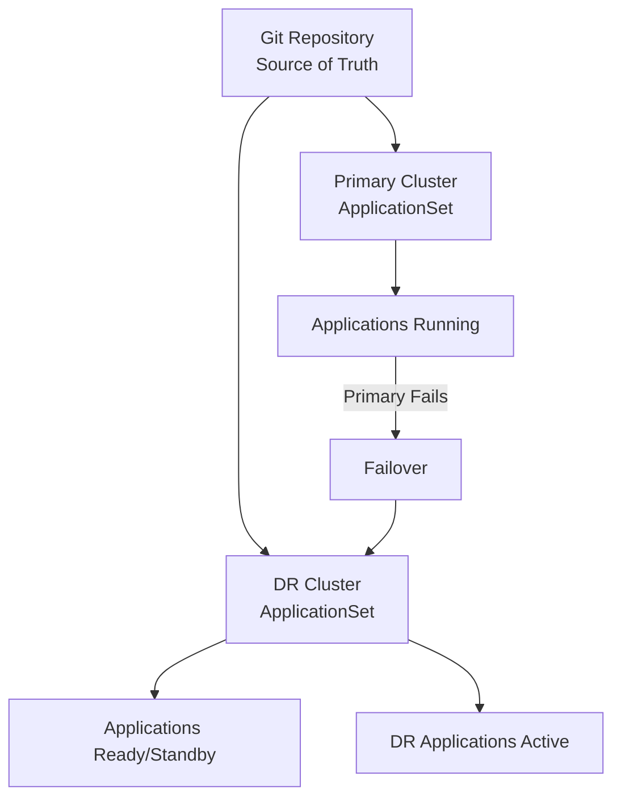

# How to Use ApplicationSets for Disaster Recovery in ArgoCD

Author: [nawazdhandala](https://github.com/nawazdhandala)

Tags: ArgoCD, GitOps, Kubernetes, ApplicationSets, Disaster Recovery

Description: Learn how to design ArgoCD ApplicationSets for disaster recovery scenarios including failover clusters, multi-region deployments, and rapid environment reconstruction.

---

Disaster recovery (DR) in Kubernetes means being able to restore your applications and services when a cluster, region, or cloud provider experiences an outage. ArgoCD ApplicationSets are uniquely suited for DR because they declaratively define your entire application fleet. When a disaster strikes, you can rebuild everything from Git by pointing ApplicationSets at a recovery cluster.

This guide covers DR patterns with ApplicationSets, from active-passive failover to full multi-region active-active deployments.

## Why ApplicationSets for Disaster Recovery

Traditional DR requires maintaining runbooks, backup scripts, and manual procedures. With ApplicationSets and GitOps, your DR plan is the code itself:

- **Everything is in Git** - Application definitions, configurations, and infrastructure are versioned
- **Automatic reconstruction** - Point an ApplicationSet at a new cluster and all apps deploy automatically
- **Tested continuously** - If your ApplicationSets work in production, they work in DR
- **No drift** - The recovery environment matches the source of truth exactly



## Pattern 1: Active-Passive DR with Cluster Labels

Maintain a standby cluster that receives applications from the same ApplicationSet but with sync disabled.

```yaml
apiVersion: argoproj.io/v1alpha1
kind: ApplicationSet
metadata:
  name: dr-capable-apps
  namespace: argocd
spec:
  goTemplate: true
  goTemplateOptions: ["missingkey=error"]
  generators:
    - clusters:
        selector:
          matchExpressions:
            - key: role
              operator: In
              values:
                - primary
                - dr-standby
  template:
    metadata:
      name: 'myapp-{{.name}}'
      labels:
        role: '{{index .metadata.labels "role"}}'
        app: myapp
    spec:
      project: default
      source:
        repoURL: https://github.com/myorg/myapp.git
        targetRevision: HEAD
        path: deploy
        helm:
          valueFiles:
            - values.yaml
            - 'values-{{index .metadata.labels "environment"}}.yaml'
      destination:
        server: '{{.server}}'
        namespace: myapp
      syncPolicy:
        {{- if eq (index .metadata.labels "role") "primary"}}
        automated:
          prune: true
          selfHeal: true
        {{- end}}
        syncOptions:
          - CreateNamespace=true
```

For the DR cluster, sync is manual (no `automated` block). During normal operation, the DR cluster has the Application resources but they are not syncing. During failover, you enable auto-sync.

### Failover Procedure

```bash
# Step 1: Label the DR cluster as primary
argocd cluster set dr-cluster \
  --label role=primary

# Step 2: Label the failed primary cluster as failed
argocd cluster set primary-cluster \
  --label role=failed

# Step 3: The ApplicationSet controller detects the label changes
# and updates sync policies automatically

# Step 4: Manually sync the DR applications if needed
argocd app sync myapp-dr-cluster

# Step 5: Update DNS/load balancer to point to DR cluster
```

## Pattern 2: Multi-Region Active-Active

Deploy applications to multiple regions simultaneously. If one region fails, the others continue serving traffic.

```yaml
apiVersion: argoproj.io/v1alpha1
kind: ApplicationSet
metadata:
  name: multi-region-apps
  namespace: argocd
spec:
  goTemplate: true
  goTemplateOptions: ["missingkey=error"]
  strategy:
    type: RollingSync
    rollingSync:
      steps:
        - matchExpressions:
            - key: region
              operator: In
              values: [us-east-1]
        - matchExpressions:
            - key: region
              operator: In
              values: [eu-west-1]
        - matchExpressions:
            - key: region
              operator: In
              values: [ap-southeast-1]
  generators:
    - clusters:
        selector:
          matchLabels:
            tier: production
  template:
    metadata:
      name: 'webapp-{{.name}}'
      labels:
        app: webapp
        region: '{{index .metadata.labels "region"}}'
    spec:
      project: production
      source:
        repoURL: https://github.com/myorg/webapp.git
        targetRevision: HEAD
        path: deploy
        helm:
          valueFiles:
            - values.yaml
            - 'values-{{index .metadata.labels "region"}}.yaml'
          parameters:
            - name: global.region
              value: '{{index .metadata.labels "region"}}'
      destination:
        server: '{{.server}}'
        namespace: webapp
      syncPolicy:
        automated:
          prune: true
          selfHeal: true
        syncOptions:
          - CreateNamespace=true
```

In active-active mode, all regions serve traffic simultaneously. If one region fails, DNS or a global load balancer routes traffic to the surviving regions.

## Pattern 3: Cold Standby with Rapid Reconstruction

Keep an ApplicationSet ready to deploy to a cold standby cluster. The cluster exists but has no applications deployed until needed.

```yaml
# Primary ApplicationSet - always active
apiVersion: argoproj.io/v1alpha1
kind: ApplicationSet
metadata:
  name: production-apps
  namespace: argocd
spec:
  generators:
    - clusters:
        selector:
          matchLabels:
            role: primary
  template:
    metadata:
      name: '{{name}}-apps'
    spec:
      project: production
      source:
        repoURL: https://github.com/myorg/platform.git
        targetRevision: HEAD
        path: deploy
      destination:
        server: '{{server}}'
        namespace: production
      syncPolicy:
        automated:
          prune: true
          selfHeal: true
---
# DR ApplicationSet - activated during disaster
apiVersion: argoproj.io/v1alpha1
kind: ApplicationSet
metadata:
  name: dr-apps
  namespace: argocd
  annotations:
    dr-status: standby
spec:
  generators:
    - clusters:
        selector:
          matchLabels:
            # No cluster has this label during normal operation
            role: dr-active
  template:
    metadata:
      name: 'dr-{{name}}-apps'
    spec:
      project: production
      source:
        repoURL: https://github.com/myorg/platform.git
        targetRevision: HEAD
        path: deploy
      destination:
        server: '{{server}}'
        namespace: production
      syncPolicy:
        automated:
          prune: true
          selfHeal: true
        syncOptions:
          - CreateNamespace=true
```

### Activation Procedure

```bash
#!/bin/bash
# activate-dr.sh - Disaster Recovery Activation Script

echo "=== Activating Disaster Recovery ==="

# Step 1: Label the DR cluster as active
argocd cluster set dr-us-west-2 --label role=dr-active
echo "DR cluster labeled as active"

# Step 2: The ApplicationSet controller generates applications
# Wait for reconciliation
sleep 30

# Step 3: Check application status
echo "Application status:"
argocd app list -l app.kubernetes.io/managed-by=applicationset-controller

# Step 4: Wait for all apps to sync
echo "Waiting for applications to sync..."
for app in $(argocd app list -l managed-by=dr-apps -o name); do
  argocd app wait "$app" --sync --health --timeout 300
  echo "  $app: ready"
done

# Step 5: Update external DNS/load balancer
echo "All applications healthy. Update DNS to point to DR cluster."
```

## Pattern 4: Cross-Cloud DR

Deploy the same applications across multiple cloud providers for cloud-level DR.

```yaml
apiVersion: argoproj.io/v1alpha1
kind: ApplicationSet
metadata:
  name: cross-cloud-apps
  namespace: argocd
spec:
  goTemplate: true
  goTemplateOptions: ["missingkey=error"]
  generators:
    - clusters:
        selector:
          matchLabels:
            dr-group: primary-workload
  template:
    metadata:
      name: 'app-{{.name}}'
      labels:
        cloud: '{{index .metadata.labels "cloud"}}'
        region: '{{index .metadata.labels "region"}}'
    spec:
      project: production
      source:
        repoURL: https://github.com/myorg/platform.git
        targetRevision: HEAD
        path: deploy
        helm:
          valueFiles:
            - values.yaml
            # Cloud-specific values
            - 'values-{{index .metadata.labels "cloud"}}.yaml'
          parameters:
            - name: cloud.provider
              value: '{{index .metadata.labels "cloud"}}'
            - name: cloud.region
              value: '{{index .metadata.labels "region"}}'
            # Cloud-specific storage class
            - name: persistence.storageClass
              value: '{{if eq (index .metadata.labels "cloud") "aws"}}gp3{{else if eq (index .metadata.labels "cloud") "gcp"}}standard-rwo{{else}}managed-premium{{end}}'
      destination:
        server: '{{.server}}'
        namespace: production
      syncPolicy:
        automated:
          selfHeal: true
        syncOptions:
          - CreateNamespace=true
```

Cluster labels for cross-cloud DR:

```bash
# AWS primary
argocd cluster set eks-us-east-1 \
  --label cloud=aws \
  --label region=us-east-1 \
  --label dr-group=primary-workload

# GCP DR
argocd cluster set gke-us-central1 \
  --label cloud=gcp \
  --label region=us-central1 \
  --label dr-group=primary-workload

# Azure DR
argocd cluster set aks-eastus \
  --label cloud=azure \
  --label region=eastus \
  --label dr-group=primary-workload
```

## Backing Up ApplicationSet Configurations

Always maintain backups of your ApplicationSet definitions.

```bash
# Export all ApplicationSets
kubectl get applicationsets -n argocd -o yaml > applicationsets-backup.yaml

# Export all related configs
kubectl get applications -n argocd -o yaml > applications-backup.yaml
kubectl get appprojects -n argocd -o yaml > projects-backup.yaml
kubectl get secrets -n argocd -l argocd.argoproj.io/secret-type=cluster -o yaml > clusters-backup.yaml

# Store in a separate Git repo or secure storage
```

## DR Testing with ApplicationSets

Test your DR plan regularly by deploying to a test DR cluster.

```yaml
# DR test ApplicationSet - points to a test cluster
apiVersion: argoproj.io/v1alpha1
kind: ApplicationSet
metadata:
  name: dr-test
  namespace: argocd
spec:
  generators:
    - clusters:
        selector:
          matchLabels:
            role: dr-test
  template:
    metadata:
      name: 'dr-test-{{name}}'
    spec:
      project: dr-testing
      source:
        repoURL: https://github.com/myorg/platform.git
        targetRevision: HEAD
        path: deploy
      destination:
        server: '{{server}}'
        namespace: dr-test
      syncPolicy:
        automated:
          selfHeal: true
        syncOptions:
          - CreateNamespace=true
```

```bash
# Run DR test monthly
# Step 1: Label test cluster
argocd cluster set test-dr-cluster --label role=dr-test

# Step 2: Wait for apps to deploy
sleep 60

# Step 3: Run health checks
argocd app list -l app.kubernetes.io/managed-by=applicationset-controller | \
  grep dr-test

# Step 4: Clean up
argocd cluster set test-dr-cluster --label role=dr-test-inactive
```

## Key DR Metrics to Track

Monitor these metrics for DR readiness:

- **Recovery Time Objective (RTO)** - How long it takes for ApplicationSets to fully deploy to a DR cluster
- **Recovery Point Objective (RPO)** - How far behind the DR cluster is (should be zero with GitOps)
- **Application sync time** - How long until all applications are synced and healthy
- **DR test frequency** - How often you test the failover process

For monitoring your DR readiness and tracking these metrics in real-time, [OneUptime](https://oneuptime.com/blog/post/2026-02-26-argocd-migrate-apps-to-applicationsets/view) provides cross-cluster health monitoring and alerting that is essential for any disaster recovery strategy.

ApplicationSets combined with GitOps give you the most reliable disaster recovery approach available for Kubernetes. Your entire platform is defined in Git, and recovering from a disaster is as simple as pointing a cluster generator at a new cluster.
