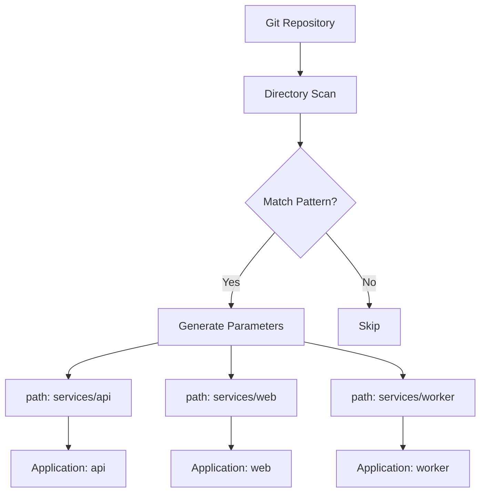

# How to Use Git Directory Generator in ApplicationSets

Author: [nawazdhandala](https://github.com/nawazdhandala)

Tags: ArgoCD, GitOps, Kubernetes, ApplicationSet

Description: Master the ArgoCD ApplicationSet Git Directory generator to automatically discover and deploy applications based on your repository's folder structure with include and exclude patterns.

---

The Git Directory generator scans a Git repository for directories matching specified patterns and creates one ArgoCD Application per matching directory. This is ideal for monorepo setups where each directory represents a deployable service, environment, or component.

Unlike the List generator where you manually enumerate applications, the Git Directory generator discovers them automatically. Add a new directory to your repo, and ArgoCD creates the Application without you touching the ApplicationSet definition.

## How the Git Directory Generator Works

The generator clones your repository (or uses a cached version) and looks for directories matching the `path` patterns you specify. For each matching directory, it produces a parameter set containing:

- `path` - the full path to the directory (e.g., `services/api-gateway`)
- `path.basename` - just the directory name (e.g., `api-gateway`)
- `path[n]` - individual path segments (e.g., `path[0]` = `services`, `path[1]` = `api-gateway`)



## Basic Directory Generator

Given a repository with this structure:

```text
platform-repo/
├── services/
│   ├── api-gateway/
│   │   └── kustomization.yaml
│   ├── user-service/
│   │   └── kustomization.yaml
│   ├── order-service/
│   │   └── kustomization.yaml
│   └── notification-service/
│       └── kustomization.yaml
└── infrastructure/
    ├── cert-manager/
    └── ingress-nginx/
```

Create an ApplicationSet that deploys all services automatically.

```yaml
apiVersion: argoproj.io/v1alpha1
kind: ApplicationSet
metadata:
  name: platform-services
  namespace: argocd
spec:
  generators:
  - git:
      repoURL: https://github.com/myorg/platform-repo
      revision: main
      directories:
      - path: services/*
  template:
    metadata:
      name: '{{path.basename}}'
      labels:
        app-type: service
    spec:
      project: default
      source:
        repoURL: https://github.com/myorg/platform-repo
        targetRevision: main
        path: '{{path}}'
      destination:
        server: https://kubernetes.default.svc
        namespace: '{{path.basename}}'
      syncPolicy:
        automated:
          prune: true
          selfHeal: true
        syncOptions:
        - CreateNamespace=true
```

This creates four Applications: api-gateway, user-service, order-service, and notification-service.

## Excluding Directories

You often need to exclude certain directories. Maybe you have a `shared` or `common` directory that contains libraries, not deployable applications.

```yaml
generators:
- git:
    repoURL: https://github.com/myorg/platform-repo
    revision: main
    directories:
    # Include all service directories
    - path: services/*
    # Exclude specific directories
    - path: services/shared
      exclude: true
    - path: services/deprecated-*
      exclude: true
```

Exclude patterns are evaluated after include patterns. A directory must match at least one include pattern and not match any exclude pattern.

## Nested Directory Discovery

For deeper directory structures, use glob patterns to match nested directories.

```yaml
# Repository structure:
# teams/
#   frontend/
#     apps/
#       web-portal/
#       admin-panel/
#   backend/
#     apps/
#       api/
#       workers/

generators:
- git:
    repoURL: https://github.com/myorg/platform
    revision: main
    directories:
    # Match directories two levels deep
    - path: teams/*/apps/*
```

This matches `teams/frontend/apps/web-portal`, `teams/frontend/apps/admin-panel`, `teams/backend/apps/api`, and `teams/backend/apps/workers`.

The path segments are available as indexed parameters.

```yaml
template:
  metadata:
    # path[0]=teams, path[1]=frontend, path[2]=apps, path[3]=web-portal
    name: '{{path[1]}}-{{path[3]}}'
    labels:
      team: '{{path[1]}}'
```

## Multiple Path Patterns

You can specify multiple include patterns to discover applications from different parts of your repository.

```yaml
generators:
- git:
    repoURL: https://github.com/myorg/platform
    revision: main
    directories:
    # Discover services
    - path: services/*
    # Discover infrastructure components
    - path: infrastructure/*
    # Discover jobs
    - path: jobs/*
    # Exclude test fixtures everywhere
    - path: '*/test-*'
      exclude: true
```

## Using Directory Generator with Kustomize Overlays

A common pattern is having base configurations with per-environment overlays. The directory generator can discover environments.

```yaml
# Repository structure:
# apps/
#   api/
#     base/
#     overlays/
#       dev/
#       staging/
#       production/

apiVersion: argoproj.io/v1alpha1
kind: ApplicationSet
metadata:
  name: api-environments
  namespace: argocd
spec:
  generators:
  - git:
      repoURL: https://github.com/myorg/app
      revision: main
      directories:
      - path: apps/api/overlays/*
  template:
    metadata:
      # path.basename gives us the environment name
      name: 'api-{{path.basename}}'
    spec:
      project: default
      source:
        repoURL: https://github.com/myorg/app
        targetRevision: main
        path: '{{path}}'
      destination:
        server: https://kubernetes.default.svc
        namespace: 'api-{{path.basename}}'
```

## Controlling Poll Interval

The Git directory generator polls the repository periodically to detect new or removed directories. The default interval is 3 minutes.

```yaml
# Adjust the poll interval in the ArgoCD ConfigMap
apiVersion: v1
kind: ConfigMap
metadata:
  name: argocd-cm
  namespace: argocd
data:
  # Set Git generator poll interval to 60 seconds
  timeout.reconciliation: "60"
```

For faster detection, you can configure webhooks so ArgoCD reconciles immediately when a push occurs.

```bash
# Configure webhook in your Git provider pointing to:
# https://argocd.example.com/api/webhook
```

## Combining Directory Generator with Matrix

Use the Matrix generator to deploy each discovered service to multiple clusters.

```yaml
apiVersion: argoproj.io/v1alpha1
kind: ApplicationSet
metadata:
  name: services-all-clusters
  namespace: argocd
spec:
  generators:
  - matrix:
      generators:
      - git:
          repoURL: https://github.com/myorg/platform
          revision: main
          directories:
          - path: services/*
      - clusters:
          selector:
            matchLabels:
              environment: production
  template:
    metadata:
      name: '{{path.basename}}-{{name}}'
    spec:
      project: default
      source:
        repoURL: https://github.com/myorg/platform
        targetRevision: main
        path: '{{path}}'
      destination:
        server: '{{server}}'
        namespace: '{{path.basename}}'
```

## Debugging the Directory Generator

When the generator does not produce the expected Applications, check what directories it discovers.

```bash
# Check ApplicationSet status for errors
kubectl describe applicationset platform-services -n argocd

# View controller logs for directory scanning
kubectl logs -n argocd deployment/argocd-applicationset-controller \
  | grep "directory" | tail -20

# Verify the repository structure matches your patterns
git ls-tree -d --name-only -r main | grep "^services/"
```

The Git Directory generator is the right choice when your repository structure is your source of truth for what applications exist. It eliminates the need to maintain separate lists or registries. Just add a directory, push, and ArgoCD handles the rest.
