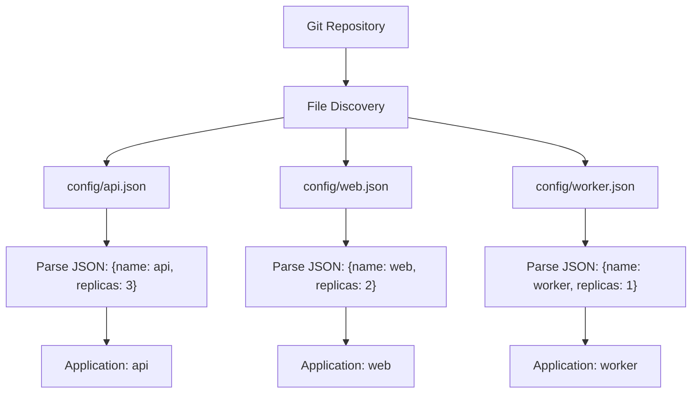

# How to Use Git File Generator in ApplicationSets

Author: [nawazdhandala](https://github.com/nawazdhandala)

Tags: ArgoCD, GitOps, Kubernetes, ApplicationSet

Description: Learn how to use the ArgoCD ApplicationSet Git File generator to create applications from JSON and YAML configuration files stored in your Git repository for flexible multi-app deployments.

---

The Git File generator reads JSON or YAML files from a Git repository and uses their contents as parameters for ApplicationSet templates. Unlike the Git Directory generator which discovers applications by folder structure, the File generator lets you define rich application metadata in configuration files - things like version numbers, resource limits, feature flags, and environment-specific settings.

This approach gives you the automation benefits of dynamic discovery with the flexibility of explicit configuration. Your config files become the single source of truth for what gets deployed and how.

## How the Git File Generator Works

The generator scans your repository for files matching a glob pattern, reads each file, and produces one parameter set per file (or per element within a file, if the file contains a list). Every key in the JSON or YAML file becomes a template variable.



## Basic File Generator with JSON

Given a repository with per-application config files:

```
config-repo/
├── apps/
│   ├── api-gateway.json
│   ├── user-service.json
│   └── order-service.json
└── deploy/
    ├── api-gateway/
    ├── user-service/
    └── order-service/
```

Each config file contains application-specific parameters.

```json
// apps/api-gateway.json
{
  "appName": "api-gateway",
  "repoPath": "deploy/api-gateway",
  "namespace": "api",
  "replicas": 3,
  "port": 8080,
  "team": "platform"
}
```

The ApplicationSet reads these files and generates Applications.

```yaml
apiVersion: argoproj.io/v1alpha1
kind: ApplicationSet
metadata:
  name: microservices
  namespace: argocd
spec:
  generators:
  - git:
      repoURL: https://github.com/myorg/config-repo
      revision: main
      files:
      - path: "apps/*.json"
  template:
    metadata:
      name: '{{appName}}'
      labels:
        team: '{{team}}'
    spec:
      project: default
      source:
        repoURL: https://github.com/myorg/config-repo
        targetRevision: main
        path: '{{repoPath}}'
        helm:
          parameters:
          - name: replicaCount
            value: '{{replicas}}'
          - name: service.port
            value: '{{port}}'
      destination:
        server: https://kubernetes.default.svc
        namespace: '{{namespace}}'
      syncPolicy:
        automated:
          prune: true
          selfHeal: true
```

## Using YAML Config Files

YAML files work the same way as JSON. Many teams prefer YAML for readability.

```yaml
# apps/user-service.yaml
appName: user-service
repoPath: deploy/user-service
namespace: users
replicas: 2
port: 8081
team: identity
resources:
  memory: 512Mi
  cpu: 250m
```

Reference YAML files in the generator.

```yaml
generators:
- git:
    repoURL: https://github.com/myorg/config-repo
    revision: main
    files:
    - path: "apps/*.yaml"
```

## Nested Values in Config Files

The File generator supports nested objects. You access nested values using dot notation in templates.

```json
{
  "name": "payment-service",
  "deploy": {
    "path": "services/payment",
    "namespace": "payments"
  },
  "scaling": {
    "minReplicas": 2,
    "maxReplicas": 10
  },
  "monitoring": {
    "enabled": true,
    "alertTeam": "payments-oncall"
  }
}
```

Access nested values in the template.

```yaml
template:
  metadata:
    name: '{{name}}'
    annotations:
      alert-team: '{{monitoring.alertTeam}}'
  spec:
    source:
      path: '{{deploy.path}}'
    destination:
      namespace: '{{deploy.namespace}}'
```

## Multiple File Patterns

You can specify multiple file patterns to read from different directories.

```yaml
generators:
- git:
    repoURL: https://github.com/myorg/config-repo
    revision: main
    files:
    # Application configs
    - path: "apps/*/config.json"
    # Infrastructure configs
    - path: "infra/*/config.json"
    # Exclude test configs
    - path: "test/**"
      exclude: true
```

## Per-Environment Config Files

A powerful pattern is using separate config files for each environment, discovered by the file generator.

```
config-repo/
├── environments/
│   ├── dev/
│   │   ├── api.json
│   │   └── web.json
│   ├── staging/
│   │   ├── api.json
│   │   └── web.json
│   └── production/
│       ├── api.json
│       └── web.json
```

Each config file includes environment-specific settings.

```json
// environments/production/api.json
{
  "appName": "api",
  "environment": "production",
  "replicas": 5,
  "resources": {
    "memory": "2Gi",
    "cpu": "1000m"
  },
  "cluster": "https://prod-cluster.example.com"
}
```

The ApplicationSet creates environment-specific deployments.

```yaml
apiVersion: argoproj.io/v1alpha1
kind: ApplicationSet
metadata:
  name: env-apps
  namespace: argocd
spec:
  generators:
  - git:
      repoURL: https://github.com/myorg/config-repo
      revision: main
      files:
      - path: "environments/*//*.json"
  template:
    metadata:
      name: '{{appName}}-{{environment}}'
    spec:
      project: default
      source:
        repoURL: https://github.com/myorg/app-repo
        targetRevision: main
        path: 'deploy/{{appName}}/overlays/{{environment}}'
      destination:
        server: '{{cluster}}'
        namespace: '{{appName}}-{{environment}}'
```

## File Generator with Go Templates

When using Go templates (recommended for complex configs), you get access to additional functions and better error handling.

```yaml
apiVersion: argoproj.io/v1alpha1
kind: ApplicationSet
metadata:
  name: apps-with-go-templates
  namespace: argocd
spec:
  goTemplate: true
  goTemplateOptions: ["missingkey=error"]
  generators:
  - git:
      repoURL: https://github.com/myorg/config-repo
      revision: main
      files:
      - path: "apps/*.json"
  template:
    metadata:
      name: '{{ .appName }}'
      labels:
        team: '{{ .team }}'
        tier: '{{ default "standard" .tier }}'
    spec:
      project: default
      source:
        repoURL: https://github.com/myorg/config-repo
        targetRevision: main
        path: '{{ .repoPath }}'
      destination:
        server: https://kubernetes.default.svc
        namespace: '{{ .namespace }}'
```

Go templates use `{{ .key }}` syntax instead of `{{key}}` and support functions like `default`, `upper`, `lower`, and conditional logic.

## Validating Config Files

Since config files drive your entire deployment, validate them in CI before they reach ArgoCD.

```bash
#!/bin/bash
# validate-configs.sh - Run in CI pipeline

# Check all JSON configs are valid
for f in apps/*.json; do
  if ! jq empty "$f" 2>/dev/null; then
    echo "ERROR: Invalid JSON in $f"
    exit 1
  fi

  # Verify required fields exist
  for field in appName repoPath namespace; do
    if ! jq -e ".$field" "$f" >/dev/null 2>&1; then
      echo "ERROR: Missing required field '$field' in $f"
      exit 1
    fi
  done
done

echo "All config files are valid"
```

## Debugging the File Generator

When the File generator does not produce expected results, check these common issues.

```bash
# Check ApplicationSet controller logs for file parsing errors
kubectl logs -n argocd deployment/argocd-applicationset-controller \
  | grep -i "file\|error\|parse"

# Verify file patterns match expected files
git ls-files "apps/*.json"

# Check ApplicationSet status
kubectl get applicationset microservices -n argocd -o yaml | grep -A 10 status
```

The Git File generator bridges the gap between fully dynamic discovery and static configuration. It gives you the structure and validation of explicit config files while maintaining the automatic application creation that makes ApplicationSets powerful. Use it when your applications need more metadata than a directory name can provide.
