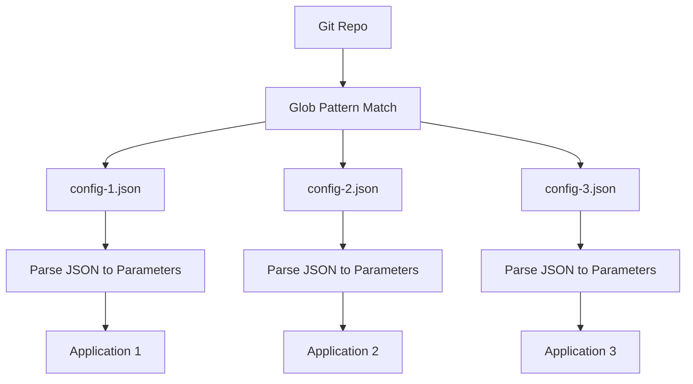

# How to Use Git File Generator with JSON Config Files in ArgoCD ApplicationSets

Author: [nawazdhandala](https://github.com/nawazdhandala)

Tags: ArgoCD, GitOps, Kubernetes, ApplicationSet, JSON

Description: Learn how to use the ArgoCD ApplicationSet Git file generator with JSON configuration files to dynamically create applications from structured data in Git.

---

The Git file generator is one of the most flexible ApplicationSet generators. It reads JSON files from a Git repository and turns each file's key-value pairs into template parameters. This approach separates application configuration from the ApplicationSet template, making it easy for teams to onboard new applications by simply creating a JSON file.

This guide covers the Git file generator with JSON config files in depth, including structuring your configs, handling nested data, and building real-world patterns.

## How JSON File Generation Works

The Git file generator scans a Git repository for files matching a glob pattern. Each matched file is parsed as JSON, and its contents become template parameters. One file equals one generated Application.



## Basic JSON Config Setup

Start with a simple directory structure.

```
config/
  apps/
    web-frontend.json
    api-backend.json
    worker-service.json
```

Each JSON file defines the parameters for one application:

```json
{
  "app_name": "web-frontend",
  "repo_url": "https://github.com/myorg/web-frontend.git",
  "path": "deploy",
  "namespace": "frontend",
  "target_revision": "main",
  "project": "web-team"
}
```

The ApplicationSet references these files:

```yaml
apiVersion: argoproj.io/v1alpha1
kind: ApplicationSet
metadata:
  name: json-config-apps
  namespace: argocd
spec:
  generators:
    - git:
        repoURL: https://github.com/myorg/app-configs.git
        revision: HEAD
        files:
          - path: 'config/apps/*.json'
  template:
    metadata:
      name: '{{app_name}}'
    spec:
      project: '{{project}}'
      source:
        repoURL: '{{repo_url}}'
        targetRevision: '{{target_revision}}'
        path: '{{path}}'
      destination:
        server: https://kubernetes.default.svc
        namespace: '{{namespace}}'
      syncPolicy:
        automated:
          prune: true
          selfHeal: true
        syncOptions:
          - CreateNamespace=true
```

## Nested JSON Objects

JSON's real power over flat formats is nesting. The Git file generator supports nested objects, which become dot-delimited parameter paths.

```json
{
  "name": "payment-api",
  "source": {
    "repo": "https://github.com/myorg/payment-api.git",
    "revision": "v2.1.0",
    "path": "kubernetes"
  },
  "destination": {
    "cluster": "https://prod.example.com",
    "namespace": "payments"
  },
  "helm": {
    "values_file": "values-production.yaml",
    "replicas": "3",
    "cpu_request": "500m",
    "memory_request": "512Mi"
  },
  "metadata": {
    "team": "payments",
    "tier": "critical",
    "pagerduty_service": "payment-api-prod"
  }
}
```

Reference nested values with Go templates:

```yaml
apiVersion: argoproj.io/v1alpha1
kind: ApplicationSet
metadata:
  name: nested-json-apps
  namespace: argocd
spec:
  goTemplate: true
  goTemplateOptions: ["missingkey=error"]
  generators:
    - git:
        repoURL: https://github.com/myorg/configs.git
        revision: HEAD
        files:
          - path: 'apps/*.json'
  template:
    metadata:
      name: '{{.name}}'
      labels:
        team: '{{.metadata.team}}'
        tier: '{{.metadata.tier}}'
      annotations:
        pagerduty.com/service-id: '{{.metadata.pagerduty_service}}'
    spec:
      project: '{{.metadata.team}}'
      source:
        repoURL: '{{.source.repo}}'
        targetRevision: '{{.source.revision}}'
        path: '{{.source.path}}'
        helm:
          valueFiles:
            - '{{.helm.values_file}}'
          parameters:
            - name: replicaCount
              value: '{{.helm.replicas}}'
            - name: resources.requests.cpu
              value: '{{.helm.cpu_request}}'
            - name: resources.requests.memory
              value: '{{.helm.memory_request}}'
      destination:
        server: '{{.destination.cluster}}'
        namespace: '{{.destination.namespace}}'
      syncPolicy:
        automated:
          selfHeal: true
        syncOptions:
          - CreateNamespace=true
```

## Arrays in JSON Config

JSON arrays can be useful for things like multiple value files or tags.

```json
{
  "name": "analytics-dashboard",
  "namespace": "analytics",
  "source_repo": "https://github.com/myorg/analytics.git",
  "environments": ["dev", "staging", "production"],
  "tags": ["analytics", "dashboard", "reporting"],
  "maintainers": ["alice", "bob"]
}
```

Note that arrays are tricky with the default template syntax. With Go templates, you can access array elements by index:

```yaml
# Access first element
name: '{{index .environments 0}}'
```

For most use cases, keep config values as strings or nested objects. If you need per-environment configurations, use separate files per environment instead of arrays.

## Multi-Directory Structure

Organize configs by category for larger organizations.

```
configs/
  infrastructure/
    cert-manager.json
    ingress-nginx.json
    external-dns.json
  applications/
    frontend.json
    backend.json
    worker.json
  monitoring/
    prometheus.json
    grafana.json
    alertmanager.json
```

```yaml
apiVersion: argoproj.io/v1alpha1
kind: ApplicationSet
metadata:
  name: all-apps-from-json
  namespace: argocd
spec:
  generators:
    - git:
        repoURL: https://github.com/myorg/configs.git
        revision: HEAD
        files:
          # Match JSON files in all subdirectories
          - path: 'configs/**/*.json'
  template:
    metadata:
      name: '{{app_name}}'
      labels:
        category: '{{category}}'
    spec:
      project: '{{project}}'
      source:
        repoURL: '{{source_repo}}'
        targetRevision: '{{target_revision}}'
        path: '{{source_path}}'
      destination:
        server: '{{cluster_url}}'
        namespace: '{{namespace}}'
```

Each JSON file includes a `category` field to identify whether it is infrastructure, application, or monitoring.

## Helm Values as JSON Strings

For Helm deployments, you can embed complete values as a JSON string that gets passed to the Helm source.

```json
{
  "app_name": "redis-cluster",
  "namespace": "redis",
  "chart_repo": "https://charts.bitnami.com/bitnami",
  "chart_name": "redis",
  "chart_version": "18.6.1",
  "helm_values": "architecture: replication\nreplica:\n  replicaCount: 3\nauth:\n  enabled: true\n  existingSecret: redis-auth\nmetrics:\n  enabled: true\n  serviceMonitor:\n    enabled: true"
}
```

```yaml
apiVersion: argoproj.io/v1alpha1
kind: ApplicationSet
metadata:
  name: helm-charts-from-json
  namespace: argocd
spec:
  generators:
    - git:
        repoURL: https://github.com/myorg/configs.git
        revision: HEAD
        files:
          - path: 'charts/*.json'
  template:
    metadata:
      name: '{{app_name}}'
    spec:
      project: infrastructure
      source:
        repoURL: '{{chart_repo}}'
        chart: '{{chart_name}}'
        targetRevision: '{{chart_version}}'
        helm:
          values: '{{helm_values}}'
      destination:
        server: https://kubernetes.default.svc
        namespace: '{{namespace}}'
      syncPolicy:
        automated:
          selfHeal: true
        syncOptions:
          - CreateNamespace=true
          - ServerSideApply=true
```

## Conditional Deployment with Enable Flags

Add a boolean flag to control whether an app should be deployed.

```json
{
  "app_name": "feature-service",
  "namespace": "features",
  "enabled": "true",
  "source_repo": "https://github.com/myorg/feature-service.git",
  "source_path": "deploy"
}
```

Use a post selector to filter out disabled apps:

```yaml
apiVersion: argoproj.io/v1alpha1
kind: ApplicationSet
metadata:
  name: toggleable-apps
  namespace: argocd
spec:
  generators:
    - git:
        repoURL: https://github.com/myorg/configs.git
        revision: HEAD
        files:
          - path: 'apps/*.json'
        # Only generate apps where enabled is true
        selector:
          matchLabels:
            enabled: "true"
  template:
    metadata:
      name: '{{app_name}}'
    spec:
      project: default
      source:
        repoURL: '{{source_repo}}'
        targetRevision: HEAD
        path: '{{source_path}}'
      destination:
        server: https://kubernetes.default.svc
        namespace: '{{namespace}}'
```

Setting `enabled` to `"false"` in the JSON file will cause the Application to be pruned (or not created).

## Validating JSON Config Files in CI

Enforce schema validation before configs reach the ApplicationSet.

```bash
#!/bin/bash
# validate-app-configs.sh

SCHEMA='{
  "type": "object",
  "required": ["app_name", "namespace", "source_repo", "source_path"],
  "properties": {
    "app_name": {"type": "string", "pattern": "^[a-z][a-z0-9-]*$"},
    "namespace": {"type": "string"},
    "source_repo": {"type": "string", "format": "uri"},
    "source_path": {"type": "string"}
  }
}'

for config in configs/apps/*.json; do
  if ! jq empty "$config" 2>/dev/null; then
    echo "FAIL: Invalid JSON - $config"
    exit 1
  fi

  app_name=$(jq -r '.app_name' "$config")
  if [ ${#app_name} -gt 63 ]; then
    echo "FAIL: app_name exceeds 63 chars - $config"
    exit 1
  fi

  echo "PASS: $config"
done
```

## Debugging Git File Generator Issues

Common troubleshooting steps:

```bash
# Check if the ApplicationSet can access the repo
kubectl logs -n argocd -l app.kubernetes.io/name=argocd-applicationset-controller \
  --tail=50

# Verify the glob pattern matches your files
# The path pattern follows Go's filepath.Match syntax

# Check the ApplicationSet status
kubectl describe applicationset json-config-apps -n argocd

# List generated applications
argocd appset get json-config-apps
```

The Git file generator with JSON configs creates a clean separation between application definitions and deployment templates. Teams manage their own JSON files while the platform team controls the ApplicationSet template. For end-to-end monitoring of your config-driven deployments, [OneUptime](https://oneuptime.com/blog/post/2026-02-26-argocd-applicationset-git-file-yaml/view) provides health tracking and alerting across all generated applications.
