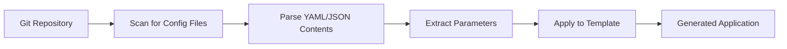

# How to Use Git File Generator with YAML Config Files in ArgoCD ApplicationSets

Author: [nawazdhandala](https://github.com/nawazdhandala)

Tags: ArgoCD, GitOps, Kubernetes, ApplicationSet, YAML

Description: Learn how to use the ArgoCD ApplicationSet Git file generator with YAML configuration files to dynamically generate applications from structured config data.

---

The Git file generator in ArgoCD ApplicationSets reads configuration files from a Git repository and uses their contents as template parameters. While JSON is the most commonly documented format, YAML config files work just as well and are often preferred by teams already steeped in Kubernetes YAML conventions.

This guide covers how to set up the Git file generator with YAML files, structure your config data, and handle practical patterns.

## How the Git File Generator Works

The Git file generator scans a Git repository for files matching a specified path pattern. It reads each file, parses its contents, and uses the key-value pairs as template parameters. Each file produces one Application.



## Basic YAML Config File Setup

Note that as of ArgoCD v2.x, the Git file generator officially supports JSON files. For YAML config files, you have two approaches: use JSON files (recommended for maximum compatibility) or use a config management plugin. However, many teams use the Git file generator with JSON files that contain YAML-like structured data.

The recommended approach is to use JSON files with the Git file generator. Here is the setup.

Create a directory structure with config files:

```
apps/
  frontend/
    config.json
  backend/
    config.json
  worker/
    config.json
```

Each config file contains application parameters:

```json
{
  "app_name": "frontend",
  "namespace": "frontend",
  "chart_path": "charts/frontend",
  "target_revision": "HEAD",
  "values_file": "values-production.yaml",
  "replicas": "3",
  "domain": "app.example.com",
  "team": "web-platform",
  "tier": "frontend"
}
```

```yaml
apiVersion: argoproj.io/v1alpha1
kind: ApplicationSet
metadata:
  name: apps-from-config
  namespace: argocd
spec:
  generators:
    - git:
        repoURL: https://github.com/myorg/app-configs.git
        revision: HEAD
        files:
          - path: 'apps/*/config.json'
  template:
    metadata:
      name: '{{app_name}}'
      labels:
        team: '{{team}}'
        tier: '{{tier}}'
    spec:
      project: default
      source:
        repoURL: https://github.com/myorg/app-configs.git
        targetRevision: '{{target_revision}}'
        path: '{{chart_path}}'
        helm:
          valueFiles:
            - '{{values_file}}'
          parameters:
            - name: replicaCount
              value: '{{replicas}}'
            - name: ingress.host
              value: '{{domain}}'
      destination:
        server: https://kubernetes.default.svc
        namespace: '{{namespace}}'
      syncPolicy:
        automated:
          prune: true
          selfHeal: true
        syncOptions:
          - CreateNamespace=true
```

## Embedding YAML Values in Config Files

While the config files themselves must be JSON for the Git file generator, you can embed YAML content as string values that get passed to Helm charts.

```json
{
  "app_name": "backend-api",
  "namespace": "backend",
  "helm_values": "replicaCount: 3\nresources:\n  requests:\n    cpu: 500m\n    memory: 512Mi\n  limits:\n    cpu: 1000m\n    memory: 1Gi\nenv:\n  DATABASE_URL: postgres://db:5432/app\n  REDIS_URL: redis://cache:6379",
  "team": "backend"
}
```

```yaml
apiVersion: argoproj.io/v1alpha1
kind: ApplicationSet
metadata:
  name: apps-with-yaml-values
  namespace: argocd
spec:
  generators:
    - git:
        repoURL: https://github.com/myorg/app-configs.git
        revision: HEAD
        files:
          - path: 'apps/*/config.json'
  template:
    metadata:
      name: '{{app_name}}'
    spec:
      project: default
      source:
        repoURL: https://github.com/myorg/charts.git
        targetRevision: HEAD
        path: 'charts/{{app_name}}'
        helm:
          # Pass the embedded YAML as Helm values
          values: '{{helm_values}}'
      destination:
        server: https://kubernetes.default.svc
        namespace: '{{namespace}}'
```

## Multi-Environment Config Files

Structure your config files to support multiple environments.

```
environments/
  dev/
    apps/
      frontend.json
      backend.json
  staging/
    apps/
      frontend.json
      backend.json
  production/
    apps/
      frontend.json
      backend.json
```

Production frontend config:

```json
{
  "app_name": "frontend",
  "env": "production",
  "namespace": "frontend-prod",
  "cluster": "https://prod.example.com",
  "replicas": "5",
  "domain": "www.example.com",
  "autoscaling_min": "3",
  "autoscaling_max": "10",
  "cdn_enabled": "true"
}
```

Dev frontend config:

```json
{
  "app_name": "frontend",
  "env": "dev",
  "namespace": "frontend-dev",
  "cluster": "https://dev.example.com",
  "replicas": "1",
  "domain": "dev.example.com",
  "autoscaling_min": "1",
  "autoscaling_max": "2",
  "cdn_enabled": "false"
}
```

```yaml
apiVersion: argoproj.io/v1alpha1
kind: ApplicationSet
metadata:
  name: multi-env-from-files
  namespace: argocd
spec:
  generators:
    - git:
        repoURL: https://github.com/myorg/env-configs.git
        revision: HEAD
        files:
          - path: 'environments/*/apps/*.json'
  template:
    metadata:
      name: '{{app_name}}-{{env}}'
      labels:
        app: '{{app_name}}'
        env: '{{env}}'
    spec:
      project: '{{env}}'
      source:
        repoURL: https://github.com/myorg/apps.git
        targetRevision: HEAD
        path: '{{app_name}}'
        helm:
          parameters:
            - name: replicaCount
              value: '{{replicas}}'
            - name: ingress.host
              value: '{{domain}}'
            - name: autoscaling.minReplicas
              value: '{{autoscaling_min}}'
            - name: autoscaling.maxReplicas
              value: '{{autoscaling_max}}'
            - name: cdn.enabled
              value: '{{cdn_enabled}}'
      destination:
        server: '{{cluster}}'
        namespace: '{{namespace}}'
      syncPolicy:
        automated:
          selfHeal: true
        syncOptions:
          - CreateNamespace=true
```

## Nested JSON for Complex Configuration

JSON config files support nested objects. The Git file generator flattens them using dot notation.

```json
{
  "name": "api-gateway",
  "metadata": {
    "team": "platform",
    "tier": "gateway",
    "oncall": "platform-oncall@example.com"
  },
  "deploy": {
    "namespace": "gateway",
    "cluster": "https://prod.example.com",
    "replicas": 3
  },
  "monitoring": {
    "enabled": true,
    "dashboard": "https://grafana.example.com/d/gateway"
  }
}
```

Access nested values in the template using dot notation:

```yaml
apiVersion: argoproj.io/v1alpha1
kind: ApplicationSet
metadata:
  name: nested-config-apps
  namespace: argocd
spec:
  goTemplate: true
  goTemplateOptions: ["missingkey=error"]
  generators:
    - git:
        repoURL: https://github.com/myorg/configs.git
        revision: HEAD
        files:
          - path: 'apps/*/config.json'
  template:
    metadata:
      name: '{{.name}}'
      labels:
        team: '{{.metadata.team}}'
        tier: '{{.metadata.tier}}'
      annotations:
        oncall: '{{.metadata.oncall}}'
        grafana-dashboard: '{{.monitoring.dashboard}}'
    spec:
      project: default
      source:
        repoURL: https://github.com/myorg/apps.git
        targetRevision: HEAD
        path: '{{.name}}'
      destination:
        server: '{{.deploy.cluster}}'
        namespace: '{{.deploy.namespace}}'
```

## Self-Service Application Onboarding

The Git file generator pattern enables a self-service workflow where developers create a config file to onboard their application.

```
# Developer creates: apps/my-new-service/config.json
{
  "app_name": "my-new-service",
  "namespace": "my-new-service",
  "repo_url": "https://github.com/myorg/my-new-service.git",
  "chart_path": "deploy",
  "team": "my-team",
  "environment": "dev",
  "deploy_enabled": "true"
}
```

The ApplicationSet picks it up on next reconciliation:

```bash
# Verify the new application was created
argocd app get my-new-service

# Check ApplicationSet status
kubectl get applicationset apps-from-config -n argocd -o yaml | \
  yq '.status.resources'
```

## Validating Config Files

Add a CI check to validate config files before they reach the ApplicationSet.

```bash
#!/bin/bash
# validate-configs.sh - Run in CI pipeline

for config_file in apps/*/config.json; do
  # Check valid JSON
  if ! jq empty "$config_file" 2>/dev/null; then
    echo "ERROR: Invalid JSON in $config_file"
    exit 1
  fi

  # Check required fields
  for field in app_name namespace team; do
    value=$(jq -r ".$field" "$config_file")
    if [ "$value" = "null" ] || [ -z "$value" ]; then
      echo "ERROR: Missing required field '$field' in $config_file"
      exit 1
    fi
  done

  echo "OK: $config_file"
done
```

The Git file generator is the foundation for self-service application platforms. By combining structured config files with ApplicationSet templates, you create a system where teams manage their own deployments through simple file changes. For monitoring all applications generated through your config-driven workflow, [OneUptime](https://oneuptime.com/blog/post/2026-02-26-argocd-applicationset-per-team/view) tracks health and sync status across your entire application fleet.
