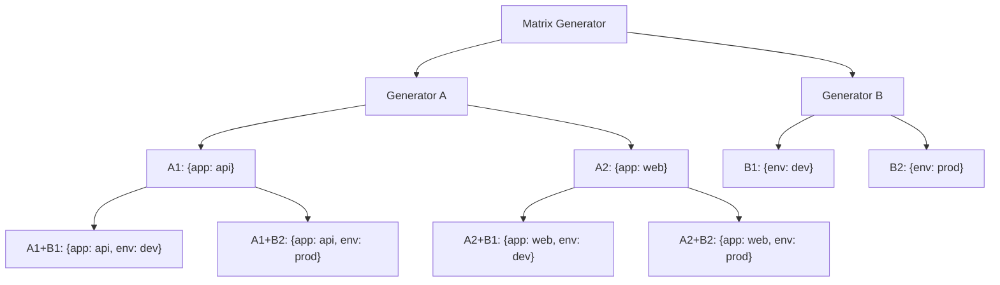

# How to Use Matrix Generator for Combining Generators

Author: [nawazdhandala](https://github.com/nawazdhandala)

Tags: ArgoCD, GitOps, Kubernetes, ApplicationSets

Description: Learn how to use the ArgoCD ApplicationSet Matrix generator to combine multiple generators and create cross-product deployments across clusters, environments, and applications.

---

The Matrix generator in ArgoCD ApplicationSets takes two generators and produces the cartesian product of their outputs. If generator A produces 3 parameter sets and generator B produces 4, the Matrix generator creates 12 combined parameter sets. This is how you deploy multiple applications across multiple clusters, or multiple services across multiple environments, from a single ApplicationSet.

This guide covers Matrix generator syntax, practical combinations, nested generators, and performance considerations.

## How the Matrix Generator Works

The Matrix generator accepts exactly two child generators. It runs both, then creates every possible combination of their outputs. Parameters from both generators are merged into a single parameter set for each combination.



## Basic Matrix: Applications x Clusters

Deploy a set of platform services to every production cluster.

```yaml
apiVersion: argoproj.io/v1alpha1
kind: ApplicationSet
metadata:
  name: platform-services
  namespace: argocd
spec:
  generators:
  - matrix:
      generators:
      # Generator A: list of platform services
      - list:
          elements:
          - service: cert-manager
            path: platform/cert-manager
            namespace: cert-manager
          - service: external-dns
            path: platform/external-dns
            namespace: external-dns
          - service: prometheus-stack
            path: platform/prometheus
            namespace: monitoring
      # Generator B: production clusters
      - clusters:
          selector:
            matchLabels:
              environment: production
  template:
    metadata:
      name: '{{service}}-{{name}}'
      labels:
        component: '{{service}}'
        cluster: '{{name}}'
    spec:
      project: platform
      source:
        repoURL: https://github.com/myorg/platform
        targetRevision: main
        path: '{{path}}'
      destination:
        server: '{{server}}'
        namespace: '{{namespace}}'
      syncPolicy:
        automated:
          prune: true
          selfHeal: true
        syncOptions:
        - CreateNamespace=true
```

With 3 services and 4 production clusters, this generates 12 Applications.

## Matrix: Git Directories x Environments

Combine a Git directory generator with a list of environments to deploy every service to every environment.

```yaml
apiVersion: argoproj.io/v1alpha1
kind: ApplicationSet
metadata:
  name: all-services-all-envs
  namespace: argocd
spec:
  generators:
  - matrix:
      generators:
      # Generator A: discover services from repo
      - git:
          repoURL: https://github.com/myorg/services
          revision: main
          directories:
          - path: services/*
      # Generator B: environments with configs
      - list:
          elements:
          - env: dev
            cluster: https://dev.example.com
            values_file: values-dev.yaml
          - env: staging
            cluster: https://staging.example.com
            values_file: values-staging.yaml
          - env: production
            cluster: https://prod.example.com
            values_file: values-prod.yaml
  template:
    metadata:
      name: '{{path.basename}}-{{env}}'
    spec:
      project: default
      source:
        repoURL: https://github.com/myorg/services
        targetRevision: main
        path: '{{path}}'
        helm:
          valueFiles:
          - '{{values_file}}'
      destination:
        server: '{{cluster}}'
        namespace: '{{path.basename}}'
```

Every time you add a new service directory, it automatically gets deployed to all three environments.

## Nested Matrix Generators

You can nest Matrix generators to create three-way or higher combinations. The trick is that each Matrix generator takes exactly two child generators, but one of those children can be another Matrix.

```yaml
apiVersion: argoproj.io/v1alpha1
kind: ApplicationSet
metadata:
  name: team-service-cluster
  namespace: argocd
spec:
  generators:
  - matrix:
      generators:
      # First Matrix: teams x services
      - matrix:
          generators:
          - list:
              elements:
              - team: frontend
                repo: https://github.com/myorg/frontend-services
              - team: backend
                repo: https://github.com/myorg/backend-services
          - git:
              repoURL: '{{repo}}'
              revision: main
              directories:
              - path: services/*
      # Second generator: clusters
      - clusters:
          selector:
            matchLabels:
              tier: production
  template:
    metadata:
      name: '{{team}}-{{path.basename}}-{{name}}'
    spec:
      project: '{{team}}'
      source:
        repoURL: '{{repo}}'
        targetRevision: main
        path: '{{path}}'
      destination:
        server: '{{server}}'
        namespace: '{{team}}-{{path.basename}}'
```

Note that nested Matrix generators have a limitation: the inner Matrix cannot use dynamic generators that depend on parameters from the outer generator. The Git generator URL `{{repo}}` in the example above requires the parameter from the List generator in the same inner Matrix.

## Parameter Precedence in Matrix

When both generators provide a parameter with the same name, the second generator's value takes precedence. Design your generators to avoid parameter name collisions.

```yaml
generators:
- matrix:
    generators:
    # Generator A provides: {name: "api", namespace: "default"}
    - list:
        elements:
        - name: api
          namespace: default
    # Generator B provides: {name: "prod-cluster", server: "..."}
    # The 'name' parameter from B overwrites A's 'name'
    - clusters: {}
```

To avoid this, use distinct parameter names or the `values` field on the Cluster generator.

```yaml
generators:
- matrix:
    generators:
    - list:
        elements:
        - appName: api  # Use 'appName' instead of 'name'
    - clusters:
        values:
          clusterName: '{{name}}'  # Rename to avoid collision
```

## Performance Considerations

Matrix generators can produce a large number of Applications. Be mindful of the multiplication factor.

```bash
# Calculate expected Application count
# Generator A produces: N parameter sets
# Generator B produces: M parameter sets
# Matrix produces: N x M Applications

# Example: 50 services x 10 clusters = 500 Applications
# This is fine for ArgoCD, but be aware of API server load
```

For very large matrices (hundreds of Applications), consider:
- Splitting into multiple ApplicationSets
- Using label selectors to reduce cluster scope
- Applying resource quotas on the ArgoCD namespace

The Matrix generator is the most powerful composition tool in ApplicationSets. It turns two simple generators into a comprehensive deployment strategy that scales automatically as you add new services or clusters.
