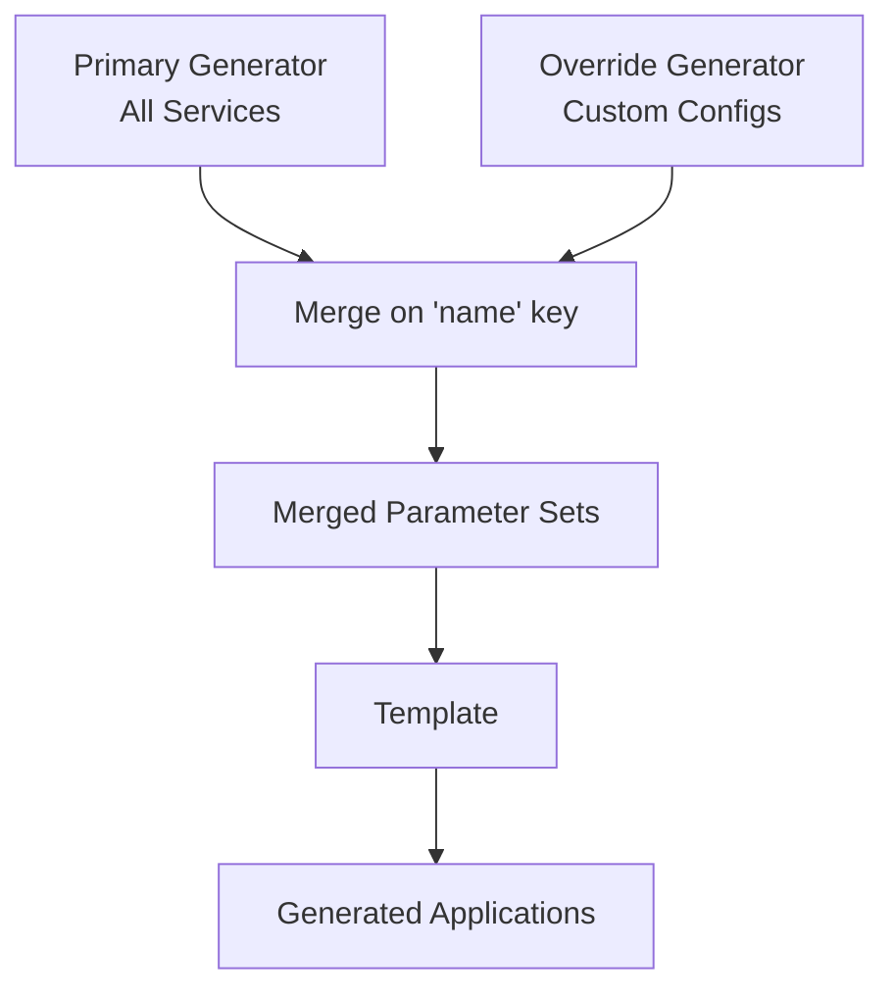

# How to Override Generator Values with Merge Generator in ArgoCD ApplicationSets

Author: [nawazdhandala](https://github.com/nawazdhandala)

Tags: ArgoCD, GitOps, Kubernetes, ApplicationSets, Merge Generator

Description: Learn how to use the ArgoCD ApplicationSet merge generator to combine and override parameter values from multiple generators for flexible application configuration.

---

The matrix generator creates the cartesian product of its child generators, but sometimes you need a different kind of combination. The merge generator takes parameter sets from multiple generators and merges them together based on matching keys. This lets you define base configurations with one generator and apply targeted overrides with another.

Think of it as a left join in SQL: the primary generator provides the full set of results, and additional generators provide overrides for specific entries.

## How the Merge Generator Works

The merge generator requires a `mergeKeys` field that specifies which parameters are used to match entries across generators. When entries from different generators share the same merge key values, their parameters are merged together. Later generators override earlier ones.



## Basic Merge Example

Here is a practical example. A Git directory generator discovers all services, and a list generator provides custom configurations for specific services.

```yaml
apiVersion: argoproj.io/v1alpha1
kind: ApplicationSet
metadata:
  name: merged-services
  namespace: argocd
spec:
  generators:
    - merge:
        mergeKeys:
          - path.basename
        generators:
          # Primary: discover all services from Git
          - git:
              repoURL: https://github.com/myorg/services.git
              revision: HEAD
              directories:
                - path: 'services/*'
          # Override: custom config for specific services
          - list:
              elements:
                - path.basename: payment-service
                  targetRevision: release-2.0
                  project: pci-compliant
                  replicas: "5"
                - path.basename: auth-service
                  targetRevision: stable
                  project: security
                  replicas: "3"
  template:
    metadata:
      name: '{{path.basename}}'
    spec:
      project: '{{project}}'
      source:
        repoURL: https://github.com/myorg/services.git
        targetRevision: '{{targetRevision}}'
        path: '{{path}}'
      destination:
        server: https://kubernetes.default.svc
        namespace: '{{path.basename}}'
```

For `payment-service` and `auth-service`, the custom `targetRevision` and `project` override whatever defaults the Git generator provides. All other services discovered by the Git generator use the default values.

## Setting Default Values

The key challenge with merge is providing defaults for parameters that only some entries have. Use a third generator layer for defaults.

```yaml
apiVersion: argoproj.io/v1alpha1
kind: ApplicationSet
metadata:
  name: services-with-defaults
  namespace: argocd
spec:
  goTemplate: true
  goTemplateOptions: ["missingkey=error"]
  generators:
    - merge:
        mergeKeys:
          - name
        generators:
          # Layer 1: All services with defaults
          - git:
              repoURL: https://github.com/myorg/services.git
              revision: HEAD
              files:
                - path: 'services/*/manifest.json'
          # Layer 2: Environment-specific overrides
          - list:
              elements:
                - name: payment-api
                  cluster_url: https://pci-cluster.example.com
                  sync_enabled: "false"
                - name: user-api
                  cluster_url: https://prod.example.com
                  sync_enabled: "true"
                  replicas: "5"
  template:
    metadata:
      name: '{{.name}}'
      labels:
        team: '{{.team}}'
    spec:
      project: '{{default "default" .project}}'
      source:
        repoURL: '{{.repo_url}}'
        targetRevision: '{{default "HEAD" .target_revision}}'
        path: '{{.deploy_path}}'
        helm:
          parameters:
            - name: replicaCount
              value: '{{default "2" .replicas}}'
      destination:
        server: '{{default "https://kubernetes.default.svc" .cluster_url}}'
        namespace: '{{.namespace}}'
```

The `default` Go template function fills in values when the override generator does not provide them.

## Multi-Key Merging

When your parameter sets need to be matched on multiple fields (such as service name AND environment), use multiple merge keys.

```yaml
apiVersion: argoproj.io/v1alpha1
kind: ApplicationSet
metadata:
  name: multi-key-merge
  namespace: argocd
spec:
  generators:
    - merge:
        mergeKeys:
          - service
          - env
        generators:
          # Primary: all service-environment combinations
          - matrix:
              generators:
                - list:
                    elements:
                      - service: frontend
                      - service: backend
                      - service: worker
                - list:
                    elements:
                      - env: dev
                        cluster: https://dev.example.com
                      - env: staging
                        cluster: https://staging.example.com
                      - env: production
                        cluster: https://prod.example.com
          # Overrides for specific service-env combinations
          - list:
              elements:
                - service: backend
                  env: production
                  replicas: "10"
                  cpu_request: "2000m"
                - service: frontend
                  env: production
                  replicas: "5"
                  cdn_enabled: "true"
                - service: worker
                  env: production
                  replicas: "20"
                  cpu_request: "4000m"
  template:
    metadata:
      name: '{{service}}-{{env}}'
      labels:
        service: '{{service}}'
        env: '{{env}}'
    spec:
      project: '{{env}}'
      source:
        repoURL: https://github.com/myorg/services.git
        targetRevision: HEAD
        path: '{{service}}'
        helm:
          valueFiles:
            - 'values-{{env}}.yaml'
      destination:
        server: '{{cluster}}'
        namespace: '{{service}}'
```

The merge happens on both `service` AND `env` together. So the override for `backend` + `production` only applies to that specific combination, not to `backend` + `dev`.

## Merge with Cluster Generator

Override cluster-specific configurations using the merge generator with cluster discovery.

```yaml
apiVersion: argoproj.io/v1alpha1
kind: ApplicationSet
metadata:
  name: cluster-specific-overrides
  namespace: argocd
spec:
  goTemplate: true
  goTemplateOptions: ["missingkey=error"]
  generators:
    - merge:
        mergeKeys:
          - name
        generators:
          # All production clusters
          - clusters:
              selector:
                matchLabels:
                  environment: production
          # Cluster-specific overrides
          - list:
              elements:
                - name: prod-us-east-1
                  ingress_class: alb
                  dns_zone: us-east.example.com
                  storage_class: gp3
                - name: prod-eu-west-1
                  ingress_class: nginx
                  dns_zone: eu-west.example.com
                  storage_class: ssd-eu
                - name: prod-ap-southeast-1
                  ingress_class: nginx
                  dns_zone: ap-se.example.com
                  storage_class: ssd-ap
  template:
    metadata:
      name: 'platform-{{.name}}'
    spec:
      project: platform
      source:
        repoURL: https://github.com/myorg/platform.git
        targetRevision: HEAD
        path: base
        helm:
          parameters:
            - name: ingressClass
              value: '{{default "nginx" .ingress_class}}'
            - name: dnsZone
              value: '{{default "default.example.com" .dns_zone}}'
            - name: storageClass
              value: '{{default "standard" .storage_class}}'
      destination:
        server: '{{.server}}'
        namespace: platform
```

## Three-Layer Merge

You can have more than two generators in a merge. Each subsequent generator can override values from previous ones.

```yaml
apiVersion: argoproj.io/v1alpha1
kind: ApplicationSet
metadata:
  name: three-layer-merge
  namespace: argocd
spec:
  generators:
    - merge:
        mergeKeys:
          - app_name
        generators:
          # Layer 1: Base configs from Git
          - git:
              repoURL: https://github.com/myorg/configs.git
              revision: HEAD
              files:
                - path: 'apps/*/base.json'
          # Layer 2: Team-specific overrides
          - git:
              repoURL: https://github.com/myorg/configs.git
              revision: HEAD
              files:
                - path: 'teams/*/app-overrides.json'
          # Layer 3: Emergency overrides (highest priority)
          - list:
              elements:
                - app_name: troubled-service
                  replicas: "1"
                  auto_sync: "false"
  template:
    metadata:
      name: '{{app_name}}'
    spec:
      project: default
      source:
        repoURL: https://github.com/myorg/apps.git
        targetRevision: HEAD
        path: '{{app_name}}'
      destination:
        server: https://kubernetes.default.svc
        namespace: '{{namespace}}'
```

Layer 3 (the list) takes highest priority, then layer 2, then layer 1. For `troubled-service`, the emergency override sets replicas to 1 and disables auto-sync regardless of what the base or team configs say.

## Merge vs Matrix: When to Use Which

Use the **matrix** generator when you want every combination of two sets (cartesian product). Use the **merge** generator when you want to overlay specific overrides onto a base set.

| Scenario | Use Matrix | Use Merge |
|----------|-----------|-----------|
| Deploy app X to all clusters | Yes | No |
| Customize app X on specific clusters | No | Yes |
| All apps x All environments | Yes | No |
| Different configs per app | No | Yes |
| Base + override pattern | No | Yes |

## Debugging Merge Issues

```bash
# Check which parameters are being merged
kubectl get applicationset merged-services -n argocd -o yaml | \
  yq '.status.resources'

# View the ApplicationSet events for merge errors
kubectl describe applicationset merged-services -n argocd

# Verify merge key values match between generators
# A common issue is a typo in the merge key value
argocd appset get merged-services
```

The most common merge issue is a merge key value in the override generator that does not match any entry in the primary generator. That override entry is silently ignored.

The merge generator is the tool for expressing "apply these specific overrides to these specific applications" in a declarative way. For monitoring the health of your merged configurations, [OneUptime](https://oneuptime.com/blog/post/2026-02-26-argocd-applicationset-nested-matrix-generator/view) provides visibility into each application's status regardless of how its parameters were assembled.
