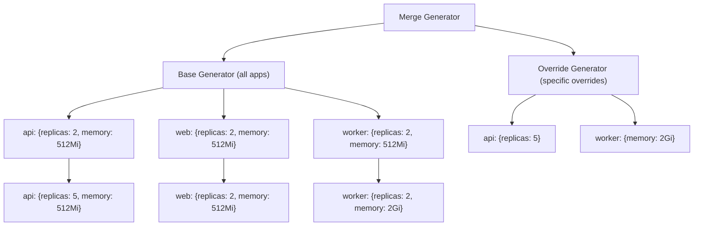

# How to Use Merge Generator in ApplicationSets

Author: [nawazdhandala](https://github.com/nawazdhandala)

Tags: ArgoCD, GitOps, Kubernetes, ApplicationSets

Description: Master the ArgoCD ApplicationSet Merge generator to combine multiple generators with override capabilities for flexible multi-source application configuration.

---

The Merge generator in ArgoCD ApplicationSets combines parameter sets from multiple generators, merging them based on a common key. Unlike the Matrix generator which creates a cartesian product, the Merge generator joins parameter sets - similar to a SQL JOIN operation. This lets you define base configurations in one generator and override specific values in another.

This guide covers Merge generator syntax, key-based merging, override patterns, and practical use cases for multi-environment deployments.

## How the Merge Generator Works

The Merge generator takes multiple child generators and a `mergeKeys` field that specifies which parameters to use as the join key. The first generator provides the base parameter sets. Subsequent generators override matching parameters.



## Basic Merge: Base Config with Overrides

Define default parameters for all applications, then override specific ones.

```yaml
apiVersion: argoproj.io/v1alpha1
kind: ApplicationSet
metadata:
  name: services-with-overrides
  namespace: argocd
spec:
  generators:
  - merge:
      # Merge on the 'appName' key
      mergeKeys:
      - appName
      generators:
      # Base generator: defaults for all apps
      - list:
          elements:
          - appName: api-gateway
            path: services/api-gateway
            replicas: "2"
            memory: "512Mi"
            environment: production
          - appName: user-service
            path: services/user-service
            replicas: "2"
            memory: "512Mi"
            environment: production
          - appName: payment-service
            path: services/payment-service
            replicas: "2"
            memory: "512Mi"
            environment: production
      # Override generator: specific overrides for some apps
      - list:
          elements:
          - appName: api-gateway
            replicas: "5"    # Override: more replicas for gateway
            memory: "1Gi"    # Override: more memory for gateway
          - appName: payment-service
            replicas: "3"    # Override: payment needs more replicas
  template:
    metadata:
      name: '{{appName}}'
    spec:
      project: default
      source:
        repoURL: https://github.com/myorg/platform
        targetRevision: main
        path: '{{path}}'
        helm:
          parameters:
          - name: replicaCount
            value: '{{replicas}}'
          - name: resources.requests.memory
            value: '{{memory}}'
      destination:
        server: https://kubernetes.default.svc
        namespace: '{{appName}}'
```

The result:
- api-gateway: replicas=5, memory=1Gi (overridden)
- user-service: replicas=2, memory=512Mi (defaults)
- payment-service: replicas=3, memory=512Mi (replicas overridden, memory default)

## Merge with Git Directory and List Override

Discover applications from a Git repository, then apply environment-specific overrides.

```yaml
apiVersion: argoproj.io/v1alpha1
kind: ApplicationSet
metadata:
  name: dynamic-services-with-overrides
  namespace: argocd
spec:
  generators:
  - merge:
      mergeKeys:
      - path.basename
      generators:
      # Base: discover all services from Git
      - git:
          repoURL: https://github.com/myorg/services
          revision: main
          directories:
          - path: services/*
      # Override: specific configuration for known services
      - list:
          elements:
          - path.basename: api-gateway
            targetCluster: https://api-cluster.example.com
            syncWave: "1"
          - path.basename: database-migrator
            targetCluster: https://db-cluster.example.com
            syncWave: "0"
  template:
    metadata:
      name: '{{path.basename}}'
      annotations:
        argocd.argoproj.io/sync-wave: '{{syncWave}}'
    spec:
      project: default
      source:
        repoURL: https://github.com/myorg/services
        targetRevision: main
        path: '{{path}}'
      destination:
        server: '{{targetCluster}}'
        namespace: '{{path.basename}}'
```

Services that have overrides get the specific cluster and sync wave. Services without overrides use whatever the template renders (which would need default handling via Go templates).

## Multiple Override Layers

The Merge generator supports more than two generators. Each subsequent generator can override values from previous ones. Think of it as layered configuration.

```yaml
generators:
- merge:
    mergeKeys:
    - appName
    generators:
    # Layer 1: defaults
    - list:
        elements:
        - appName: api
          replicas: "1"
          image: myorg/api:latest
          env: dev
        - appName: web
          replicas: "1"
          image: myorg/web:latest
          env: dev
    # Layer 2: staging overrides
    - list:
        elements:
        - appName: api
          replicas: "2"
          env: staging
        - appName: web
          replicas: "2"
          env: staging
    # Layer 3: production overrides (wins over layer 2)
    - list:
        elements:
        - appName: api
          replicas: "5"
          image: myorg/api:v2.1.0
          env: production
```

For the `api` app, the final values are: replicas=5, image=myorg/api:v2.1.0, env=production. Each layer overrides the previous one.

## Merge Keys with Multiple Fields

You can merge on multiple keys to create more specific join conditions.

```yaml
generators:
- merge:
    # Merge on both app name AND cluster
    mergeKeys:
    - appName
    - cluster
    generators:
    - list:
        elements:
        - appName: api
          cluster: us-east
          replicas: "3"
        - appName: api
          cluster: us-west
          replicas: "3"
        - appName: api
          cluster: eu-west
          replicas: "3"
    - list:
        elements:
        # Only override api in us-east
        - appName: api
          cluster: us-east
          replicas: "5"
```

## Handling Missing Override Keys

When the override generator does not provide a value for a parameter, the base generator's value is preserved. This is the expected behavior and the core value of the Merge generator.

However, when the base generator does not provide a parameter that the override does, the result includes the new parameter. This can cause issues if your template references parameters that only some parameter sets have.

Use Go templates with default values to handle this safely.

```yaml
spec:
  goTemplate: true
  generators:
  - merge:
      mergeKeys:
      - name
      generators:
      - list:
          elements:
          - name: basic-app
            path: apps/basic
      - list:
          elements:
          - name: basic-app
            customDomain: app.example.com
  template:
    metadata:
      name: '{{ .name }}'
      annotations:
        # Use default if customDomain is not set
        domain: '{{ default "default.example.com" .customDomain }}'
```

## Debugging Merge Generator

When merged results do not match expectations, check the merge keys and parameter names carefully.

```bash
# Check ApplicationSet status
kubectl get applicationset services-with-overrides -n argocd -o yaml

# Look for merge-related messages in logs
kubectl logs -n argocd deployment/argocd-applicationset-controller \
  | grep -i "merge"

# Verify generated Applications
kubectl get applications -n argocd -l app.kubernetes.io/managed-by=applicationset-controller
```

The Merge generator is the right tool when you have a base set of applications that mostly share the same configuration but need targeted overrides. It keeps your ApplicationSet DRY by avoiding repetition of common parameters while allowing surgical customization where needed.
