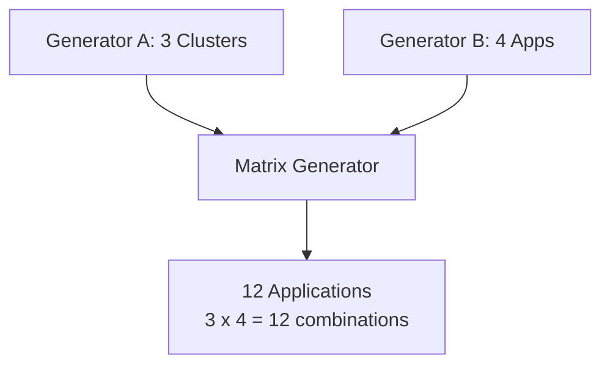

# How to Nest Generators with Matrix Generator in ArgoCD ApplicationSets

Author: [nawazdhandala](https://github.com/nawazdhandala)

Tags: ArgoCD, GitOps, Kubernetes, ApplicationSets, Matrix Generator

Description: Learn how to nest generators using the matrix generator in ArgoCD ApplicationSets to create complex multi-dimensional application deployments.

---

The matrix generator in ArgoCD ApplicationSets produces the cartesian product of two generators. But what if two dimensions are not enough? Nested matrix generators let you combine three or more generators, creating multi-dimensional deployments that would otherwise require massive amounts of duplicated YAML.

This guide covers how matrix generator nesting works, practical patterns for multi-dimensional deployments, and the limitations you need to be aware of.

## How the Matrix Generator Works

The matrix generator takes exactly two child generators and produces every possible combination of their outputs. If generator A produces 3 items and generator B produces 4 items, the matrix produces 3 x 4 = 12 parameter sets.



## Basic Matrix Example

Before nesting, here is a standard two-dimensional matrix.

```yaml
apiVersion: argoproj.io/v1alpha1
kind: ApplicationSet
metadata:
  name: basic-matrix
  namespace: argocd
spec:
  generators:
    - matrix:
        generators:
          # Dimension 1: Clusters
          - clusters:
              selector:
                matchLabels:
                  tier: production
          # Dimension 2: Applications
          - list:
              elements:
                - app: frontend
                  port: "80"
                - app: backend
                  port: "8080"
                - app: worker
                  port: "9090"
  template:
    metadata:
      name: '{{app}}-{{name}}'
    spec:
      project: default
      source:
        repoURL: https://github.com/myorg/apps.git
        targetRevision: HEAD
        path: '{{app}}'
      destination:
        server: '{{server}}'
        namespace: '{{app}}'
```

## Nesting Matrix Generators

To add a third dimension, nest a matrix generator inside another matrix generator.

```yaml
apiVersion: argoproj.io/v1alpha1
kind: ApplicationSet
metadata:
  name: nested-matrix
  namespace: argocd
spec:
  goTemplate: true
  goTemplateOptions: ["missingkey=error"]
  generators:
    - matrix:
        generators:
          # Outer dimension: Environments
          - list:
              elements:
                - env: dev
                  cluster: https://dev.example.com
                  branch: develop
                - env: staging
                  cluster: https://staging.example.com
                  branch: release
                - env: production
                  cluster: https://prod.example.com
                  branch: main
          # Inner matrix: Services x Configurations
          - matrix:
              generators:
                - list:
                    elements:
                      - service: api
                        chart_path: charts/api
                      - service: web
                        chart_path: charts/web
                - list:
                    elements:
                      - variant: default
                        values_suffix: ""
                      - variant: canary
                        values_suffix: "-canary"
  template:
    metadata:
      name: '{{.service}}-{{.variant}}-{{.env}}'
      labels:
        service: '{{.service}}'
        env: '{{.env}}'
        variant: '{{.variant}}'
    spec:
      project: '{{.env}}'
      source:
        repoURL: https://github.com/myorg/services.git
        targetRevision: '{{.branch}}'
        path: '{{.chart_path}}'
        helm:
          valueFiles:
            - 'values-{{.env}}{{.values_suffix}}.yaml'
      destination:
        server: '{{.cluster}}'
        namespace: '{{.service}}-{{.variant}}'
      syncPolicy:
        automated:
          selfHeal: true
        syncOptions:
          - CreateNamespace=true
```

This creates 3 (environments) x 2 (services) x 2 (variants) = 12 applications. Each combination gets its own Application with the merged parameters from all three dimensions.

## Nesting Matrix with Cluster Generator

A common pattern is to combine the cluster generator with a Git directory generator and an environment list.

```yaml
apiVersion: argoproj.io/v1alpha1
kind: ApplicationSet
metadata:
  name: fleet-services
  namespace: argocd
spec:
  goTemplate: true
  goTemplateOptions: ["missingkey=error"]
  generators:
    - matrix:
        generators:
          # Dimension 1: All production clusters
          - clusters:
              selector:
                matchLabels:
                  environment: production
          # Dimension 2: All services from Git
          - git:
              repoURL: https://github.com/myorg/platform.git
              revision: HEAD
              directories:
                - path: 'services/*'
  template:
    metadata:
      name: '{{.path.basename}}-{{.name}}'
      labels:
        service: '{{.path.basename}}'
        cluster: '{{.name}}'
    spec:
      project: production
      source:
        repoURL: https://github.com/myorg/platform.git
        targetRevision: HEAD
        path: 'services/{{.path.basename}}'
      destination:
        server: '{{.server}}'
        namespace: '{{.path.basename}}'
      syncPolicy:
        automated:
          selfHeal: true
        syncOptions:
          - CreateNamespace=true
```

Now nest this with an additional dimension for deployment tiers:

```yaml
apiVersion: argoproj.io/v1alpha1
kind: ApplicationSet
metadata:
  name: tiered-fleet-services
  namespace: argocd
spec:
  goTemplate: true
  goTemplateOptions: ["missingkey=error"]
  generators:
    - matrix:
        generators:
          # Dimension 1: Deployment tiers
          - list:
              elements:
                - tier: core
                  sync_policy: automated
                - tier: optional
                  sync_policy: manual
          # Nested matrix: Clusters x Services
          - matrix:
              generators:
                - clusters:
                    selector:
                      matchLabels:
                        environment: production
                - git:
                    repoURL: https://github.com/myorg/platform.git
                    revision: HEAD
                    directories:
                      - path: 'services/{{.tier}}/*'
  template:
    metadata:
      name: '{{.path.basename}}-{{.name}}'
      labels:
        tier: '{{.tier}}'
        cluster: '{{.name}}'
    spec:
      project: production
      source:
        repoURL: https://github.com/myorg/platform.git
        targetRevision: HEAD
        path: '{{.path}}'
      destination:
        server: '{{.server}}'
        namespace: '{{.path.basename}}'
```

## Parameter Merging in Nested Matrices

When generators are nested, parameters from all levels are merged into a single flat parameter set. If two generators produce a parameter with the same key, the value from the later (inner) generator takes precedence.

```yaml
generators:
  - matrix:
      generators:
        # Outer: provides "name" as cluster name
        - clusters: {}
        # Inner: also provides "name" as app name
        - list:
            elements:
              - name: frontend  # CONFLICT with cluster "name"!
```

To avoid conflicts, use distinct parameter names:

```yaml
generators:
  - matrix:
      generators:
        - clusters: {}
        - list:
            elements:
              # Use "app" instead of "name" to avoid conflict
              - app: frontend
                app_namespace: frontend
```

## Three-Level Nesting: Environments x Clusters x Services

Here is a complete example with three fully nested levels.

```yaml
apiVersion: argoproj.io/v1alpha1
kind: ApplicationSet
metadata:
  name: three-level-matrix
  namespace: argocd
spec:
  goTemplate: true
  goTemplateOptions: ["missingkey=error"]
  generators:
    - matrix:
        generators:
          # Level 1: Environments
          - list:
              elements:
                - env: dev
                  values_prefix: dev
                - env: staging
                  values_prefix: staging
                - env: production
                  values_prefix: prod
          # Level 2+3: Clusters per env x Services
          - matrix:
              generators:
                # Level 2: Clusters (filtered by env label)
                - clusters:
                    selector:
                      matchLabels:
                        environment: '{{.env}}'
                # Level 3: Services from Git
                - list:
                    elements:
                      - svc: api-gateway
                        svc_port: "8080"
                      - svc: auth-service
                        svc_port: "8081"
                      - svc: user-service
                        svc_port: "8082"
  template:
    metadata:
      name: '{{.svc}}-{{.name}}'
      labels:
        env: '{{.env}}'
        service: '{{.svc}}'
        cluster: '{{.name}}'
    spec:
      project: '{{.env}}'
      source:
        repoURL: https://github.com/myorg/services.git
        targetRevision: HEAD
        path: '{{.svc}}'
        helm:
          valueFiles:
            - 'values.yaml'
            - 'values-{{.values_prefix}}.yaml'
          parameters:
            - name: service.port
              value: '{{.svc_port}}'
      destination:
        server: '{{.server}}'
        namespace: '{{.svc}}'
      syncPolicy:
        automated:
          selfHeal: true
        syncOptions:
          - CreateNamespace=true
```

## Limitations and Best Practices

The matrix generator has some important constraints.

First, nesting depth is limited. ArgoCD supports up to two levels of nesting (a matrix inside a matrix). Going deeper than that is not supported and will produce errors.

Second, the number of generated applications grows multiplicatively. Three generators producing 5, 10, and 8 items respectively create 400 applications. Monitor your ApplicationSet controller's resource usage.

```bash
# Check how many applications a matrix produces
kubectl get applications -n argocd -l app.kubernetes.io/managed-by=applicationset-controller | wc -l

# Monitor ApplicationSet controller resources
kubectl top pod -n argocd -l app.kubernetes.io/name=argocd-applicationset-controller
```

Third, use post selectors to reduce the output if the full cartesian product is too large.

```yaml
generators:
  - matrix:
      generators:
        - list:
            elements:
              - env: dev
              - env: production
        - list:
            elements:
              - app: debug-tool
                env_filter: dev
              - app: frontend
                env_filter: all
      # Only keep valid combinations
      selector:
        matchExpressions:
          - key: env_filter
            operator: In
            values:
              - all
              - '{{env}}'
```

Nested matrix generators are the power tool for multi-dimensional ApplicationSets. Use them thoughtfully, and they will manage hundreds of applications from a single definition. For monitoring the large number of applications that nested matrices produce, [OneUptime](https://oneuptime.com/blog/post/2026-02-26-argocd-applicationset-git-file-globbing/view) provides centralized observability across all dimensions of your deployment.
