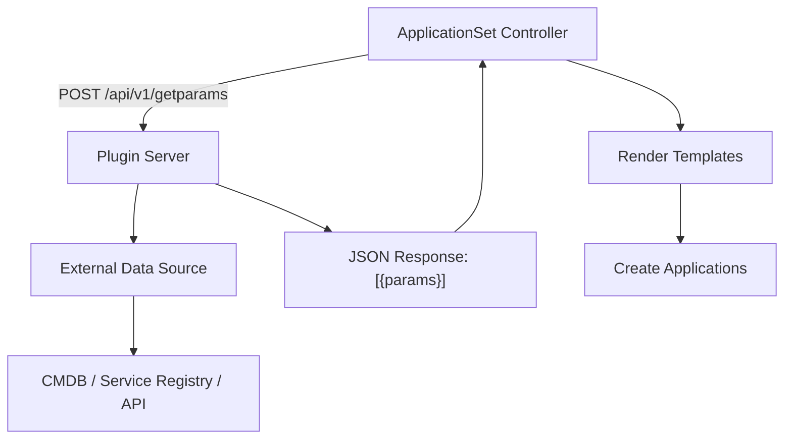

# How to Use Plugin Generator in ApplicationSets

Author: [nawazdhandala](https://github.com/nawazdhandala)

Tags: ArgoCD, GitOps, Kubernetes, ApplicationSets

Description: Learn how to use the ArgoCD ApplicationSet Plugin generator to create custom generators that call external APIs or run scripts to produce application parameters dynamically.

---

The Plugin generator in ArgoCD ApplicationSets lets you call an external HTTP endpoint to produce parameter sets. When the built-in generators (List, Git, Cluster, SCM) do not cover your use case, the Plugin generator gives you a way to integrate any external system - a CMDB, a service registry, a custom API, or any data source that can respond to HTTP requests.

This guide covers Plugin generator configuration, building a plugin server, authentication, and practical integration patterns.

## How the Plugin Generator Works

The Plugin generator sends an HTTP POST request to a configured endpoint. The endpoint must return a JSON response containing a list of parameter sets. The ApplicationSet controller uses those parameter sets to render templates and create Applications.



## Enabling the Plugin Generator

The Plugin generator is not enabled by default. You need to configure it in the ApplicationSet controller.

```yaml
# argocd-cmd-params-cm ConfigMap
apiVersion: v1
kind: ConfigMap
metadata:
  name: argocd-cmd-params-cm
  namespace: argocd
data:
  # Enable plugin generators
  applicationsetcontroller.enable.plugin: "true"
```

Restart the ApplicationSet controller after changing the ConfigMap.

```bash
kubectl rollout restart deployment argocd-applicationset-controller -n argocd
```

## Configuring a Plugin Generator

Register your plugin in a ConfigMap that the ApplicationSet controller reads.

```yaml
# Plugin configuration
apiVersion: v1
kind: ConfigMap
metadata:
  name: applicationset-plugin-config
  namespace: argocd
data:
  token: "$plugin.token"
  baseUrl: "http://plugin-server.argocd.svc.cluster.local:8080"
```

Then reference the plugin in your ApplicationSet.

```yaml
apiVersion: argoproj.io/v1alpha1
kind: ApplicationSet
metadata:
  name: plugin-driven-apps
  namespace: argocd
spec:
  generators:
  - plugin:
      configMapRef:
        name: applicationset-plugin-config
      # Input parameters sent to the plugin
      input:
        parameters:
          environment: production
          team: backend
      # How often to poll the plugin (seconds)
      requeueAfterSeconds: 300
  template:
    metadata:
      name: '{{name}}'
      labels:
        team: '{{team}}'
    spec:
      project: default
      source:
        repoURL: '{{repoUrl}}'
        targetRevision: '{{branch}}'
        path: '{{deployPath}}'
      destination:
        server: '{{clusterUrl}}'
        namespace: '{{namespace}}'
      syncPolicy:
        automated:
          prune: true
          selfHeal: true
```

## Building a Plugin Server

The plugin server must implement a single endpoint that accepts POST requests and returns parameter sets.

Here is a minimal plugin server in Python.

```python
# plugin_server.py
from flask import Flask, request, jsonify

app = Flask(__name__)

@app.route('/api/v1/getparams.execute', methods=['POST'])
def get_params():
    # Read input parameters from the request
    req = request.json
    input_params = req.get('input', {}).get('parameters', {})

    environment = input_params.get('environment', 'dev')
    team = input_params.get('team', '')

    # Query your data source
    # This could be a CMDB, database, API, etc.
    services = fetch_services(environment, team)

    # Return parameter sets
    output = {
        "output": {
            "parameters": [
                {
                    "name": svc['name'],
                    "repoUrl": svc['repository'],
                    "branch": svc.get('branch', 'main'),
                    "deployPath": svc.get('deploy_path', 'deploy/'),
                    "namespace": svc['namespace'],
                    "clusterUrl": svc['cluster_url'],
                    "team": team
                }
                for svc in services
            ]
        }
    }

    return jsonify(output)


def fetch_services(environment, team):
    """
    Replace this with your actual data source query.
    This example returns static data.
    """
    return [
        {
            "name": "api-gateway",
            "repository": "https://github.com/myorg/api-gateway",
            "namespace": "api",
            "cluster_url": "https://prod.example.com",
            "deploy_path": "deploy/production"
        },
        {
            "name": "user-service",
            "repository": "https://github.com/myorg/user-service",
            "namespace": "users",
            "cluster_url": "https://prod.example.com",
            "deploy_path": "deploy/production"
        }
    ]


if __name__ == '__main__':
    app.run(host='0.0.0.0', port=8080)
```

## Deploying the Plugin Server

Deploy the plugin server in the same cluster as ArgoCD for easy networking.

```yaml
apiVersion: apps/v1
kind: Deployment
metadata:
  name: plugin-server
  namespace: argocd
spec:
  replicas: 2
  selector:
    matchLabels:
      app: appset-plugin
  template:
    metadata:
      labels:
        app: appset-plugin
    spec:
      containers:
      - name: plugin
        image: myorg/appset-plugin:latest
        ports:
        - containerPort: 8080
        env:
        - name: DATABASE_URL
          valueFrom:
            secretKeyRef:
              name: plugin-db-creds
              key: url
        readinessProbe:
          httpGet:
            path: /health
            port: 8080
          initialDelaySeconds: 5
          periodSeconds: 10
---
apiVersion: v1
kind: Service
metadata:
  name: plugin-server
  namespace: argocd
spec:
  selector:
    app: appset-plugin
  ports:
  - port: 8080
    targetPort: 8080
```

## Authentication

Secure your plugin endpoint with token-based authentication. The token is stored in a Kubernetes secret and passed in the request header.

```bash
# Create the plugin token secret
kubectl create secret generic argocd-appset-plugin-token -n argocd \
  --from-literal=plugin.token=your-secret-token-here
```

The plugin server should validate the token.

```python
@app.before_request
def verify_token():
    token = request.headers.get('Authorization', '').replace('Bearer ', '')
    if token != os.environ.get('PLUGIN_TOKEN'):
        return jsonify({"error": "unauthorized"}), 401
```

## CMDB Integration Example

A common use case is integrating with a Configuration Management Database (CMDB) to determine which applications should be deployed where.

```python
@app.route('/api/v1/getparams.execute', methods=['POST'])
def get_params():
    req = request.json
    environment = req['input']['parameters'].get('environment')

    # Query ServiceNow CMDB
    response = requests.get(
        f"https://myorg.service-now.com/api/now/table/cmdb_ci_service",
        params={
            "sysparm_query": f"environment={environment}^operational_status=1",
            "sysparm_fields": "name,u_repository,u_namespace,u_cluster"
        },
        auth=(SNOW_USER, SNOW_PASS)
    )

    services = response.json()['result']

    return jsonify({
        "output": {
            "parameters": [
                {
                    "name": svc['name'],
                    "repoUrl": svc['u_repository'],
                    "namespace": svc['u_namespace'],
                    "clusterUrl": svc['u_cluster']
                }
                for svc in services
            ]
        }
    })
```

## Error Handling

When the plugin server returns an error or is unreachable, the ApplicationSet controller preserves existing Applications. It does not delete Applications due to a temporary plugin failure.

Implement proper error handling in your plugin.

```python
@app.route('/api/v1/getparams.execute', methods=['POST'])
def get_params():
    try:
        services = fetch_services()
        return jsonify({"output": {"parameters": services}})
    except Exception as e:
        # Return 500 to signal error
        # Controller will retry and preserve existing apps
        return jsonify({"error": str(e)}), 500
```

## Monitoring Plugin Health

Track the health and performance of your plugin server.

```bash
# Check plugin server logs
kubectl logs -n argocd -l app=appset-plugin --tail=50

# Check ApplicationSet controller logs for plugin calls
kubectl logs -n argocd deployment/argocd-applicationset-controller \
  | grep -i "plugin"

# Verify plugin endpoint is reachable
kubectl exec -n argocd deployment/argocd-applicationset-controller -- \
  curl -s http://plugin-server.argocd.svc.cluster.local:8080/health
```

The Plugin generator is the escape hatch for any integration that the built-in generators cannot handle. Whether you need to pull application metadata from a CMDB, service catalog, custom database, or any API, the Plugin generator lets you extend ApplicationSets to fit your organization's unique requirements.
