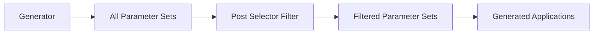

# How to Use Post Selectors to Filter Generated Applications

Author: [nawazdhandala](https://github.com/nawazdhandala)

Tags: ArgoCD, GitOps, Kubernetes, ApplicationSet, Filtering

Description: Learn how to use post selectors in ArgoCD ApplicationSets to filter which applications get generated from your generators using label-based matching.

---

When you work with ArgoCD ApplicationSets, generators can produce a large number of applications. Sometimes you need only a subset of those generated applications to actually be created. That is exactly where post selectors come in. Post selectors let you filter the output of any generator using label-matching expressions, giving you fine-grained control over which applications get deployed.

In this guide, you will learn how post selectors work, how to configure them with different generator types, and practical patterns for real-world filtering scenarios.

## What Are Post Selectors?

Post selectors act as a filtering layer that sits between a generator's output and the final application creation. After a generator produces its list of parameter sets, the post selector evaluates each set against the specified match criteria. Only parameter sets that match the selector criteria will result in an Application being created.

Think of it like a SQL WHERE clause for your generated applications. The generator produces a full result set, and the post selector narrows it down.



## Basic Post Selector Syntax

Post selectors use the `matchLabels` and `matchExpressions` fields, which work identically to Kubernetes label selectors. Here is a simple example with a list generator.

```yaml
apiVersion: argoproj.io/v1alpha1
kind: ApplicationSet
metadata:
  name: my-apps
  namespace: argocd
spec:
  generators:
    - list:
        elements:
          - cluster: production
            url: https://prod.example.com
            env: prod
            region: us-east-1
          - cluster: staging
            url: https://staging.example.com
            env: staging
            region: us-east-1
          - cluster: development
            url: https://dev.example.com
            env: dev
            region: eu-west-1
        # Post selector filters the output
        selector:
          matchLabels:
            env: prod
  template:
    metadata:
      name: 'app-{{cluster}}'
    spec:
      project: default
      source:
        repoURL: https://github.com/myorg/manifests.git
        targetRevision: HEAD
        path: 'overlays/{{env}}'
      destination:
        server: '{{url}}'
        namespace: my-app
```

In this example, even though the list generator defines three clusters, only the production cluster passes the post selector filter. Only `app-production` will be created.

## Using matchExpressions for Advanced Filtering

When `matchLabels` is not expressive enough, `matchExpressions` gives you operators like `In`, `NotIn`, `Exists`, and `DoesNotExist`.

```yaml
apiVersion: argoproj.io/v1alpha1
kind: ApplicationSet
metadata:
  name: multi-env-apps
  namespace: argocd
spec:
  generators:
    - list:
        elements:
          - cluster: prod-us
            url: https://prod-us.example.com
            env: prod
            region: us-east-1
            tier: critical
          - cluster: prod-eu
            url: https://prod-eu.example.com
            env: prod
            region: eu-west-1
            tier: critical
          - cluster: staging
            url: https://staging.example.com
            env: staging
            region: us-east-1
            tier: standard
          - cluster: dev
            url: https://dev.example.com
            env: dev
            region: us-east-1
            tier: standard
        # Only deploy to non-dev environments in us-east-1
        selector:
          matchExpressions:
            - key: env
              operator: NotIn
              values:
                - dev
            - key: region
              operator: In
              values:
                - us-east-1
  template:
    metadata:
      name: 'myapp-{{cluster}}'
    spec:
      project: default
      source:
        repoURL: https://github.com/myorg/manifests.git
        targetRevision: HEAD
        path: 'envs/{{env}}'
      destination:
        server: '{{url}}'
        namespace: myapp
```

This configuration deploys to `prod-us` and `staging` only, since those are the non-dev clusters in `us-east-1`.

## Post Selectors with Cluster Generator

Post selectors are especially useful with the cluster generator because it automatically pulls in cluster labels from ArgoCD's cluster definitions.

```yaml
apiVersion: argoproj.io/v1alpha1
kind: ApplicationSet
metadata:
  name: monitoring-stack
  namespace: argocd
spec:
  generators:
    - clusters:
        # The cluster generator pulls all registered clusters
        selector:
          matchLabels:
            environment: production
          matchExpressions:
            - key: cloud-provider
              operator: In
              values:
                - aws
                - gcp
  template:
    metadata:
      name: 'monitoring-{{name}}'
    spec:
      project: monitoring
      source:
        repoURL: https://github.com/myorg/monitoring.git
        targetRevision: HEAD
        path: monitoring-stack
      destination:
        server: '{{server}}'
        namespace: monitoring
```

Here, the cluster generator discovers all clusters registered in ArgoCD but the selector ensures only production clusters running on AWS or GCP get the monitoring stack deployed.

## Post Selectors with Git Generator

When using the Git directory or file generator, post selectors filter based on the parameters extracted from your Git repo structure.

```yaml
apiVersion: argoproj.io/v1alpha1
kind: ApplicationSet
metadata:
  name: team-services
  namespace: argocd
spec:
  generators:
    - git:
        repoURL: https://github.com/myorg/services.git
        revision: HEAD
        files:
          - path: 'services/*/config.json'
        selector:
          matchExpressions:
            - key: deploy
              operator: NotIn
              values:
                - "false"
  template:
    metadata:
      name: '{{service_name}}'
    spec:
      project: default
      source:
        repoURL: https://github.com/myorg/services.git
        targetRevision: HEAD
        path: 'services/{{service_name}}/manifests'
      destination:
        server: https://kubernetes.default.svc
        namespace: '{{namespace}}'
```

Each `config.json` file would contain parameters like `service_name`, `namespace`, and `deploy`. Services with `deploy: "false"` get filtered out by the post selector.

## Post Selectors with Matrix Generator

When combining generators with the matrix generator, post selectors can be applied at different levels.

```yaml
apiVersion: argoproj.io/v1alpha1
kind: ApplicationSet
metadata:
  name: apps-per-cluster
  namespace: argocd
spec:
  generators:
    - matrix:
        generators:
          # First generator: clusters
          - clusters:
              selector:
                matchLabels:
                  tier: production
          # Second generator: list of apps
          - list:
              elements:
                - app: frontend
                  cpu: "500m"
                - app: backend
                  cpu: "1000m"
                - app: worker
                  cpu: "2000m"
        # Post selector on the combined output
        selector:
          matchExpressions:
            - key: app
              operator: NotIn
              values:
                - worker
  template:
    metadata:
      name: '{{name}}-{{app}}'
    spec:
      project: default
      source:
        repoURL: https://github.com/myorg/apps.git
        targetRevision: HEAD
        path: '{{app}}'
      destination:
        server: '{{server}}'
        namespace: '{{app}}'
```

The matrix produces combinations of every cluster with every app. The post selector then removes all `worker` combinations, so only `frontend` and `backend` deploy to the production clusters.

## Combining matchLabels and matchExpressions

You can use both matchLabels and matchExpressions together. Both conditions must be satisfied (they are ANDed).

```yaml
selector:
  matchLabels:
    region: us-east-1
  matchExpressions:
    - key: env
      operator: In
      values:
        - production
        - staging
    - key: maintenance
      operator: DoesNotExist
```

This selector matches parameter sets that are in `us-east-1`, have environment set to either `production` or `staging`, and do not have a `maintenance` key defined.

## Practical Pattern: Gradual Rollouts

Post selectors enable a manual canary-style rollout. You can update the selector to progressively include more targets.

```yaml
# Phase 1: Deploy to canary only
selector:
  matchLabels:
    rollout-group: canary

# Phase 2: Expand to canary + region-1
selector:
  matchExpressions:
    - key: rollout-group
      operator: In
      values:
        - canary
        - region-1

# Phase 3: Deploy everywhere (remove selector)
# Simply remove the selector block
```

This pattern works well when you want human-controlled progressive delivery without the complexity of automated rollout tools.

## Debugging Post Selectors

When post selectors do not produce the expected results, use the ArgoCD CLI to inspect what the ApplicationSet generates.

```bash
# List all applications generated by the ApplicationSet
argocd appset get my-apps --output json | jq '.status.resources'

# Check the ApplicationSet status for generation errors
kubectl describe applicationset my-apps -n argocd
```

If no applications are generated, check that your parameter keys in the selector match the actual parameter names produced by the generator. A common mistake is using a key name that does not exist in the generator output, which causes the selector to filter out everything.

## Key Things to Remember

Post selectors operate on the string values of generator parameters, not on Kubernetes labels. The parameter names from your generator become the "label keys" for selector matching. All values are treated as strings, so `matchLabels: { replicas: "3" }` needs the value quoted as a string in the element definition.

Post selectors evaluate after the generator runs but before applications are created. They cannot modify the parameter values, only filter which parameter sets pass through.

For monitoring your ApplicationSet deployments and ensuring healthy applications across clusters, consider using [OneUptime](https://oneuptime.com/blog/post/2026-02-26-argocd-applicationset-deploy-all-clusters/view) to track deployment status and receive alerts when applications drift or fail to sync.

Post selectors are one of the most practical tools in the ApplicationSet toolkit. They give you the flexibility to use broad generators while still maintaining precise control over which applications actually get created.
