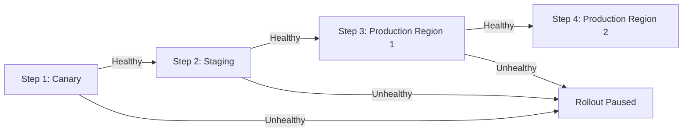

# How to Use Progressive Syncs in ArgoCD ApplicationSets

Author: [nawazdhandala](https://github.com/nawazdhandala)

Tags: ArgoCD, GitOps, Kubernetes, ApplicationSet, Progressive Delivery

Description: Learn how to use progressive syncs in ArgoCD ApplicationSets to roll out changes gradually across environments and clusters with controlled rollout steps.

---

When you manage dozens or hundreds of applications with an ApplicationSet, updating the template applies changes to all generated applications simultaneously. Progressive syncs solve this by letting you define a rollout order, syncing applications in stages rather than all at once. If something breaks in the first stage, the remaining stages are paused, preventing a bad change from cascading across your entire infrastructure.

This guide walks through configuring progressive syncs, defining rollout steps, and handling real-world rollout scenarios.

## What Are Progressive Syncs?

Progressive syncs use the `RollingSync` strategy in ApplicationSets. Instead of updating all generated Applications at once, the controller processes them in defined steps. Each step specifies which Applications to sync using label selectors. The controller waits for all Applications in a step to become healthy before proceeding to the next step.



## Basic Progressive Sync Configuration

Here is a minimal example that rolls out changes first to staging, then to production.

```yaml
apiVersion: argoproj.io/v1alpha1
kind: ApplicationSet
metadata:
  name: progressive-rollout
  namespace: argocd
spec:
  strategy:
    type: RollingSync
    rollingSync:
      steps:
        # Step 1: Deploy to staging first
        - matchExpressions:
            - key: env
              operator: In
              values:
                - staging
        # Step 2: Deploy to production after staging is healthy
        - matchExpressions:
            - key: env
              operator: In
              values:
                - production
  generators:
    - list:
        elements:
          - name: myapp
            env: staging
            cluster: https://staging.example.com
          - name: myapp
            env: production
            cluster: https://prod.example.com
  template:
    metadata:
      name: 'myapp-{{env}}'
      labels:
        # Labels must match the step selectors
        env: '{{env}}'
    spec:
      project: default
      source:
        repoURL: https://github.com/myorg/apps.git
        targetRevision: HEAD
        path: myapp/overlays/{{env}}
      destination:
        server: '{{cluster}}'
        namespace: myapp
      syncPolicy:
        automated:
          prune: true
          selfHeal: true
```

The labels on the generated Applications must match the `matchExpressions` in the rollout steps. The controller uses these labels to determine which Applications belong to each step.

## Multi-Step Regional Rollout

For organizations with multiple production regions, progressive syncs enable a safe region-by-region rollout.

```yaml
apiVersion: argoproj.io/v1alpha1
kind: ApplicationSet
metadata:
  name: regional-rollout
  namespace: argocd
spec:
  strategy:
    type: RollingSync
    rollingSync:
      steps:
        # Step 1: Canary region (lowest traffic)
        - matchExpressions:
            - key: rollout-group
              operator: In
              values:
                - canary
        # Step 2: Secondary regions
        - matchExpressions:
            - key: rollout-group
              operator: In
              values:
                - secondary
        # Step 3: Primary regions (highest traffic)
        - matchExpressions:
            - key: rollout-group
              operator: In
              values:
                - primary
  generators:
    - clusters:
        selector:
          matchLabels:
            tier: production
  template:
    metadata:
      name: 'payment-svc-{{name}}'
      labels:
        app: payment-svc
        # The rollout-group label comes from cluster labels
        rollout-group: '{{metadata.labels.rollout-group}}'
    spec:
      project: payments
      source:
        repoURL: https://github.com/myorg/payment-svc.git
        targetRevision: HEAD
        path: deploy
      destination:
        server: '{{server}}'
        namespace: payment-svc
      syncPolicy:
        automated:
          selfHeal: true
```

For this to work, your clusters need the `rollout-group` label set appropriately:

```bash
# Label your clusters for rollout grouping
argocd cluster set prod-us-east-1 --label rollout-group=canary
argocd cluster set prod-us-west-2 --label rollout-group=secondary
argocd cluster set prod-eu-west-1 --label rollout-group=secondary
argocd cluster set prod-ap-southeast-1 --label rollout-group=primary
argocd cluster set prod-us-east-2 --label rollout-group=primary
```

## Progressive Sync with maxUpdate

You can limit how many Applications are updated simultaneously within a step using `maxUpdate`.

```yaml
apiVersion: argoproj.io/v1alpha1
kind: ApplicationSet
metadata:
  name: throttled-rollout
  namespace: argocd
spec:
  strategy:
    type: RollingSync
    rollingSync:
      steps:
        - matchExpressions:
            - key: env
              operator: In
              values:
                - staging
          # Update all staging apps at once
          maxUpdate: 100%
        - matchExpressions:
            - key: env
              operator: In
              values:
                - production
          # Update production apps 2 at a time
          maxUpdate: 2
  generators:
    - matrix:
        generators:
          - list:
              elements:
                - env: staging
                  cluster: https://staging.example.com
                - env: production
                  cluster: https://prod-1.example.com
                - env: production
                  cluster: https://prod-2.example.com
                - env: production
                  cluster: https://prod-3.example.com
                - env: production
                  cluster: https://prod-4.example.com
          - list:
              elements:
                - app: frontend
                - app: backend
                - app: worker
  template:
    metadata:
      name: '{{app}}-{{env}}-{{cluster}}'
      labels:
        env: '{{env}}'
        app: '{{app}}'
    spec:
      project: default
      source:
        repoURL: https://github.com/myorg/apps.git
        targetRevision: HEAD
        path: '{{app}}'
      destination:
        server: '{{cluster}}'
        namespace: '{{app}}'
```

The `maxUpdate: 2` setting means that even though there might be 12 production applications (4 clusters x 3 apps), only 2 will be updated at a time.

## Combining Progressive Sync with Health Checks

Progressive syncs rely on Application health status to gate progression. Make sure your health checks accurately reflect deployment readiness.

```yaml
apiVersion: argoproj.io/v1alpha1
kind: ApplicationSet
metadata:
  name: health-gated-rollout
  namespace: argocd
spec:
  strategy:
    type: RollingSync
    rollingSync:
      steps:
        - matchExpressions:
            - key: phase
              operator: In
              values:
                - canary
        - matchExpressions:
            - key: phase
              operator: In
              values:
                - production
  generators:
    - list:
        elements:
          - name: api
            phase: canary
            cluster: https://canary.example.com
          - name: api
            phase: production
            cluster: https://prod.example.com
  template:
    metadata:
      name: 'api-{{phase}}'
      labels:
        phase: '{{phase}}'
    spec:
      project: default
      source:
        repoURL: https://github.com/myorg/api.git
        targetRevision: HEAD
        path: deploy
      destination:
        server: '{{cluster}}'
        namespace: api
      syncPolicy:
        automated:
          selfHeal: true
        # Retry on transient failures
        retry:
          limit: 3
          backoff:
            duration: 30s
            factor: 2
            maxDuration: 3m
```

The retry policy is important with progressive syncs. Transient failures (like a brief image pull delay) should not permanently block the rollout.

## Monitoring Progressive Sync Status

Check the progress of a rolling sync.

```bash
# View the ApplicationSet status including rollout progress
kubectl get applicationset regional-rollout -n argocd -o yaml | \
  yq '.status'

# Check which step is currently active
kubectl describe applicationset regional-rollout -n argocd

# List all applications with their sync and health status
argocd app list -l app=payment-svc -o wide

# Watch for status changes in real time
kubectl get applications -n argocd -l app=payment-svc -w
```

The ApplicationSet status section shows which step is currently being processed and the health of applications in each step.

## Handling Rollout Failures

When an Application in a step fails to become healthy, the progressive sync pauses. You have several options.

```bash
# Option 1: Fix the issue and let the rollout continue
# Edit the source manifests, push to Git, and wait for sync

# Option 2: Manually sync a specific application
argocd app sync myapp-canary

# Option 3: Roll back the change in Git
git revert HEAD
git push origin main
# The ApplicationSet will sync all applications back to the previous state
```

## Progressive Sync with Go Templates

When using Go templates, make sure your label values are properly formatted.

```yaml
apiVersion: argoproj.io/v1alpha1
kind: ApplicationSet
metadata:
  name: go-template-rollout
  namespace: argocd
spec:
  goTemplate: true
  goTemplateOptions: ["missingkey=error"]
  strategy:
    type: RollingSync
    rollingSync:
      steps:
        - matchExpressions:
            - key: priority
              operator: In
              values:
                - low
        - matchExpressions:
            - key: priority
              operator: In
              values:
                - high
  generators:
    - list:
        elements:
          - name: dev-cluster
            priority: low
            url: https://dev.example.com
          - name: prod-cluster
            priority: high
            url: https://prod.example.com
  template:
    metadata:
      name: 'app-{{.name}}'
      labels:
        priority: '{{.priority}}'
        cluster: '{{.name}}'
    spec:
      project: default
      source:
        repoURL: https://github.com/myorg/apps.git
        targetRevision: HEAD
        path: app
      destination:
        server: '{{.url}}'
        namespace: app
```

## Key Takeaways

Progressive syncs are essential for any production ApplicationSet that manages applications across multiple environments or clusters. The key principles are:

1. Always define canary or staging steps before production steps
2. Use meaningful labels on generated Applications that match your step selectors
3. Ensure your health checks are accurate since they gate progression
4. Set appropriate `maxUpdate` values for production steps
5. Configure retry policies to handle transient failures

For real-time visibility into your progressive rollout status, [OneUptime](https://oneuptime.com/blog/post/2026-02-26-argocd-applicationset-pruning/view) can monitor the health of applications at each rollout stage and alert you when a step fails to progress.
