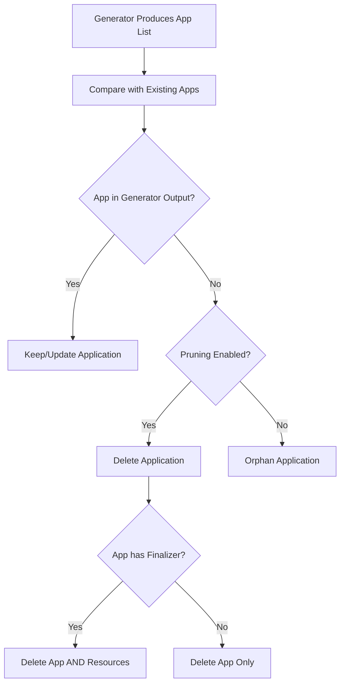

# How to Configure Application Pruning in ArgoCD ApplicationSets

Author: [nawazdhandala](https://github.com/nawazdhandala)

Tags: ArgoCD, GitOps, Kubernetes, ApplicationSets, Lifecycle Management

Description: Learn how to configure application pruning in ArgoCD ApplicationSets to safely handle the removal of generated applications when generator output changes.

---

When an ApplicationSet generator stops producing a particular application - because a directory was deleted, a cluster was removed, or a list entry was taken out - ArgoCD needs to decide what to do with the orphaned Application resource. Pruning controls this cleanup behavior. Getting it wrong can accidentally destroy production workloads. Getting it right keeps your cluster clean without unexpected deletions.

This guide covers how ApplicationSet pruning works, the available options, and how to configure it safely.

## How Pruning Works

ApplicationSet pruning happens during the reconciliation loop. The controller compares the set of Applications that should exist (based on current generator output) with the Applications that actually exist in the cluster. Any Application that exists but is no longer in the generator output is a candidate for pruning.



## Default Pruning Behavior

By default, ApplicationSets will delete Applications that are no longer generated. This is the sync behavior where the set of Applications in the cluster matches exactly what the generators produce.

```yaml
apiVersion: argoproj.io/v1alpha1
kind: ApplicationSet
metadata:
  name: auto-pruning-apps
  namespace: argocd
spec:
  generators:
    - git:
        repoURL: https://github.com/myorg/services.git
        revision: HEAD
        directories:
          - path: 'services/*'
  template:
    metadata:
      name: '{{path.basename}}'
    spec:
      project: default
      source:
        repoURL: https://github.com/myorg/services.git
        targetRevision: HEAD
        path: '{{path}}'
      destination:
        server: https://kubernetes.default.svc
        namespace: '{{path.basename}}'
  # Default: sync (creates, updates, AND deletes)
  # If you remove a services/my-app directory,
  # the my-app Application gets deleted
```

With this configuration, deleting the `services/my-app` directory from Git causes the `my-app` Application to be deleted from ArgoCD.

## Disabling Pruning

To prevent ApplicationSets from deleting Applications, set the `applicationsSync` policy to `create-only` or `create-update`.

```yaml
apiVersion: argoproj.io/v1alpha1
kind: ApplicationSet
metadata:
  name: no-prune-apps
  namespace: argocd
spec:
  generators:
    - list:
        elements:
          - name: database
            namespace: db
          - name: cache
            namespace: cache
  template:
    metadata:
      name: '{{name}}'
    spec:
      project: infrastructure
      source:
        repoURL: https://github.com/myorg/infra.git
        targetRevision: HEAD
        path: '{{name}}'
      destination:
        server: https://kubernetes.default.svc
        namespace: '{{namespace}}'
  # Never delete Applications
  syncPolicy:
    applicationsSync: create-update
```

If you remove `database` from the elements list, the database Application continues to exist. You must manually delete it when ready.

## Controlling Resource Deletion with Finalizers

The Application-level finalizer determines whether deleting an Application also deletes its deployed Kubernetes resources. This interacts with ApplicationSet pruning in a critical way.

```yaml
apiVersion: argoproj.io/v1alpha1
kind: ApplicationSet
metadata:
  name: cascade-delete-apps
  namespace: argocd
spec:
  generators:
    - git:
        repoURL: https://github.com/myorg/services.git
        revision: HEAD
        directories:
          - path: 'services/*'
  template:
    metadata:
      name: '{{path.basename}}'
      # This finalizer means: when the Application is deleted,
      # also delete all its managed Kubernetes resources
      finalizers:
        - resources-finalizer.argocd.argoproj.io
    spec:
      project: default
      source:
        repoURL: https://github.com/myorg/services.git
        targetRevision: HEAD
        path: '{{path}}'
      destination:
        server: https://kubernetes.default.svc
        namespace: '{{path.basename}}'
```

With the `resources-finalizer.argocd.argoproj.io` finalizer, pruning an Application triggers a cascade delete - the Application AND all its Kubernetes resources (Deployments, Services, ConfigMaps, etc.) are removed.

Without the finalizer, pruning only removes the ArgoCD Application resource. The deployed workloads remain running in the cluster as orphaned resources.

```yaml
# Safe option: No finalizer = no cascade delete
template:
  metadata:
    name: '{{path.basename}}'
    # No finalizers - only the Application resource is deleted
    # Kubernetes resources are left intact
  spec:
    # ...
```

## Safe Pruning Strategies for Production

For production environments, consider these patterns.

### Strategy 1: No Prune with Manual Cleanup

The safest approach - never auto-delete, always manually clean up.

```yaml
apiVersion: argoproj.io/v1alpha1
kind: ApplicationSet
metadata:
  name: production-apps
  namespace: argocd
spec:
  generators:
    - clusters:
        selector:
          matchLabels:
            environment: production
  template:
    metadata:
      name: 'app-{{name}}'
    spec:
      project: production
      source:
        repoURL: https://github.com/myorg/apps.git
        targetRevision: HEAD
        path: production
      destination:
        server: '{{server}}'
        namespace: myapp
  syncPolicy:
    applicationsSync: create-only
```

### Strategy 2: Prune Without Cascade

Allow Application cleanup but preserve workloads.

```yaml
apiVersion: argoproj.io/v1alpha1
kind: ApplicationSet
metadata:
  name: cleanup-safe-apps
  namespace: argocd
spec:
  generators:
    - git:
        repoURL: https://github.com/myorg/services.git
        revision: HEAD
        directories:
          - path: 'services/*'
  template:
    metadata:
      name: '{{path.basename}}'
      # No finalizer = Application deleted but resources preserved
    spec:
      project: default
      source:
        repoURL: https://github.com/myorg/services.git
        targetRevision: HEAD
        path: '{{path}}'
      destination:
        server: https://kubernetes.default.svc
        namespace: '{{path.basename}}'
  # Pruning enabled (default sync) but no cascade
```

### Strategy 3: Full Prune with Progressive Rollout

Use progressive sync to stage deletions across environments.

```yaml
apiVersion: argoproj.io/v1alpha1
kind: ApplicationSet
metadata:
  name: progressive-prune-apps
  namespace: argocd
spec:
  strategy:
    type: RollingSync
    rollingSync:
      steps:
        - matchExpressions:
            - key: env
              operator: In
              values:
                - staging
        - matchExpressions:
            - key: env
              operator: In
              values:
                - production
  generators:
    - list:
        elements:
          - name: myapp-staging
            env: staging
            cluster: https://staging.example.com
          - name: myapp-production
            env: production
            cluster: https://prod.example.com
  template:
    metadata:
      name: '{{name}}'
      labels:
        env: '{{env}}'
      finalizers:
        - resources-finalizer.argocd.argoproj.io
    spec:
      project: default
      source:
        repoURL: https://github.com/myorg/apps.git
        targetRevision: HEAD
        path: myapp
      destination:
        server: '{{cluster}}'
        namespace: myapp
```

## Recovering from Accidental Pruning

If an Application was accidentally pruned, recovery depends on whether cascade delete was triggered.

If the Application was pruned without a finalizer (resources still running):

```bash
# Re-add the element to the generator and let ApplicationSet recreate it
# Or manually create the Application
argocd app create my-app \
  --repo https://github.com/myorg/apps.git \
  --path my-app \
  --dest-server https://kubernetes.default.svc \
  --dest-namespace my-app
```

If cascade delete happened (resources were deleted):

```bash
# The Application and resources are gone
# Re-add the generator element - ApplicationSet will recreate
# the Application, which will then sync and recreate the resources

# Check if any PVCs survived (they often have reclaim policies)
kubectl get pvc -n my-app
```

## Monitoring Pruning Events

Track pruning activity with kubectl events and ArgoCD logs.

```bash
# Watch for Application deletions
kubectl get events -n argocd --field-selector reason=ResourceDeleted

# Check ApplicationSet controller logs for pruning decisions
kubectl logs -n argocd -l app.kubernetes.io/name=argocd-applicationset-controller \
  --tail=100 | grep -i "prune\|delete"

# List all Applications to verify state
argocd app list
```

## Key Recommendations

For critical workloads, start with `create-only` or `create-update` and manually handle deletions. For development and staging, the default sync pruning with cascade delete keeps environments clean automatically. Always test pruning behavior in a non-production environment first.

Remember that pruning is a one-way operation. Once an Application and its resources are deleted, recovery requires redeployment. For tracking ApplicationSet pruning events and ensuring no unexpected deletions occur, [OneUptime](https://oneuptime.com/blog/post/2026-02-26-argocd-applicationset-resource-modification/view) can monitor your applications and alert you when applications are removed.
