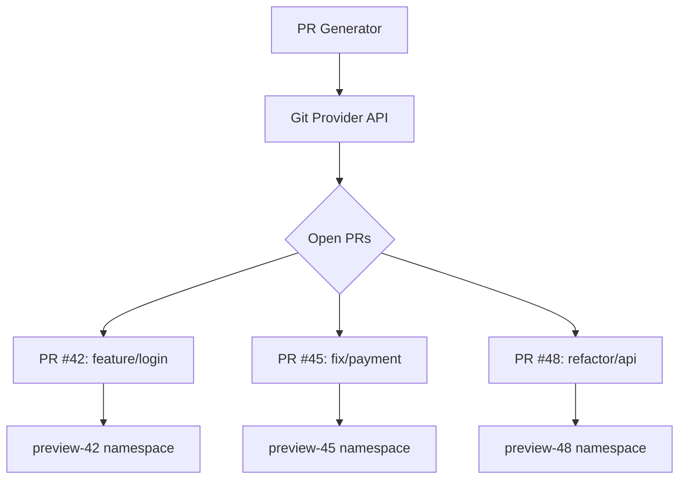

# How to Use Pull Request Generator in ApplicationSets

Author: [nawazdhandala](https://github.com/nawazdhandala)

Tags: ArgoCD, GitOps, Kubernetes, ApplicationSet, CI/CD

Description: Learn how to use the ArgoCD ApplicationSet Pull Request generator to create ephemeral preview environments for every pull request with automatic cleanup on merge.

---

The Pull Request generator in ArgoCD ApplicationSets automatically creates preview environments for open pull requests. When a developer opens a PR, ArgoCD deploys the changes to an isolated namespace. When the PR is closed or merged, the environment is cleaned up automatically. This gives every developer a live environment to test their changes before merging.

This guide covers the Pull Request generator for GitHub, GitLab, and Bitbucket, along with namespace isolation, resource management, and production patterns.

## How the Pull Request Generator Works

The generator queries your Git provider's API for open pull requests on a specific repository. For each open PR, it produces a parameter set with PR metadata. When a PR is closed, the corresponding Application is deleted.



## GitHub Pull Request Generator

Configure the generator for a GitHub repository.

```yaml
apiVersion: argoproj.io/v1alpha1
kind: ApplicationSet
metadata:
  name: preview-environments
  namespace: argocd
spec:
  generators:
  - pullRequest:
      github:
        # Repository owner and name
        owner: myorg
        repo: api-service
        # Authentication
        tokenRef:
          secretName: github-token
          key: token
        # Only PRs with specific labels
        labels:
        - preview
      requeueAfterSeconds: 60
  template:
    metadata:
      name: 'preview-{{number}}'
      labels:
        preview: "true"
        pr-number: '{{number}}'
    spec:
      project: previews
      source:
        repoURL: https://github.com/myorg/api-service
        targetRevision: '{{head_sha}}'
        path: deploy/preview
        helm:
          parameters:
          - name: image.tag
            value: 'pr-{{number}}'
          - name: ingress.host
            value: 'pr-{{number}}.preview.example.com'
      destination:
        server: https://kubernetes.default.svc
        namespace: 'preview-{{number}}'
      syncPolicy:
        automated:
          prune: true
          selfHeal: true
        syncOptions:
        - CreateNamespace=true
```

## Available Template Parameters

The PR generator provides these parameters:

- `number` - the pull request number
- `branch` - the source branch name
- `branch_slug` - the branch name slugified (safe for DNS names)
- `target_branch` - the target/base branch
- `target_branch_slug` - target branch slugified
- `head_sha` - the latest commit SHA on the PR branch
- `head_short_sha` - shortened commit SHA
- `labels` - comma-separated list of PR labels

```yaml
template:
  metadata:
    name: 'preview-{{branch_slug}}'
    annotations:
      pr-number: '{{number}}'
      source-branch: '{{branch}}'
      target: '{{target_branch}}'
      commit: '{{head_short_sha}}'
```

## GitLab Merge Request Generator

For GitLab, configure the generator with your project ID.

```yaml
generators:
- pullRequest:
    gitlab:
      # GitLab project path or ID
      project: "myorg/api-service"
      # Authentication
      tokenRef:
        secretName: gitlab-token
        key: token
      # For self-hosted GitLab
      # api: https://gitlab.mycompany.com/
      # Only MRs with specific labels
      labels:
      - deploy-preview
    requeueAfterSeconds: 60
```

## Bitbucket Pull Request Generator

For Bitbucket Cloud.

```yaml
generators:
- pullRequest:
    bitbucket:
      owner: myorg
      repo: api-service
      basicAuth:
        passwordRef:
          secretName: bitbucket-creds
          key: password
    requeueAfterSeconds: 60
```

For Bitbucket Server.

```yaml
generators:
- pullRequest:
    bitbucketServer:
      project: SVC
      repo: api-service
      api: https://bitbucket.mycompany.com
      basicAuth:
        passwordRef:
          secretName: bitbucket-server-creds
          key: token
    requeueAfterSeconds: 60
```

## Filtering by Labels

Use labels to control which PRs get preview environments. Not every PR needs a live preview - draft PRs, documentation changes, or dependency updates can be excluded.

```yaml
generators:
- pullRequest:
    github:
      owner: myorg
      repo: api-service
      tokenRef:
        secretName: github-token
        key: token
      # Only PRs with the 'preview' label get environments
      labels:
      - preview
```

Developers add the `preview` label to their PR when they want a deployment.

```bash
# Add the label using GitHub CLI
gh pr edit 42 --add-label preview
```

## Filtering by Target Branch

You can filter PRs by their target branch to only create previews for PRs targeting specific branches.

```yaml
generators:
- pullRequest:
    github:
      owner: myorg
      repo: api-service
      tokenRef:
        secretName: github-token
        key: token
    # Only PRs targeting the main branch
    filters:
    - branchMatch: "^(feature|fix)/.*"
```

## Resource Limits for Preview Environments

Preview environments should use fewer resources than production. Configure resource quotas in the preview namespace.

```yaml
# Include this in your preview Helm values
template:
  spec:
    source:
      helm:
        values: |
          replicaCount: 1
          resources:
            requests:
              memory: 128Mi
              cpu: 100m
            limits:
              memory: 256Mi
              cpu: 200m
          autoscaling:
            enabled: false
```

Also consider setting namespace-level resource quotas.

```yaml
# deploy/preview/resource-quota.yaml
apiVersion: v1
kind: ResourceQuota
metadata:
  name: preview-quota
spec:
  hard:
    requests.cpu: "500m"
    requests.memory: "512Mi"
    limits.cpu: "1"
    limits.memory: "1Gi"
    pods: "10"
```

## Automatic DNS for Preview Environments

Set up wildcard DNS so each preview gets its own URL.

```bash
# Configure wildcard DNS record:
# *.preview.example.com -> your-ingress-controller-ip
```

Then each preview Application gets a unique hostname.

```yaml
helm:
  parameters:
  - name: ingress.host
    value: 'pr-{{number}}.preview.example.com'
```

## Cleanup and TTL

Preview environments are automatically cleaned up when the PR is closed or merged. The PR generator removes the parameter set, which triggers Application deletion.

For additional safety, you can set a TTL annotation.

```yaml
template:
  metadata:
    name: 'preview-{{number}}'
    annotations:
      # Reminder annotation for manual cleanup scripts
      preview.expires: "72h"
```

```bash
# Cleanup script for stale previews
kubectl get applications -n argocd -l preview=true \
  -o jsonpath='{range .items[*]}{.metadata.name}{" "}{.metadata.creationTimestamp}{"\n"}{end}' \
  | while read name ts; do
    age=$(( ($(date +%s) - $(date -d "$ts" +%s)) / 3600 ))
    if [ "$age" -gt 72 ]; then
      echo "Deleting stale preview: $name (age: ${age}h)"
      kubectl delete application "$name" -n argocd
    fi
  done
```

## Monitoring Preview Environments

Track the health of your preview environments.

```bash
# List all preview Applications
kubectl get applications -n argocd -l preview=true

# Check for failed previews
kubectl get applications -n argocd -l preview=true \
  -o jsonpath='{range .items[?(@.status.health.status!="Healthy")]}{.metadata.name}{"\t"}{.status.health.status}{"\n"}{end}'
```

The Pull Request generator transforms the developer experience by providing instant, isolated preview environments for every PR. It removes the bottleneck of shared staging environments and gives developers confidence that their changes work in a real Kubernetes cluster before merging.
