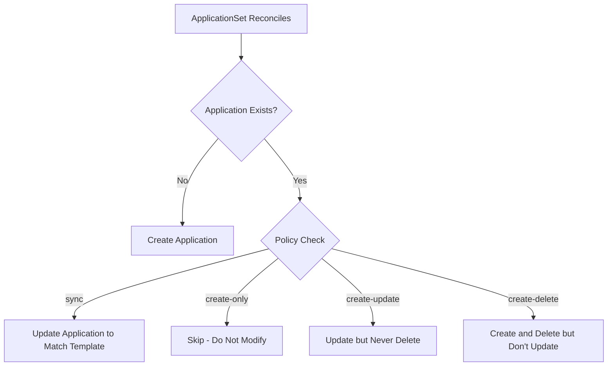

# How to Control Resource Modification in ArgoCD ApplicationSets

Author: [nawazdhandala](https://github.com/nawazdhandala)

Tags: ArgoCD, GitOps, Kubernetes, ApplicationSets, Security

Description: Learn how to control what ApplicationSets can modify on generated Applications using resource modification policies and update strategies in ArgoCD.

---

ApplicationSets in ArgoCD automatically create and manage Application resources. But that automatic management raises an important question: what happens when someone manually edits a generated Application? And how do you prevent ApplicationSets from accidentally overwriting critical changes? The resource modification policy controls exactly this behavior.

This guide covers the ApplicationSet policy settings, how to configure them for safety, and practical approaches for production environments.

## Understanding the Update Policy

When an ApplicationSet reconciles, it compares the generated Application spec with the existing Application resource in the cluster. The `policy` field in the ApplicationSet spec controls what happens when differences are found.



## Available Policies

ArgoCD ApplicationSets support several policies that control creation, update, and deletion behavior.

```yaml
apiVersion: argoproj.io/v1alpha1
kind: ApplicationSet
metadata:
  name: managed-apps
  namespace: argocd
spec:
  # Policy controls what the ApplicationSet can do
  # to generated Applications
  strategy:
    type: RollingSync
  generators:
    - list:
        elements:
          - name: app-one
          - name: app-two
  template:
    metadata:
      name: '{{name}}'
    spec:
      project: default
      source:
        repoURL: https://github.com/myorg/apps.git
        targetRevision: HEAD
        path: '{{name}}'
      destination:
        server: https://kubernetes.default.svc
        namespace: '{{name}}'
```

## The create-only Policy

The `create-only` policy is the safest option. The ApplicationSet creates Applications but never modifies or deletes them afterward. This is useful when teams want initial bootstrapping but full manual control afterward.

```yaml
apiVersion: argoproj.io/v1alpha1
kind: ApplicationSet
metadata:
  name: bootstrap-apps
  namespace: argocd
spec:
  generators:
    - git:
        repoURL: https://github.com/myorg/services.git
        revision: HEAD
        directories:
          - path: 'services/*'
  template:
    metadata:
      name: '{{path.basename}}'
      annotations:
        # Mark as bootstrapped by ApplicationSet
        managed-by: applicationset-bootstrap
    spec:
      project: default
      source:
        repoURL: https://github.com/myorg/services.git
        targetRevision: HEAD
        path: '{{path}}'
      destination:
        server: https://kubernetes.default.svc
        namespace: '{{path.basename}}'
  # Only create, never update or delete
  syncPolicy:
    applicationsSync: create-only
```

After creation, teams can freely modify sync policies, add annotations, change target revisions, or adjust any setting without worrying about the ApplicationSet reverting their changes.

## The create-update Policy

The `create-update` policy allows creation and updates but prevents deletion. If you remove an element from a generator, the corresponding Application stays in the cluster.

```yaml
apiVersion: argoproj.io/v1alpha1
kind: ApplicationSet
metadata:
  name: persistent-apps
  namespace: argocd
spec:
  generators:
    - list:
        elements:
          - name: critical-database
            namespace: databases
          - name: message-queue
            namespace: messaging
  template:
    metadata:
      name: '{{name}}'
    spec:
      project: infrastructure
      source:
        repoURL: https://github.com/myorg/infra.git
        targetRevision: HEAD
        path: '{{name}}'
      destination:
        server: https://kubernetes.default.svc
        namespace: '{{namespace}}'
  # Create and update, but never delete
  syncPolicy:
    applicationsSync: create-update
```

This is particularly important for stateful services. If someone accidentally removes a database entry from the generator list, the Application (and thus the database deployment) survives.

## The create-delete Policy

The `create-delete` policy creates and deletes Applications but does not update existing ones. This is useful when you want the ApplicationSet to manage the lifecycle (creation and cleanup) but not override manual changes.

```yaml
apiVersion: argoproj.io/v1alpha1
kind: ApplicationSet
metadata:
  name: lifecycle-managed-apps
  namespace: argocd
spec:
  generators:
    - clusters:
        selector:
          matchLabels:
            tier: production
  template:
    metadata:
      name: 'monitoring-{{name}}'
    spec:
      project: monitoring
      source:
        repoURL: https://github.com/myorg/monitoring.git
        targetRevision: HEAD
        path: stack
      destination:
        server: '{{server}}'
        namespace: monitoring
  syncPolicy:
    applicationsSync: create-delete
```

With this policy, when a new production cluster is registered, the monitoring Application is created automatically. When a cluster is deregistered, the Application is cleaned up. But if an operator customizes the monitoring configuration for a specific cluster, those changes are preserved.

## The Default sync Policy

When no explicit policy is set, ApplicationSets use the default `sync` behavior, which creates, updates, and deletes Applications to match the generator output exactly. This is the most GitOps-aligned approach but requires careful management.

```yaml
apiVersion: argoproj.io/v1alpha1
kind: ApplicationSet
metadata:
  name: fully-managed-apps
  namespace: argocd
spec:
  generators:
    - git:
        repoURL: https://github.com/myorg/apps.git
        revision: HEAD
        directories:
          - path: 'apps/*'
  template:
    metadata:
      name: '{{path.basename}}'
    spec:
      project: default
      source:
        repoURL: https://github.com/myorg/apps.git
        targetRevision: HEAD
        path: '{{path}}'
      destination:
        server: https://kubernetes.default.svc
        namespace: '{{path.basename}}'
  # Default behavior - full lifecycle management
  # syncPolicy:
  #   applicationsSync: sync
```

## Preserving Specific Fields

Even with the sync policy, you can use `preservedFields` to protect certain fields from being overwritten during updates.

```yaml
apiVersion: argoproj.io/v1alpha1
kind: ApplicationSet
metadata:
  name: preserved-fields-apps
  namespace: argocd
spec:
  preservedFields:
    # Preserve annotations added by notification controllers
    # or manual operations
    annotations:
      - notifications.argoproj.io/*
      - custom.company.io/*
    # Preserve labels added externally
    labels:
      - custom-label
  generators:
    - list:
        elements:
          - name: service-a
          - name: service-b
  template:
    metadata:
      name: '{{name}}'
      labels:
        managed-by: applicationset
    spec:
      project: default
      source:
        repoURL: https://github.com/myorg/apps.git
        targetRevision: HEAD
        path: '{{name}}'
      destination:
        server: https://kubernetes.default.svc
        namespace: '{{name}}'
```

The `preservedFields` configuration ensures that when the ApplicationSet reconciles and updates Applications, it does not remove annotations matching the specified patterns. This is critical for notification subscriptions that are often added via annotation.

## Ignoring ApplicationSet-Managed Fields

You can use the `ignoreApplicationDifferences` field to tell the ApplicationSet controller to ignore specific fields when comparing generated and existing Applications.

```yaml
apiVersion: argoproj.io/v1alpha1
kind: ApplicationSet
metadata:
  name: flexible-apps
  namespace: argocd
spec:
  ignoreApplicationDifferences:
    - jsonPointers:
        # Ignore changes to sync policy made manually
        - /spec/syncPolicy
        # Ignore changes to info section
        - /spec/info
    - name: special-app
      jsonPointers:
        # For this specific app, also ignore source changes
        - /spec/source/targetRevision
  generators:
    - list:
        elements:
          - name: standard-app
          - name: special-app
  template:
    metadata:
      name: '{{name}}'
    spec:
      project: default
      source:
        repoURL: https://github.com/myorg/apps.git
        targetRevision: HEAD
        path: '{{name}}'
      destination:
        server: https://kubernetes.default.svc
        namespace: '{{name}}'
      syncPolicy:
        automated:
          prune: true
```

## Practical Pattern: Graduated Control

A common production pattern is to start with full management and loosen control as applications mature.

```yaml
# Phase 1: New services - fully managed
apiVersion: argoproj.io/v1alpha1
kind: ApplicationSet
metadata:
  name: new-services
  namespace: argocd
spec:
  generators:
    - git:
        repoURL: https://github.com/myorg/new-services.git
        revision: HEAD
        directories:
          - path: 'services/*'
  template:
    metadata:
      name: '{{path.basename}}'
    spec:
      project: default
      source:
        repoURL: https://github.com/myorg/new-services.git
        targetRevision: HEAD
        path: '{{path}}'
      destination:
        server: https://kubernetes.default.svc
        namespace: '{{path.basename}}'
      syncPolicy:
        automated:
          prune: true
          selfHeal: true
  # Full lifecycle management for new services
  # (default sync policy)
---
# Phase 2: Stable services - create and update only
apiVersion: argoproj.io/v1alpha1
kind: ApplicationSet
metadata:
  name: stable-services
  namespace: argocd
spec:
  generators:
    - git:
        repoURL: https://github.com/myorg/stable-services.git
        revision: HEAD
        directories:
          - path: 'services/*'
  template:
    metadata:
      name: '{{path.basename}}'
    spec:
      project: default
      source:
        repoURL: https://github.com/myorg/stable-services.git
        targetRevision: HEAD
        path: '{{path}}'
      destination:
        server: https://kubernetes.default.svc
        namespace: '{{path.basename}}'
  syncPolicy:
    applicationsSync: create-update
```

## Verifying Policy Behavior

You can check how the ApplicationSet controller is handling your Applications.

```bash
# Check ApplicationSet status
kubectl get applicationset managed-apps -n argocd -o yaml | \
  yq '.status'

# View the generated applications and their status
argocd appset get managed-apps

# Check for any policy-related events
kubectl get events -n argocd --field-selector involvedObject.name=managed-apps
```

Choosing the right resource modification policy is essential for production safety. For monitoring your ApplicationSet-managed applications and catching unexpected state changes, [OneUptime](https://oneuptime.com/blog/post/2026-02-26-argocd-applicationset-template-overrides/view) provides real-time visibility into application health and sync status across all your clusters.
