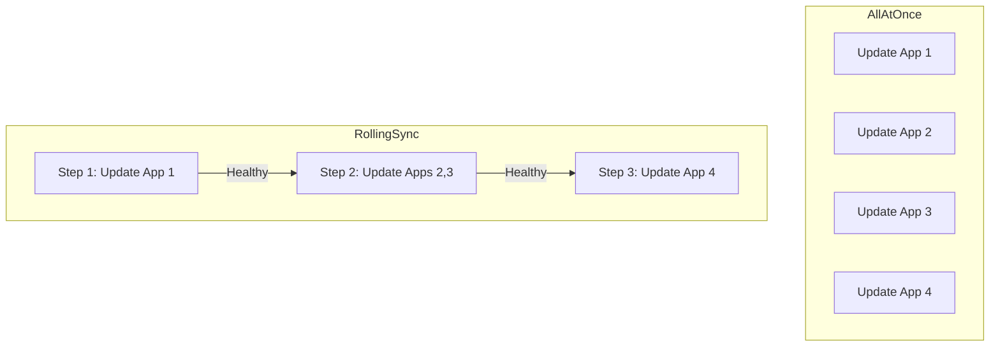

# How to Handle ApplicationSet Rollout Strategy in ArgoCD

Author: [nawazdhandala](https://github.com/nawazdhandala)

Tags: ArgoCD, GitOps, Kubernetes, ApplicationSets, Deployment Strategy

Description: Learn how to configure rollout strategies for ArgoCD ApplicationSets including AllAtOnce and RollingSync to control how changes propagate across applications.

---

When you update an ApplicationSet template, all generated applications get updated. Without a rollout strategy, this happens simultaneously - which is fine for development but dangerous for production. ArgoCD ApplicationSets offer rollout strategies that control how changes propagate, letting you stage updates across groups of applications with health checks between each stage.

This guide covers the available rollout strategies, how to configure them, and production-ready patterns for safe deployments.

## Available Rollout Strategies

ArgoCD ApplicationSets support two rollout strategies:

1. **AllAtOnce** (default) - Updates all applications simultaneously
2. **RollingSync** - Updates applications in defined steps with health gates



## AllAtOnce Strategy

The AllAtOnce strategy is the default behavior. When the ApplicationSet template changes, all generated Applications are updated immediately.

```yaml
apiVersion: argoproj.io/v1alpha1
kind: ApplicationSet
metadata:
  name: all-at-once-apps
  namespace: argocd
spec:
  # Explicit AllAtOnce (this is also the default)
  strategy:
    type: AllAtOnce
  generators:
    - list:
        elements:
          - name: service-a
            cluster: https://cluster-1.example.com
          - name: service-b
            cluster: https://cluster-2.example.com
          - name: service-c
            cluster: https://cluster-3.example.com
  template:
    metadata:
      name: '{{name}}'
    spec:
      project: default
      source:
        repoURL: https://github.com/myorg/services.git
        targetRevision: HEAD
        path: '{{name}}'
      destination:
        server: '{{cluster}}'
        namespace: '{{name}}'
      syncPolicy:
        automated:
          selfHeal: true
```

Use AllAtOnce for:
- Development and testing environments
- Non-critical infrastructure components
- When speed matters more than safety
- Small numbers of applications

## RollingSync Strategy

RollingSync processes applications in sequential steps. Each step defines which applications to update using label selectors. The controller waits for all applications in a step to become healthy before proceeding.

```yaml
apiVersion: argoproj.io/v1alpha1
kind: ApplicationSet
metadata:
  name: rolling-apps
  namespace: argocd
spec:
  strategy:
    type: RollingSync
    rollingSync:
      steps:
        - matchExpressions:
            - key: tier
              operator: In
              values:
                - canary
        - matchExpressions:
            - key: tier
              operator: In
              values:
                - staging
        - matchExpressions:
            - key: tier
              operator: In
              values:
                - production
  generators:
    - list:
        elements:
          - name: app-canary
            tier: canary
            cluster: https://canary.example.com
          - name: app-staging
            tier: staging
            cluster: https://staging.example.com
          - name: app-prod-1
            tier: production
            cluster: https://prod-1.example.com
          - name: app-prod-2
            tier: production
            cluster: https://prod-2.example.com
  template:
    metadata:
      name: '{{name}}'
      labels:
        # Labels MUST match the step selectors
        tier: '{{tier}}'
    spec:
      project: default
      source:
        repoURL: https://github.com/myorg/app.git
        targetRevision: HEAD
        path: deploy
      destination:
        server: '{{cluster}}'
        namespace: myapp
      syncPolicy:
        automated:
          selfHeal: true
```

The flow is: update canary, wait for healthy, update staging, wait for healthy, update both production clusters.

## Controlling Parallelism with maxUpdate

Within each step, `maxUpdate` controls how many applications are updated simultaneously.

```yaml
strategy:
  type: RollingSync
  rollingSync:
    steps:
      # Step 1: Update one canary app
      - matchExpressions:
          - key: env
            operator: In
            values: [canary]
        maxUpdate: 1
      # Step 2: Update staging, all at once
      - matchExpressions:
          - key: env
            operator: In
            values: [staging]
        maxUpdate: 100%
      # Step 3: Update production, two at a time
      - matchExpressions:
          - key: env
            operator: In
            values: [production]
        maxUpdate: 2
```

`maxUpdate` accepts:
- An integer (e.g., `2`) - absolute number of apps to update simultaneously
- A percentage (e.g., `25%`) - percentage of apps in the step to update simultaneously

## Regional Rollout Strategy

A production-grade rollout pattern for geographically distributed applications.

```yaml
apiVersion: argoproj.io/v1alpha1
kind: ApplicationSet
metadata:
  name: global-service
  namespace: argocd
spec:
  strategy:
    type: RollingSync
    rollingSync:
      steps:
        # Phase 1: Internal testing region
        - matchExpressions:
            - key: rollout-phase
              operator: In
              values: ["1"]
          maxUpdate: 1
        # Phase 2: Low-traffic regions
        - matchExpressions:
            - key: rollout-phase
              operator: In
              values: ["2"]
          maxUpdate: 2
        # Phase 3: Medium-traffic regions
        - matchExpressions:
            - key: rollout-phase
              operator: In
              values: ["3"]
          maxUpdate: 2
        # Phase 4: High-traffic regions
        - matchExpressions:
            - key: rollout-phase
              operator: In
              values: ["4"]
          maxUpdate: 1
  generators:
    - clusters:
        selector:
          matchLabels:
            tier: production
  template:
    metadata:
      name: 'api-{{name}}'
      labels:
        rollout-phase: '{{metadata.labels.rollout-phase}}'
    spec:
      project: production
      source:
        repoURL: https://github.com/myorg/api.git
        targetRevision: HEAD
        path: deploy
      destination:
        server: '{{server}}'
        namespace: api
      syncPolicy:
        automated:
          selfHeal: true
        retry:
          limit: 3
          backoff:
            duration: 30s
            factor: 2
            maxDuration: 5m
```

Set up cluster labels to assign rollout phases:

```bash
argocd cluster set test-us-east --label rollout-phase=1
argocd cluster set prod-ap-south --label rollout-phase=2
argocd cluster set prod-eu-west --label rollout-phase=2
argocd cluster set prod-us-west --label rollout-phase=3
argocd cluster set prod-ap-east --label rollout-phase=3
argocd cluster set prod-us-east --label rollout-phase=4
```

## Service-Type Based Strategy

Different types of services can have different rollout priorities.

```yaml
apiVersion: argoproj.io/v1alpha1
kind: ApplicationSet
metadata:
  name: platform-services
  namespace: argocd
spec:
  strategy:
    type: RollingSync
    rollingSync:
      steps:
        # First: Infrastructure (cert-manager, ingress, etc.)
        - matchExpressions:
            - key: service-type
              operator: In
              values: [infrastructure]
        # Then: Backend services
        - matchExpressions:
            - key: service-type
              operator: In
              values: [backend]
          maxUpdate: 2
        # Finally: Frontend services
        - matchExpressions:
            - key: service-type
              operator: In
              values: [frontend]
  generators:
    - list:
        elements:
          - name: cert-manager
            service-type: infrastructure
          - name: ingress-nginx
            service-type: infrastructure
          - name: user-api
            service-type: backend
          - name: order-api
            service-type: backend
          - name: payment-api
            service-type: backend
          - name: web-app
            service-type: frontend
          - name: admin-portal
            service-type: frontend
  template:
    metadata:
      name: '{{name}}'
      labels:
        service-type: '{{service-type}}'
    spec:
      project: default
      source:
        repoURL: https://github.com/myorg/platform.git
        targetRevision: HEAD
        path: '{{name}}'
      destination:
        server: https://kubernetes.default.svc
        namespace: '{{name}}'
      syncPolicy:
        automated:
          selfHeal: true
```

## Monitoring Rollout Progress

Track the progress of a rolling sync.

```bash
# Check overall rollout status
kubectl get applicationset global-service -n argocd -o yaml | \
  yq '.status'

# Watch applications status in real-time
watch "argocd app list -l app.kubernetes.io/managed-by=applicationset-controller -o wide"

# Check which step is currently active
kubectl describe applicationset global-service -n argocd | \
  grep -A 20 "Status:"

# View rollout events
kubectl get events -n argocd \
  --field-selector involvedObject.name=global-service \
  --sort-by='.lastTimestamp'
```

## Handling Stuck Rollouts

When a step fails and the rollout is paused:

```bash
# Check which application is unhealthy
argocd app list -l tier=canary -o wide

# Get detailed health info
argocd app get app-canary

# Option 1: Fix the issue and let rollout continue
# Fix manifests in Git, push changes

# Option 2: Force sync the stuck application
argocd app sync app-canary --force

# Option 3: Revert the change in Git
git revert HEAD && git push
```

## Choosing the Right Strategy

| Scenario | Strategy | maxUpdate |
|----------|----------|-----------|
| Dev/Test environments | AllAtOnce | N/A |
| Small production (< 5 apps) | AllAtOnce | N/A |
| Multi-environment deployment | RollingSync | 100% per step |
| Multi-region production | RollingSync | 1-2 per step |
| Critical infrastructure | RollingSync | 1 per step |
| Large fleet (100+ apps) | RollingSync | 10% per step |

The rollout strategy is your safety net for ApplicationSet updates. For real-time visibility into your rollout progress and automated alerting when steps fail, [OneUptime](https://oneuptime.com/blog/post/2026-02-26-argocd-applicationset-dry-run/view) monitors application health across all stages of your deployment pipeline.
