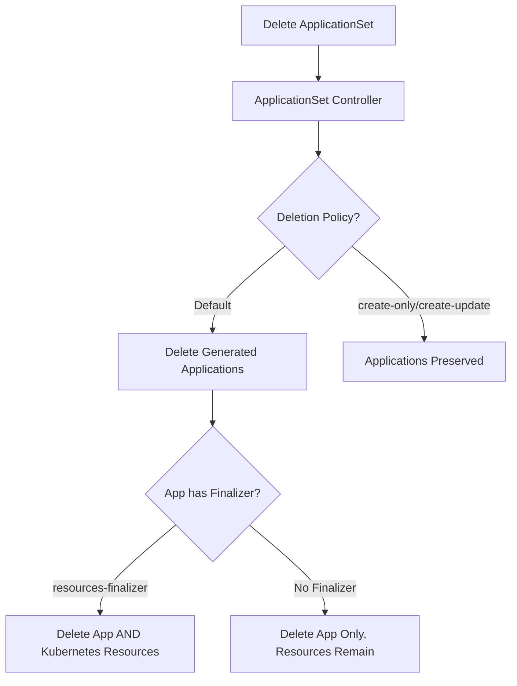

# How to Handle ApplicationSet Deletion Safely in ArgoCD

Author: [nawazdhandala](https://github.com/nawazdhandala)

Tags: ArgoCD, GitOps, Kubernetes, ApplicationSet, Safety

Description: Learn how to safely delete ArgoCD ApplicationSets without accidentally destroying generated applications and their deployed Kubernetes resources.

---

Deleting an ApplicationSet is one of the most dangerous operations in ArgoCD. By default, when you delete an ApplicationSet, all Applications it generated are also deleted. And if those Applications have cascade delete finalizers, their deployed Kubernetes resources (Deployments, Services, PersistentVolumeClaims) are destroyed too. A single `kubectl delete` can take down an entire production environment.

This guide covers how to delete ApplicationSets safely, protect against accidental deletion, and handle various deletion scenarios.

## Understanding the Deletion Chain

When you delete an ApplicationSet, a chain reaction can occur.



## The Danger: Default Behavior

With default settings, deleting an ApplicationSet triggers cascade deletion.

```bash
# THIS IS DANGEROUS in production!
kubectl delete applicationset my-apps -n argocd

# This will:
# 1. Delete the ApplicationSet resource
# 2. Delete ALL generated Application resources
# 3. If apps have finalizers, delete ALL deployed resources
```

## Safe Deletion Strategy 1: Remove Finalizers First

Before deleting the ApplicationSet, remove the cascade delete finalizer from all generated Applications.

```bash
# Step 1: List all applications generated by the ApplicationSet
kubectl get applications -n argocd -l app.kubernetes.io/managed-by=applicationset-controller \
  -o name

# Step 2: Remove the finalizer from each application
for app in $(kubectl get applications -n argocd \
  -o jsonpath='{range .items[?(@.metadata.ownerReferences[0].name=="my-apps")]}{.metadata.name}{"\n"}{end}'); do
  kubectl patch application "$app" -n argocd \
    --type json \
    -p '[{"op":"remove","path":"/metadata/finalizers"}]'
  echo "Removed finalizer from $app"
done

# Step 3: Now safely delete the ApplicationSet
kubectl delete applicationset my-apps -n argocd
# Applications are deleted but Kubernetes resources are preserved
```

## Safe Deletion Strategy 2: Change Policy Before Deletion

Switch the ApplicationSet to `create-only` policy before deleting it. This orphans the Applications.

```bash
# Step 1: Patch the ApplicationSet to create-only
kubectl patch applicationset my-apps -n argocd \
  --type merge \
  -p '{"spec":{"syncPolicy":{"applicationsSync":"create-only"}}}'

# Step 2: Wait for the controller to reconcile
sleep 10

# Step 3: Delete the ApplicationSet
kubectl delete applicationset my-apps -n argocd

# Applications are now orphaned (still running) and need manual cleanup later
```

## Safe Deletion Strategy 3: Remove Owner References

Remove the owner references from Applications so they are no longer linked to the ApplicationSet.

```bash
# Remove owner references from all generated applications
for app in $(kubectl get applications -n argocd \
  -o jsonpath='{range .items[?(@.metadata.ownerReferences[0].name=="my-apps")]}{.metadata.name}{"\n"}{end}'); do
  kubectl patch application "$app" -n argocd \
    --type json \
    -p '[{"op":"remove","path":"/metadata/ownerReferences"}]'
  echo "Removed owner reference from $app"
done

# Now delete the ApplicationSet - apps are no longer owned by it
kubectl delete applicationset my-apps -n argocd
```

## Safe Deletion Strategy 4: Use preservedFields in Advance

If you plan ahead, configure the ApplicationSet to preserve Applications on deletion using the syncPolicy.

```yaml
apiVersion: argoproj.io/v1alpha1
kind: ApplicationSet
metadata:
  name: production-apps
  namespace: argocd
spec:
  generators:
    - list:
        elements:
          - name: critical-service
  template:
    metadata:
      name: '{{name}}'
      # Do NOT add resources-finalizer to prevent cascade
      # finalizers:
      #   - resources-finalizer.argocd.argoproj.io
    spec:
      project: default
      source:
        repoURL: https://github.com/myorg/apps.git
        targetRevision: HEAD
        path: '{{name}}'
      destination:
        server: https://kubernetes.default.svc
        namespace: '{{name}}'
  # Prevent deletion of applications when ApplicationSet is deleted
  syncPolicy:
    applicationsSync: create-only
```

## Preventing Accidental Deletion

### Add Deletion Protection Annotations

```yaml
apiVersion: argoproj.io/v1alpha1
kind: ApplicationSet
metadata:
  name: critical-apps
  namespace: argocd
  annotations:
    # Reminder annotation (not enforced by ArgoCD but visible to operators)
    deletion-protection: "enabled"
    managed-by: "platform-team"
    warning: "Deleting this ApplicationSet will remove production applications"
spec:
  generators:
    - clusters:
        selector:
          matchLabels:
            environment: production
  template:
    metadata:
      name: 'app-{{name}}'
    spec:
      project: production
      source:
        repoURL: https://github.com/myorg/apps.git
        targetRevision: HEAD
        path: deploy
      destination:
        server: '{{server}}'
        namespace: myapp
```

### Use Kubernetes Admission Webhooks

Deploy a validating webhook that prevents accidental deletion of critical ApplicationSets.

```yaml
apiVersion: admissionregistration.k8s.io/v1
kind: ValidatingWebhookConfiguration
metadata:
  name: protect-applicationsets
webhooks:
  - name: protect-appsets.example.com
    clientConfig:
      service:
        name: webhook-server
        namespace: argocd
        path: /validate-applicationset-delete
    rules:
      - apiGroups: [argoproj.io]
        apiVersions: [v1alpha1]
        operations: [DELETE]
        resources: [applicationsets]
    admissionReviewVersions: [v1]
    sideEffects: None
    failurePolicy: Fail
```

### RBAC Restriction on Deletion

```yaml
apiVersion: v1
kind: ConfigMap
metadata:
  name: argocd-rbac-cm
  namespace: argocd
data:
  policy.csv: |
    # Allow team leads to manage ApplicationSets
    p, role:team-lead, applicationsets, get, */*, allow
    p, role:team-lead, applicationsets, create, */*, allow
    p, role:team-lead, applicationsets, update, */*, allow

    # Only platform admins can delete ApplicationSets
    p, role:team-lead, applicationsets, delete, */*, deny
    p, role:platform-admin, applicationsets, delete, */*, allow
```

## Step-by-Step Safe Deletion Procedure

For production environments, follow this procedure.

```bash
#!/bin/bash
# safe-delete-applicationset.sh
APPSET_NAME=$1
NAMESPACE=${2:-argocd}

echo "=== Safe ApplicationSet Deletion: $APPSET_NAME ==="

# Step 1: List affected applications
echo ""
echo "Step 1: Applications that will be affected:"
kubectl get applications -n "$NAMESPACE" \
  -o json | jq -r ".items[] | select(.metadata.ownerReferences[]?.name == \"$APPSET_NAME\") | .metadata.name"

# Step 2: Check for finalizers
echo ""
echo "Step 2: Applications with cascade delete finalizers:"
kubectl get applications -n "$NAMESPACE" \
  -o json | jq -r ".items[] | select(.metadata.ownerReferences[]?.name == \"$APPSET_NAME\") | select(.metadata.finalizers // [] | length > 0) | .metadata.name + \" -> \" + (.metadata.finalizers | join(\", \"))"

# Step 3: Confirm
echo ""
read -p "Do you want to proceed with safe deletion? (y/N) " confirm
if [ "$confirm" != "y" ]; then
  echo "Aborted."
  exit 0
fi

# Step 4: Remove finalizers from applications
echo ""
echo "Step 4: Removing finalizers from applications..."
for app in $(kubectl get applications -n "$NAMESPACE" \
  -o json | jq -r ".items[] | select(.metadata.ownerReferences[]?.name == \"$APPSET_NAME\") | .metadata.name"); do
  kubectl patch application "$app" -n "$NAMESPACE" \
    --type json \
    -p '[{"op":"remove","path":"/metadata/finalizers"}]' 2>/dev/null
  echo "  Cleaned: $app"
done

# Step 5: Remove owner references
echo ""
echo "Step 5: Removing owner references..."
for app in $(kubectl get applications -n "$NAMESPACE" \
  -o json | jq -r ".items[] | select(.metadata.ownerReferences[]?.name == \"$APPSET_NAME\") | .metadata.name"); do
  kubectl patch application "$app" -n "$NAMESPACE" \
    --type json \
    -p '[{"op":"remove","path":"/metadata/ownerReferences"}]' 2>/dev/null
  echo "  Detached: $app"
done

# Step 6: Delete the ApplicationSet
echo ""
echo "Step 6: Deleting ApplicationSet..."
kubectl delete applicationset "$APPSET_NAME" -n "$NAMESPACE"

# Step 7: Verify applications still exist
echo ""
echo "Step 7: Verifying applications are preserved:"
argocd app list | head -20

echo ""
echo "Done. Applications are now independent (not managed by any ApplicationSet)."
echo "Delete them individually when ready."
```

## Recovering from Accidental Deletion

If an ApplicationSet was deleted accidentally and applications were cascade-deleted:

```bash
# Check if applications still exist
argocd app list

# If applications are gone but resources remain (no finalizer):
# Simply re-apply the ApplicationSet and it will rediscover/recreate applications

# If resources were also deleted (had finalizer):
# Re-apply the ApplicationSet - applications will be recreated
# Applications will sync and recreate the resources from Git
kubectl apply -f applicationset.yaml

# Monitor the recovery
watch "argocd app list -o wide"
```

Safe deletion requires planning and discipline. The default behavior is aggressive, so always use one of the protection strategies described here before deleting an ApplicationSet in production. For monitoring critical ApplicationSet changes and receiving alerts on deletion events, [OneUptime](https://oneuptime.com/blog/post/2026-02-26-argocd-applicationset-security-policies/view) provides the observability layer you need for production safety.
