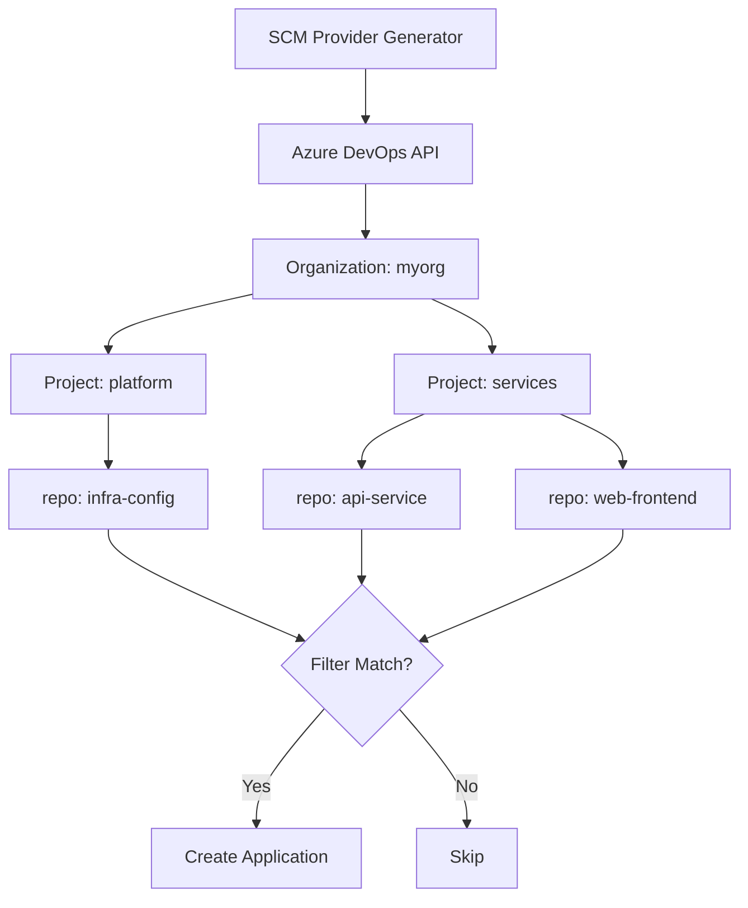

# How to Use SCM Provider Generator for Azure DevOps

Author: [nawazdhandala](https://github.com/nawazdhandala)

Tags: ArgoCD, GitOps, Kubernetes, ApplicationSets, Azure DevOps

Description: Configure the ArgoCD ApplicationSet SCM Provider generator for Azure DevOps to automatically discover repositories in Azure DevOps projects and create Kubernetes applications.

---

Azure DevOps is widely used in enterprise environments for source control, CI/CD, and project management. The ArgoCD ApplicationSet SCM Provider generator for Azure DevOps lets you automatically discover repositories within Azure DevOps organizations and projects, creating ArgoCD Applications for each one without manual intervention.

This guide covers the complete setup process, authentication configuration, filtering options, and practical deployment patterns for Azure DevOps-based GitOps workflows.

## How the Azure DevOps SCM Provider Works

The generator queries the Azure DevOps REST API to list repositories within a specified organization and project (or all projects). For each matching repository, it produces template parameters that ApplicationSet uses to create Application resources.



## Setting Up Azure DevOps Authentication

Create a Personal Access Token (PAT) in Azure DevOps with the Code (Read) scope.

```bash
# Navigate to: Azure DevOps > User Settings > Personal Access Tokens
# Required scope: Code - Read

# Create the secret in Kubernetes
kubectl create secret generic azure-devops-token -n argocd \
  --from-literal=token=your-azure-devops-pat-here
```

For Azure DevOps Server (on-premises), you might also need to configure TLS certificates if using self-signed certs.

## Basic Azure DevOps SCM Provider

Discover all repositories in an Azure DevOps organization.

```yaml
apiVersion: argoproj.io/v1alpha1
kind: ApplicationSet
metadata:
  name: azure-devops-services
  namespace: argocd
spec:
  generators:
  - scmProvider:
      azureDevOps:
        # Azure DevOps organization name
        organization: myorg
        # Specify a single project or leave empty for all projects
        teamProject: platform-services
        # Authentication
        accessTokenRef:
          secretName: azure-devops-token
          key: token
        # For Azure DevOps Server (on-premises)
        # api: https://dev.azure.com/
        allBranches: false
      filters:
      - repositoryMatch: "^svc-.*"
        pathsExist:
        - deploy/
  template:
    metadata:
      name: '{{repository}}'
    spec:
      project: default
      source:
        repoURL: '{{url}}'
        targetRevision: '{{branch}}'
        path: deploy/
      destination:
        server: https://kubernetes.default.svc
        namespace: '{{repository}}'
      syncPolicy:
        automated:
          prune: true
          selfHeal: true
        syncOptions:
        - CreateNamespace=true
```

## Available Template Parameters

The Azure DevOps SCM Provider provides these parameters:

- `organization` - the Azure DevOps organization
- `repository` - the repository name
- `url` - the clone URL (HTTPS)
- `branch` - the default branch
- `sha` - the latest commit SHA

```yaml
template:
  metadata:
    name: '{{repository}}'
    annotations:
      azure-devops-org: '{{organization}}'
      source-sha: '{{sha}}'
  spec:
    source:
      repoURL: '{{url}}'
      targetRevision: '{{branch}}'
```

## Configuring Repository Access in ArgoCD

Azure DevOps repositories require authentication for cloning. Configure ArgoCD to use credentials for Azure DevOps URLs.

```bash
# Add Azure DevOps credentials to ArgoCD
argocd repo add https://dev.azure.com/myorg/platform-services/_git/svc-api \
  --username "deploy-bot" \
  --password "your-pat-token"

# Or use a credential template for all repos in the org
kubectl apply -f - <<EOF
apiVersion: v1
kind: Secret
metadata:
  name: azure-devops-repo-creds
  namespace: argocd
  labels:
    argocd.argoproj.io/secret-type: repo-creds
type: Opaque
stringData:
  type: git
  url: https://dev.azure.com/myorg
  username: deploy-bot
  password: your-pat-token
EOF
```

The credential template ensures all discovered repositories can be cloned without individual configuration.

## Filtering by Project

When your Azure DevOps organization has many projects, target specific ones.

```yaml
generators:
# Single project
- scmProvider:
    azureDevOps:
      organization: myorg
      teamProject: backend-services
      accessTokenRef:
        secretName: azure-devops-token
        key: token
    filters:
    - repositoryMatch: ".*"
      pathsExist:
      - k8s/
```

To scan multiple projects, use multiple generators.

```yaml
generators:
# Backend project
- scmProvider:
    azureDevOps:
      organization: myorg
      teamProject: backend-services
      accessTokenRef:
        secretName: azure-devops-token
        key: token
    filters:
    - pathsExist:
      - deploy/
# Frontend project
- scmProvider:
    azureDevOps:
      organization: myorg
      teamProject: frontend-services
      accessTokenRef:
        secretName: azure-devops-token
        key: token
    filters:
    - pathsExist:
      - deploy/
```

## Filtering by Path Existence

The `pathsExist` filter is critical for Azure DevOps environments where not every repository contains deployable Kubernetes manifests.

```yaml
filters:
# Only repos with Helm charts
- repositoryMatch: ".*"
  pathsExist:
  - charts/Chart.yaml

# Or repos with Kustomize configs
- repositoryMatch: ".*"
  pathsExist:
  - deploy/kustomization.yaml

# Multiple paths (ANY match)
- pathsExist:
  - deploy/
  - k8s/
  - manifests/
```

## Multi-Cluster Deployment with Azure DevOps

Combine the Azure DevOps SCM Provider with the Cluster generator to deploy discovered services across multiple AKS clusters.

```yaml
apiVersion: argoproj.io/v1alpha1
kind: ApplicationSet
metadata:
  name: services-all-aks
  namespace: argocd
spec:
  generators:
  - matrix:
      generators:
      - scmProvider:
          azureDevOps:
            organization: myorg
            teamProject: microservices
            accessTokenRef:
              secretName: azure-devops-token
              key: token
          filters:
          - pathsExist:
            - deploy/
      - clusters:
          selector:
            matchLabels:
              cloud: azure
              environment: production
  template:
    metadata:
      name: '{{repository}}-{{name}}'
    spec:
      project: default
      source:
        repoURL: '{{url}}'
        targetRevision: '{{branch}}'
        path: deploy/
      destination:
        server: '{{server}}'
        namespace: '{{repository}}'
      syncPolicy:
        automated:
          prune: true
          selfHeal: true
```

## Azure DevOps Server (On-Premises)

For organizations running Azure DevOps Server on-premises, specify the API endpoint.

```yaml
generators:
- scmProvider:
    azureDevOps:
      organization: myorg
      teamProject: services
      # Point to on-premises instance
      api: https://azure-devops.internal.mycompany.com/
      accessTokenRef:
        secretName: azure-devops-token
        key: token
    filters:
    - repositoryMatch: ".*"
```

Ensure network connectivity between the ArgoCD ApplicationSet controller and the Azure DevOps Server.

```bash
# Test connectivity from the controller pod
kubectl exec -n argocd deployment/argocd-applicationset-controller -- \
  curl -s -H "Authorization: Basic $(echo -n :your-pat | base64)" \
  "https://azure-devops.internal.mycompany.com/myorg/_apis/git/repositories?api-version=7.0"
```

## Handling Azure DevOps SSH URLs

If your ArgoCD is configured to use SSH for repository access, you may need to map the HTTPS URLs from the SCM provider to SSH URLs.

```yaml
spec:
  goTemplate: true
  generators:
  - scmProvider:
      azureDevOps:
        organization: myorg
        teamProject: services
        accessTokenRef:
          secretName: azure-devops-token
          key: token
  template:
    metadata:
      name: '{{ .repository }}'
    spec:
      source:
        # Convert HTTPS URL to SSH format
        repoURL: 'git@ssh.dev.azure.com:v3/myorg/services/{{ .repository }}'
        targetRevision: '{{ .branch }}'
        path: deploy/
```

## Monitoring and Troubleshooting

Debug the Azure DevOps SCM Provider when things do not work as expected.

```bash
# Check controller logs
kubectl logs -n argocd deployment/argocd-applicationset-controller \
  | grep -i "azure\|devops\|scm"

# Verify the token secret
kubectl get secret azure-devops-token -n argocd -o jsonpath='{.data.token}' | base64 -d

# Test the Azure DevOps API directly
curl -s -H "Authorization: Basic $(echo -n :your-pat | base64)" \
  "https://dev.azure.com/myorg/services/_apis/git/repositories?api-version=7.0" | jq '.value[].name'

# Check ApplicationSet status
kubectl describe applicationset azure-devops-services -n argocd
```

The Azure DevOps SCM Provider generator brings GitOps automation to enterprise organizations that rely on Azure DevOps. Combined with AKS clusters and Azure-native tooling, it creates a seamless deployment pipeline from Azure DevOps repositories to Kubernetes clusters managed by ArgoCD.
