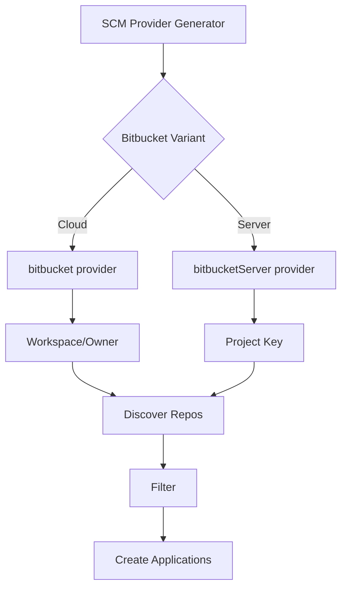

# How to Use SCM Provider Generator for Bitbucket

Author: [nawazdhandala](https://github.com/nawazdhandala)

Tags: ArgoCD, GitOps, Kubernetes, ApplicationSets, Bitbucket

Description: Learn how to configure the ArgoCD ApplicationSet SCM Provider generator for Bitbucket Cloud and Bitbucket Server to automatically discover repositories and deploy applications.

---

Organizations using Bitbucket for source control can leverage the ArgoCD ApplicationSet SCM Provider generator to automatically discover repositories and create ArgoCD Applications. Whether you use Bitbucket Cloud or Bitbucket Server (formerly Stash), the generator queries the Bitbucket API to find repositories matching your criteria and creates deployments for each one.

This guide covers configuration for both Bitbucket Cloud and Bitbucket Server, authentication setup, filtering strategies, and real-world deployment patterns.

## Bitbucket Cloud vs Bitbucket Server

ArgoCD supports both Bitbucket variants, but they use different configuration blocks:

- **Bitbucket Cloud** - Uses the `bitbucket` provider with workspace-based discovery
- **Bitbucket Server** - Uses the `bitbucketServer` provider with project-based discovery



## Setting Up Authentication

For Bitbucket Cloud, create an app password with repository read permissions.

```bash
# Bitbucket Cloud: Create an app password
# Navigate to: Bitbucket Settings > App passwords
# Required permissions: Repositories - Read

kubectl create secret generic bitbucket-creds -n argocd \
  --from-literal=username=your-bitbucket-username \
  --from-literal=password=your-app-password
```

For Bitbucket Server, use a personal access token or HTTP access token.

```bash
# Bitbucket Server: Create a personal access token
# Navigate to: Bitbucket Server > Manage Account > Personal Access Tokens
# Required permissions: Repository - Read

kubectl create secret generic bitbucket-server-creds -n argocd \
  --from-literal=token=your-personal-access-token
```

## Bitbucket Cloud Configuration

Discover repositories in a Bitbucket Cloud workspace.

```yaml
apiVersion: argoproj.io/v1alpha1
kind: ApplicationSet
metadata:
  name: bitbucket-cloud-services
  namespace: argocd
spec:
  generators:
  - scmProvider:
      bitbucket:
        # Bitbucket workspace name (or user)
        owner: myorg
        # Authentication credentials
        user: deploy-bot
        appPasswordRef:
          secretName: bitbucket-creds
          key: password
        # Scan all repos, not just the default branch
        allBranches: false
      filters:
      # Only repositories matching the pattern
      - repositoryMatch: "^svc-.*"
        # Only repos with deploy manifests
        pathsExist:
        - k8s/
  template:
    metadata:
      name: '{{repository}}'
    spec:
      project: default
      source:
        repoURL: '{{url}}'
        targetRevision: '{{branch}}'
        path: k8s/
      destination:
        server: https://kubernetes.default.svc
        namespace: '{{repository}}'
      syncPolicy:
        automated:
          prune: true
          selfHeal: true
        syncOptions:
        - CreateNamespace=true
```

## Bitbucket Server Configuration

For self-hosted Bitbucket Server instances, use the `bitbucketServer` provider.

```yaml
apiVersion: argoproj.io/v1alpha1
kind: ApplicationSet
metadata:
  name: bitbucket-server-services
  namespace: argocd
spec:
  generators:
  - scmProvider:
      bitbucketServer:
        # Bitbucket Server project key
        project: SVC
        # Bitbucket Server API URL
        api: https://bitbucket.mycompany.com
        # Authentication
        basicAuth:
          passwordRef:
            secretName: bitbucket-server-creds
            key: token
      filters:
      - repositoryMatch: ".*"
        pathsExist:
        - deploy/
  template:
    metadata:
      name: '{{repository}}'
    spec:
      project: default
      source:
        repoURL: '{{url}}'
        targetRevision: '{{branch}}'
        path: deploy/
      destination:
        server: https://kubernetes.default.svc
        namespace: '{{repository}}'
      syncPolicy:
        automated:
          prune: true
          selfHeal: true
```

## Available Template Parameters

Both Bitbucket Cloud and Server provide these parameters:

- `organization` - the workspace (Cloud) or project (Server)
- `repository` - the repository slug
- `url` - the clone URL
- `branch` - the default branch name
- `sha` - the latest commit SHA on the default branch

```yaml
template:
  metadata:
    name: '{{repository}}'
    annotations:
      bitbucket-project: '{{organization}}'
      latest-commit: '{{sha}}'
  spec:
    source:
      repoURL: '{{url}}'
      targetRevision: '{{branch}}'
```

## Filtering Repositories

Use filters to narrow down which repositories get Applications.

```yaml
filters:
# Match repository name pattern
- repositoryMatch: "^(svc|app)-.*"
# Only repos with Kubernetes manifests
  pathsExist:
  - deploy/kustomization.yaml

# You can also use multiple filters (OR logic)
- repositoryMatch: "^infra-.*"
  pathsExist:
  - helm/Chart.yaml
```

For Bitbucket Cloud, you can also filter by topics if your repositories have been tagged.

```yaml
filters:
- labelMatch: "kubernetes"
  repositoryMatch: ".*"
```

## Multiple Bitbucket Projects

If your organization spans multiple Bitbucket Server projects, create separate ApplicationSets or use multiple generators.

```yaml
apiVersion: argoproj.io/v1alpha1
kind: ApplicationSet
metadata:
  name: all-projects
  namespace: argocd
spec:
  generators:
  # Project 1: Backend services
  - scmProvider:
      bitbucketServer:
        project: BACKEND
        api: https://bitbucket.mycompany.com
        basicAuth:
          passwordRef:
            secretName: bitbucket-server-creds
            key: token
      filters:
      - repositoryMatch: ".*"
        pathsExist:
        - deploy/
  # Project 2: Frontend services
  - scmProvider:
      bitbucketServer:
        project: FRONTEND
        api: https://bitbucket.mycompany.com
        basicAuth:
          passwordRef:
            secretName: bitbucket-server-creds
            key: token
      filters:
      - repositoryMatch: ".*"
        pathsExist:
        - deploy/
  template:
    metadata:
      name: '{{organization}}-{{repository}}'
    spec:
      project: default
      source:
        repoURL: '{{url}}'
        targetRevision: '{{branch}}'
        path: deploy/
      destination:
        server: https://kubernetes.default.svc
        namespace: '{{repository}}'
```

## Deploying to Multiple Clusters

Combine the Bitbucket SCM Provider with the Cluster generator via Matrix.

```yaml
apiVersion: argoproj.io/v1alpha1
kind: ApplicationSet
metadata:
  name: services-multi-cluster
  namespace: argocd
spec:
  generators:
  - matrix:
      generators:
      - scmProvider:
          bitbucketServer:
            project: SVC
            api: https://bitbucket.mycompany.com
            basicAuth:
              passwordRef:
                secretName: bitbucket-server-creds
                key: token
          filters:
          - repositoryMatch: ".*"
            pathsExist:
            - deploy/
      - clusters:
          selector:
            matchLabels:
              environment: production
  template:
    metadata:
      name: '{{repository}}-{{name}}'
    spec:
      project: default
      source:
        repoURL: '{{url}}'
        targetRevision: '{{branch}}'
        path: deploy/
      destination:
        server: '{{server}}'
        namespace: '{{repository}}'
```

## Handling Network Access for Self-Hosted Bitbucket

The ArgoCD ApplicationSet controller needs network access to the Bitbucket Server API. For on-premises installations behind firewalls, configure network policies.

```yaml
# NetworkPolicy to allow ApplicationSet controller to reach Bitbucket
apiVersion: networking.k8s.io/v1
kind: NetworkPolicy
metadata:
  name: allow-appset-to-bitbucket
  namespace: argocd
spec:
  podSelector:
    matchLabels:
      app.kubernetes.io/name: argocd-applicationset-controller
  policyTypes:
  - Egress
  egress:
  - to:
    - ipBlock:
        cidr: 10.0.0.50/32  # Bitbucket Server IP
    ports:
    - protocol: TCP
      port: 443
```

Also ensure TLS certificates are trusted if using self-signed certificates.

```bash
# Add custom CA to ArgoCD
kubectl create configmap argocd-tls-certs-cm -n argocd \
  --from-file=bitbucket.mycompany.com=ca-cert.pem
```

## Debugging and Monitoring

Troubleshoot the Bitbucket SCM Provider generator when Applications are not being created.

```bash
# Check controller logs for Bitbucket-related messages
kubectl logs -n argocd deployment/argocd-applicationset-controller \
  | grep -i "bitbucket\|scm"

# Verify the secret exists and has correct keys
kubectl get secret bitbucket-server-creds -n argocd -o jsonpath='{.data}' | base64 -d

# Test Bitbucket API connectivity from the controller pod
kubectl exec -n argocd deployment/argocd-applicationset-controller -- \
  curl -s https://bitbucket.mycompany.com/rest/api/1.0/projects/SVC/repos
```

The Bitbucket SCM Provider generator brings the same repository discovery automation to Bitbucket users that GitHub and GitLab users enjoy. Whether you are on Bitbucket Cloud or running Bitbucket Server on-premises, the generator automatically keeps your ArgoCD Applications in sync with your repository landscape.
