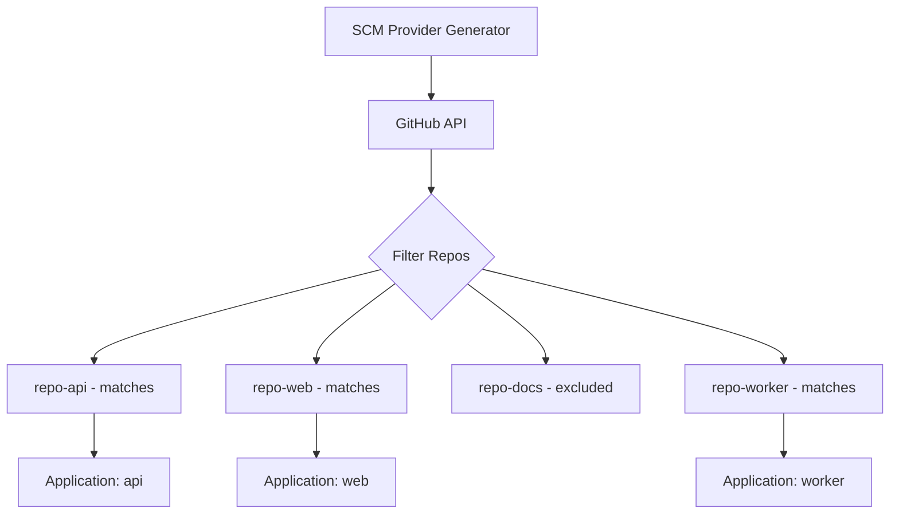

# How to Use SCM Provider Generator for GitHub

Author: [nawazdhandala](https://github.com/nawazdhandala)

Tags: ArgoCD, GitOps, Kubernetes, ApplicationSet, GitHub

Description: Learn how to use the ArgoCD ApplicationSet SCM Provider generator for GitHub to automatically discover repositories and create applications based on your organization's repository structure.

---

The SCM Provider generator for GitHub automatically discovers repositories in a GitHub organization and creates ArgoCD Applications for each one. Instead of manually listing every repository that needs deployment, the generator queries the GitHub API, filters repositories based on criteria you define, and creates Applications dynamically.

This is perfect for organizations with many microservices, where new repositories are created regularly. The SCM Provider generator ensures that every new repo gets an ArgoCD Application automatically.

## How the SCM Provider Generator Works

The generator queries the GitHub API to list repositories in an organization. It filters results based on topics, names, visibility, and other criteria. For each matching repository, it produces parameters including the repo URL, name, default branch, and other metadata.



## Setting Up GitHub Authentication

The SCM Provider generator needs a GitHub token to access the organization's repositories. Create a Kubernetes secret with the token.

```bash
# Create a GitHub token with 'repo' scope for private repos
# or 'public_repo' for public repos only

kubectl create secret generic github-token -n argocd \
  --from-literal=token=ghp_your_personal_access_token_here
```

For GitHub Apps (recommended for organizations), create a secret with the app credentials.

```bash
kubectl create secret generic github-app-creds -n argocd \
  --from-literal=githubAppID=12345 \
  --from-literal=githubAppInstallationID=67890 \
  --from-file=githubAppPrivateKey=private-key.pem
```

## Basic SCM Provider Generator

Discover all repositories in a GitHub organization and create Applications.

```yaml
apiVersion: argoproj.io/v1alpha1
kind: ApplicationSet
metadata:
  name: org-services
  namespace: argocd
spec:
  generators:
  - scmProvider:
      github:
        # GitHub organization name
        organization: myorg
        # Authentication
        tokenRef:
          secretName: github-token
          key: token
        # Only include repos that aren't archived
        allBranches: false
      # Filter repositories
      filters:
      - repositoryMatch: "^svc-.*"  # Only repos starting with 'svc-'
  template:
    metadata:
      name: '{{repository}}'
    spec:
      project: default
      source:
        repoURL: '{{url}}'
        targetRevision: '{{branch}}'
        path: deploy/
      destination:
        server: https://kubernetes.default.svc
        namespace: '{{repository}}'
      syncPolicy:
        automated:
          prune: true
          selfHeal: true
        syncOptions:
        - CreateNamespace=true
```

## Available Template Parameters

The SCM Provider generator provides these parameters for each discovered repository:

- `organization` - the GitHub org name
- `repository` - the repository name
- `url` - the clone URL (HTTPS)
- `branch` - the default branch
- `sha` - the latest commit SHA
- `labels` - repository topics as comma-separated string

```yaml
template:
  metadata:
    name: '{{repository}}'
    labels:
      org: '{{organization}}'
    annotations:
      latest-sha: '{{sha}}'
  spec:
    source:
      repoURL: '{{url}}'
      targetRevision: '{{branch}}'
```

## Filtering by Repository Topics

GitHub topics are a powerful way to tag repositories. Use them to control which repos get ArgoCD Applications.

```yaml
generators:
- scmProvider:
    github:
      organization: myorg
      tokenRef:
        secretName: github-token
        key: token
    filters:
    # Only repos with the 'kubernetes' topic
    - labelMatch: "kubernetes"
    # AND name matches the pattern
      repositoryMatch: ".*"
```

On the GitHub side, add topics to your repositories.

```bash
# Add topics to a repository using GitHub CLI
gh repo edit myorg/my-service --add-topic kubernetes
gh repo edit myorg/my-service --add-topic production
```

## Filtering by Branch

You can filter based on branch patterns to target specific branches.

```yaml
generators:
- scmProvider:
    github:
      organization: myorg
      tokenRef:
        secretName: github-token
        key: token
      allBranches: true  # Scan all branches, not just default
    filters:
    - branchMatch: "^release/.*"  # Only release branches
      repositoryMatch: "^svc-.*"
```

This creates one Application per release branch per matching repository.

## Using GitHub App Authentication

For production environments, GitHub Apps provide better security and higher rate limits than personal access tokens.

```yaml
generators:
- scmProvider:
    github:
      organization: myorg
      appSecretName: github-app-creds
    filters:
    - repositoryMatch: ".*"
      labelMatch: "deploy-argocd"
```

The secret must contain `githubAppID`, `githubAppInstallationID`, and `githubAppPrivateKey`.

## Combining SCM Provider with Other Generators

Use the Matrix generator to deploy each discovered repository to multiple clusters.

```yaml
apiVersion: argoproj.io/v1alpha1
kind: ApplicationSet
metadata:
  name: services-multi-cluster
  namespace: argocd
spec:
  generators:
  - matrix:
      generators:
      - scmProvider:
          github:
            organization: myorg
            tokenRef:
              secretName: github-token
              key: token
          filters:
          - labelMatch: "kubernetes"
      - clusters:
          selector:
            matchLabels:
              environment: production
  template:
    metadata:
      name: '{{repository}}-{{name}}'
    spec:
      project: default
      source:
        repoURL: '{{url}}'
        targetRevision: '{{branch}}'
        path: deploy/
      destination:
        server: '{{server}}'
        namespace: '{{repository}}'
```

## Rate Limiting and Caching

The SCM Provider generator queries the GitHub API on every reconciliation cycle. For large organizations with many repositories, this can hit rate limits.

```yaml
# Adjust reconciliation interval
apiVersion: v1
kind: ConfigMap
metadata:
  name: argocd-cm
  namespace: argocd
data:
  # Increase interval to reduce API calls (default: 180 seconds)
  timeout.reconciliation: "300"
```

Monitor your API usage.

```bash
# Check GitHub API rate limit
curl -H "Authorization: token ghp_your_token" \
  https://api.github.com/rate_limit
```

## Monitoring SCM Provider Generator

Track which repositories the generator discovers.

```bash
# Check ApplicationSet status
kubectl describe applicationset org-services -n argocd

# View controller logs for SCM provider activity
kubectl logs -n argocd deployment/argocd-applicationset-controller \
  | grep "scm\|github\|organization"

# List generated Applications
kubectl get applications -n argocd \
  -l app.kubernetes.io/managed-by=applicationset-controller \
  -o custom-columns=NAME:.metadata.name,REPO:.spec.source.repoURL
```

The SCM Provider generator for GitHub is the ultimate automation tool for organizations practicing GitOps at scale. Every new repository that matches your filters gets deployed automatically, ensuring no service is left behind. Combined with GitHub topics for filtering and proper authentication, it creates a self-service deployment platform where developers just create a repo and push code.
