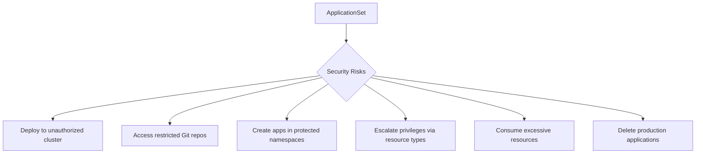

# How to Configure ApplicationSet Security Policies in ArgoCD

Author: [nawazdhandala](https://github.com/nawazdhandala)

Tags: ArgoCD, GitOps, Kubernetes, ApplicationSet, Security

Description: Learn how to configure security policies for ArgoCD ApplicationSets to prevent unauthorized application creation, restrict generator usage, and enforce deployment boundaries.

---

ApplicationSets are powerful because they automatically create Application resources. That same power makes them a security concern - a misconfigured ApplicationSet can deploy to unauthorized clusters, access restricted repositories, or create applications in protected namespaces. Security policies ensure ApplicationSets operate within defined boundaries.

This guide covers the security controls available for ApplicationSets, from project restrictions to RBAC and generator limitations.

## Security Threat Model for ApplicationSets

Before configuring policies, understand what can go wrong.



Each risk has corresponding controls that you should configure.

## Project-Level Restrictions

ArgoCD Projects are the primary security boundary for ApplicationSets. Every generated Application must belong to a project that defines what it can and cannot do.

```yaml
apiVersion: argoproj.io/v1alpha1
kind: AppProject
metadata:
  name: team-frontend
  namespace: argocd
spec:
  description: Frontend team project with restricted access

  # Allowed source repositories
  sourceRepos:
    - 'https://github.com/myorg/frontend-*'
    - 'https://charts.example.com'

  # Allowed destination clusters and namespaces
  destinations:
    - server: https://kubernetes.default.svc
      namespace: 'frontend-*'
    - server: https://staging.example.com
      namespace: 'frontend-*'
    # Explicitly deny all other destinations

  # Cluster-scoped resources this project can manage
  clusterResourceWhitelist: []
  # Empty list = no cluster-scoped resources allowed

  # Namespace-scoped resources this project can manage
  namespaceResourceWhitelist:
    - group: ''
      kind: ConfigMap
    - group: ''
      kind: Secret
    - group: ''
      kind: Service
    - group: ''
      kind: ServiceAccount
    - group: apps
      kind: Deployment
    - group: apps
      kind: StatefulSet
    - group: networking.k8s.io
      kind: Ingress
    - group: autoscaling
      kind: HorizontalPodAutoscaler

  # Deny specific resource kinds
  namespaceResourceBlacklist:
    - group: ''
      kind: ResourceQuota
    - group: rbac.authorization.k8s.io
      kind: Role
    - group: rbac.authorization.k8s.io
      kind: RoleBinding
```

Now the ApplicationSet must reference this project:

```yaml
apiVersion: argoproj.io/v1alpha1
kind: ApplicationSet
metadata:
  name: frontend-apps
  namespace: argocd
spec:
  generators:
    - list:
        elements:
          - name: web-app
            namespace: frontend-web
  template:
    metadata:
      name: '{{name}}'
    spec:
      # Must use the restricted project
      project: team-frontend
      source:
        # Must be in the allowed sourceRepos list
        repoURL: https://github.com/myorg/frontend-web.git
        targetRevision: HEAD
        path: deploy
      destination:
        # Must match allowed destinations
        server: https://kubernetes.default.svc
        namespace: '{{namespace}}'
```

## RBAC for ApplicationSets

ArgoCD's RBAC system controls who can create and manage ApplicationSets.

```yaml
apiVersion: v1
kind: ConfigMap
metadata:
  name: argocd-rbac-cm
  namespace: argocd
data:
  policy.csv: |
    # ApplicationSet RBAC policies

    # Platform admins can manage all ApplicationSets
    p, role:platform-admin, applicationsets, *, */*, allow

    # Team leads can create/update ApplicationSets in their project
    p, role:frontend-lead, applicationsets, get, argocd/frontend-*, allow
    p, role:frontend-lead, applicationsets, create, argocd/frontend-*, allow
    p, role:frontend-lead, applicationsets, update, argocd/frontend-*, allow
    p, role:frontend-lead, applicationsets, delete, argocd/frontend-*, allow

    # Developers can only view ApplicationSets
    p, role:frontend-dev, applicationsets, get, argocd/frontend-*, allow

    # No one outside the team can manage their ApplicationSets
    p, role:backend-lead, applicationsets, *, argocd/frontend-*, deny

    # Map SSO groups to roles
    g, frontend-leads, role:frontend-lead
    g, frontend-developers, role:frontend-dev
    g, platform-admins, role:platform-admin

  policy.default: role:readonly
```

## Restricting Generator Types

Some generators can be more dangerous than others. The SCM provider generator can scan entire GitHub organizations, and the pull request generator creates applications for every PR. Restrict these at the controller level.

```yaml
apiVersion: v1
kind: ConfigMap
metadata:
  name: argocd-cmd-params-cm
  namespace: argocd
data:
  # Restrict SCM providers that can be used
  applicationsetcontroller.allowed-scm-providers: "https://github.com/myorg"

  # Set global policy for ApplicationSet behavior
  applicationsetcontroller.enable-scm-providers: "true"
```

For environments where you want to disable certain generators entirely, configure the controller:

```yaml
apiVersion: apps/v1
kind: Deployment
metadata:
  name: argocd-applicationset-controller
  namespace: argocd
spec:
  template:
    spec:
      containers:
        - name: argocd-applicationset-controller
          args:
            - /usr/local/bin/argocd-applicationset-controller
            # Disable SCM provider generators
            - --enable-scm-providers=false
```

## Preventing Privilege Escalation

ApplicationSets should not be able to create Applications with more privileges than their project allows.

```yaml
apiVersion: argoproj.io/v1alpha1
kind: AppProject
metadata:
  name: restricted
  namespace: argocd
spec:
  sourceRepos:
    - 'https://github.com/myorg/approved-charts/*'

  destinations:
    - server: https://kubernetes.default.svc
      namespace: 'team-*'

  # Prevent applications from managing RBAC resources
  namespaceResourceBlacklist:
    - group: rbac.authorization.k8s.io
      kind: '*'
    - group: ''
      kind: ServiceAccount

  # Prevent cluster-scoped resource creation
  clusterResourceWhitelist: []

  # Deny managing resources in kube-system
  destinations:
    - server: '*'
      namespace: 'kube-system'
      deny: true
```

## Resource Quota Protection

Prevent ApplicationSets from overwhelming the cluster.

```yaml
# Limit the number of Applications that can exist in the argocd namespace
apiVersion: v1
kind: ResourceQuota
metadata:
  name: applicationset-limits
  namespace: argocd
spec:
  hard:
    # Limit total Application CRDs (not perfect but helps)
    count/applicationsets.argoproj.io: "50"
```

At the ApplicationSet level, use the global policy:

```yaml
apiVersion: v1
kind: ConfigMap
metadata:
  name: argocd-cmd-params-cm
  namespace: argocd
data:
  # Limit applications per ApplicationSet
  applicationsetcontroller.policy: |
    maxApplications: 100
```

## Sync Policy Enforcement

Control whether ApplicationSets can enable auto-sync and auto-prune.

```yaml
apiVersion: argoproj.io/v1alpha1
kind: ApplicationSet
metadata:
  name: safe-apps
  namespace: argocd
spec:
  generators:
    - list:
        elements:
          - name: production-app
  template:
    metadata:
      name: '{{name}}'
    spec:
      project: production
      source:
        repoURL: https://github.com/myorg/apps.git
        targetRevision: HEAD
        path: production
      destination:
        server: https://kubernetes.default.svc
        namespace: production
      # For production: no auto-sync, no auto-prune
      # Manual sync required
  # Prevent the ApplicationSet from deleting applications
  syncPolicy:
    applicationsSync: create-update
  # Preserve fields that might be set manually
  preservedFields:
    annotations:
      - notifications.argoproj.io/*
```

## Audit Logging

Enable audit logging to track ApplicationSet changes.

```bash
# Check ApplicationSet creation and modification events
kubectl get events -n argocd \
  --field-selector involvedObject.kind=ApplicationSet \
  --sort-by='.lastTimestamp'

# Check the controller logs for generation activity
kubectl logs -n argocd \
  -l app.kubernetes.io/name=argocd-applicationset-controller \
  --tail=200 | grep -iE "create|update|delete|generate"

# Use ArgoCD audit log
argocd admin settings resource-overrides list
```

## Security Checklist

Before deploying ApplicationSets to production, verify:

```bash
# 1. All ApplicationSets reference restricted projects
kubectl get applicationsets -n argocd -o json | \
  jq '.items[] | {name: .metadata.name, project: .spec.template.spec.project}'

# 2. Projects have appropriate source and destination restrictions
argocd proj list

# 3. RBAC policies are configured
argocd admin settings rbac validate

# 4. Generator restrictions are in place
kubectl get cm argocd-cmd-params-cm -n argocd -o yaml

# 5. Resource quotas are set
kubectl get resourcequota -n argocd
```

## Recommended Security Configuration

For production environments, start with this baseline:

1. Every ApplicationSet must reference a non-default project
2. Projects must have explicit sourceRepos and destinations (no wildcards)
3. Cluster-scoped resources should be denied unless specifically needed
4. RBAC should follow least-privilege per team
5. ApplicationSet creation should be limited to team leads or platform engineers
6. The SCM provider and PR generators should be restricted to approved organizations
7. MaxApplications should be set globally

Security policies are the guardrails that make ApplicationSets safe for multi-team environments. For monitoring security-relevant events across your ArgoCD installation, [OneUptime](https://oneuptime.com/blog/post/2026-02-26-argocd-applicationset-any-namespace/view) provides alerting on unexpected application creation, deletion, and configuration changes.
