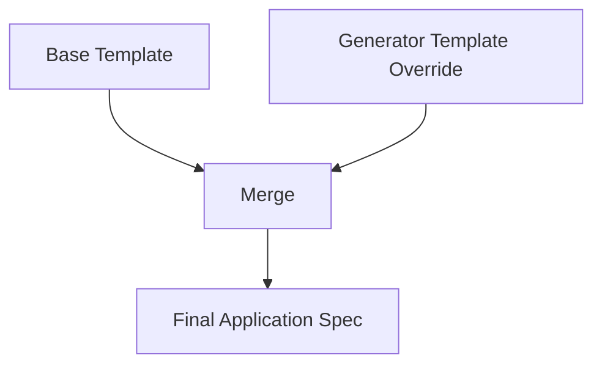

# How to Configure ApplicationSet Template Overrides in ArgoCD

Author: [nawazdhandala](https://github.com/nawazdhandala)

Tags: ArgoCD, GitOps, Kubernetes, ApplicationSet, Configuration

Description: Learn how to use template overrides in ArgoCD ApplicationSets to customize individual application specs generated from shared templates.

---

ArgoCD ApplicationSets generate multiple applications from a single template. But what happens when one or two of those applications need slightly different configurations? Template overrides solve this problem by letting generators provide their own template patches that override the base template for specific applications.

This guide covers how template overrides work, when to use them, and practical patterns for real deployments.

## Understanding Template Overrides

Every ApplicationSet has a base `template` that defines the default Application spec. When you add a `template` block inside a generator's element, that generator-level template merges with and overrides the base template for that specific element.



The merge follows a simple rule: fields defined in the generator template override replace the corresponding fields in the base template. Fields not specified in the override remain unchanged from the base template.

## Basic Template Override Example

Here is a straightforward example where most applications use the same configuration, but one needs a different source path.

```yaml
apiVersion: argoproj.io/v1alpha1
kind: ApplicationSet
metadata:
  name: team-services
  namespace: argocd
spec:
  generators:
    - list:
        elements:
          - name: user-service
            namespace: users
          - name: order-service
            namespace: orders
          - name: payment-service
            namespace: payments
            # This element has a template override
        template:
          metadata:
            name: 'payment-service'
          spec:
            source:
              # Payment service uses a different repo
              repoURL: https://github.com/myorg/payment-manifests.git
              targetRevision: main
              path: deploy
  # Base template used by all other elements
  template:
    metadata:
      name: '{{name}}'
      labels:
        team: backend
    spec:
      project: backend
      source:
        repoURL: https://github.com/myorg/services.git
        targetRevision: HEAD
        path: '{{name}}/manifests'
      destination:
        server: https://kubernetes.default.svc
        namespace: '{{namespace}}'
      syncPolicy:
        automated:
          prune: true
          selfHeal: true
```

In this example, `user-service` and `order-service` use the base template pointing to the shared mono-repo. The `payment-service` element includes a template override that changes the source repository and path, while still inheriting the destination, syncPolicy, and labels from the base template.

## Template Overrides with List Generator

The list generator is the most common place to use template overrides because each element can carry its own template block.

```yaml
apiVersion: argoproj.io/v1alpha1
kind: ApplicationSet
metadata:
  name: platform-apps
  namespace: argocd
spec:
  generators:
    - list:
        elements:
          # Standard app using base template
          - name: frontend
            env: production
            cluster: https://prod.example.com
          # App with template override for different sync policy
          - name: database-migrator
            env: production
            cluster: https://prod.example.com
        template:
          metadata:
            name: 'database-migrator-production'
          spec:
            syncPolicy:
              # Database migrator should NOT auto-sync
              automated: null
            source:
              repoURL: https://github.com/myorg/db-migrations.git
              targetRevision: HEAD
              path: migrations
  template:
    metadata:
      name: '{{name}}-{{env}}'
      labels:
        app: '{{name}}'
        env: '{{env}}'
    spec:
      project: production
      source:
        repoURL: https://github.com/myorg/platform.git
        targetRevision: HEAD
        path: 'apps/{{name}}'
      destination:
        server: '{{cluster}}'
        namespace: '{{name}}'
      syncPolicy:
        automated:
          prune: true
          selfHeal: true
        syncOptions:
          - CreateNamespace=true
```

The database migrator gets its own sync policy (no auto-sync) and a different source repo while keeping the same project, destination pattern, and sync options.

## Template Overrides with Merge Generator

The merge generator is specifically designed for template override scenarios at scale. It lets you define a primary generator for the base configuration and additional generators that override specific fields.

```yaml
apiVersion: argoproj.io/v1alpha1
kind: ApplicationSet
metadata:
  name: merged-apps
  namespace: argocd
spec:
  generators:
    - merge:
        mergeKeys:
          - name
        generators:
          # Primary generator provides base values
          - git:
              repoURL: https://github.com/myorg/services.git
              revision: HEAD
              directories:
                - path: 'services/*'
          # Override generator provides custom values for specific services
          - list:
              elements:
                - name: payment-service
                  targetRevision: release-2.0
                  project: pci-compliant
                - name: auth-service
                  targetRevision: stable
                  project: security
  template:
    metadata:
      name: '{{path.basename}}'
    spec:
      project: '{{project}}'
      source:
        repoURL: https://github.com/myorg/services.git
        targetRevision: '{{targetRevision}}'
        path: 'services/{{path.basename}}'
      destination:
        server: https://kubernetes.default.svc
        namespace: '{{path.basename}}'
```

The merge generator merges parameter sets based on the `mergeKeys` field. Services listed in the override list get custom `targetRevision` and `project` values, while all other services discovered by the Git generator use the default values.

## Overriding Metadata

Template overrides can modify Application metadata including labels, annotations, and finalizers.

```yaml
apiVersion: argoproj.io/v1alpha1
kind: ApplicationSet
metadata:
  name: annotated-apps
  namespace: argocd
spec:
  generators:
    - list:
        elements:
          - name: standard-app
            env: prod
          - name: critical-app
            env: prod
        template:
          metadata:
            name: 'critical-app-prod'
            annotations:
              # Override annotations for critical app
              notifications.argoproj.io/subscribe.on-sync-failed.pagerduty: critical-ops
              notifications.argoproj.io/subscribe.on-health-degraded.pagerduty: critical-ops
            finalizers:
              - resources-finalizer.argocd.argoproj.io
  template:
    metadata:
      name: '{{name}}-{{env}}'
      annotations:
        notifications.argoproj.io/subscribe.on-sync-failed.slack: general-deploys
      labels:
        team: platform
    spec:
      project: default
      source:
        repoURL: https://github.com/myorg/apps.git
        targetRevision: HEAD
        path: '{{name}}'
      destination:
        server: https://kubernetes.default.svc
        namespace: '{{name}}'
```

The critical app gets PagerDuty notification annotations and a finalizer, while the standard app only gets the Slack notification from the base template.

## Override Patterns for Different Source Types

Template overrides are useful when most apps use Helm but one uses Kustomize, or vice versa.

```yaml
apiVersion: argoproj.io/v1alpha1
kind: ApplicationSet
metadata:
  name: mixed-source-apps
  namespace: argocd
spec:
  generators:
    - list:
        elements:
          # These use the base Helm template
          - name: api-gateway
            chart_path: charts/api-gateway
          - name: web-frontend
            chart_path: charts/web-frontend
          # This uses Kustomize instead of Helm
          - name: config-service
            chart_path: unused
        template:
          metadata:
            name: 'config-service'
          spec:
            source:
              # Override to use Kustomize source
              repoURL: https://github.com/myorg/config-service.git
              targetRevision: HEAD
              path: deploy/overlays/production
              # No helm section means ArgoCD auto-detects Kustomize
  template:
    metadata:
      name: '{{name}}'
    spec:
      project: default
      source:
        repoURL: https://github.com/myorg/charts.git
        targetRevision: HEAD
        path: '{{chart_path}}'
        helm:
          valueFiles:
            - values-production.yaml
      destination:
        server: https://kubernetes.default.svc
        namespace: '{{name}}'
      syncPolicy:
        automated:
          prune: true
          selfHeal: true
```

## Go Template Conditionals as an Alternative

With Go templates enabled, you can sometimes achieve template override behavior without the override block by using conditionals directly in the base template.

```yaml
apiVersion: argoproj.io/v1alpha1
kind: ApplicationSet
metadata:
  name: conditional-override
  namespace: argocd
spec:
  goTemplate: true
  goTemplateOptions: ["missingkey=error"]
  generators:
    - list:
        elements:
          - name: standard-app
            override_repo: ""
          - name: special-app
            override_repo: "https://github.com/myorg/special.git"
  template:
    metadata:
      name: '{{.name}}'
    spec:
      project: default
      source:
        repoURL: '{{if .override_repo}}{{.override_repo}}{{else}}https://github.com/myorg/default.git{{end}}'
        targetRevision: HEAD
        path: '{{.name}}'
      destination:
        server: https://kubernetes.default.svc
        namespace: '{{.name}}'
```

This approach works well for simple overrides but becomes unwieldy for complex multi-field overrides where the template override block is cleaner.

## When to Use Template Overrides vs Separate ApplicationSets

Use template overrides when:
- Most applications share the same configuration with minor variations
- Only a few elements need different settings
- The differences are in source, sync policy, or metadata

Use separate ApplicationSets when:
- The applications have fundamentally different configurations
- The override block would be larger than the base template
- Different teams own different sets of applications

Template overrides keep your configuration DRY while maintaining flexibility. For monitoring the health of applications across your overridden configurations, [OneUptime](https://oneuptime.com/blog/post/2026-02-26-argocd-applicationset-helm-template-syntax/view) provides unified visibility into all your ArgoCD-managed deployments.
