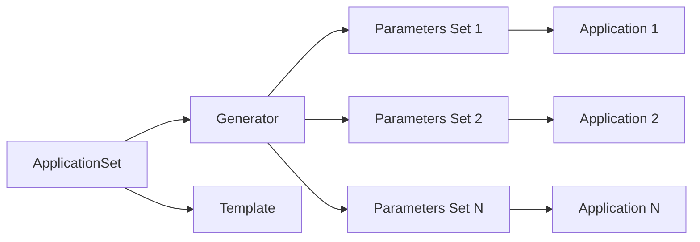

# How to Get Started with ArgoCD ApplicationSets

Author: [nawazdhandala](https://github.com/nawazdhandala)

Tags: ArgoCD, GitOps, Kubernetes, ApplicationSet

Description: A practical beginner's guide to ArgoCD ApplicationSets covering installation, first generator, templating basics, and deploying your first set of applications from a single definition.

---

Managing a handful of ArgoCD Application resources by hand is fine. Managing fifty, a hundred, or a thousand is not. ApplicationSets solve this problem by letting you define a single template that generates multiple Application resources automatically. Instead of writing one YAML file per application, you write one ApplicationSet and let ArgoCD do the rest.

This guide walks you through the entire process - from understanding what ApplicationSets are to deploying your first one in a real cluster.

## What Are ApplicationSets

An ApplicationSet is a custom resource in ArgoCD that acts as a factory for Application resources. You provide two things: a generator that produces a list of parameters, and a template that uses those parameters to create Application resources.

Think of it like a for-loop over your applications. The generator defines what to iterate over (clusters, directories, files, repositories), and the template defines what each Application should look like.



## Prerequisites

Before working with ApplicationSets, you need ArgoCD installed in your cluster. The ApplicationSet controller ships with ArgoCD starting from version 2.3.

Verify your ArgoCD installation includes the ApplicationSet controller.

```bash
# Check if the ApplicationSet controller is running
kubectl get pods -n argocd | grep applicationset

# Expected output:
# argocd-applicationset-controller-xxx   1/1   Running   0   2d
```

If you are running an older version of ArgoCD, the ApplicationSet controller was a separate installation. Upgrading to ArgoCD 2.3+ is recommended since it bundles everything together.

## Your First ApplicationSet with the List Generator

The simplest generator is the List generator. You manually provide a list of key-value pairs, and ApplicationSet creates one Application per entry.

Here is a complete example that deploys the same application across three environments.

```yaml
# applicationset-environments.yaml
apiVersion: argoproj.io/v1alpha1
kind: ApplicationSet
metadata:
  name: my-app-environments
  namespace: argocd
spec:
  generators:
  # List generator provides explicit parameter sets
  - list:
      elements:
      - environment: dev
        namespace: my-app-dev
        targetRevision: develop
      - environment: staging
        namespace: my-app-staging
        targetRevision: main
      - environment: production
        namespace: my-app-prod
        targetRevision: v1.2.0
  template:
    metadata:
      # Each generated Application gets a unique name
      name: 'my-app-{{environment}}'
    spec:
      project: default
      source:
        repoURL: https://github.com/myorg/my-app
        targetRevision: '{{targetRevision}}'
        path: k8s/overlays/{{environment}}
      destination:
        server: https://kubernetes.default.svc
        namespace: '{{namespace}}'
      syncPolicy:
        automated:
          prune: true
          selfHeal: true
        syncOptions:
        - CreateNamespace=true
```

Apply the ApplicationSet to your cluster.

```bash
# Apply the ApplicationSet
kubectl apply -f applicationset-environments.yaml

# Verify the generated Applications
kubectl get applications -n argocd
# NAME                  SYNC STATUS   HEALTH STATUS
# my-app-dev            Synced        Healthy
# my-app-staging        Synced        Healthy
# my-app-production     Synced        Healthy
```

ArgoCD automatically creates three Application resources - one for each element in the list. Each Application points to a different branch or tag and deploys to a different namespace.

## Understanding the Template System

The template section of an ApplicationSet looks exactly like a regular ArgoCD Application spec. The difference is that you can use `{{parameter}}` placeholders that get replaced with values from the generator.

Every generator provides different built-in parameters. The List generator provides whatever keys you define in the elements. The Git directory generator provides `{{path}}` and `{{path.basename}}`. The Cluster generator provides `{{name}}`, `{{server}}`, and any labels on the cluster secret.

Here is how the parameter substitution works.

```yaml
# Generator output (one element):
# environment: staging, namespace: my-app-staging

# Template with placeholders:
template:
  metadata:
    name: 'my-app-{{environment}}'    # becomes: my-app-staging
  spec:
    source:
      path: 'k8s/overlays/{{environment}}'  # becomes: k8s/overlays/staging
    destination:
      namespace: '{{namespace}}'       # becomes: my-app-staging
```

## Adding Sync Policies and Options

Most production ApplicationSets include sync policies to control how ArgoCD handles drift and pruning.

```yaml
template:
  spec:
    syncPolicy:
      automated:
        # Automatically sync when Git changes
        prune: true
        # Fix resources modified outside Git
        selfHeal: true
      syncOptions:
      # Create namespace if missing
      - CreateNamespace=true
      # Apply out of sync only
      - ApplyOutOfSyncOnly=true
      retry:
        # Retry failed syncs
        limit: 5
        backoff:
          duration: 5s
          factor: 2
          maxDuration: 3m
```

## Using the Git Directory Generator

For teams that organize their applications in a monorepo, the Git directory generator automatically discovers applications based on folder structure.

```yaml
apiVersion: argoproj.io/v1alpha1
kind: ApplicationSet
metadata:
  name: monorepo-apps
  namespace: argocd
spec:
  generators:
  - git:
      repoURL: https://github.com/myorg/platform
      revision: main
      directories:
      # Match all directories under apps/
      - path: apps/*
      # Exclude shared libraries
      - path: apps/shared
        exclude: true
  template:
    metadata:
      name: '{{path.basename}}'
    spec:
      project: default
      source:
        repoURL: https://github.com/myorg/platform
        targetRevision: main
        path: '{{path}}'
      destination:
        server: https://kubernetes.default.svc
        namespace: '{{path.basename}}'
```

When you add a new directory under `apps/`, ArgoCD automatically creates a new Application for it. No manual intervention required.

## Handling ApplicationSet Lifecycle

ApplicationSets manage the lifecycle of the Applications they create. When you delete an element from a generator, the corresponding Application gets deleted too - along with all its Kubernetes resources if pruning is enabled.

This is the default behavior, but you can control it.

```yaml
spec:
  generators:
  - list:
      elements:
      - environment: dev
  # Prevent accidental deletion of Applications
  syncPolicy:
    preserveResourcesOnDeletion: true
```

With `preserveResourcesOnDeletion: true`, deleting the ApplicationSet removes the Application resources from ArgoCD but leaves the actual Kubernetes workloads running. This is a safety net during migrations.

## Monitoring ApplicationSet Health

After deploying an ApplicationSet, monitor the status to confirm everything generated correctly.

```bash
# View ApplicationSet status
kubectl get applicationset -n argocd my-app-environments -o yaml

# Check the status conditions
kubectl get applicationset -n argocd -o jsonpath='{range .items[*]}{.metadata.name}{"\t"}{.status.conditions[*].message}{"\n"}{end}'

# List all Applications created by a specific ApplicationSet
kubectl get applications -n argocd -l 'app.kubernetes.io/managed-by=applicationset-controller'
```

For ongoing monitoring, consider setting up alerts with a platform like [OneUptime](https://oneuptime.com/blog/post/2026-02-26-argocd-applicationset-resource-modification/view) that can track the health of your ArgoCD-managed applications.

## Common Mistakes to Avoid

A few patterns trip up beginners consistently.

First, do not forget to quote template parameters in YAML. Without quotes, `{{path.basename}}` breaks YAML parsing.

```yaml
# Wrong - YAML parser will fail
name: {{path.basename}}

# Correct - wrapped in quotes
name: '{{path.basename}}'
```

Second, make sure your generator produces unique names. If two generator elements produce the same Application name, ApplicationSet will error out.

Third, do not mix ApplicationSet-managed Applications with manually created ones that have the same names. The ApplicationSet controller will try to take ownership and things get confusing fast.

## Next Steps

Once you are comfortable with the List and Git generators, explore more powerful generators like the Cluster generator for multi-cluster deployments, the Matrix generator for combining generators, and the SCM Provider generator for discovering repositories automatically. Each generator opens up new automation patterns that reduce the manual work of managing Kubernetes deployments at scale.

ApplicationSets are the foundation of managing ArgoCD at scale. Master the basics here, and the advanced patterns will follow naturally.
