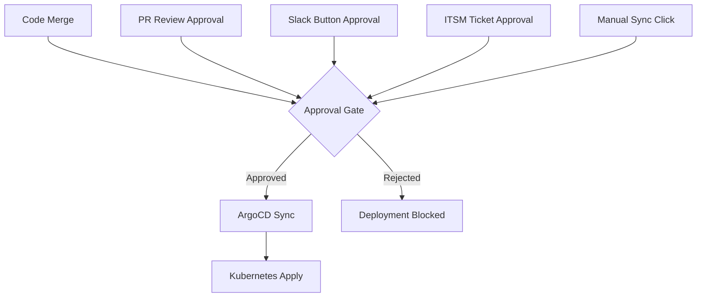
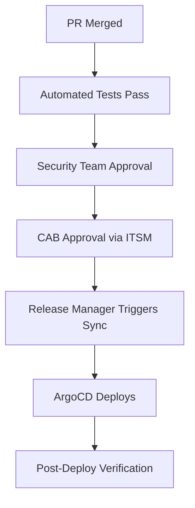

# How to Implement Approval-Gated Deployments

Author: [nawazdhandala](https://github.com/nawazdhandala)

Tags: ArgoCD, GitOps, Kubernetes, Approval Gates, Deployment Strategy

Description: Learn how to implement approval-gated deployment workflows with ArgoCD, including manual sync policies, PR-based approvals, Slack approval bots, and integration with change management systems.

---

Production deployments in enterprise environments often require explicit approval before they proceed. Whether it is a team lead approving a release, a change advisory board signing off on an infrastructure change, or a security team verifying a compliance check, approval gates ensure that deployments only happen when the right people have reviewed and approved them. ArgoCD supports approval-gated deployments through several patterns, from simple manual sync to sophisticated integration with external approval systems.

This guide covers implementing approval gates at different stages of the ArgoCD deployment workflow.

## Approval Gate Patterns



## Pattern 1: Manual Sync (Simplest Approval Gate)

The simplest approval gate is disabling auto-sync. Changes merge to Git, ArgoCD detects the drift, but does not apply it until someone manually triggers a sync:

```yaml
apiVersion: argoproj.io/v1alpha1
kind: Application
metadata:
  name: myapp-production
  namespace: argocd
spec:
  project: production
  source:
    repoURL: https://github.com/org/config-repo.git
    targetRevision: HEAD
    path: environments/production
  destination:
    server: https://kubernetes.default.svc
    namespace: myapp-production
  # No syncPolicy.automated - requires manual sync
  syncPolicy:
    syncOptions:
    - Validate=true
    - CreateNamespace=false
    - PrunePropagationPolicy=foreground
```

The approval flow:
1. Developer merges PR to config repo
2. ArgoCD shows application as "OutOfSync"
3. Authorized user clicks "Sync" in ArgoCD UI or runs `argocd app sync`
4. Deployment proceeds

Control who can click sync with RBAC:

```yaml
apiVersion: v1
kind: ConfigMap
metadata:
  name: argocd-rbac-cm
  namespace: argocd
data:
  policy.csv: |
    # Developers can view but not sync production
    p, role:developer, applications, get, production/*, allow
    p, role:developer, applications, list, production/*, allow

    # Only release managers can sync production
    p, role:release-manager, applications, get, production/*, allow
    p, role:release-manager, applications, list, production/*, allow
    p, role:release-manager, applications, sync, production/*, allow
    p, role:release-manager, applications, action/*, production/*, allow

    g, developers-group, role:developer
    g, release-managers-group, role:release-manager
```

## Pattern 2: PR-Based Approval with Branch Protection

Use Git branch protection as the approval gate. The production branch requires specific reviewers:

```yaml
# GitHub branch protection for 'production' branch:
# - Required reviewers: 2
# - Required review from code owners
# - Dismiss stale reviews
# - Require status checks to pass
```

Create a `CODEOWNERS` file:

```
# Production environment changes require platform team approval
environments/production/** @org/platform-team @org/security-team

# Staging only needs dev lead approval
environments/staging/** @org/dev-leads
```

ArgoCD watches the production branch with auto-sync:

```yaml
apiVersion: argoproj.io/v1alpha1
kind: Application
metadata:
  name: myapp-production
spec:
  source:
    targetRevision: production  # Protected branch
    path: environments/production
  syncPolicy:
    automated:
      prune: true
      selfHeal: true
```

The approval happens at the Git level - merging to the production branch requires reviews from the designated teams. Once merged, ArgoCD auto-syncs. This keeps approval in Git (auditable) while still allowing automated deployment.

## Pattern 3: Slack-Based Approval Workflow

Build an interactive approval flow in Slack:

```python
# approval-bot/app.py
from slack_bolt import App
import requests
import json

app = App(token=os.environ["SLACK_BOT_TOKEN"])

ARGOCD_SERVER = os.environ["ARGOCD_SERVER"]
ARGOCD_TOKEN = os.environ["ARGOCD_TOKEN"]

# Store pending approvals
pending_approvals = {}

def request_approval(app_name, revision, channel):
    """Send an approval request to Slack"""
    approval_id = f"{app_name}-{revision[:7]}"
    pending_approvals[approval_id] = {
        "app_name": app_name,
        "revision": revision,
        "approved_by": [],
        "required_approvals": 2
    }

    blocks = [
        {
            "type": "header",
            "text": {"type": "plain_text", "text": "Deployment Approval Required"}
        },
        {
            "type": "section",
            "fields": [
                {"type": "mrkdwn", "text": f"*Application:*\n{app_name}"},
                {"type": "mrkdwn", "text": f"*Revision:*\n{revision[:7]}"},
            ]
        },
        {
            "type": "actions",
            "elements": [
                {
                    "type": "button",
                    "text": {"type": "plain_text", "text": "Approve"},
                    "style": "primary",
                    "action_id": "approve_deployment",
                    "value": approval_id
                },
                {
                    "type": "button",
                    "text": {"type": "plain_text", "text": "Reject"},
                    "style": "danger",
                    "action_id": "reject_deployment",
                    "value": approval_id
                }
            ]
        }
    ]

    app.client.chat_postMessage(channel=channel, blocks=blocks)

@app.action("approve_deployment")
def handle_approve(ack, body, say):
    ack()
    approval_id = body["actions"][0]["value"]
    user = body["user"]["username"]

    if approval_id not in pending_approvals:
        say("This approval request has expired.")
        return

    approval = pending_approvals[approval_id]

    # Prevent self-approval
    if user in approval["approved_by"]:
        say(f"You have already approved this deployment, {user}.")
        return

    approval["approved_by"].append(user)

    if len(approval["approved_by"]) >= approval["required_approvals"]:
        # All approvals received - trigger deployment
        say(f":white_check_mark: Deployment of `{approval['app_name']}` "
            f"approved by: {', '.join(approval['approved_by'])}")

        # Trigger ArgoCD sync
        headers = {
            "Authorization": f"Bearer {ARGOCD_TOKEN}",
            "Content-Type": "application/json"
        }
        requests.post(
            f"{ARGOCD_SERVER}/api/v1/applications/{approval['app_name']}/sync",
            headers=headers,
            json={"revision": approval["revision"]}
        )
        say(f":rocket: Deployment initiated for `{approval['app_name']}`")
        del pending_approvals[approval_id]
    else:
        remaining = approval["required_approvals"] - len(approval["approved_by"])
        say(f":eyes: {user} approved. {remaining} more approval(s) needed.")

@app.action("reject_deployment")
def handle_reject(ack, body, say):
    ack()
    approval_id = body["actions"][0]["value"]
    user = body["user"]["username"]

    if approval_id in pending_approvals:
        app_name = pending_approvals[approval_id]["app_name"]
        say(f":no_entry: {user} rejected deployment of `{app_name}`")
        del pending_approvals[approval_id]
```

## Pattern 4: ITSM Integration (ServiceNow, Jira)

For organizations with formal change management, integrate with ITSM tools:

```yaml
# PreSync hook that checks for approved change ticket
apiVersion: batch/v1
kind: Job
metadata:
  name: check-change-approval
  annotations:
    argocd.argoproj.io/hook: PreSync
    argocd.argoproj.io/hook-delete-policy: HookSucceeded
spec:
  template:
    spec:
      containers:
      - name: check-approval
        image: org/itsm-checker:latest
        command:
        - /bin/sh
        - -c
        - |
          # Check ServiceNow for approved change ticket
          CHANGE_TICKET=$(kubectl get configmap deployment-metadata \
            -n myapp-production \
            -o jsonpath='{.data.change-ticket}')

          if [ -z "$CHANGE_TICKET" ]; then
            echo "ERROR: No change ticket found"
            exit 1
          fi

          # Query ServiceNow API
          APPROVAL_STATUS=$(curl -s \
            -u "$SNOW_USER:$SNOW_PASS" \
            "https://company.service-now.com/api/now/table/change_request?sysparm_query=number=$CHANGE_TICKET" \
            | jq -r '.result[0].approval')

          if [ "$APPROVAL_STATUS" != "approved" ]; then
            echo "ERROR: Change ticket $CHANGE_TICKET is not approved (status: $APPROVAL_STATUS)"
            exit 1
          fi

          echo "Change ticket $CHANGE_TICKET is approved. Proceeding with deployment."
        env:
        - name: SNOW_USER
          valueFrom:
            secretKeyRef:
              name: servicenow-credentials
              key: username
        - name: SNOW_PASS
          valueFrom:
            secretKeyRef:
              name: servicenow-credentials
              key: password
      restartPolicy: Never
  backoffLimit: 0
```

This PreSync hook runs before every sync. If the change ticket is not approved in ServiceNow, the hook fails and the deployment is blocked.

## Pattern 5: Multi-Stage Approval Pipeline

Combine multiple approval stages for high-security environments:



Implement this with a combination of:

1. **CI checks** (automated - pass/fail)
2. **PreSync hook** checking ITSM approval (automated check)
3. **Manual sync** by authorized role (human action)

```yaml
# Application with manual sync and PreSync approval check
apiVersion: argoproj.io/v1alpha1
kind: Application
metadata:
  name: myapp-production
spec:
  source:
    repoURL: https://github.com/org/config-repo.git
    targetRevision: HEAD
    path: environments/production
  destination:
    server: https://kubernetes.default.svc
    namespace: myapp-production
  # No auto-sync - manual trigger required
  syncPolicy:
    syncOptions:
    - Validate=true
    - PruneLast=true
```

The deployment only proceeds when:
1. The code is merged (PR approval)
2. A release manager clicks sync (manual gate)
3. The PreSync hook verifies ITSM approval (automated gate)

## Notification on Pending Approvals

Alert the team when deployments are waiting for approval:

```yaml
apiVersion: v1
kind: ConfigMap
metadata:
  name: argocd-notifications-cm
  namespace: argocd
data:
  trigger.on-sync-status-unknown: |
    - when: app.status.sync.status == 'OutOfSync'
      oncePer: app.status.sync.revision
      send: [pending-approval-notice]

  template.pending-approval-notice: |
    slack:
      attachments: |
        [{
          "color": "#f4c030",
          "title": "Deployment pending approval: {{.app.metadata.name}}",
          "text": "New changes detected but not yet deployed. Manual sync required.",
          "fields": [
            {"title": "Revision", "value": "{{.app.status.sync.revision | trunc 7}}", "short": true},
            {"title": "Project", "value": "{{.app.spec.project}}", "short": true}
          ],
          "actions": [
            {"type": "button", "text": "View in ArgoCD", "url": "{{.context.argocdUrl}}/applications/{{.app.metadata.name}}"}
          ]
        }]
```

Track approval latency and deployment pipeline health with OneUptime to identify bottlenecks in your approval workflow.

## Conclusion

Approval-gated deployments in ArgoCD range from simple manual sync (disable auto-sync, require a human to click) to sophisticated multi-stage pipelines with ITSM integration. The right approach depends on your organization's risk tolerance and compliance requirements. For most teams, PR-based approval (Git branch protection) combined with manual sync for production provides a good balance. Regulated industries may need the additional layers of ITSM integration and multi-person approval. Whatever pattern you choose, the key principle is that the approval creates an auditable record - whether that is a Git PR review, a Slack message, or a ServiceNow change ticket.
