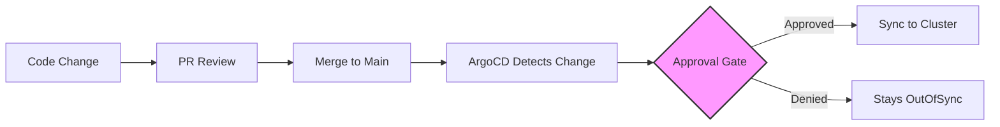

# How to Implement Approval Workflows for Deployments in ArgoCD

Author: [nawazdhandala](https://github.com/nawazdhandala)

Tags: ArgoCD, GitOps, Kubernetes, Deployment Approvals, CI/CD

Description: Learn how to implement deployment approval workflows in ArgoCD using sync windows, manual sync policies, Git-based approvals, and external webhook integrations.

---

Not every deployment should go out automatically. Production releases often need a human to review the changes and click "approve" before they land. Compliance requirements might demand sign-off from a team lead. Critical infrastructure changes might need approval from the SRE team.

ArgoCD does not have a built-in approval workflow engine, but you can build effective approval gates using its existing features: manual sync policies, sync windows, Git-based workflows, and external integrations. This guide covers each approach with practical examples.

## Understanding Approval Patterns in GitOps

In a GitOps workflow, the "approval" happens at different stages. Understanding where to place the gate determines which pattern to use.



The gate can be:
- **Git-based** - PR approval is the deployment approval
- **ArgoCD-based** - manual sync required after change detection
- **External** - webhook calls an external system for approval
- **Time-based** - sync windows control when deployments happen

## Pattern 1: Manual Sync Policy

The simplest approval pattern disables auto-sync. Changes are detected but not applied until someone manually triggers a sync.

```yaml
apiVersion: argoproj.io/v1alpha1
kind: Application
metadata:
  name: payment-service-prod
  namespace: argocd
spec:
  project: team-alpha
  source:
    repoURL: https://github.com/myorg/payment-service.git
    path: k8s/overlays/prod
    targetRevision: main
  destination:
    server: https://kubernetes.default.svc
    namespace: team-alpha-prod
  # No syncPolicy.automated - requires manual sync
  syncPolicy:
    syncOptions:
      - CreateNamespace=false
```

Without `syncPolicy.automated`, ArgoCD shows the application as OutOfSync when changes are detected, but does not apply them. A team member must manually click "Sync" in the UI or run:

```bash
argocd app sync payment-service-prod
```

**Pros**: Simple to implement, works out of the box
**Cons**: No structured approval process, anyone with sync permission can approve

## Pattern 2: Git-Based Approval with Branch Protection

Use Git's pull request workflow as your approval mechanism. The deployment branch requires PR approval before changes merge, and ArgoCD syncs automatically after merge.

```yaml
# Dev - auto-sync, no approval needed
apiVersion: argoproj.io/v1alpha1
kind: Application
metadata:
  name: payment-service-dev
spec:
  source:
    targetRevision: main
  syncPolicy:
    automated:
      prune: true
      selfHeal: true
---
# Production - tracks a release branch with required reviews
apiVersion: argoproj.io/v1alpha1
kind: Application
metadata:
  name: payment-service-prod
spec:
  source:
    targetRevision: release/production
  syncPolicy:
    automated:
      prune: true
      selfHeal: true
```

Configure branch protection rules on `release/production`:
- Require at least 2 PR approvals
- Require approval from the `sre-team` CODEOWNERS group
- Require status checks to pass
- Prevent force pushes

The workflow becomes:
1. Developer creates PR from `main` to `release/production`
2. Required reviewers approve
3. PR merges
4. ArgoCD auto-syncs from the release branch

## Pattern 3: Sync Windows as Approval Gates

Sync windows restrict when deployments can happen. Use deny windows to block production deployments, then override them for approved releases.

```yaml
apiVersion: argoproj.io/v1alpha1
kind: AppProject
metadata:
  name: team-alpha
  namespace: argocd
spec:
  syncWindows:
    # Deny all syncs to production by default
    - kind: deny
      schedule: "* * * * *"
      duration: 24h
      namespaces:
        - "team-alpha-prod"
      manualSync: false
    # Allow syncs only during maintenance window
    - kind: allow
      schedule: "0 14 * * 1-5"  # Weekdays at 2 PM UTC
      duration: 2h
      namespaces:
        - "team-alpha-prod"
      manualSync: true  # Manual syncs always allowed
```

With this configuration:
- Automated syncs to production only happen during the 2-hour window
- Manual syncs (the "approval" action) work anytime
- Weekend deployments are completely blocked unless manually triggered

## Pattern 4: External Approval with CI/CD Integration

For formal approval workflows, integrate ArgoCD with your CI/CD system or a dedicated approval tool.

```yaml
# GitHub Actions workflow for approved deployments
name: Production Deploy Approval
on:
  workflow_dispatch:
    inputs:
      application:
        description: "ArgoCD application name"
        required: true
      approver:
        description: "Approver username"
        required: true

jobs:
  approve-and-deploy:
    runs-on: ubuntu-latest
    environment: production  # Requires environment approval in GitHub
    steps:
      - name: Login to ArgoCD
        run: |
          argocd login $ARGOCD_SERVER \
            --username $ARGOCD_USER \
            --password $ARGOCD_PASS \
            --grpc-web

      - name: Verify OutOfSync status
        run: |
          STATUS=$(argocd app get ${{ inputs.application }} -o json | jq -r '.status.sync.status')
          if [ "$STATUS" != "OutOfSync" ]; then
            echo "Application is not OutOfSync, nothing to deploy"
            exit 1
          fi

      - name: Record approval
        run: |
          # Add annotation recording the approval
          argocd app set ${{ inputs.application }} \
            --annotations "deployment.myorg.io/approved-by=${{ inputs.approver }}" \
            --annotations "deployment.myorg.io/approved-at=$(date -u +%Y-%m-%dT%H:%M:%SZ)"

      - name: Sync application
        run: |
          argocd app sync ${{ inputs.application }} --prune
          argocd app wait ${{ inputs.application }} --timeout 300
```

The GitHub environment protection rule acts as the approval gate. Configure it to require approval from specific teams before the workflow runs.

## Pattern 5: Webhook-Based Approval

Use ArgoCD's resource hooks to call an external approval service before proceeding with the sync.

```yaml
apiVersion: batch/v1
kind: Job
metadata:
  name: deployment-approval
  annotations:
    argocd.argoproj.io/hook: PreSync
    argocd.argoproj.io/hook-delete-policy: HookSucceeded
spec:
  template:
    spec:
      containers:
        - name: approval-check
          image: curlimages/curl:8.5.0
          command:
            - /bin/sh
            - -c
            - |
              # Check with external approval service
              RESPONSE=$(curl -s -w "%{http_code}" \
                -H "Authorization: Bearer ${APPROVAL_TOKEN}" \
                "https://approvals.internal/api/check?app=${APP_NAME}&env=production")

              HTTP_CODE=$(echo "$RESPONSE" | tail -c 4)
              if [ "$HTTP_CODE" != "200" ]; then
                echo "Deployment not approved. HTTP $HTTP_CODE"
                exit 1
              fi
              echo "Deployment approved"
          env:
            - name: APP_NAME
              value: "payment-service"
            - name: APPROVAL_TOKEN
              valueFrom:
                secretKeyRef:
                  name: approval-service-token
                  key: token
      restartPolicy: Never
  backoffLimit: 0
```

If the PreSync hook job fails (approval not granted), the sync stops and the application remains OutOfSync.

## Pattern 6: Argo Rollouts with Analysis

For canary or blue-green deployments, use Argo Rollouts analysis to automatically approve or reject based on metrics.

```yaml
apiVersion: argoproj.io/v1alpha1
kind: AnalysisTemplate
metadata:
  name: success-rate
spec:
  metrics:
    - name: success-rate
      interval: 30s
      count: 10
      successCondition: result[0] >= 0.99
      provider:
        prometheus:
          address: http://prometheus.monitoring:9090
          query: |
            sum(rate(http_requests_total{status=~"2..",app="payment-service"}[5m]))
            /
            sum(rate(http_requests_total{app="payment-service"}[5m]))
```

This is an automated approval - the metrics decide whether the deployment continues or rolls back. No human intervention required unless the analysis fails.

## Combining Patterns

Most organizations use a combination:

| Environment | Approval Pattern |
|-------------|-----------------|
| Development | Auto-sync, no approval |
| Staging | PR approval (Git-based) |
| Production | Manual sync + sync windows + notifications |

```yaml
# Notification when production is ready for approval
apiVersion: v1
kind: ConfigMap
metadata:
  name: argocd-notifications-cm
  namespace: argocd
data:
  trigger.on-out-of-sync: |
    - when: app.status.sync.status == 'OutOfSync' and app.metadata.labels.environment == 'production'
      send: [slack-approval-request]
  template.slack-approval-request: |
    message: |
      Application {{.app.metadata.name}} has pending changes for production.
      Review and approve: {{.context.argocdUrl}}/applications/{{.app.metadata.name}}
      Changes: {{.app.status.sync.revision}}
```

This sends a Slack message when production applications have pending changes, prompting the right person to review and approve.

## Tracking Approvals for Compliance

Record approval metadata on the Application resource for audit purposes:

```bash
# After approval, annotate the application
argocd app set my-app \
  --annotations "audit.myorg.io/approved-by=jane.doe" \
  --annotations "audit.myorg.io/approved-at=$(date -u +%Y-%m-%dT%H:%M:%SZ)" \
  --annotations "audit.myorg.io/ticket=DEPLOY-1234"
```

These annotations persist in the Application resource and are visible in Git history, providing the audit trail compliance teams need.

Approval workflows in ArgoCD are about choosing the right level of friction for each environment. Development should be fast and automatic. Production should have the checks your organization requires. The patterns in this guide let you build exactly the workflow you need, from simple manual sync gates to fully automated metric-based approvals.
