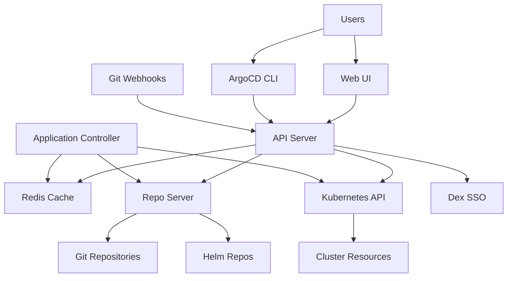
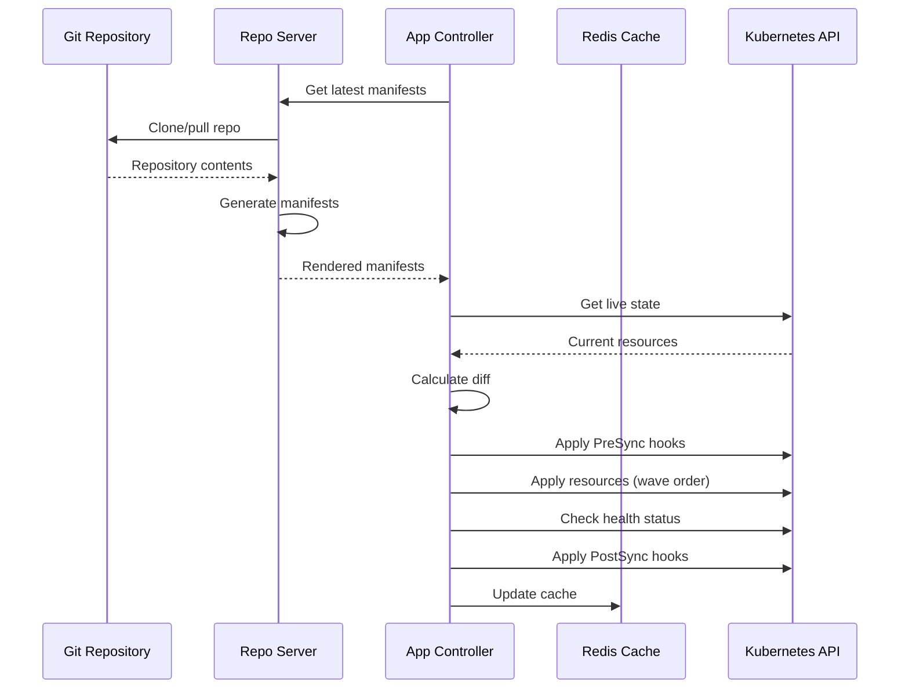

# How ArgoCD Architecture Works Under the Hood

Author: [nawazdhandala](https://github.com/nawazdhandala)

Tags: ArgoCD, GitOps, Kubernetes, Architecture

Description: A deep dive into ArgoCD's internal architecture covering the API server, repo server, application controller, Redis cache, and how they work together.

---

Understanding how ArgoCD works internally makes you better at operating, debugging, and scaling it. This post takes you through every component in the ArgoCD architecture, how they communicate, and what happens when you trigger a sync.

## The Big Picture

ArgoCD runs as a set of Kubernetes deployments inside your cluster, typically in the `argocd` namespace. The core components are:

1. **API Server** - handles all external requests (UI, CLI, API)
2. **Repo Server** - clones Git repos and generates Kubernetes manifests
3. **Application Controller** - compares desired state with live state and drives syncs
4. **Redis** - caches data to reduce load on Git repos and the Kubernetes API
5. **Dex** (optional) - handles SSO authentication

Here is how they fit together:



## The API Server

The API server (`argocd-server`) is the front door to ArgoCD. It exposes three interfaces:

- A gRPC API (used by the ArgoCD CLI)
- A REST API (used by the web UI and integrations)
- The web UI itself (served as static files)

When you run `argocd app sync my-app` from the CLI, the request hits the API server over gRPC. When you click "Sync" in the web UI, it hits the REST API. Both end up in the same backend code.

The API server handles authentication and authorization. It validates JWT tokens, checks RBAC policies, and proxies requests to the appropriate backend. It does not do the heavy lifting of syncing or manifest generation - it delegates those tasks to other components.

You can see the API server deployment in your cluster:

```bash
# Check the API server deployment
kubectl get deployment argocd-server -n argocd

# View API server logs
kubectl logs -l app.kubernetes.io/name=argocd-server -n argocd

# The API server exposes port 443 (HTTPS) by default
kubectl get svc argocd-server -n argocd
```

For a deeper look at the API server specifically, see [how the ArgoCD API server handles requests](https://oneuptime.com/blog/post/2026-02-26-argocd-api-server-explained/view).

## The Repo Server

The repo server (`argocd-repo-server`) is responsible for generating Kubernetes manifests from your Git repositories. It handles three key tasks:

1. **Cloning repositories** - pulls source code from Git
2. **Generating manifests** - runs Helm template, Kustomize build, or plain manifest rendering
3. **Caching results** - stores generated manifests so it does not regenerate them on every request

When the application controller or API server needs the desired state for an application, it asks the repo server. The repo server clones the Git repo (or uses a cached clone), checks out the specified revision, and runs the appropriate tool to generate manifests.

For Helm-based applications, the repo server runs `helm template` with the specified values. For Kustomize, it runs `kustomize build`. For plain YAML directories, it simply reads the files.

The repo server is stateless and can be scaled horizontally. Each replica maintains its own local clone cache.

```bash
# Check repo server status
kubectl get deployment argocd-repo-server -n argocd

# View repo server logs - useful for debugging manifest generation
kubectl logs -l app.kubernetes.io/name=argocd-repo-server -n argocd

# Repo server stores cloned repos in a local volume
kubectl describe deployment argocd-repo-server -n argocd | grep -A5 "Volumes"
```

## The Application Controller

The application controller (`argocd-application-controller`) is the brain of ArgoCD. It runs as a Kubernetes StatefulSet (not a Deployment) and does the following:

1. **Watches Application resources** - monitors ArgoCD Application CRDs for changes
2. **Compares desired vs live state** - asks the repo server for desired state and the Kubernetes API for live state
3. **Calculates diffs** - determines what needs to change
4. **Executes syncs** - applies manifests to bring the cluster to the desired state
5. **Monitors health** - checks the health of all managed resources

The controller operates on a reconciliation loop. Every few seconds, it checks each Application to see if the live state matches the desired state. If there is a difference and the Application has automated sync enabled, the controller triggers a sync.

```bash
# The controller runs as a StatefulSet
kubectl get statefulset argocd-application-controller -n argocd

# View controller logs - this is where sync operations are logged
kubectl logs -l app.kubernetes.io/name=argocd-application-controller -n argocd

# Check controller metrics for sync status
kubectl port-forward svc/argocd-application-controller-metrics 8082:8082 -n argocd
```

The controller can be sharded for large-scale deployments. Sharding distributes the responsibility of managing Applications across multiple controller replicas, with each shard handling a subset of Applications.

## Redis Cache

Redis serves as the caching layer between components. It caches:

- **Application state** - the last known state of each Application
- **Manifest cache** - generated manifests from the repo server
- **Cluster cache** - the live state of resources in managed clusters
- **Git revision cache** - the latest commit SHA for each tracked branch

Without Redis, every reconciliation loop would require cloning Git repos and querying the Kubernetes API from scratch. Redis dramatically reduces the load on both Git servers and the Kubernetes API server.

```bash
# Check Redis deployment
kubectl get deployment argocd-redis -n argocd

# You can connect to Redis to inspect the cache
kubectl exec -it deploy/argocd-redis -n argocd -- redis-cli

# Check memory usage
kubectl exec -it deploy/argocd-redis -n argocd -- redis-cli info memory
```

In high-availability setups, Redis can be deployed as a Redis Sentinel cluster or replaced with an external Redis service.

## What Happens During a Sync

Let us walk through the complete flow when you update a manifest in Git and ArgoCD syncs it:

1. **Change detection** - The application controller periodically polls Git (default: 3 minutes) or receives a webhook notification. It asks the repo server for the latest commit SHA.

2. **Manifest generation** - The controller requests manifests from the repo server for the new commit. The repo server clones or updates the repo, checks out the commit, and generates manifests using Helm, Kustomize, or plain YAML.

3. **Diff calculation** - The controller compares the generated manifests (desired state) with what is currently running in the cluster (live state). It normalizes both sides to avoid false positives from default values and ordering differences.

4. **Sync decision** - If there is a difference and the sync policy allows it (either automated or manually triggered), the controller proceeds with the sync.

5. **Pre-sync hooks** - If any resources have `argocd.argoproj.io/hook: PreSync` annotations, those run first. Common examples include database migrations.

6. **Sync wave execution** - Resources are applied in order of their sync wave annotations. Wave 0 first, then wave 1, and so on. Within a wave, resources are applied in a specific order (namespaces before deployments, for example).

7. **Resource application** - The controller applies each resource to the cluster using `kubectl apply` (or server-side apply if configured).

8. **Health assessment** - After applying, the controller monitors the health of each resource. Deployments need to have all replicas ready, Services need endpoints, and so on.

9. **Post-sync hooks** - Resources with `argocd.argoproj.io/hook: PostSync` annotations run after all resources are healthy. Smoke tests and notifications are common post-sync hooks.

10. **Status update** - The Application resource is updated with the sync result, health status, and any errors.



## Resource Tracking

ArgoCD needs to know which resources in the cluster belong to which Application. It uses one of three tracking methods:

- **Label-based tracking** (default in older versions) - adds `app.kubernetes.io/instance` label to resources
- **Annotation-based tracking** - stores tracking info in annotations, avoiding label conflicts
- **Annotation+label tracking** - hybrid approach

The tracking method matters when you have other tools (like Helm or operators) that also set labels on resources.

## Cluster Communication

When ArgoCD manages external clusters (not the cluster it runs in), it communicates through the Kubernetes API. The cluster credentials are stored as Kubernetes Secrets in the `argocd` namespace.

Each external cluster secret contains the API server URL and authentication credentials (service account token, client certificate, or cloud provider auth). The application controller uses these credentials to read live state and apply manifests.

```bash
# List registered clusters
argocd cluster list

# Cluster secrets are stored in the argocd namespace
kubectl get secrets -n argocd -l argocd.argoproj.io/secret-type=cluster
```

## Performance Considerations

The three components that typically need tuning are:

- **Repo server** - add replicas if manifest generation is slow. Each Helm template or Kustomize build runs in a separate process, so CPU matters.
- **Application controller** - increase status and operation processors for more concurrent syncs. Sharding helps with many Applications.
- **Redis** - increase memory if you manage many Applications. The cluster cache grows with the number of managed resources.

```yaml
# Example: scaling repo server for better performance
apiVersion: apps/v1
kind: Deployment
metadata:
  name: argocd-repo-server
  namespace: argocd
spec:
  replicas: 3  # Scale up for faster manifest generation
  template:
    spec:
      containers:
      - name: argocd-repo-server
        resources:
          requests:
            cpu: 500m
            memory: 512Mi
          limits:
            cpu: "2"
            memory: 1Gi
```

## Wrapping Up

ArgoCD's architecture is designed around separation of concerns. The API server handles user interaction, the repo server handles manifest generation, the application controller handles reconciliation, and Redis ties everything together with caching.

Understanding these components helps you debug issues (is the problem in manifest generation or in sync execution?), scale appropriately (more repo server replicas for Helm-heavy workloads), and operate ArgoCD confidently in production.

The architecture is intentionally simple compared to other CD platforms, which is a feature, not a limitation. Fewer moving parts means fewer things that can break.
