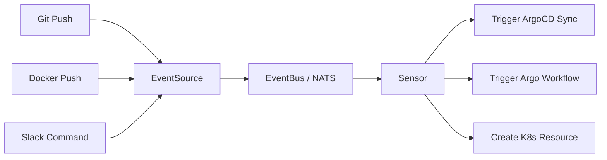

# How to Use Argo Events with ArgoCD for Event-Driven Deployments

Author: [nawazdhandala](https://github.com/nawazdhandala)

Tags: ArgoCD, GitOps, Kubernetes, Argo Events, Event-Driven

Description: Learn how to use Argo Events with ArgoCD to trigger deployments automatically based on Git webhooks, message queues, and other event sources in Kubernetes.

---

ArgoCD polls your Git repository every few minutes to detect changes. But what if you want deployments to start immediately when something happens - a Git push, a message on a queue, or an API call? That is where Argo Events comes in. It listens for events from dozens of sources and triggers actions in response, including ArgoCD syncs.

This guide shows you how to set up Argo Events alongside ArgoCD for truly event-driven deployments.

## What Argo Events Brings to the Table

Argo Events is a Kubernetes-native event-driven automation framework. It has three core components:

- **EventSources**: Define where events come from (webhooks, S3, Kafka, SNS, etc.)
- **EventBus**: A transport layer that routes events between sources and sensors
- **Sensors**: Define what happens when specific events are detected

When combined with ArgoCD, Argo Events eliminates polling delays and enables complex deployment logic based on multiple event conditions.



## Installing Argo Events

Install Argo Events in its own namespace:

```bash
# Create namespace
kubectl create namespace argo-events

# Install Argo Events
kubectl apply -f https://raw.githubusercontent.com/argoproj/argo-events/stable/manifests/install.yaml -n argo-events

# Install the EventBus (NATS-based)
kubectl apply -f https://raw.githubusercontent.com/argoproj/argo-events/stable/manifests/install-validating-webhook.yaml -n argo-events

# Verify installation
kubectl get pods -n argo-events
```

Next, set up the EventBus which acts as the messaging backbone:

```yaml
# eventbus.yaml
apiVersion: argoproj.io/v1alpha1
kind: EventBus
metadata:
  name: default
  namespace: argo-events
spec:
  nats:
    native:
      replicas: 3
      auth: token
```

Apply it:

```bash
kubectl apply -f eventbus.yaml
```

## Setting Up a GitHub Webhook EventSource

The most common use case is triggering deployments on Git push. Here is an EventSource that receives GitHub webhooks:

```yaml
# github-eventsource.yaml
apiVersion: argoproj.io/v1alpha1
kind: EventSource
metadata:
  name: github-webhook
  namespace: argo-events
spec:
  service:
    ports:
      - port: 12000
        targetPort: 12000
  github:
    myapp-repo:
      # GitHub repository to watch
      repositories:
        - owner: myorg
          names:
            - myapp
            - gitops-repo
      # Which events to listen for
      events:
        - push
        - pull_request
      # Webhook configuration
      webhook:
        endpoint: /push
        port: "12000"
        method: POST
      # GitHub webhook secret for validation
      webhookSecret:
        name: github-webhook-secret
        key: secret
      # Filter to specific branches
      filter:
        branches:
          - "main"
          - "release/*"
      # Use API token for webhook management
      apiToken:
        name: github-token
        key: token
      active: true
      contentType: json
```

Create the required secrets:

```bash
# Create the webhook secret
kubectl create secret generic github-webhook-secret \
  --from-literal=secret=my-webhook-secret \
  -n argo-events

# Create the GitHub API token
kubectl create secret generic github-token \
  --from-literal=token=ghp_your_token_here \
  -n argo-events
```

Expose the EventSource so GitHub can reach it. In production, use an Ingress or LoadBalancer:

```yaml
# eventsource-ingress.yaml
apiVersion: networking.k8s.io/v1
kind: Ingress
metadata:
  name: github-webhook-ingress
  namespace: argo-events
  annotations:
    nginx.ingress.kubernetes.io/ssl-redirect: "true"
spec:
  rules:
    - host: webhooks.example.com
      http:
        paths:
          - path: /push
            pathType: Prefix
            backend:
              service:
                name: github-webhook-eventsource-svc
                port:
                  number: 12000
```

## Creating a Sensor to Trigger ArgoCD

Now create a Sensor that listens for push events and triggers an ArgoCD sync:

```yaml
# argocd-sync-sensor.yaml
apiVersion: argoproj.io/v1alpha1
kind: Sensor
metadata:
  name: argocd-sync-trigger
  namespace: argo-events
spec:
  dependencies:
    - name: github-push
      eventSourceName: github-webhook
      eventName: myapp-repo
      filters:
        data:
          - path: body.ref
            type: string
            value:
              - "refs/heads/main"
  triggers:
    - template:
        name: argocd-sync
        argoWorkflow:
          operation: submit
          source:
            resource:
              apiVersion: argoproj.io/v1alpha1
              kind: Workflow
              metadata:
                generateName: argocd-sync-
                namespace: argo-events
              spec:
                entrypoint: sync
                serviceAccountName: argo-events-sa
                templates:
                  - name: sync
                    container:
                      image: argoproj/argocd:v2.9.0
                      command: [sh, -c]
                      args:
                        - |
                          # Login to ArgoCD
                          argocd login argocd-server.argocd.svc.cluster.local \
                            --username admin \
                            --password $ARGOCD_PASSWORD \
                            --insecure

                          # Trigger sync for the application
                          argocd app sync myapp --async

                          echo "Sync triggered successfully"
                      env:
                        - name: ARGOCD_PASSWORD
                          valueFrom:
                            secretKeyRef:
                              name: argocd-credentials
                              key: password
```

Alternatively, you can use the ArgoCD API directly through an HTTP trigger, which avoids needing the ArgoCD CLI:

```yaml
# argocd-api-sensor.yaml
apiVersion: argoproj.io/v1alpha1
kind: Sensor
metadata:
  name: argocd-api-trigger
  namespace: argo-events
spec:
  dependencies:
    - name: github-push
      eventSourceName: github-webhook
      eventName: myapp-repo
  triggers:
    - template:
        name: argocd-sync-api
        http:
          url: "https://argocd-server.argocd.svc.cluster.local/api/v1/applications/myapp/sync"
          method: POST
          headers:
            Content-Type: "application/json"
            Authorization: "Bearer YOUR_ARGOCD_TOKEN"
          payload:
            - src:
                dependencyName: github-push
                dataKey: body.after
              dest: revision
          tls:
            insecureSkipVerify: true
```

## Filtering Events for Specific Conditions

You can filter events to trigger deployments only when certain conditions are met. For example, only deploy when files in the `k8s/` directory change:

```yaml
spec:
  dependencies:
    - name: github-push
      eventSourceName: github-webhook
      eventName: myapp-repo
      filters:
        data:
          # Only trigger on main branch
          - path: body.ref
            type: string
            value:
              - "refs/heads/main"
        # Use a script filter for complex logic
        script:
          content: |
            local json = require("json")
            local event = json.decode(event)
            local commits = event.body.commits
            for _, commit in ipairs(commits) do
              for _, file in ipairs(commit.modified) do
                if string.find(file, "^k8s/") then
                  return true
                end
              end
            end
            return false
```

## Multi-Event Triggers

One powerful feature is requiring multiple events before triggering a deployment. For example, wait for both a successful CI build and a Docker image push:

```yaml
spec:
  dependencies:
    - name: ci-complete
      eventSourceName: github-webhook
      eventName: ci-status
      filters:
        data:
          - path: body.state
            type: string
            value:
              - "success"
    - name: image-pushed
      eventSourceName: docker-registry
      eventName: image-push
  triggers:
    - template:
        name: deploy-after-ci-and-image
        conditions: "ci-complete && image-pushed"
        # ... trigger definition
```

This ensures deployments only happen when all prerequisites are satisfied.

## Using Argo Events with ArgoCD Webhooks

ArgoCD has built-in webhook support for Git providers. Argo Events provides a more flexible alternative. However, you can also use Argo Events to call ArgoCD's webhook endpoint:

```bash
# ArgoCD can be configured to accept webhooks directly
# This refreshes the app faster than polling
kubectl patch configmap argocd-cm -n argocd --type merge -p '{
  "data": {
    "webhook.github.secret": "my-webhook-secret"
  }
}'
```

The advantage of going through Argo Events instead is that you get filtering, transformation, multi-event correlation, and the ability to trigger additional actions beyond just an ArgoCD sync.

## Setting Up RBAC for Argo Events

The Argo Events service account needs permission to interact with ArgoCD:

```yaml
# argo-events-rbac.yaml
apiVersion: v1
kind: ServiceAccount
metadata:
  name: argo-events-sa
  namespace: argo-events
---
apiVersion: rbac.authorization.k8s.io/v1
kind: ClusterRole
metadata:
  name: argo-events-role
rules:
  - apiGroups: ["argoproj.io"]
    resources: ["workflows", "applications"]
    verbs: ["create", "get", "list", "watch", "update", "patch"]
---
apiVersion: rbac.authorization.k8s.io/v1
kind: ClusterRoleBinding
metadata:
  name: argo-events-binding
subjects:
  - kind: ServiceAccount
    name: argo-events-sa
    namespace: argo-events
roleRef:
  kind: ClusterRole
  name: argo-events-role
  apiGroup: rbac.authorization.k8s.io
```

## Monitoring Event-Driven Deployments

Track your event-driven pipeline by monitoring both Argo Events and ArgoCD metrics. Key things to watch:

- Event processing latency (time from event received to trigger fired)
- Sensor processing failures
- ArgoCD sync duration after trigger

You can set up alerts for failed triggers or stalled syncs to catch pipeline issues early.

## Summary

Argo Events transforms ArgoCD from a polling-based system into an event-driven deployment platform. By setting up EventSources for your Git repositories, container registries, or message queues, and connecting them to Sensors that trigger ArgoCD syncs, you get near-instant deployments with sophisticated filtering and multi-event correlation. Combined with Argo Workflows for CI (see our [Argo Workflows guide](https://oneuptime.com/blog/post/2026-02-26-argocd-argo-workflows-ci-cd/view)), you have a complete Kubernetes-native automation platform.
