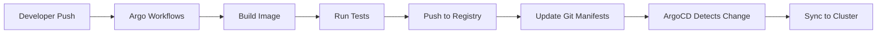

# How to Use Argo Workflows with ArgoCD for CI+CD

Author: [nawazdhandala](https://github.com/nawazdhandala)

Tags: ArgoCD, GitOps, Kubernetes, Argo Workflows, CI/CD

Description: Learn how to combine Argo Workflows for continuous integration with ArgoCD for continuous deployment to build a complete Kubernetes-native CI+CD pipeline.

---

Most teams use separate tools for CI and CD. Jenkins or GitHub Actions builds your code, then ArgoCD deploys it. But there is a Kubernetes-native alternative that keeps everything in your cluster: Argo Workflows for CI paired with ArgoCD for CD.

This guide walks you through building a complete CI+CD pipeline using both Argo projects together.

## Why Combine Argo Workflows with ArgoCD

Argo Workflows is a Kubernetes-native workflow engine. It runs each step of your pipeline as a container in your cluster. When you pair it with ArgoCD, you get a fully declarative pipeline where CI builds and tests your code, updates your Git repository, and ArgoCD picks up the changes automatically.

The benefits are significant:

- **Single platform**: Everything runs on Kubernetes. No external CI servers to maintain.
- **Consistent tooling**: Both tools use Kubernetes CRDs and follow GitOps principles.
- **Scalability**: Argo Workflows scales horizontally across your cluster.
- **Cost efficiency**: No idle CI servers - workflow pods spin up on demand and release resources when done.

## Architecture Overview

Here is how the two tools work together:



The key handoff point is step F. Argo Workflows updates the Kubernetes manifests in your Git repository (changing the image tag), and ArgoCD detects this change during its next sync cycle.

## Prerequisites

You need both tools installed in your cluster. If you already have ArgoCD running, install Argo Workflows alongside it:

```bash
# Create a namespace for Argo Workflows
kubectl create namespace argo

# Install Argo Workflows
kubectl apply -n argo -f https://github.com/argoproj/argo-workflows/releases/latest/download/install.yaml

# Verify the installation
kubectl get pods -n argo
```

You also need the Argo CLI for submitting workflows:

```bash
# macOS
brew install argo

# Linux
curl -sLO https://github.com/argoproj/argo-workflows/releases/latest/download/argo-linux-amd64.gz
gunzip argo-linux-amd64.gz
chmod +x argo-linux-amd64
sudo mv argo-linux-amd64 /usr/local/bin/argo
```

## Building the CI Workflow

Here is a complete Argo Workflow that builds a Docker image, runs tests, pushes the image, and updates the GitOps repository:

```yaml
# ci-workflow.yaml
apiVersion: argoproj.io/v1alpha1
kind: Workflow
metadata:
  generateName: ci-pipeline-
  namespace: argo
spec:
  entrypoint: ci-pipeline
  arguments:
    parameters:
      - name: repo-url
        value: "https://github.com/myorg/myapp"
      - name: branch
        value: "main"
      - name: image-name
        value: "registry.example.com/myapp"
  volumes:
    - name: docker-config
      secret:
        secretName: docker-registry-creds
    - name: git-creds
      secret:
        secretName: git-credentials

  templates:
    - name: ci-pipeline
      dag:
        tasks:
          # Step 1: Clone the source repository
          - name: clone
            template: git-clone
            arguments:
              parameters:
                - name: repo-url
                  value: "{{workflow.parameters.repo-url}}"
                - name: branch
                  value: "{{workflow.parameters.branch}}"

          # Step 2: Run tests (depends on clone)
          - name: test
            template: run-tests
            dependencies: [clone]

          # Step 3: Build and push image (depends on tests passing)
          - name: build-push
            template: build-and-push
            dependencies: [test]
            arguments:
              parameters:
                - name: image-name
                  value: "{{workflow.parameters.image-name}}"

          # Step 4: Update GitOps repo with new image tag
          - name: update-manifests
            template: update-gitops-repo
            dependencies: [build-push]
            arguments:
              parameters:
                - name: image-name
                  value: "{{workflow.parameters.image-name}}"

    - name: git-clone
      inputs:
        parameters:
          - name: repo-url
          - name: branch
      container:
        image: alpine/git:latest
        command: [sh, -c]
        args:
          - |
            git clone --branch {{inputs.parameters.branch}} \
              {{inputs.parameters.repo-url}} /workspace
        volumeMounts:
          - name: work
            mountPath: /workspace

    - name: run-tests
      container:
        image: node:18
        command: [sh, -c]
        args:
          - |
            cd /workspace
            npm install
            npm test
        volumeMounts:
          - name: work
            mountPath: /workspace

    - name: build-and-push
      inputs:
        parameters:
          - name: image-name
      container:
        image: gcr.io/kaniko-project/executor:latest
        args:
          - --dockerfile=/workspace/Dockerfile
          - --context=/workspace
          - "--destination={{inputs.parameters.image-name}}:{{workflow.name}}"
        volumeMounts:
          - name: work
            mountPath: /workspace
          - name: docker-config
            mountPath: /kaniko/.docker

    - name: update-gitops-repo
      inputs:
        parameters:
          - name: image-name
      container:
        image: alpine/git:latest
        command: [sh, -c]
        args:
          - |
            # Clone the GitOps repository
            git clone https://github.com/myorg/gitops-repo /gitops
            cd /gitops

            # Update the image tag in the deployment manifest
            sed -i "s|image: {{inputs.parameters.image-name}}:.*|image: {{inputs.parameters.image-name}}:{{workflow.name}}|" \
              apps/myapp/deployment.yaml

            # Commit and push
            git config user.email "ci@example.com"
            git config user.name "Argo CI"
            git add .
            git commit -m "Update myapp image to {{workflow.name}}"
            git push
        volumeMounts:
          - name: git-creds
            mountPath: /root/.git-credentials
```

This workflow uses a DAG (directed acyclic graph) to define step dependencies. Tests must pass before the image is built, and the image must be pushed before manifests are updated.

## Triggering Workflows on Git Push

To trigger this workflow automatically when code is pushed, you can use Argo Events (covered in our [Argo Events integration guide](https://oneuptime.com/blog/post/2026-02-26-argocd-argo-events-deployments/view)) or a simple webhook from your Git provider.

For a basic webhook approach, create a Kubernetes service that receives webhooks and submits workflows:

```yaml
# workflow-trigger.yaml
apiVersion: argoproj.io/v1alpha1
kind: WorkflowTemplate
metadata:
  name: ci-pipeline-template
  namespace: argo
spec:
  entrypoint: ci-pipeline
  arguments:
    parameters:
      - name: repo-url
      - name: branch
      - name: image-name
  # ... same templates as above
```

Then submit workflows using the Argo CLI or API:

```bash
# Submit a workflow from the template
argo submit --from workflowtemplate/ci-pipeline-template \
  -p repo-url=https://github.com/myorg/myapp \
  -p branch=main \
  -p image-name=registry.example.com/myapp
```

## Configuring ArgoCD to Watch for Changes

On the ArgoCD side, set up your application to watch the GitOps repository. Enable automated sync so deployments happen without manual intervention:

```yaml
# argocd-application.yaml
apiVersion: argoproj.io/v1alpha1
kind: Application
metadata:
  name: myapp
  namespace: argocd
spec:
  project: default
  source:
    repoURL: https://github.com/myorg/gitops-repo
    targetRevision: main
    path: apps/myapp
  destination:
    server: https://kubernetes.default.svc
    namespace: production
  syncPolicy:
    automated:
      prune: true       # Remove resources not in Git
      selfHeal: true     # Revert manual changes
    syncOptions:
      - CreateNamespace=true
    retry:
      limit: 3
      backoff:
        duration: 5s
        factor: 2
        maxDuration: 3m
```

With `automated` sync enabled, ArgoCD polls the Git repository (default every 3 minutes) and automatically syncs when it detects changes made by the Argo Workflows CI pipeline.

## Using Workflow Status to Gate Deployments

You can add a notification step in your Argo Workflow that posts the pipeline status. If the workflow fails at any step, the GitOps repo never gets updated, so ArgoCD never deploys broken code. This is a natural safety gate.

For additional safety, add a verification step after the manifest update:

```yaml
- name: verify-argocd-sync
  container:
    image: argoproj/argocd:latest
    command: [sh, -c]
    args:
      - |
        # Wait for ArgoCD to sync the application
        argocd app wait myapp \
          --sync \
          --health \
          --timeout 300 \
          --server argocd-server.argocd.svc.cluster.local

        echo "Application synced and healthy"
```

## Shared Artifact Storage

Both tools can share artifacts through Kubernetes PVCs or S3-compatible storage. Configure Argo Workflows to store logs and artifacts in the same backend ArgoCD uses for its state:

```yaml
# artifact-repository-config.yaml
apiVersion: v1
kind: ConfigMap
metadata:
  name: artifact-repositories
  namespace: argo
data:
  default-v1: |
    archiveLogs: true
    s3:
      bucket: my-argo-artifacts
      endpoint: minio.argo.svc:9000
      insecure: true
      accessKeySecret:
        name: argo-artifacts-creds
        key: accesskey
      secretKeySecret:
        name: argo-artifacts-creds
        key: secretkey
```

## Monitoring the Full Pipeline

For observability across both CI and CD, set up monitoring that covers the entire pipeline. You can track Argo Workflows metrics alongside ArgoCD metrics using Prometheus:

```yaml
# servicemonitor.yaml
apiVersion: monitoring.coreos.com/v1
kind: ServiceMonitor
metadata:
  name: argo-workflows
  namespace: argo
spec:
  selector:
    matchLabels:
      app: workflow-controller
  endpoints:
    - port: metrics
      interval: 30s
```

Key metrics to watch include workflow duration, success rate, and the time from commit to deployment (the full CI+CD cycle time).

## Summary

Combining Argo Workflows with ArgoCD gives you a Kubernetes-native CI+CD pipeline where the CI side builds, tests, and updates Git, and the CD side deploys from Git. The Git repository serves as the handoff point between the two systems, keeping the pipeline loosely coupled while maintaining the GitOps principle that Git is the single source of truth. This approach eliminates external CI servers and keeps your entire delivery pipeline running on the same platform as your applications.
